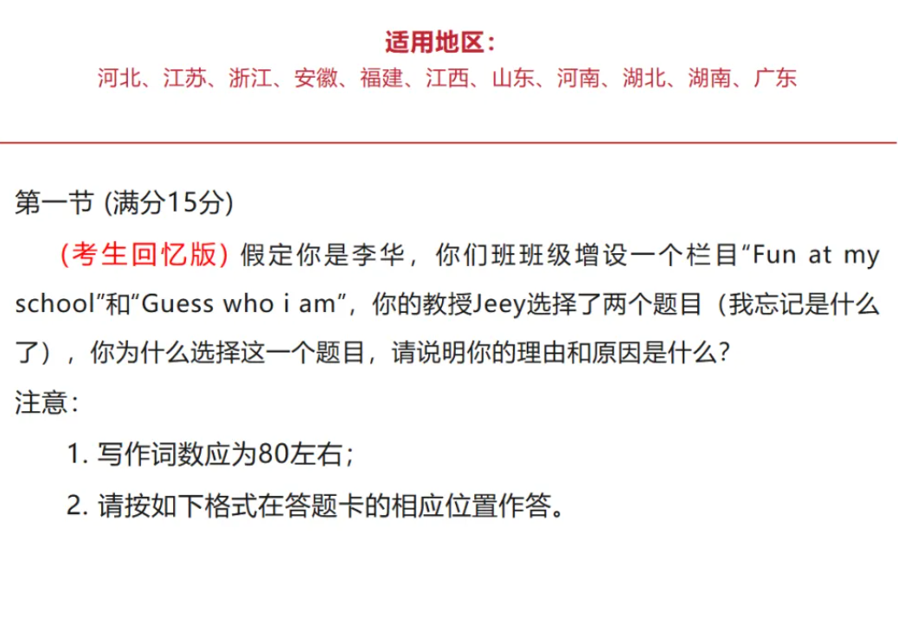
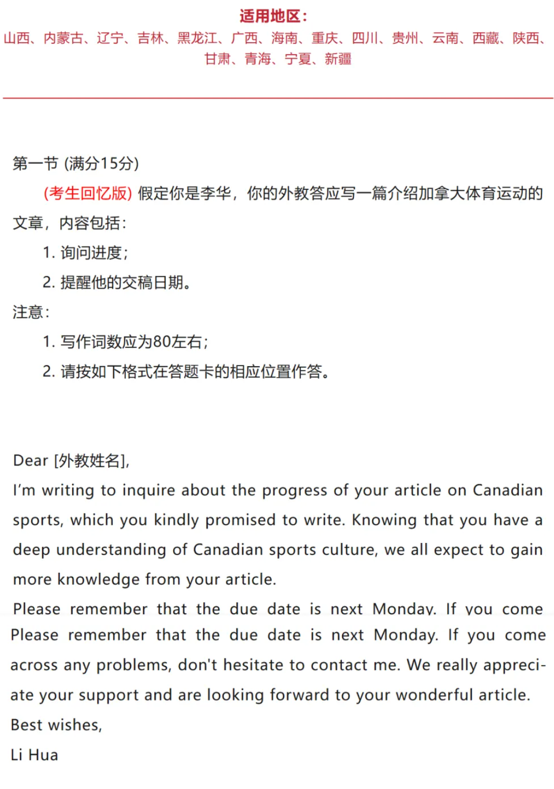
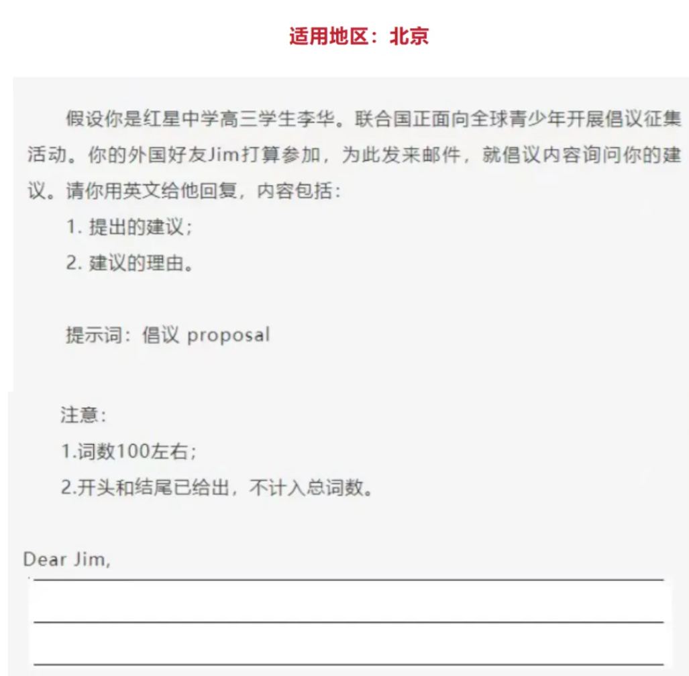
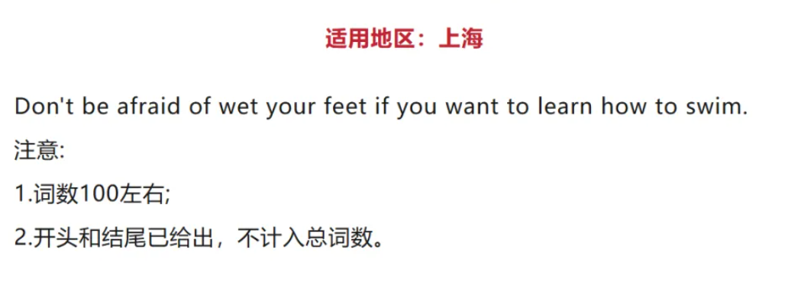
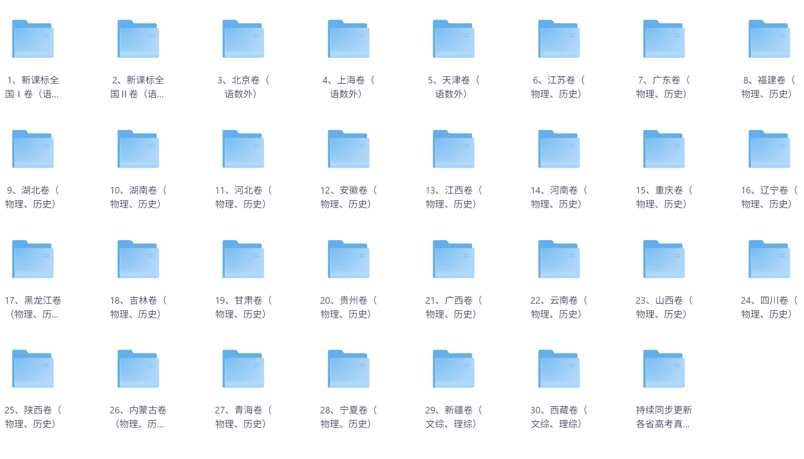
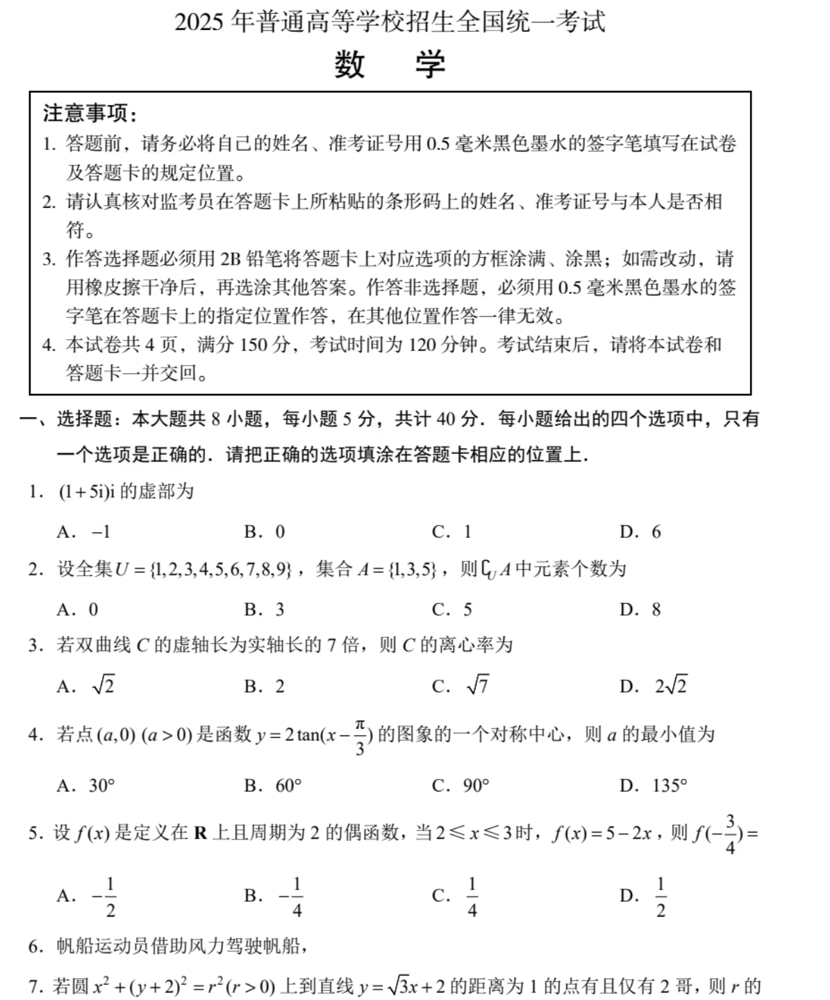
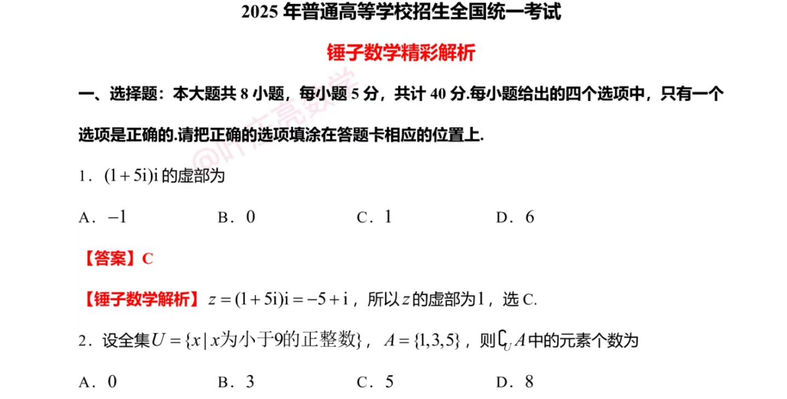
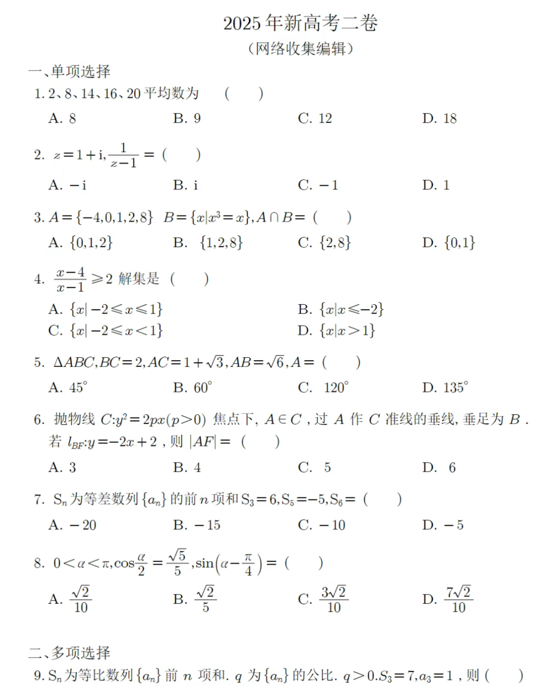
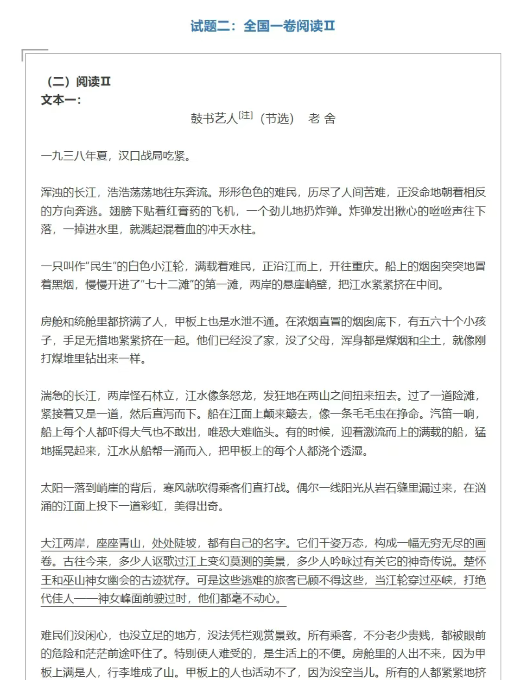

---

内容太多放在这里了自己拿

[2025年各省高考英语及答案](https://pan.quark.cn/s/c1f374a95247)

地址： https://pan.quark.cn/s/c1f374a95247

---

今天给大家准备的是：2025高考英语真题试卷答案（全国1卷+2卷+北京卷+天津卷+上海卷）。

2025年英语高考真题答案pdf电子版来了。2025高考英语真题pdf，上海英语高考真题2025，英语试卷高考真题，2025河南高考英语真题。**今天给大家准备的是：2025年高考历史全国各省真题和参考答案。**

接下来的考试继续加油！

**浙江，山东，广东，江苏，福建，湖北，湖南，河北，安徽，江西，河南**

**新课标2卷适用省份**：

**四川，山西，广西，云南，海南，贵州，甘肃，陕西，青海，宁夏，重庆，辽宁，吉林，内蒙古，黑龙江，新疆，西藏**

## 目录

1. 新课标全国 Ⅰ 卷（语数外）
2. 新课标全国 Ⅱ 卷（语数外）
3. 北京卷（语数外）
4. 上海卷（语数外）
5. 天津卷（语数外）
6. 江苏卷（物理、历史）
7. 广东卷（物理、历史）
8. 福建卷（物理、历史）
9. 湖北卷（物理、历史）
10. 湖南卷（物理、历史）
11. 河北卷（物理、历史）
12. 安徽卷（物理、历史）
13. 江西卷（物理、历史）
14. 河南卷（物理、历史）
15. 重庆卷（物理、历史）
16. 辽宁卷（物理、历史）
17. 黑龙江卷（物理、历史）
18. 吉林卷（物理、历史）
19. 甘肃卷（物理、历史）
20. 贵州卷（物理、历史）
21. 广西卷（物理、历史）
22. 云南卷（物理、历史）
23. 山西卷（物理、历史）
24. 四川卷（物理、历史）
25. 陕西卷（物理、历史）
26. 内蒙古卷（物理、历史）
27. 青海卷（物理、历史）
28. 宁夏卷（物理、历史）
29. 新疆卷（文综、理综）
30. 西藏卷（文综、理综）

