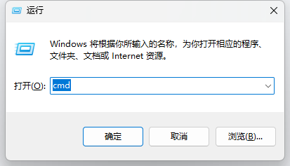
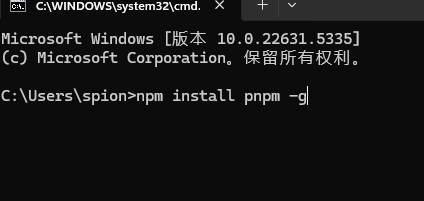

做网站是要花钱的，需要买域名，买服务器，然后备案，才可以有一个自己的个人网站，光备案做网站就需要2周到一个月，因此为花大量的时间。

现在我有个方法，你只要使用`vuepress`和`plume主题`，就可以在github上搭建一个免费的个人博客。

完全免费，不需要买域名，也不需要服务器，我已经搭建好了。
这是我的网站，你可以到我的网站上看我的博客：

[https://spionbo.github.io/](https://spionbo.github.io/)

# 搭建教程

下面开始搭建教程：

开发这个项目之前，需要安装一些`软件`或`工具`才能实现开发；下面是一些工具：
需具备一定的编程能力才可以进行个人博客搭建，当然如果按照以下方法，也是可以行的通的。
如果不想自己操作也可以联系我进行搭建。

- Node.js 最新版
- pnpm
- VuePress
- git

## 安装 Node.js
首先去Node.js官方下载安装包安装： [https://nodejs.org/en](https://nodejs.org/en)


## 安装pnpm
同时按 win+R键，在弹出的运行对话框中输入cmd，打开Windows的命令行：



按确定。会出一个命令对话匡：



执行命令：

```bash
npm install pnpm -g
```
## 命令行安装
主题提供了一个 命令行工具，帮助您构建一个基本项目。您可以通过运行以下命令，启动 安装向导。

```bash
pnpm create vuepress-theme-plume@latest
```

启动向导后，您只需要回答几个简单的问题：

```bash
┌  Welcome to VuePress and vuepress-theme-plume !
│
◇  Select a language to display / 选择显示语言
│  简体中文
│
◇  您想在哪里初始化 VuePress？
│  ./my-project
│
◇  站点名称：
│  My Vuepress Site
│
◇  站点描述信息：
│  My Vuepress Site Description
│
◇  是否使用多语言？
│  No
│
◇  请选择站点默认语言
│  简体中文
│
◇  是否使用 TypeScript？
│  Yes
│
◇  请选择打包工具
│  Vite
│
◇  部署方式：
│  Custom
│
◇  是否初始化 git 仓库？
│  Yes
│
◇  是否安装依赖？
│  Yes
│
◇   🎉 创建成功!
│
└  🔨 执行以下命令即可启动：
      cd ./my-project
      pnpm run docs:dev
```

## 启动项目
执行以下命令即可启动：
上一步说明过，其实就是进入你创建的项目，再启动项目:

```bash
  cd ./my-project
  pnpm run docs:dev
```

## 怎么写文章？

这里用的都是`markdown`语法，你可以在`docs/`文件夹下写文章。

`markdown`语法很简单，可以看以下文章：

[markdown写作指南](/article/a8ekvit2/)

--- 

# 部署，把项目上传到github，拥有自己的网站