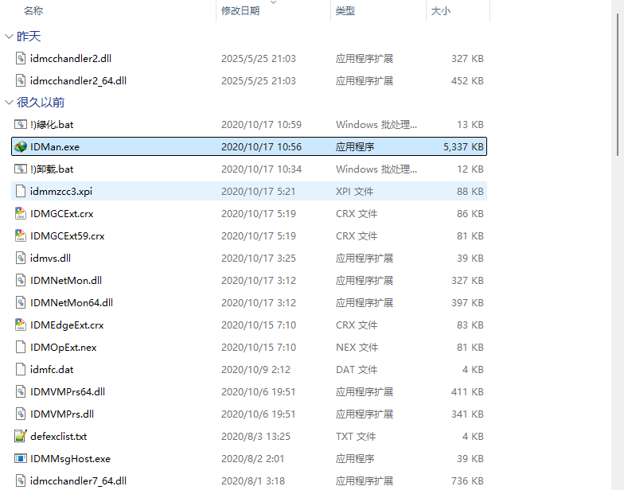
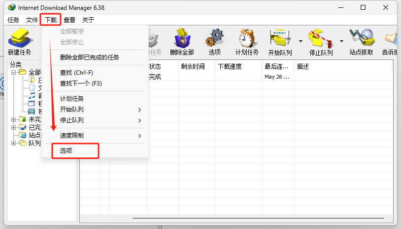
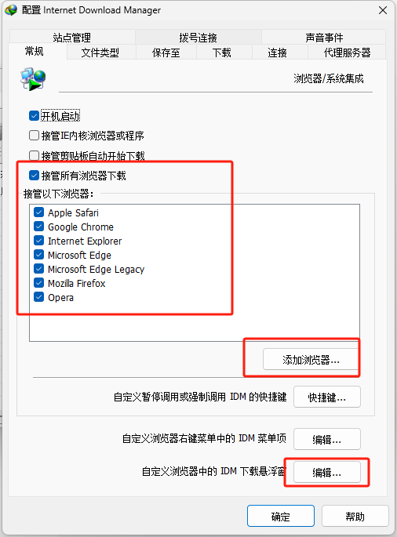
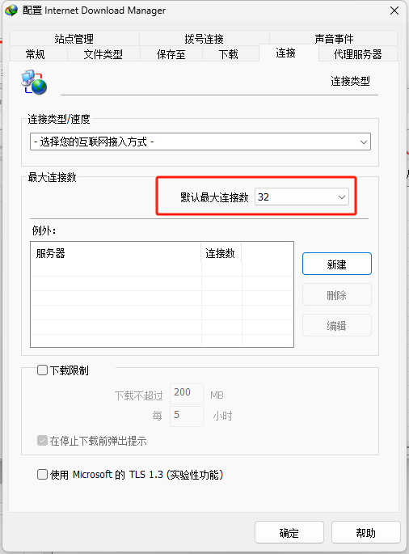
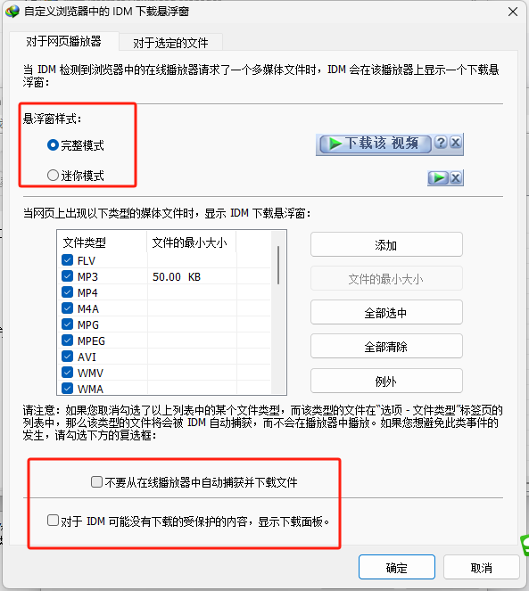
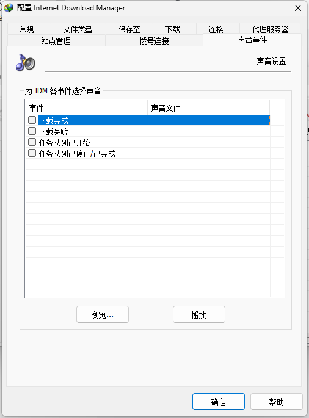
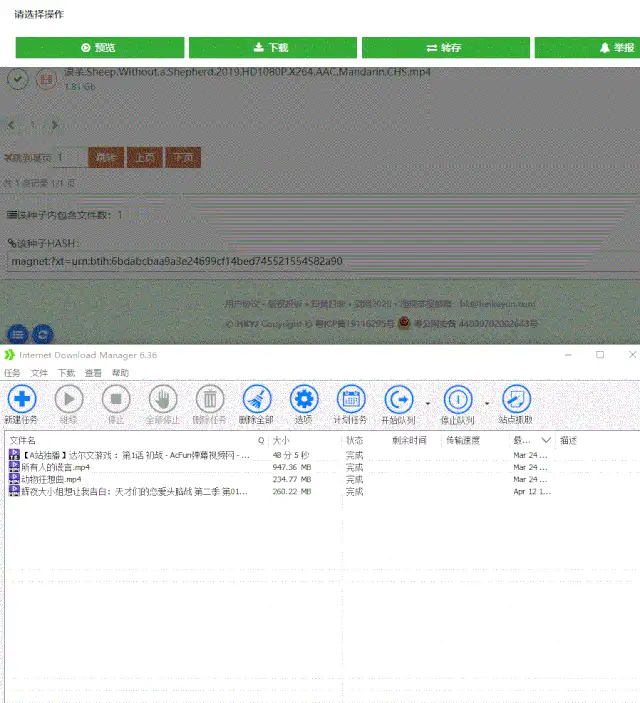

## 软件安装教程

# 保姆级教程：手把手教你玩转 IDM 下载神器
咱们普通老百姓平时上网，不管是下载电影、音乐，还是各种学习资料，都希望能又快又方便。今天就给大家介绍一款超厉害的下载工具——IDM（Internet Download Manager），下面我会一步一步教大家怎么下载、安装、设置，还有用它下载网页资源、网盘资源和磁力资源的方法。

## 一、IDM 的下载与安装
### （一）软件简介
IDM 就像是一个下载小能手，它最大的特点就是下载速度超级快，快到让你感觉像坐了火箭一样。不管你是想下载音乐、视频，还是其他各种文件，它都能轻松搞定。而且，要是配合一些脚本或者插件，还能突破百度网盘的限速，让你下载网盘里的东西也能飞快。

它的工作原理其实也不复杂。它支持 HTTP、FTP、HTTPS 和 MMS 这些协议的下载方式，简单来说，就是可以直接从网页上下载资源。它会把一个大文件分成好多小段，然后同时下载这些小段，最后再把它们合在一起。这样一来，就不用像迅雷那样，要靠很多人一起上传下载（P2P 方式），所以就算用的人多，也不会影响它的下载速度。

### （二）下载与安装
IDM 的安装其实不难，不过浏览器插件的安装可能会让一些朋友有点摸不着头脑，别担心，跟着我一步一步来，肯定没问题。

#### 第一步：下载安装包
大家可以下载我分享的俄罗斯大神版 IDM 安装包。要是你觉得下载安装包有点麻烦，我在文末也准备了最新 6.38 的直装版，直接运行安装包就能装好，很方便。

#### 安装步骤
1. **下载安装包**：你可以下载DM 安装包，然后解压。要是你觉得麻烦，文末也准备了最新 6.38 的直装版，不用自己手动折腾。

### （二）下载与安装
1. **安装包获取与解压**：先下载 IDM 安装包。要是觉得麻烦，文末还有最新 6.38 直装版（简化版，无需复杂操作）
   - 俄罗斯大神版安装步骤：
    - 下载 IDM 安装包，解压后，右键以管理员身份运行安装包中的图标。
    - 安装时，默认安装在 C 盘，但你可以选择自定义安装位置，比如不想装在 C 盘，就选“Browse”浏览选择其他盘符安装。
    - **直装版**：运行安装包就能直接使用，安装超方便。
    - **绿色版**：直接双击运行

### （二）下载与安装
1. **下载安装包**：下载后进行解压。如果嫌麻烦，文末还有最新直装版，直接运行就能安装，非常方便。
2. **解压与运行**：解压后，右键以管理员身份运行安装包中的图标。
3. **安装过程**：一路点击“下一步”完成安装。如果不想安装在 C 盘，可在安装时选择“Browse”自定义安装位置。

### （二）设置
1. **参数设置**
    - **浏览器插件响应**：确保“监视点击事件”和“使用浏览器集成”已勾选，并选择你常用的浏览器。
    - **最大连接数设置**：将最大连接数设为32，这样IDM就能同时用32个接口同时下载文件，速度更快。但需注意，对于超过2G的文件，需权衡连接数与后期重组合成时间。  
- **临时文件夹设置**：建议将临时文件夹设置在非C盘，避免大文件下载时占用C盘空间。  
- **下载完成音**：可自定义提示音，提升使用体验。

## 二、IDM 的网页下载
### （一）网页资源下载
安装并设置好 IDM 后，咱们来试试它的威力。打开一个视频网页，点击下载按钮，IDM能以极快速度下载，如200M宽带跑出30Mb/s速度，200M宽带跑出30Mb/s。

---

## 三、IDM 的网页下载
### （一）操作步骤
1. **找到资源**：打开任意视频网页，IDM 会自动捕捉可下载资源，点击下载按钮即可。  
2. **见证速度**：以200M宽带为例，IDM 下载速度可达30Mb/s，轻松应对1080P视频下载，几十秒搞定，速度远超常规。

---

## 二、IDM 的网盘下载
通过安装特定插件，IDM 可突破网盘限速，实现近30Mb/s的下载速度。

### （一）插件安装
插件安装后，配合IDM可快速下载网盘资源，但需注意敏感资源的下载合规性。

---

## 四、IDM 的磁力下载
### （一）方法一：某科解析下载
1. **复制链接**：将需要下载的磁力链接复制到解析网站。  
2. **解析下载**：利用解析网站启动IDM，速度可达30Mb/s，适合大文件。  

---

## 三、IDM的磁力下载
### 方法一：某科解析法  
- **操作**：复制磁力链接 → 某科解析启动IDM，30Mb/s 极限速度。  
- **某度网盘**：离线解析后IDM可达30Mb/s。

---

### 方法二：网盘离线法  
1. **操作**：将磁力链接提交至某6网盘等支持离线的平台，解析成功后用IDM下载。  
2. **效果**：同样能达到近30Mb/s的下载速度，但需注意某度网盘离线成功率较低，建议结合其他网盘（如某6）提高离线成功率。  

---

IDM 是一款功能强大的下载工具，但需严格遵守法律法规，严禁用于非法下载受版权保护的内容。通过科学设置与持续优化，让IDM在合法合规前提下发挥最大效能，让每一次点击都充满温度。

---
## 软件来源
[【夸克网盘】点击查看](https://pan.quark.cn/s/97224e8c5ec0)

---
关注我获取更多内容