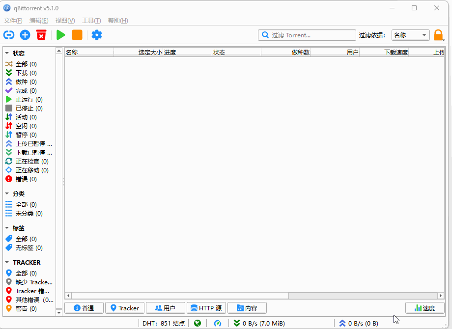
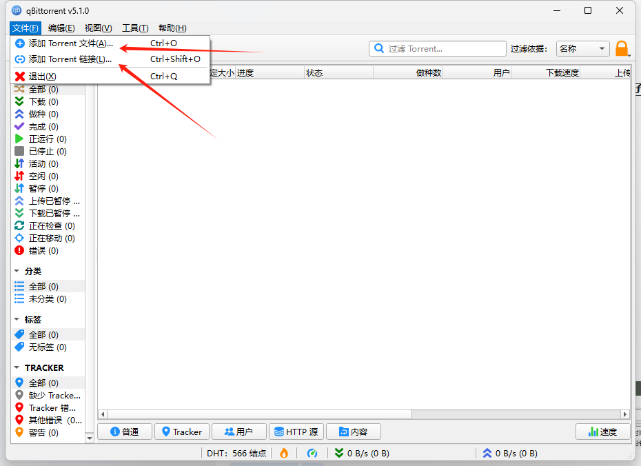
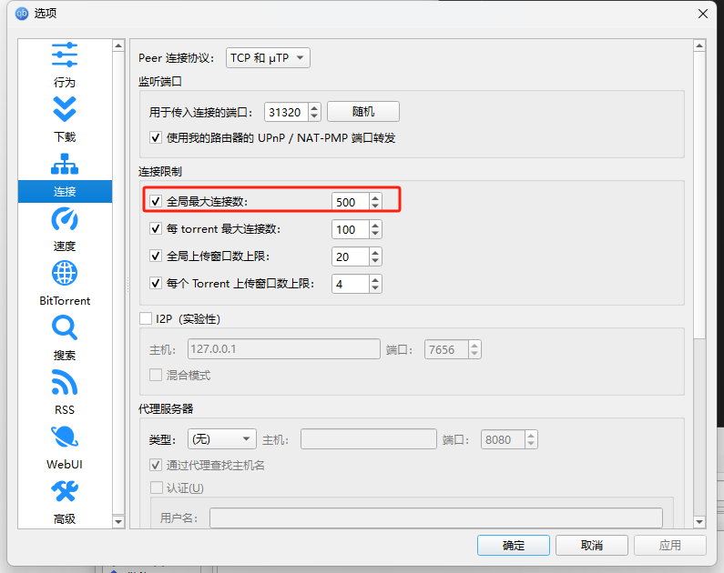
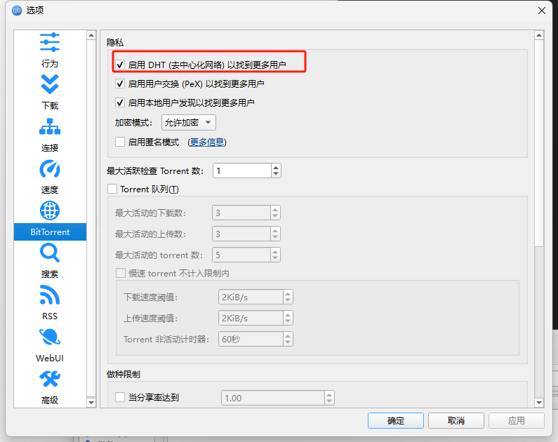

`qBittorrent`是免费和可靠的P2P Bittorrent客户端，横跨`Linux`, `Mac OS X`, `Windows`, `OS/2`, `FreeBSD`平台，支持包括 `DHT`、`Peer Exchange`、`Full encryption` `等多种下载技术，支持下载完成后自动关机、限制上传下载速度。用户可以使用qBittorrent` `Controller`进行远程控制。还可通过手动添加的搜索引擎可以搜索到更多的种子。

`qBittorrent` 没有任何广告，这让它成为最佳的 `Mac` 系统种子下载工具。 毕竟没有人希望使用数不尽弹出广告的下载程序。该软件没有任何不必要的插件，可以帮助用户快速完成下载，节省时间和金钱。

`qBittorrent` 是一款开源免费的种子和磁力链接下载工具，支持 `Windows`、`Mac` 和 `Linux`，且功能非常强大。

`qBittorrent` 支持使用种子文件和磁力链接下载，包括了做种、`tracker` 编辑、下载优先级设置、RSS 订阅等功能非常丰富。

## 一、安装 qBittorrent

**下载客户端**

• 访问 `qBittorrent` 官网，选择适合你操作系统的版本（`Windows/macOS/Linux`）。

[所有版本都放在这里了，点击下载安装包](https://pan.quark.cn/s/a8b5729843d8)

**安装软件**

• 双击安装包，按提示完成安装。

## 二、获取 Torrent 文件或磁力链接

**Torrent 文件（.torrent）**

• 从合法资源网站下载种子文件（如开源软件、公共领域内容）。

**磁力链接（Magnet Link）**

• 复制以 `magnet:?xt=urn:btih:...` 开头的链接（常见于资源分享页面）。

## 三、使用 qBittorrent 下载文件

**方法1：通过 Torrent 文件下载**

**添加 Torrent 文件**

• 打开 `qBittorrent`，点击左上角 文件 → 添加 `Torrent` 文件（或直接拖拽 `.torrent` 文件到窗口）。

• 选择文件后，弹出设置窗口。

**设置下载选项**

• 保存路径：选择文件下载位置（如 D:\Downloads）。

• 内容布局：

◦ 若种子包含多个文件，可取消勾选不需要的文件。

• 点击 `确定` 开始下载。

**方法2：通过磁力链接下载**

**添加磁力链接**

• 点击左上角 文件 → 添加 `Torrent` 链接。

• 粘贴复制的磁力链接，点击 下载。

设置保存路径（同上）。

## 四、优化下载速度

1.  调整连接设置

点击 工具 → 选项 → BitTorrent：

• 全局最大连接数：设置为 500（默认值较低）。

• 每个 `Torrent` 的最大连接数：设置为 100。

• 勾选 启用 DHT 网络 和 启用 Peer 交换（PEX）。

3. 端口转发（可选）

在 选项 → 连接 中：

• 监听端口：设置为 `6881-6889`（需在路由器中开启端口转发）。

## 常见问题

1、状态栏的 “插头” 是黄色的（不是绿色）：不影响下载，只有文件有上传了才会变绿。

2、添加磁力链接，`qBittorrent` 一直显示 “正在下载元数据”：这个最常见了，相当于在等待下载种子信息。强烈建议使用种子文件进行下载，就不会出现这个了。

3、连不上` DHT` 节点：先下一个热门种子试试，`DHT` 涨起来了再下载。

4、理论上 `trackers` 和 `DHT` 网络有一种连上了在工作，就有速度。还没速度查看下用户、种子、trackers 等的连接情况，如果都为 0 可能是死链，建议换热门的资源。

5、磁力种子的下载速度依赖于资源数量和广大用户的上传做种，上传分享的人越多，速度越快。

6、建议下载完后不要急着移除任务，上传做种，可以设置下上传速度或时间，原因就是上一条。