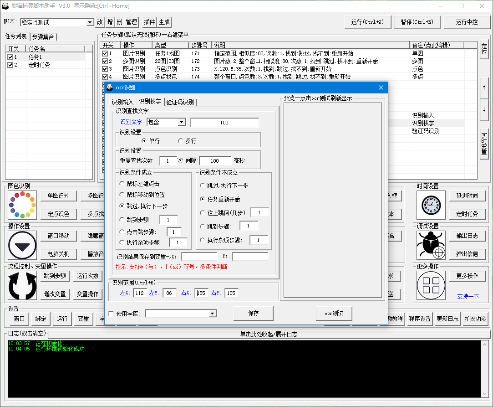
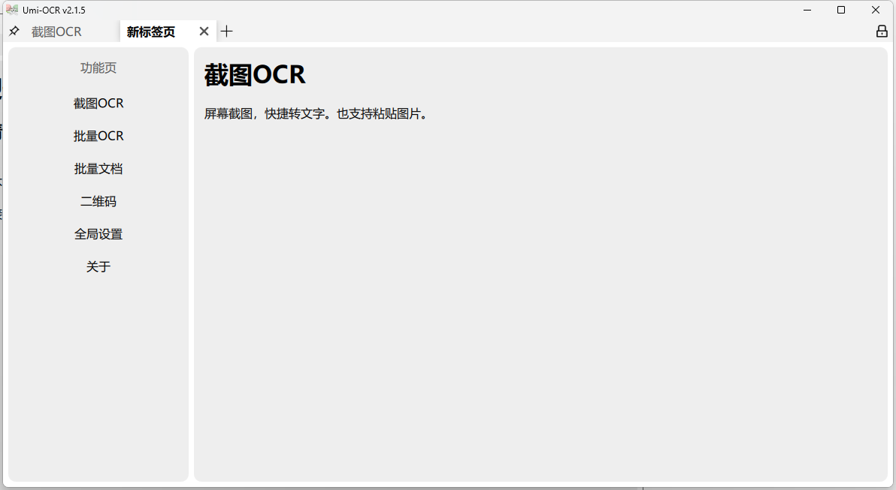
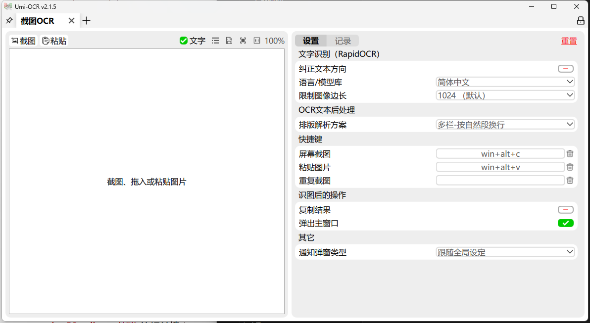
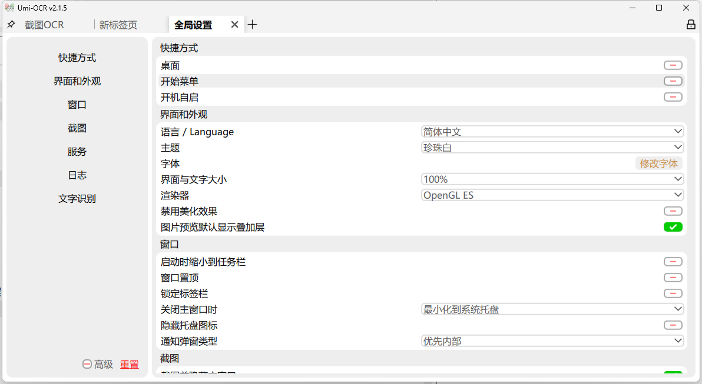
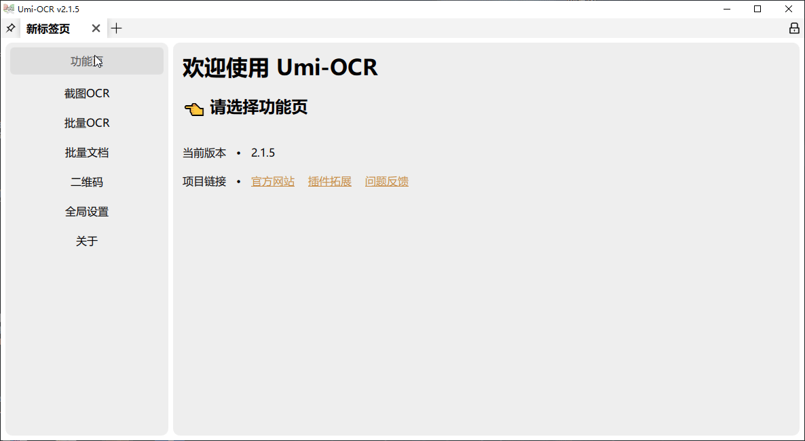
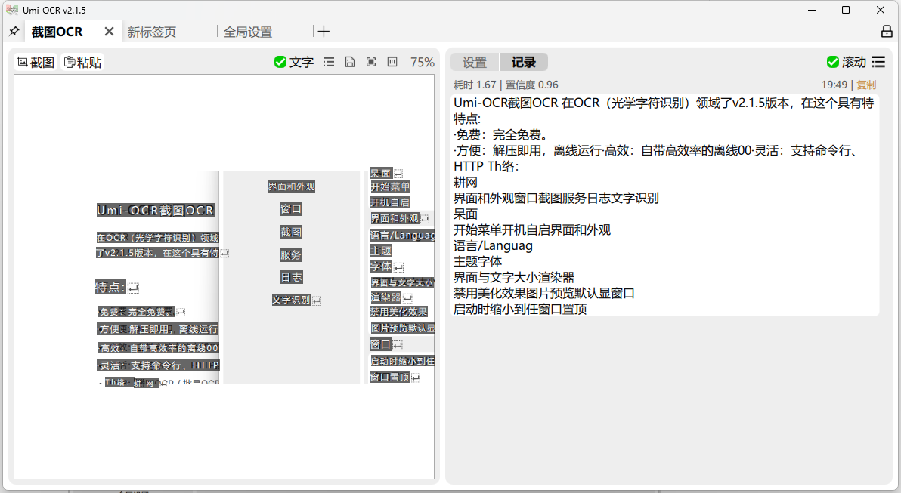
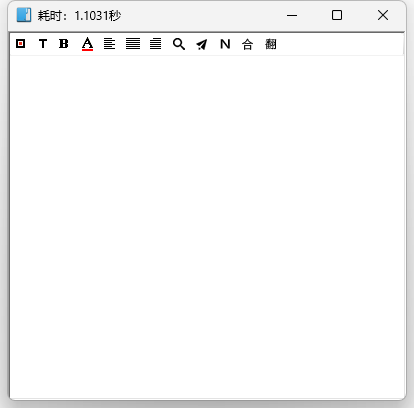
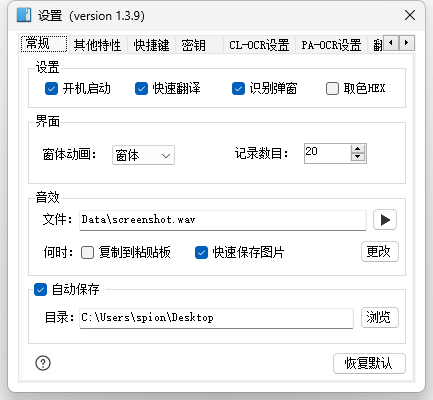

图文识别的软件有很多，但主要还是要功能全，速度快，误差小，有的软件虽然可以用，但速度太慢了，下面分享几个都还不错的。

## 下载

[直接在这里获取，所有OCR文件都放这里了](https://pan.quark.cn/s/71ca74d1d0e9)

## 熊猫OCR

熊猫精灵脚本助手

- 简易上手、无需懂代码、完成复杂脚本操作
- 功能:多窗口操作、AI找图找色、ocr识别、字库、验证码、键鼠录制
- 后台操作、流程控制、Api对接、速度调节、生成脚本等
- 适合:办公、游戏、小程序、虚拟机、模拟器、手机投屏等。

出了OCR，他还有更多功能

1. 图    色=>YoloAi找图、单张多张图片识别、单点多点找色识别等
2. 鼠    标=>录制、拖动、移动、单击、双击、滚动等
3. 键    盘=>录制、按键、按下、放开、组合按键等
4. ocr 识别=>识别输入、识别找字、验证码识别、字库识别
5. Api 接口=>接口请求
6. 通知设置=>短信接收、邮件接收
7. 文字操作=>读入文件、输入文本、密码输入、变量输入、输入框等
8. 时间控制=>延迟时间、随机时间、定时操作
9. 流程控制=>运行次数、判断循环、变量判断、跳到指定步骤、重新开始、结束运行、关闭软件等
10. 其它设置=>隐藏窗口、调整窗口、电脑关机、播放音乐等
11. 外部设置=>打开网址、运行文件、关闭窗口、关闭软件等
12. 变量设置=>自定义变量、内置变量、读取txt文件、读取excel文件等
13. 更多操作=>降低cpu、激活窗口、禁止外部输入
14. 扩展功能=>开启护盾、坐标工具、调试滚动、运行备注等
15. 窗口设置=>添加窗口、搜索同类窗口、删除失效窗口、窗口排列、统一大小等
16. 绑定设置=>设置前台、后台、仿真、高级识别模式、测试模式
17. 运行设置=>全局偏移、执行任务数量、执行窗口数量、全局延迟、运行速度调节
18. 程序设置=>快捷键、托盘设置、坐标模式
19. 脚本管理=>导入导出修改、分享脚本、备份脚本等
20. 调试设置=>运行中控、输出log、弹出信息框
21. 插件管理=>自带ocr插件、umi-ocr、验证码识别、仿真驱动等
22. 生成脚本=>将制作好的脚本生成后发给客户、自定义软件页面内容

## Umi-OCR 截图OCR

在 OCR（光学字符识别）领域，Umi-OCR 一直凭借其强大的功能和开源特性备受关注。如今，Umi-OCR 迎来了 v2.1.5 版本，在这个具有特殊意义的三周年之际，带来了诸多令人惊喜的更新。

注意：需要以管理员身份运行，具体操作，右键点击，选择以管理员身份运行

### 特点：

- 免费：完全免费。
- 方便：解压即用，离线运行，无需网络。
- 高效：自带高效率的离线OCR引擎，内置多种语言识别库。
- 灵活：支持命令行、HTTP接口等外部调用方式。
- 功能：截图OCR / 批量OCR / PDF识别 / 二维码 / 公式识别

### 界面：

全局设置：

### 识别效果

## 天若OCR_本地版

天若OCR_本地版 比较简单，运行后，是在后台运行的，基本没什么界面，只需要像截图一样，截图后，就自动返回识别的内容。

天若OCR是一款高效的文字识别工具，作为生活类小程序，它能够快速将图片或截图中的文字转换为可编辑文本，支持多种语言识别且精度高 。该工具支持多种语言识别，识别精度较高，用户可选择局部或全屏截图进行操作，流程简洁。适用于文档编辑、翻译等场景。

天若OCR主要功能为高效文字识别，支持多语言转换，识别结果精准度高。用户可通过截图或上传图片快速获取可编辑文本，截至2024年10月，新增批量处理功能，可同时识别多张图片内容。

### 界面

设置：

