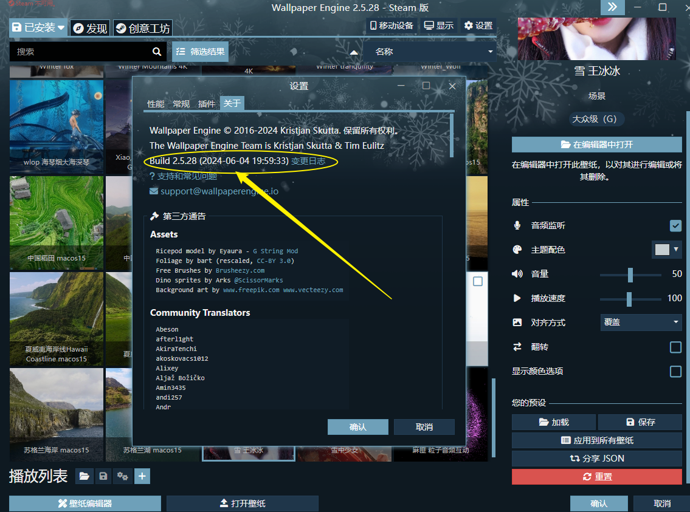
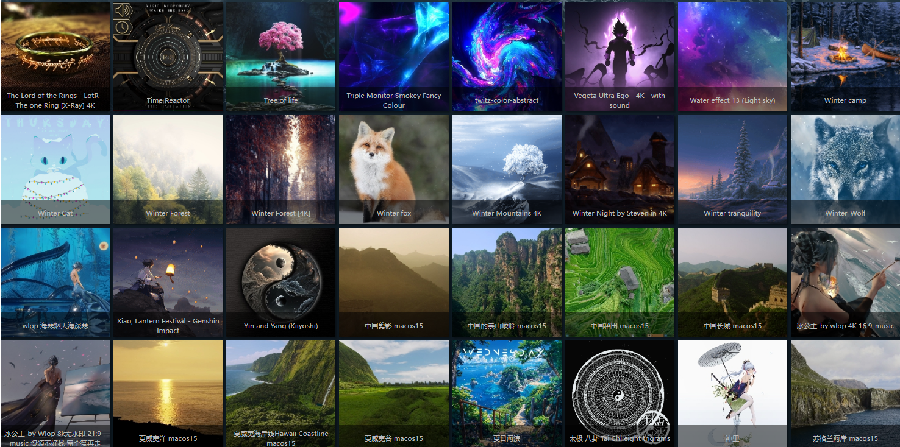
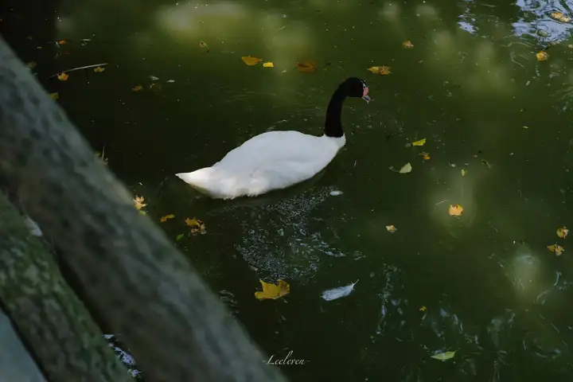

你见过最惊艳的 Wallpaper Engine 壁纸有哪些?

Wallpaper 是 Steam 人手一个的软件吗？

在某知上搜索你会发现，不知道这款壁纸软件，真心不知道壁纸还有这么多玩法，
可以这么说他能搜索到你想要的任何壁纸，

## 安装教程

下载地址放下面了

[wallpaper_engine2.5.28版]()

---

## 界面展示

## 功能介绍

- 添加了新的光束效果和预设。
- 添加了新的克隆系统，改进了 Windows 11 兼容性，并能够水平翻转每个克隆。
- 添加了新的播放列表过渡系统，改进了 Windows 11 与 27 种基于着色器的过渡动画的兼容性。
- 添加了 Puppet 变形/混合形状涂抹画笔。
- 添加了可动画的木偶骨骼深度排序。
- 添加了 Puppet 参考叠加，用于参考姿势编辑器。
- 可以将其他内容添加到现有的 Puppet Warp 角色表单中。
- 向 2D 场景添加了 FOV 滑块，其中也包含 3D 资产。
- 改进了 Puppet Warp 参考姿势混合系统，可实现更平滑的肢体过渡。
- 向动画编辑器添加了骨骼多选。
- 向曲线编辑器添加了属性组视图。
- 添加了人偶变形深度顺序以引用姿势编辑器。
- 使骨骼名称可在动画编辑器中编辑。
- 向动画编辑器添加了骨骼选择列表。
- 向混合变形编辑器添加了预览切换。
- 添加了新的人偶着色叠加，以便更轻松地编辑混合变形/变形。
- 改进了动画编辑器缩放。
- 更改了 playSingleAnimation 脚本函数，以应用动画的入/出混合，并使其可配置。
- 更改了 playSingleAnimation，以便在永久附加层之前动态地对动画进行排序。
- 向编辑器添加了 clean local storage 按钮。
- 向可调整的合成图层添加了点滤镜选项。
- 将预览模式下的缩放与当前摄像机缩放值相乘，以便于预览。
- 添加了效果脚本支持，以通过脚本清除中间缓冲区（即流体模拟）。
- 添加了脚本函数，用于每帧操作人偶混合形状和局部骨骼变换。
- 将子图层上的可渲染中心功能更改为以父图层为中心。
- 更新了 CEF。
- 在编辑器中实施了新的场景渲染，以便与新的 CEF 版本兼容并实现最佳性能。
- 改进了摄像机输入的鼠标捕获。
- 更新了 Freetype/Harfbuzz。
- 更新了 V8。
- 如果 Windows 缺少 Media Foundation 库，则为视频纹理添加了 Media Foundation 故障保护。
- 改进了设备丢失稳定性。

## 一些壁纸分享

分享一波自己的wallpaper engine壁纸收藏

个人的审美因素影响比较大，喜欢绿色和雨景，喜欢宁静和纯净。被安利的点个赞

都是直接电脑截屏，画质可能有点被压缩，建议心动的直接去软件上实装一下看看。

