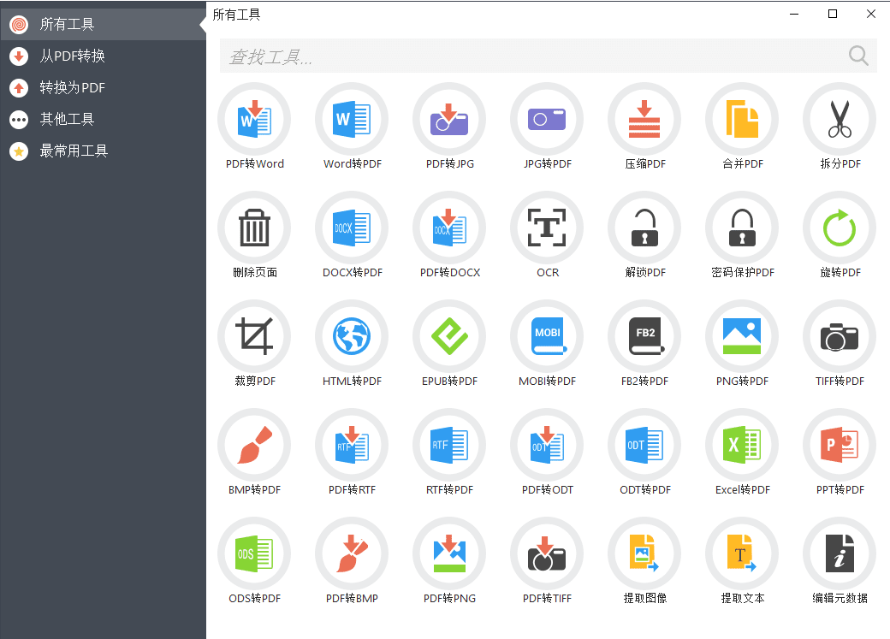
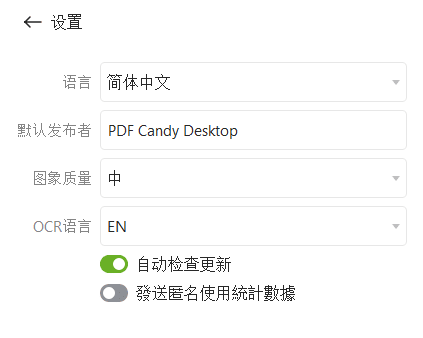
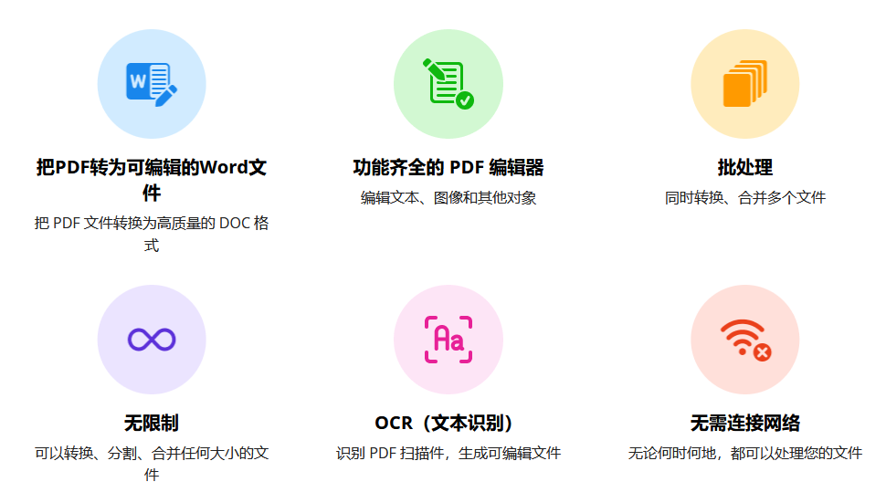
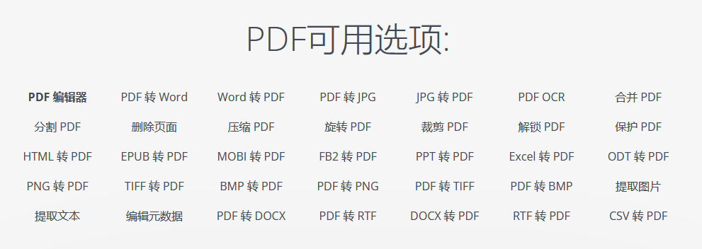
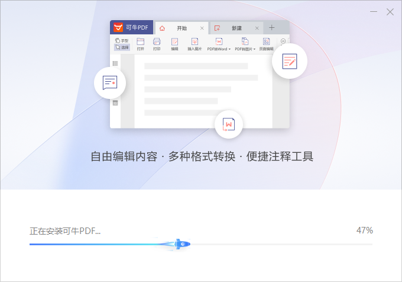
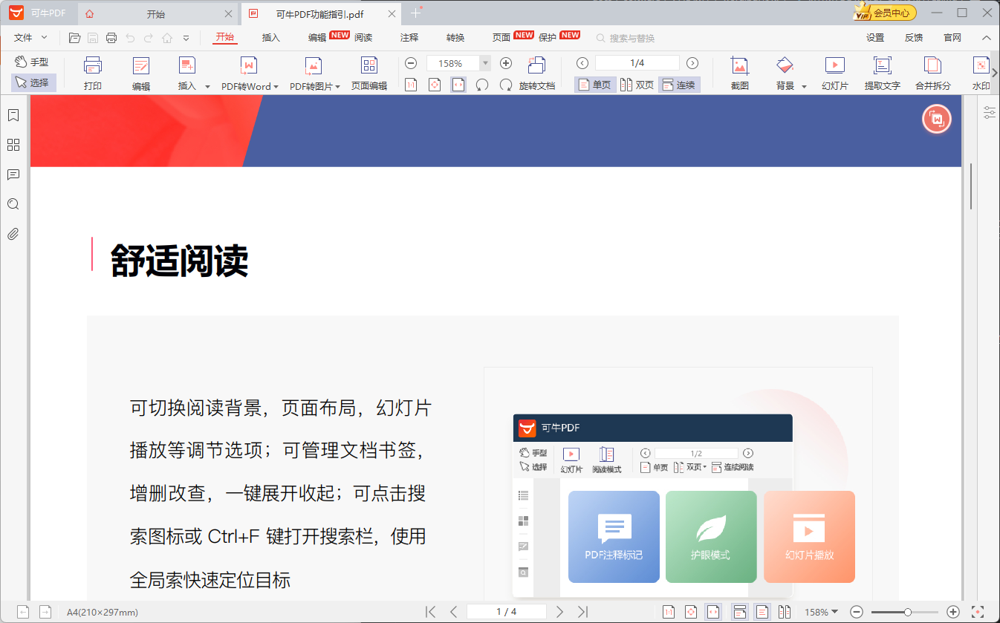
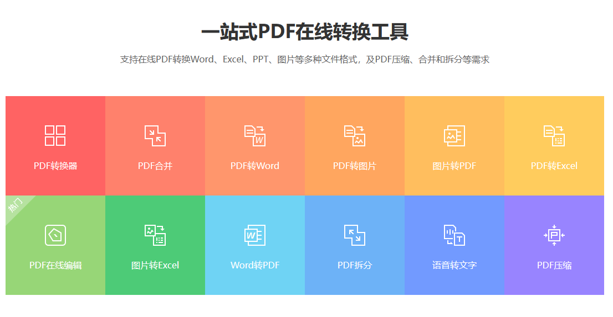
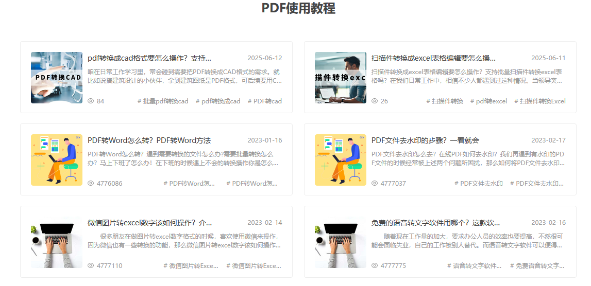

万彩办公大师目前来说应该是最强大，最全面的工具了。

PDF转WORD/PPT/EXCEL批量转换工具等

万彩办公大师就是一款包含了PDF工具集，格式转换工具集，图片编辑工具集，OCR识别工具集，屏幕录制工具集，教学办公工具集，文件处理工具集，系统安全工具集，阅读/浏览器工具等九大类的免费办公工具集。其中涵盖了各种文件的所有处理编辑工具，可以满足目前所有的办公处理要求。

## 安装

无需安装，直接解压，双击运行就可以使用了。

下载地址： [万彩办公大师OfficeBox官方绿色版v_3.1.2](https://pan.quark.cn/s/8aba5da76a4d)

---

## PDF Candy 

### 介绍

PDF Candy Desktop 是一款一体化的 PDF 解决方案。可编辑 PDF、转换为 PDF 或反向转换（PDF 转 Word、JPG 转 PDF、EPUB 转 PDF、PDF 转 JPG 等）、合并 PDF、分割 PDF、从 PDF 中提取图像和文本、编辑 PDF 元数据、保护或解锁 PDF 文件。大多数工具支持批量处理。全新、现代的用户界面。

### 安装

获取地址：[PDFCandyDesktop](https://pan.quark.cn/s/dd54c5a3b98f)

## 可牛PDF编辑器

这个要充钱，自己按自己情况来，下载链接我都不想提供了，因为太多不要钱的了，没必要。

PDF编辑，操作简单高效

工具支持文字快速编辑、支持擦除图片、一键插入图片、插入页码。界面布局浅显易懂，操作简单，让办公更有效率！

 一键PDF编辑  ·  PDF快速阅读  ·  PDF添加去除水印  ·  PDF编辑与抠图
高效PDF转Word  ·  OCR图文识别  ·  支持全文翻译

### 操作界面
软件功能实用且丰富

一款支持文档编辑，图片编辑、以及文档转换的全能处理工具。还拥有PDF合并、文件加密以及添加水印、去除水印等功能

## 在线PDF编辑平台

任意门：https://www.pdf365.cn/

一个在线PDF编辑平台，功能很多，而且操作也很简单。它里头功能包括编辑、转换、合并啥都有，一应俱全。当然啦，免费版的

在线PDF编辑平台根本不用下载安装，打开网页就能直接用，简直就是即开即用的典范

提供了很多使用教程，轻松解决问题

