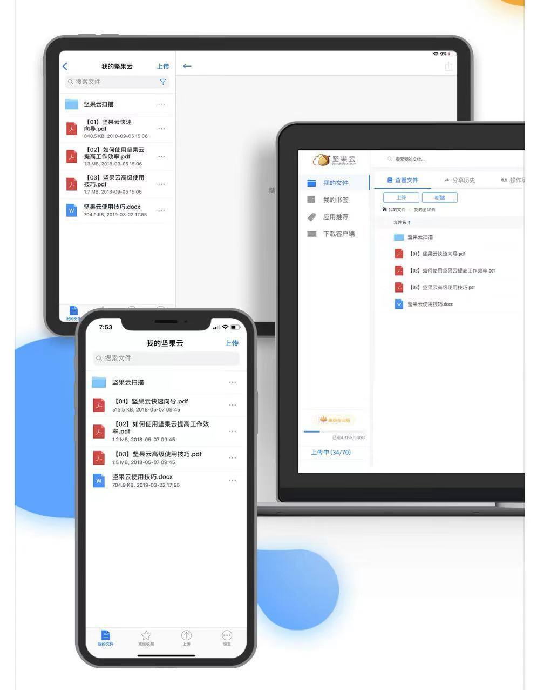
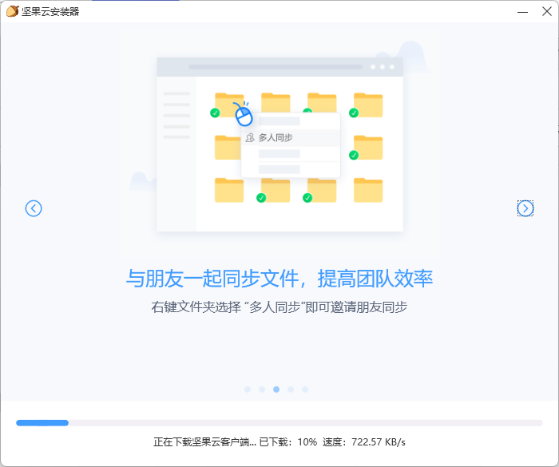
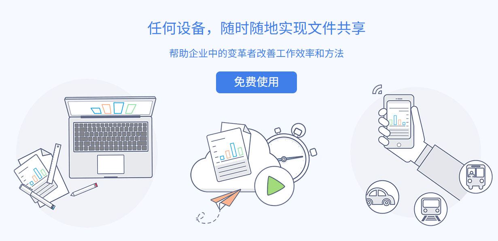
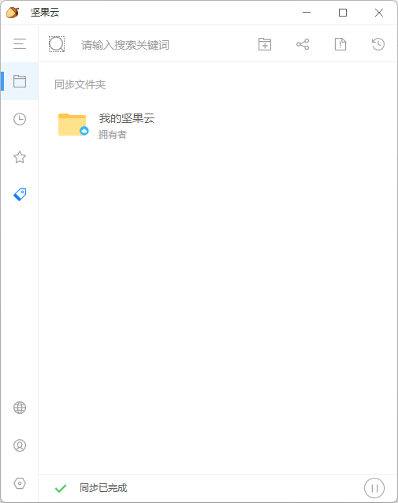

坚果云是一款便捷、安全的专业网盘产品，通过文件自动同步、共享、备份功能，为用户实现智能文件管理，提供高效办公解决方案。

## 下载地址

[坚果云点击获取](https://pan.quark.cn/s/c08bba3e91f7)

--- 

坚果云是微软加速器云存储合作伙伴，IBM全球创业企业扶持计划成员，安全稳定的服务着数百万企业用户，包括东风雷诺、郑州日产、上海通用、银河证券、中石油、中海油、阿里巴巴等大型企事业单位。

坚果云全平台覆盖，支持Windows、Mac、Linux、iOS（iPad及iPhone）、Android、Windows Phone、Web七大系统。安装客户端后即可在电脑、平板、手机、网页之间实现互联，随时随地访问文件。

坚果云产品分为面向个人用户的免费版、专业版和面向企业/团队用户的团队版（公有云）、企业版（私有云），满足用户的不同需求。

坚果云强大的自动同步功能，随时为用户将文件更新备份到客户端和云端，无需手动操作，创造便捷、“无感”的用户体验。

坚果云团队版可实现文件共享及精细的权限设置功能，帮助企业用户实现文件集中规范管理和安全共享。

## 文件自动同步

用户可以在多个设备（电脑、手机、平板电脑）随时随地访问文件，只需在每个设备上安装坚果云客户端并登录同一账号，指定需要同步的文件夹，坚果云会自动将指定文件夹同步到云端和所有设备中，在任何设备中创建、修改文件也会实时同步到其他设备。如果编辑文件的设备处于离线状态，或其他设备处于关机或离线状态，在连接网络后会自动将文件同步到最新状态。

## 文件共享

用户可以邀请他人与自己同步指定文件夹，即共享该文件夹。收到邀请者可选择将该文件夹同步到自己的电脑，也可不同步到本地只通过网页端访问。文件夹拥有者可以对共享者设置访问权限，包括可读写、只读、只写、预览等。

## 文件搜索

用户可以在坚果云客户端和网页端通过名称搜索文件或文件夹，快速定位文件。其中如果客户端搜索的是本地文件，在无网络环境下也可以进行，通过网页端可以搜索到并未同步到本地的文件。
坚果云企业版用户可以进行全文检索。

## 历史版本比较

坚果云为用户保留文件的历史版本，用户可以查看文件的历史修改记录，并选定某一历史版本进行查看。坚果云对Office文件提供比较功能，自动高亮出不同版本间的差异。

## 一键分享

用户可通过坚果云客户端、网页端获取指定文件/文件夹链接（URL）及二维码，通过邮件或其他方式分享给他人，接收人可通过链接直接下载或在线预览该文件/文件夹。

## 照片视频自动备份

坚果云移动客户端（iOS、Android）具备照片自动备份功能，用户可设置在WIFI环境下自动备份拍摄的照片和视频（免费版只提供照片备份），并同步至电脑。

## 团队管理

用户可以通过坚果云团队版创建和管理团队，对团队成员进行分组管理，并对每个用户和每个群组进行精确的文件夹访问权限设置，包括可读写、只读、只写、预览等，还可以通过限制登录IP、强制手机验证、禁止粉碎文件等设置保证团队文件安全。

