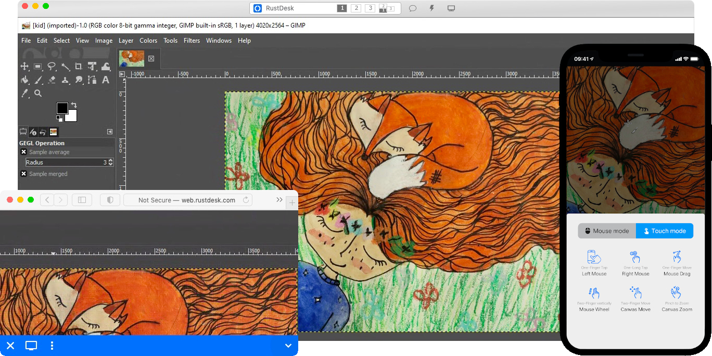
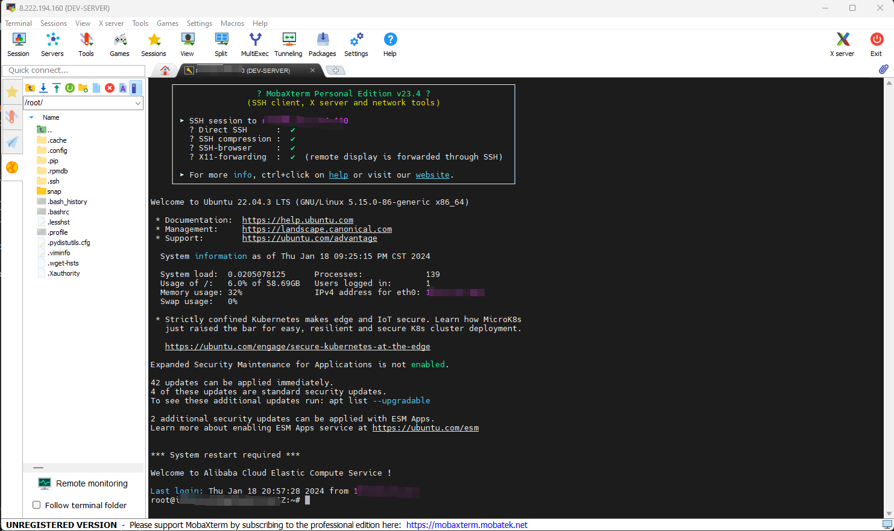
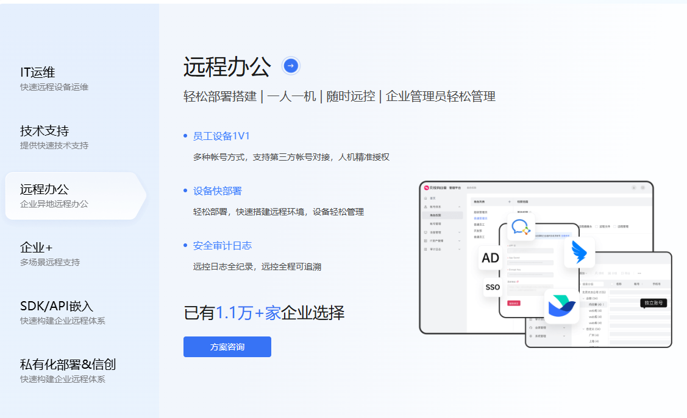
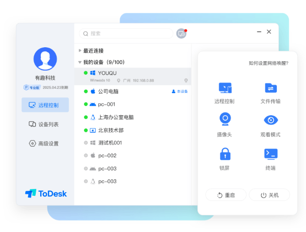
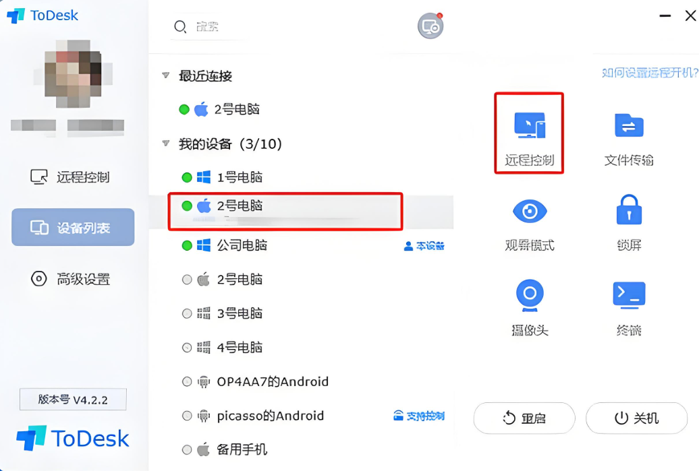

远程桌面软件有很多，但需要支持跨平台控制、端到端加密和自建服务器，其开源特性、安全机制和灵活的部署方式，使其成为个人和企业远程协作的理想工具。‌‌‌‌

主要体现，安全，跨平台，保密，速度快等特性。

## 下载地址

[向日葵，ToDesk，RustDesk，三款都在这里了](https://pan.quark.cn/s/688c036ff32f)

## RustDesk

RustDesk是一款 免费开源 的远程桌面软件。它跨平台，支持Windows、MacOS和Linux。它非常容易使用，界面友好。其最大的特点是 支持自建服务器 。您可以构建自己的服务器并使用它来连接远程计算机。这对于那些想要控制远程计算机但又不想使用公共服务器的人来说非常有用。

**1、‌开源与自主可控‌。**

RustDesktop 基于 Rust 语言开发，代码完全开源，支持社区参与优化。用户可自建服务器，实现数据主权掌控，规避第三方平台的安全风险，特别适合企业级合规需求。‌‌‌‌

**2、‌跨平台兼容性‌。**

支持 Windows、macOS、Linux、Android、iOS 及网页端，实现设备无缝衔接。例如，手机远程操控办公电脑，或通过平板控制教室设备。‌‌‌‌

**3、‌安全机制‌。**

采用 TLS 1.3 端到端加密协议，支持 IP 白名单和局域网发现功能。2025 年 5 月发布的 1.4.0 版本新增锁屏密码登录，进一步提升远程访问安全性。‌‌‌‌

**4、、典型应用场景‌**

‌远程办公‌：手机控制公司电脑处理紧急事务，支持 60 fps 高帧率显示和带宽自适应技术，保障低延迟操作。‌‌

‌IT 运维‌：通过无人值守访问批量部署设备，结合访问控制列表（ACL）实现精细权限管理。‌‌

‌教育培训‌：教师远程操控教学设备，利用截屏功能实时标注讲解（1.4.0 版本新增）。‌‌

## 向日葵

向日葵远程控制支持手机远程操控电脑桌面并录屏审计，便于异地协助；可分享屏幕给技术支持，实现实时沟通、文件互传及设备设置调整；能将手机屏幕投屏至电脑或电视，适用于游戏分享与会议讲解；支持手机互控，可远程调试及教学；能手机或电脑操控异地电脑游戏；可调用设备摄像头进行远程监控；支持多设备间文件互传；搭配硬件可远程开关电脑；还支持远程命令行及Linux设备运维操作。

## ToDesk

本来Todesk靠着免费用户没限制已经稳压向日葵了，结果这一波直接加了免费用户限制之后，一点优势都没了，画面也就那样，除了传输速度还行好像别的都一般了。

主要是这个120h/300次，我的天呀...你是自己不知道自己的断线频率有多高么，我手机放后台几十秒就断线了，我给别人传个文件还要我一直前台盯着嘛！正常用一天连接次数就得有个几十次，300次我连一个星期都撑不下来！