## Chrome浏览器

[chrome浏览器离线版](https://pan.quark.cn/s/0065796ea9dc)

点击 安装到浏览器 按钮，此时右上角出现下载按钮，点击下载按钮。

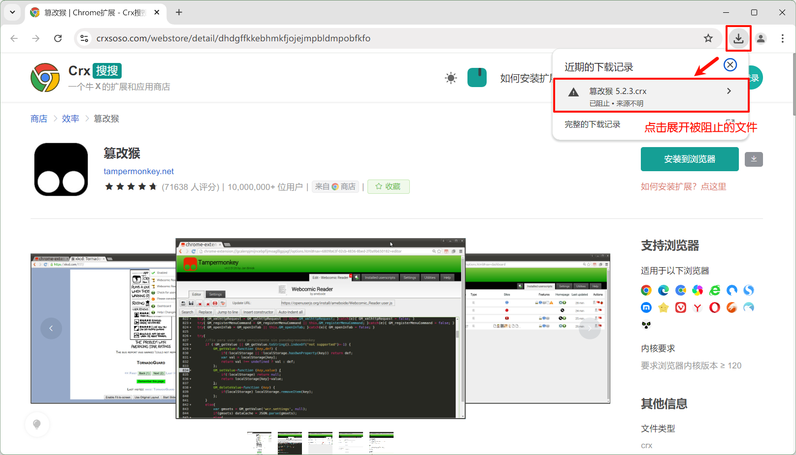

找到下载的文件点击 下载可疑文件，（说明：这里并非可疑文件，而是 Google 为了垄断，从第三方商店（比如Crx搜搜）安装的默认会被 Chrome 阻止下载）

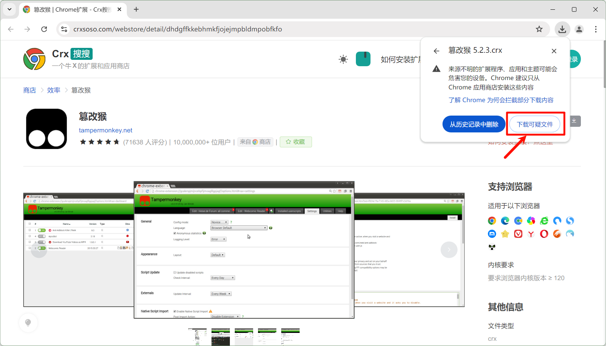

下载完成后提示 无法从该网站添加扩展程序，这是因为 Google 限制，导致无法从第三方网站在线安装扩展，忽略即可。

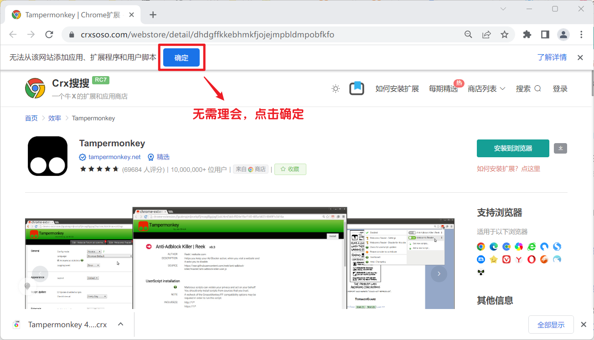

在地址栏中输入 chrome://extensions复制链接，打开扩展管理页面，然后再打开右上角的【开发者模式】，然后刷新本页。

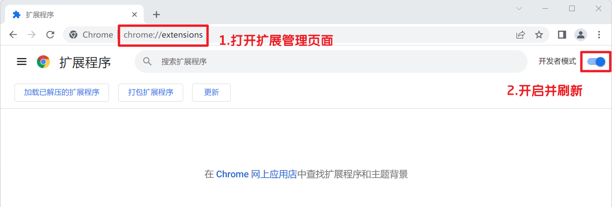

在下载记录里找到刚才下载的文件拖动到扩展管理页面。

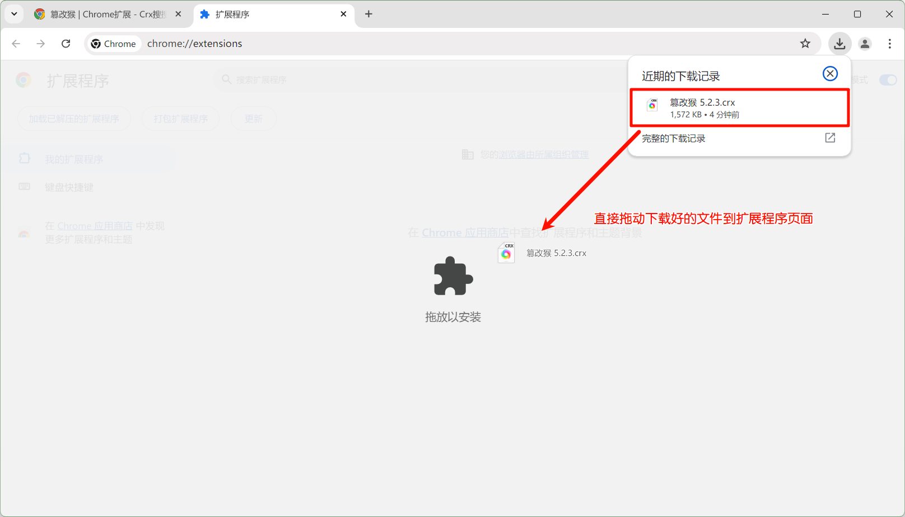

若底部栏消失或扩展文件被自动删除可在按钮上右键选择 “链接另存为” 重新下载.crx 文件。然后把 .crx 文件拖放到扩展管理页。

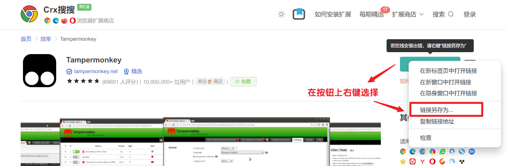

松开鼠标，浏览器弹出提示 要添加"xxx"吗？，点击【添加扩展】，安装完成。

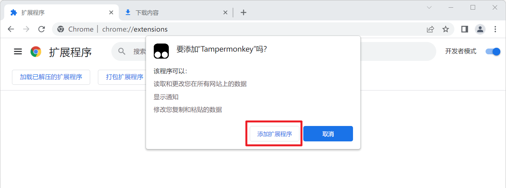

## Edge浏览器

点击 安装到浏览器 会提示：xxx.crx 可能会损害你的设备。是否仍要保留？，此时选择 【保留】 => 【另存为】，将 crx 文件存放到电脑中。

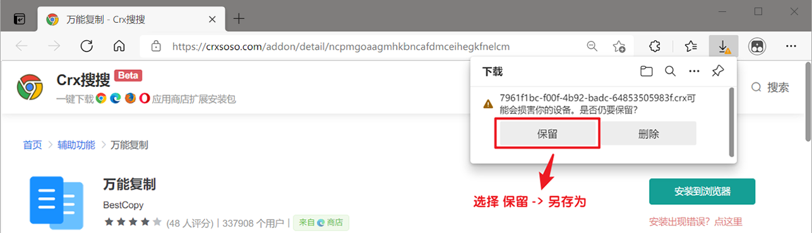

若提示 无法从该网站添加扩展程序，这是因为 Edge 限制，导致无法从第三方网站在线安装扩展，忽略即可。

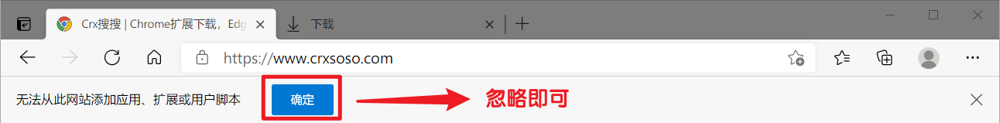

在地址栏中输入 edge://extensions复制链接，打开扩展管理页面，然后再打开左下角的【开发人员模式】和【允许来自其他应用商店的扩展】，然后刷新本页。

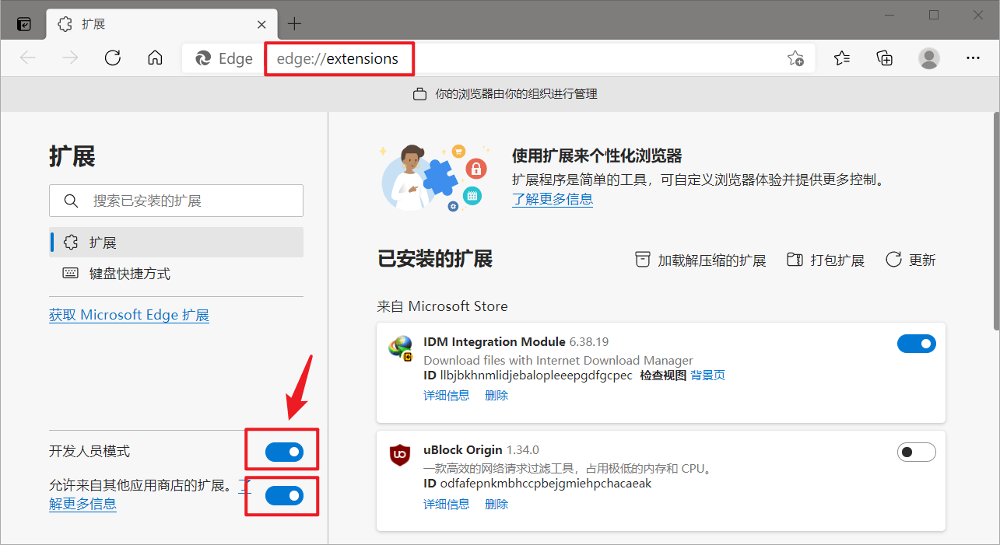

打开【允许来自其他应用商店的扩展】开关后，Edge 浏览器还可以安装来自 Chrome 商店中的扩展。

将下载好的 crx 扩展文件拖动到扩展管理页面。

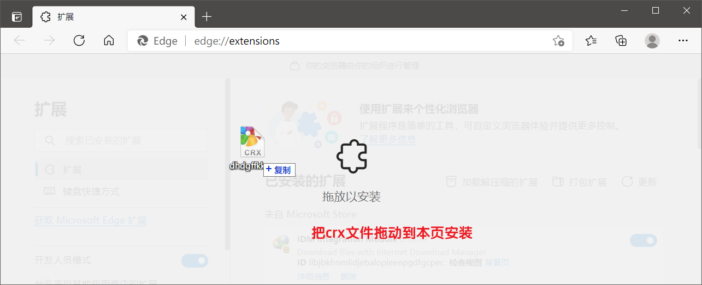

松开鼠标，浏览器弹出提示将 "xxx" 添加到 Microsoft Edge？，点击【添加扩展程序】，安装完成。

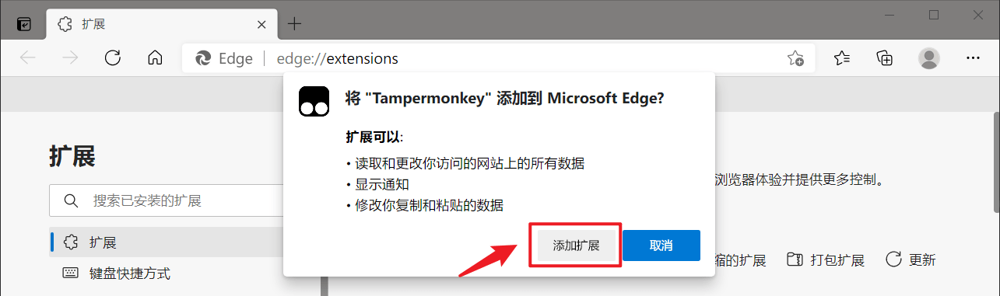

## 其它浏览器

其它浏览器可以按照上面的方法安装，基本都是一下步下一步操作；