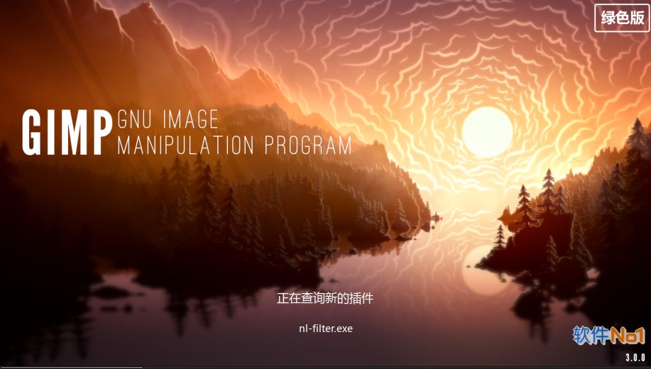
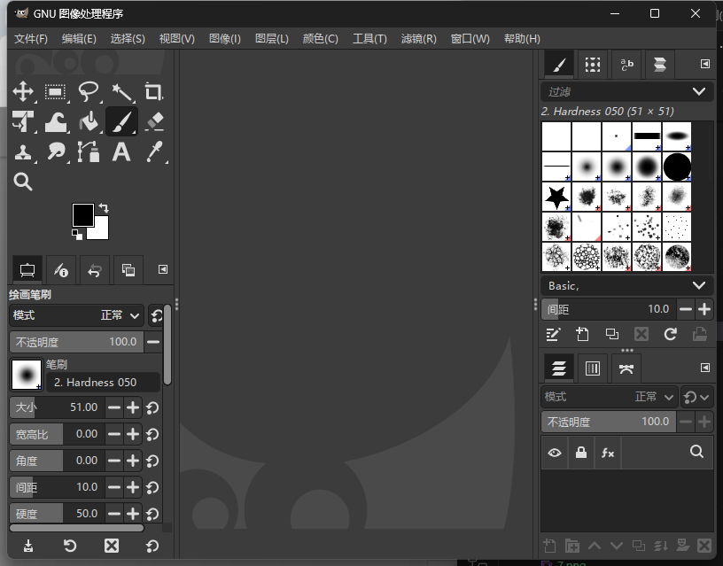
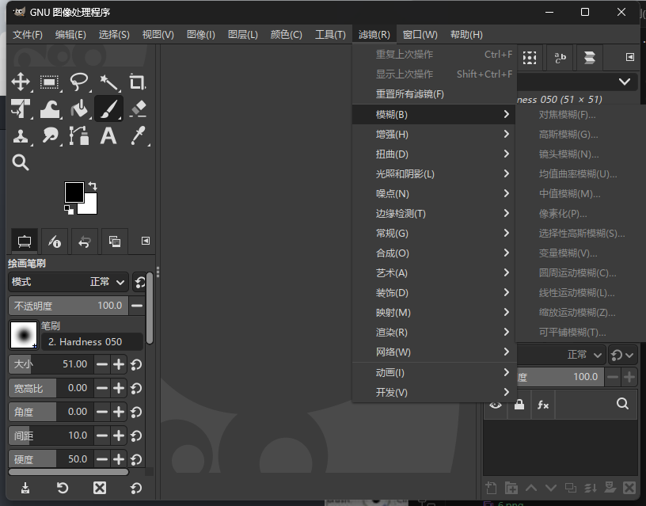
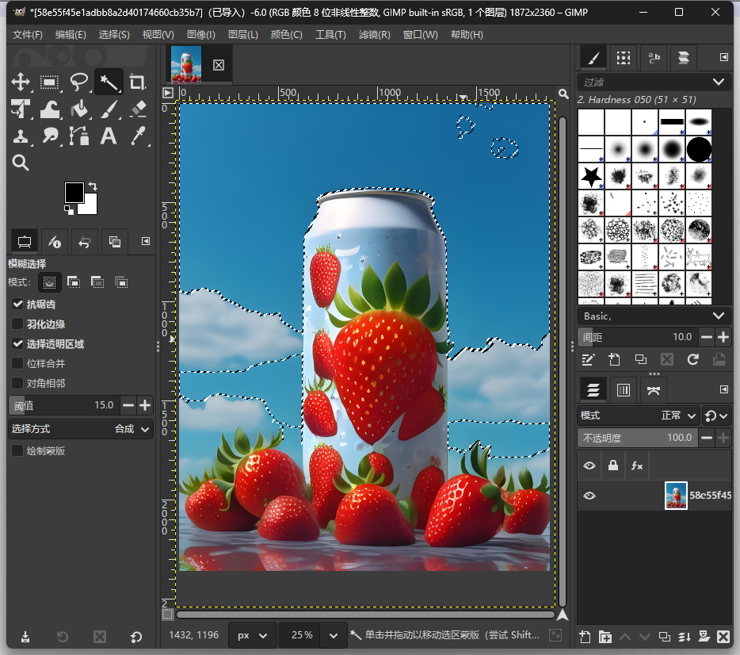
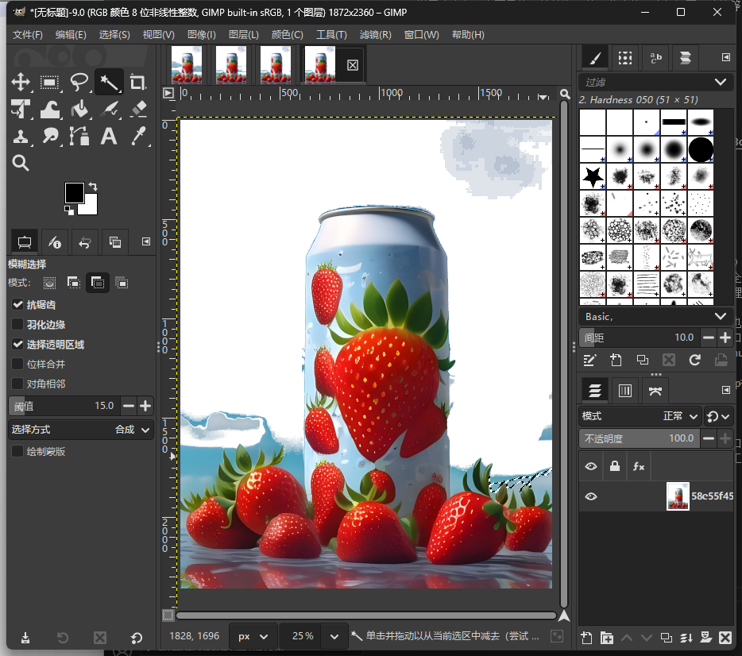
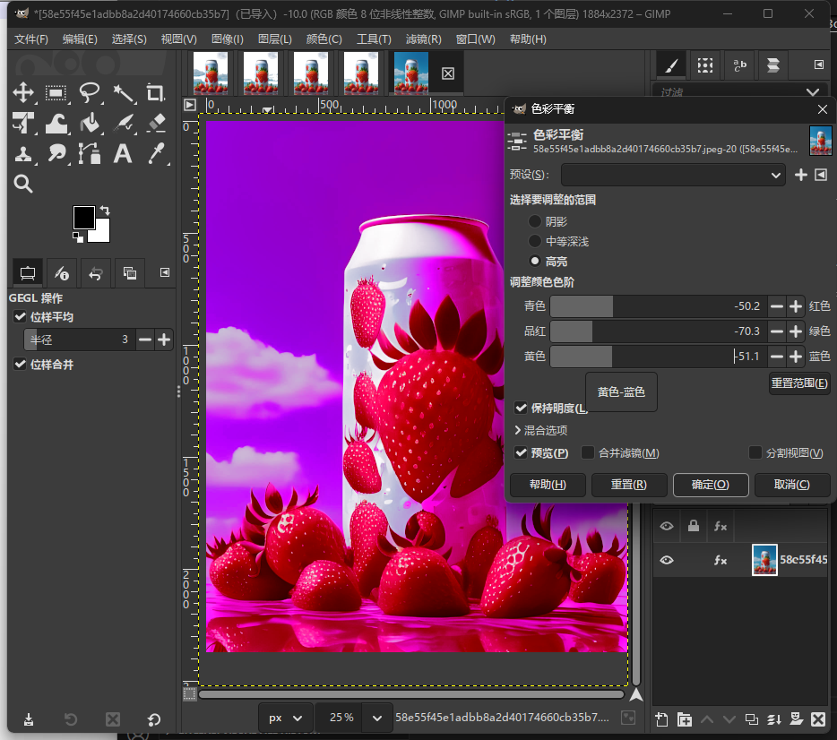
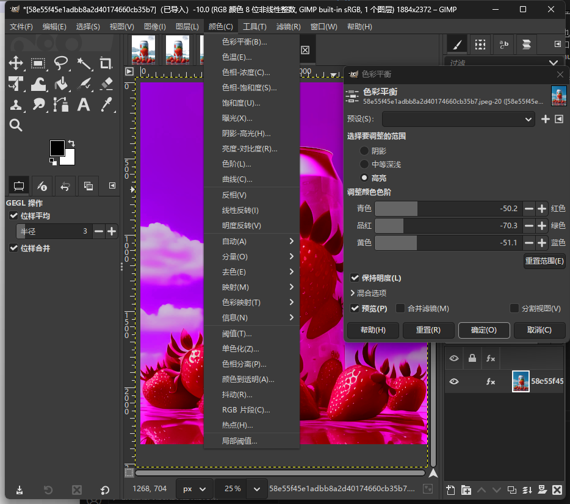
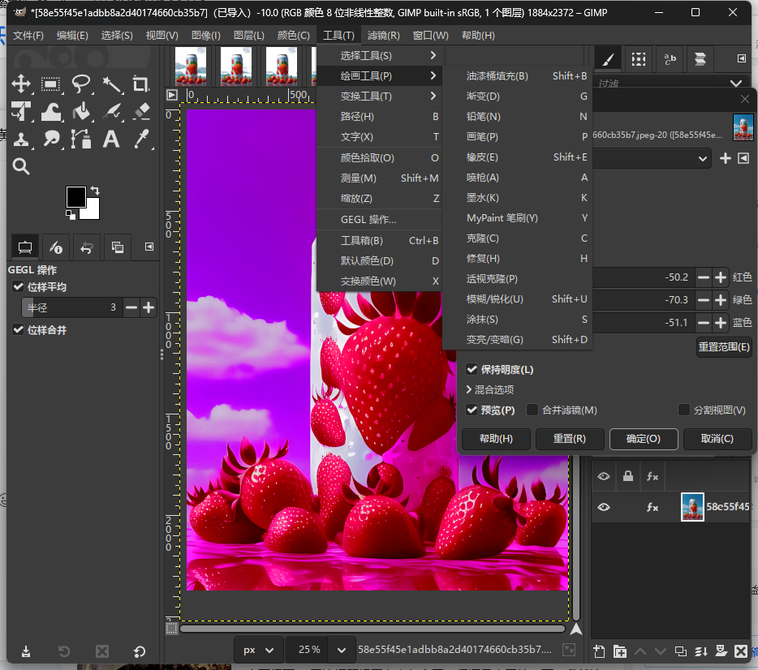

GIMP （GNU Image Manipulation Program，GNU图像处理程序），它是一个图像处理与合成工具。GIMP的扩展性很强，用户可以通过自己编写的插件来扩充GIMP功能。

说了这么多，主要是他可以替换PS的一些功能，比如抠图、滤镜等，主要是免费咯。

免费，免费，免费，绿色可用，说了三次，不多说了。

## 安装

[gimp轻量免安装绿色版](https://pan.quark.cn/s/37cc83c8cd6a)

双击安装，安装好后需要激活一下，手机激活就行

GIMP是GNU Image Manipulation Program（GNU图像处理程序）的缩写，它是Peter Mattis和Spencer Kimhall开发的免费照片和图像处理和创作工具，功能十分强大。GIMP支持多种图像处理工具、全通道、多级撤销操作恢复旧貌与映像修饰等功能。它也支持数目众多的效果插件（plug-ins），完全可以与Windows平台下著名的图像处理软件Photoshop媲美。

GIMP的功能相当强大，它可以作为一个简单的绘图程序来使用，也可以作为一个高质量的图像处理软件来使用，它还有图像格式转换等功能。GIMP具有良好的可扩展性，它支持带插件参数的高级脚本接口，对每件工作，无论是最简单的任务，还是最复杂的图像处理过程，都可以很容易地用脚本来描述。由于其功能相当强大，GIMP被誉为Linux下处理图像的法宝，是Linux下的Photoshop。

GIMP的界面比Photoshop简洁，启动时有一个看起来和Photoshop很相似的工具栏，当我们打开图像文件，并用鼠标右键单击图像时会弹出一系列的选项。

GIMP与其他常用软件不同，启动后屏幕上将出现两个窗口：主窗口和“图层，通道，路径，撤销画笔，图案，渐变”窗口。主窗口的上方区域为各种常用的GIMP工具按钮，主窗口下方为工具选项。根据所选工具，工具选项随之改变。具体如图

功能基本和PS差不多

## 扣图效果

1、使用魔术棒直接扣图：选择相似图层，多点几下，删除即可

GIMP和PS已经没有太大区别了，如果PS是10分，那么GIMP能拿8分（在抠图方面还是比较薄弱）

最终效果：

## 图片换颜色调整色调

直接看图片效果，因为很多功能都和PS一样，基本会PS就能会他，我这里随便调的，可能有点难看

颜色选择功能还是有很多的，可以按自己喜欢的来调整

以下是工具

GIMP在某些领域已经几乎实现了Photoshop的所有功能。在很多个人用户的眼里，GIMP只是一个可以免费使用的，代替部分Ps功能的软件，但这远远不是GIMP的全部价值。

开源

是另外一个我认为比免费使用更加重要的特性，也是GIMP相比Ps的最大优势。我个人认为这是GIMP诞生二十多年来足以顶住Photoshop强大压力的决定性因素。