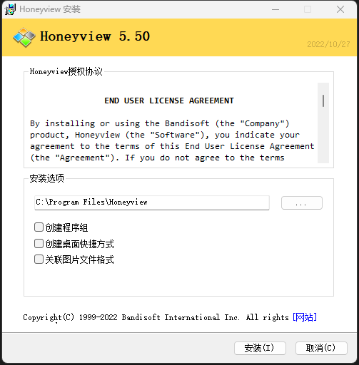
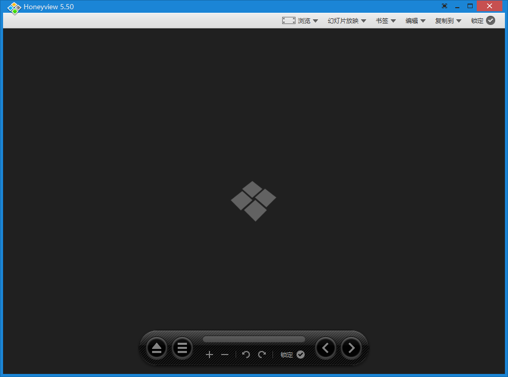
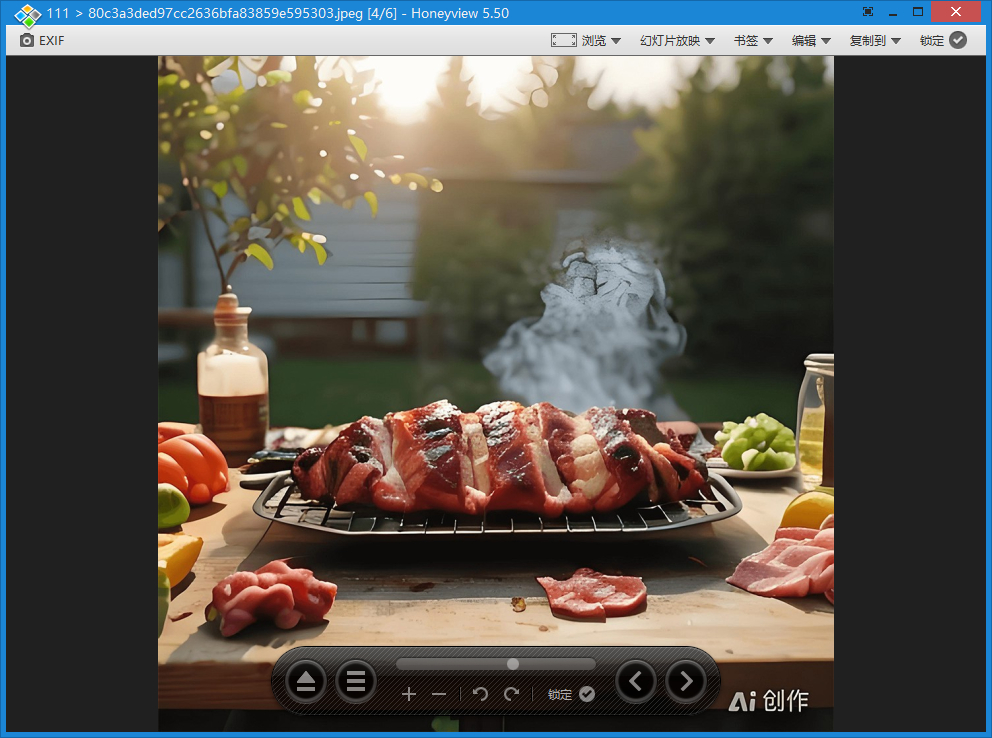
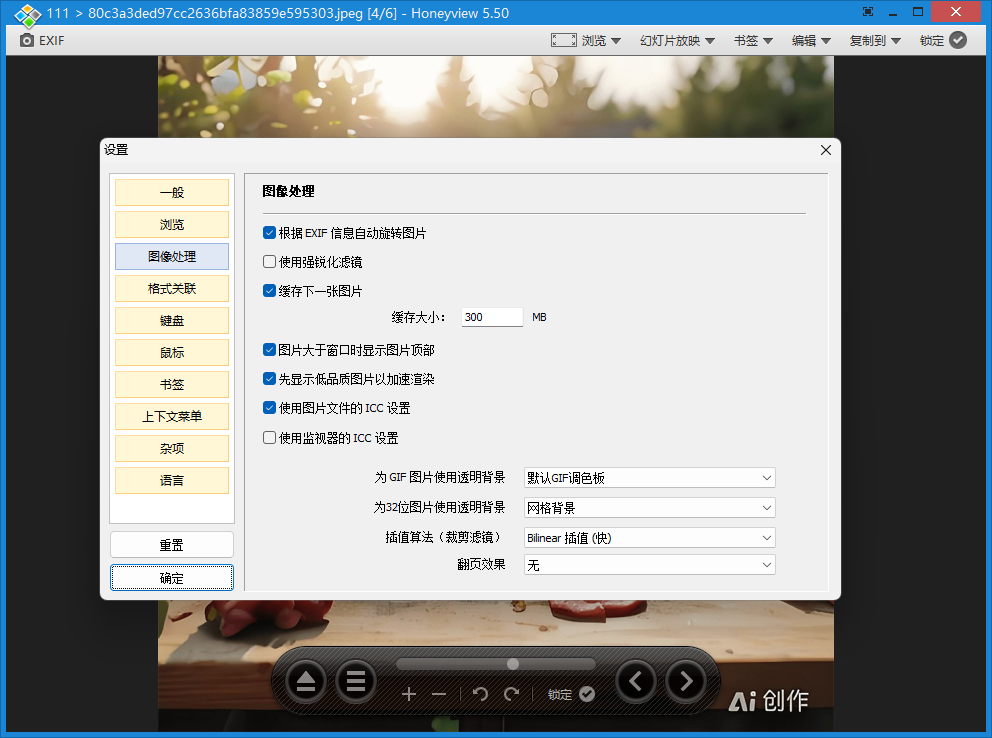
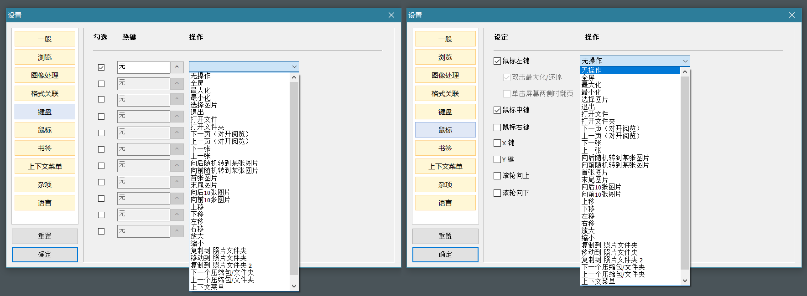
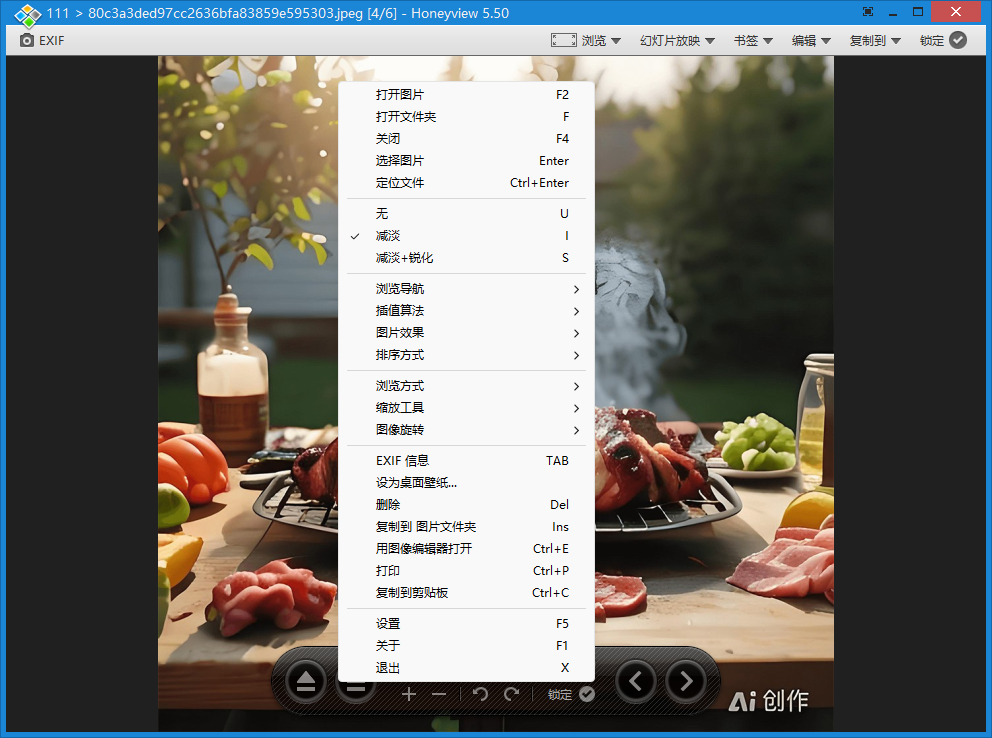

Honeyview 是一款兼快速与强大于一体的免费图像查看器。该版本为绿色版，可以直接使用。

1、基本上所有的图片都可以查看；

2、还可以播放幻灯版，设置播放时长及循环播放功能。

## 安装

[Honeyview图片预览绿色版](https://pan.quark.cn/s/e0ee0a909a0e)

进入后，打开的界面如下图：

## 主要功能

- 轻量且快速
- 可以显示包括 GPS 信息在内的 JPEG 格式的 EXIF 信息
- 对图像格式进行批量转换和调整大小
- 支持显示 GIF 和 WebP 动图
- 无需解压即可直接查看压缩包中的图像

## 支持的格式

- 图像格式: BMP, JPG, GIF, PNG, PSD, DDS, JXR, WebP, J2K, JP2, TGA, TIFF, PCX, PGM, PNM, PPM, BPG
- Raw 图像格式: DNG, CR2, CRW, NEF, NRW, ORF, RW2, PEF, SR2, RAF
- 动画图像格式: Animated GIF, Animated WebP, Animated BPG, Animated PNG
- 无需解压即可直接查看压缩包中的图像: ZIP, RAR, 7Z, LZH, TAR, CBR, CBZ

## 预览图片：

可设置，右键选择，或直接按F5快捷，常见的一些图片信息：

## 快捷键设置

`Honeyview`，如果看不清，可以点击放大看，对键盘快捷键和鼠标操作都有高度的自定义性：

基本上所有操作，也可以通过鼠标右键菜单来完成。

