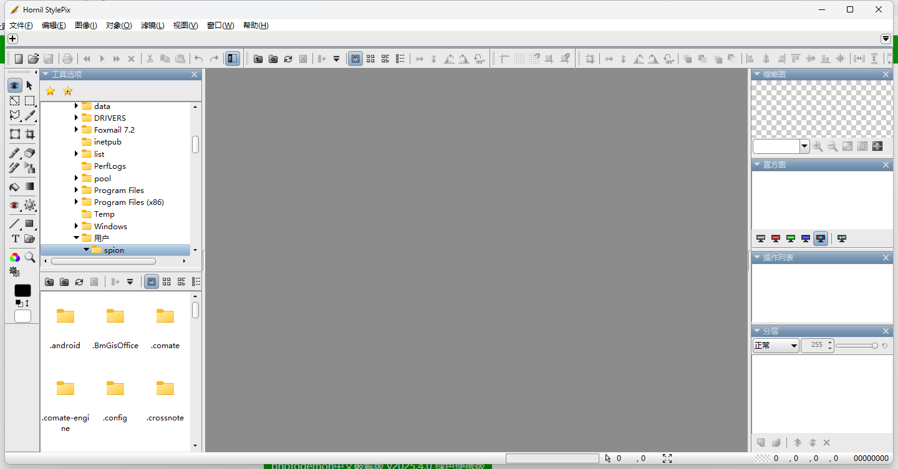
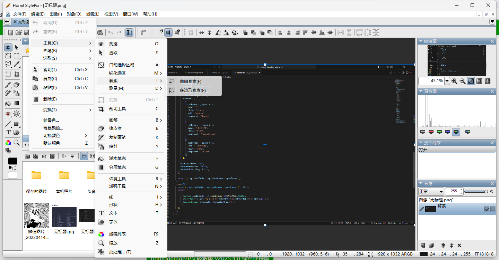
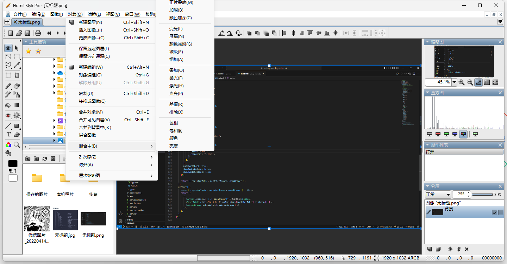
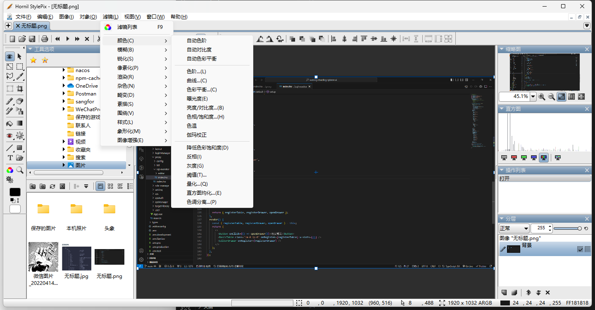

一些简单的ps图片处理，可以替换ps的图片处理工具，主要是小，几下就打开了。

PhotoDemon 是一个轻量小巧、功能强大的 Windows 平台照片编辑软件，拥有图层管理、特效滤镜、阴影/高光调整、多通道曲线、内容感知等超过 200 项专业的图像处理功能，并且对 Adobe Photoshop 的 PSD 格式文件提供全面的支持。

## 下载地址

[PhotoDemon轻量免安装](https://pan.quark.cn/s/37cc83c8cd6a)

## 使用说明

在PhotoDemon中，用户可以进行基础的图片处理，如调整亮度、对比度、色彩平衡等。软件还提供了文字处理功能，虽然体验上可能不如专业的设计软件，但对于简单的文字添加和样式调整已经足够。

软件界面简洁，左侧工具栏提供了基础的图片处理工具，用户可以轻松拖入图片并开始编辑。要注意的是，PhotoDemon支持直接打开PSD文件，但经我测试，拖动文件打开时会卡住，所以大家对这功能别太大期待。

PhotoDemon支持图层管理，用户可以调整图层顺序，虽然无法直接编辑图层内容，但对于多图层的图片处理项目，这一功能显得尤为重要。

软件还内置了一些调色和渐变工具，以及多种特效效果，如模糊、锐化、扭曲等，这些功能虽然简单，但在紧急情况下或日常使用中，能够满足基本的图像编辑需求。PhotoDemon的图像调整功能也相当实用，用户可以轻松实现裁剪、旋转、翻转等操作。

专业且高性能的照片编辑软件，适用于 Windows 平台。它拥有图层管理、特效滤镜、阴影/高光调整、多通道曲线、内容感知等超过 200 项专业的图像处理功能，并且对 Adobe Photoshop 的 PSD 格式文件提供全面的支持。

对于初学者和低配电脑用户，PhotoDemon提供了一个低门槛的学习和实践平台，让他们能够在不花费大量金钱和时间的情况下，探索图像处理的世界。
常见问题

功能基本和PS差不多

## 无法打开特定类型的图片文件?

请检查图片文件格式是否受支持，并确保文件路径正确。

## 如何撤销多步操作？

您可以点击历史记录栏中的每个操作步骤，或使用Ctrl+Z组合键快捷撤销操作。

## 为什么我在添加文字时字体显示不正常？

请确保您的计算机安装了所选字体，并在文字工具中选择正确的字体名称。

## PhotoDemon 软件的优点

- 小巧轻量，仅 13M 的大小，主打便携性，不需要安装，解压后打开就能用
- 支持大部分图像处理功能，可用性强，性能表现也很不错
- 提供超过 200 种语言，几乎在任何国家都可以使用，支持中文
- 软件界面相对简单易用，学习成本很低

### **专业功能**

图层支持：支持多层编辑，便于复杂图像处理。

高级工具：提供曲线、色阶、通道混合等专业调整工具。

滤镜与特效：内置多种滤镜和特效，如模糊、锐化、扭曲等。

### **开源与免费**

开源：代码公开，用户可自定义或参与开发。

免费：无广告或隐藏费用，功能全面。

### **高效性能**

轻量快速：占用资源少，启动和运行速度快。

批量处理：支持批量处理，提升工作效率。

### **非破坏性编辑**

历史记录：完整记录操作步骤，随时撤销或重做。

无损编辑：支持无损保存，保留原始图像质量。

### **跨平台与便携性**

绿色版：无需安装，可直接运行，适合U盘携带。

跨平台：兼容Windows，未来可能支持更多系统。

### **用户友好**

界面简洁：界面直观，易于上手。

多语言支持：支持多种语言，方便全球用户。

### **插件扩展**

插件支持：支持第三方插件，扩展功能。

### **社区支持**

活跃社区：有活跃的用户和开发者社区，提供支持和更新。

## 批处理参数：

- 在PhotoDemon中找到批处理（Batch Processing）的选项或功能。
- 在批处理设置中，选择你要处理的图片文件夹或添加多个图片文件。
- 对于裁剪右下角水印，可以设置以下参数：
- 宽度百分比：100%（保持原图宽度不变）
- 高度：92%（这将导致图片在垂直方向上被裁剪4%）
- 调整图像选择：选择“完全匹配”或其他适当的选项，以确保水印区域被正确识别和处理。

## 专业级的图像处理支持

- 广泛的文件格式支持，除了常用的 Adobe Photoshop的 PSD 文件，还包括Corel PaintShop Pro 的 PSP 文件，以及所有主要的相机 RAW 格式
- 拥有颜色管理的工作流程，包括对嵌入式 ICC 配置文件的全面支持
- 高级多层支持，包括可编辑的文本图层和非破坏性图层修改
- 专业的画布工具，包括数字画笔、仿制画笔和图案画笔、交互式渐变等
- 图像调整工具，包括色阶、曲线、HDR、阴影/高光恢复、白平衡等
- 支持滤镜和特效，比如透视校正、边缘检测、噪声去除、内容感知模糊、不清晰蒙版、绿屏、镜头衍射、暗角等
- 支持批处理功能，也支持宏录制（类似于 Office 软件的宏）