## 水印管家（Apowersoft Watermark Remover）

水印管家是一款专业高效的图片视频去水印软件，界面简洁明了操作简单，支持批量去除图片水印和瑕疵，能保证原图的质感、画质、格式等。

### 下载地址

[水印官家，去除图片，视频水印地址](https://pan.quark.cn/s/9396dcd53c70)

下载完成后，解压压缩包，在文件中直接双击`Apowersoft Watermark Remover.exe`打开软件，在弹出的对话匡中按以下图操作：

选择跳过（Skip Thins Version），再选择是(Y)

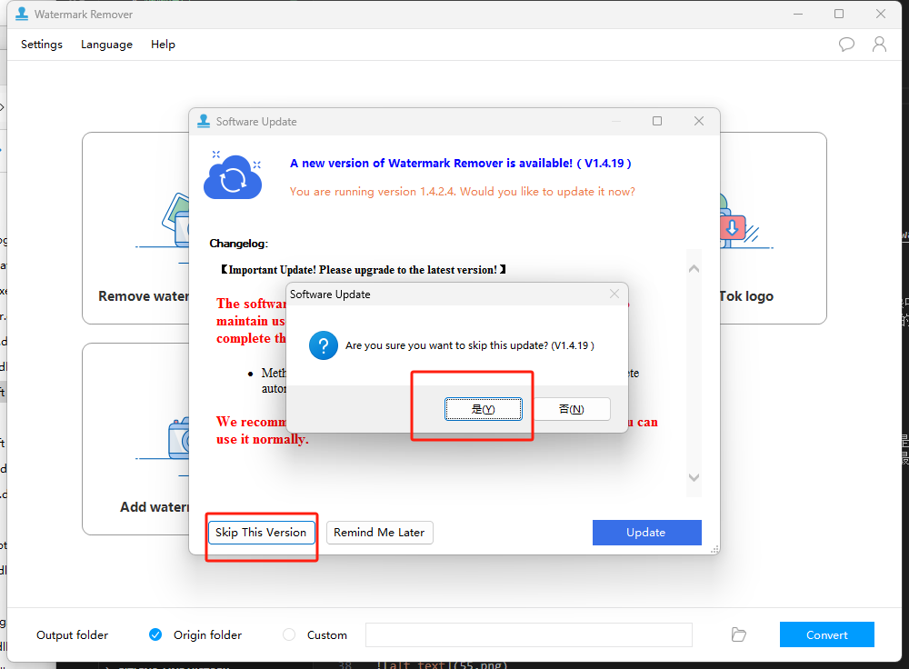

再切换到中文：

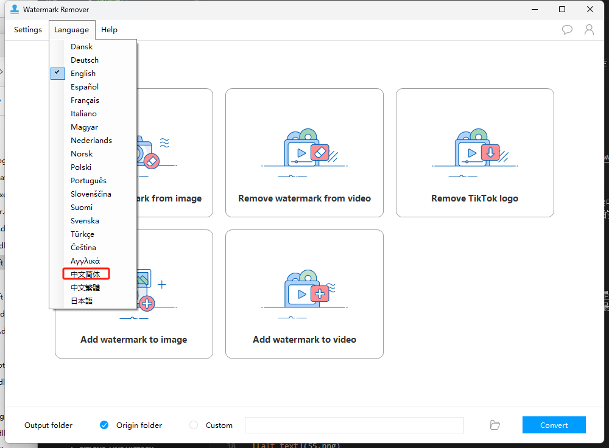

最后效果：

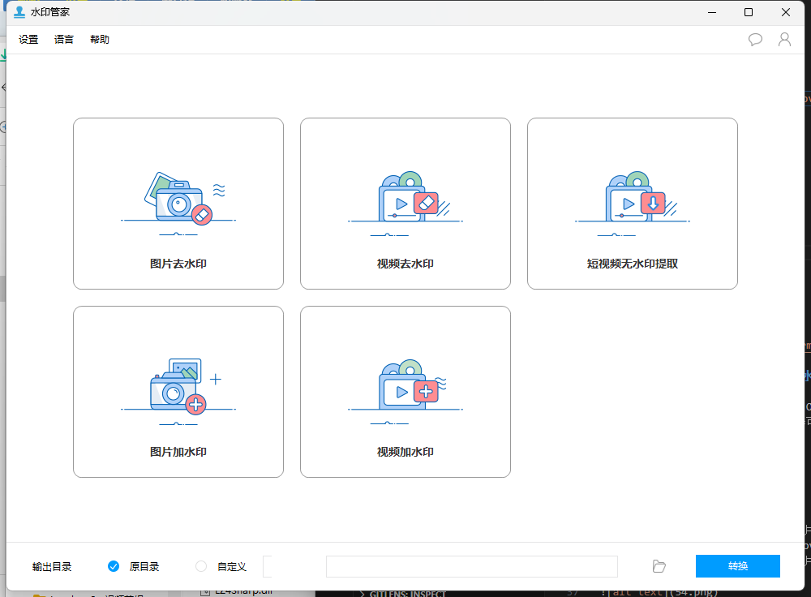

支持多种选择添加或去除水印：

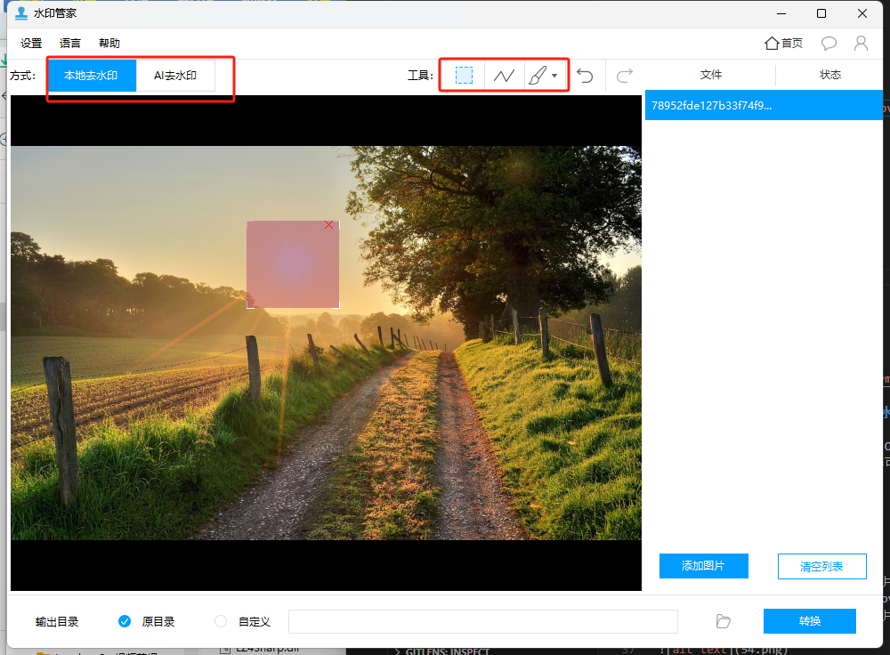

支持  视频 去水印

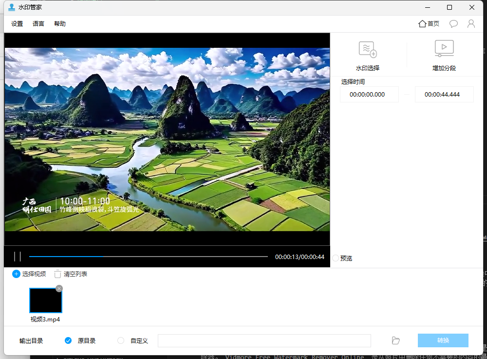

## Inpaint 单文件版-双击就能用

主要是非常小，不占地方，但该有的功能还是有的，Inpaint是一款简单实用的图片去水印软件，只需将对象物体选定后，Inpaint会帮你全自动进行擦除，同时Inpaint会根据附近图片区域重建擦除的区域，使看起来无瑕，没有痕迹。

地址： [https://pan.quark.cn/s/9396dcd53c70][https://pan.quark.cn/s/9396dcd53c70]

主界面图：

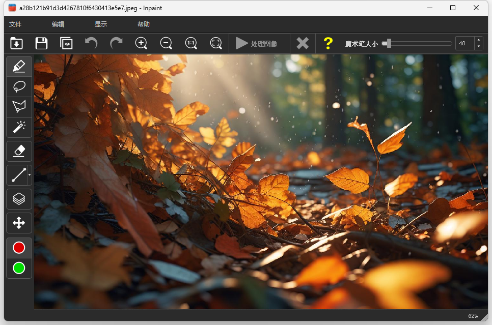

该软件优点也比较简单，就是只处理图片水印，提供了多种去水印的选择方式

## Photo Stamp Remover 

Photo Stamp Remover 是一款由俄罗斯 SoftOrbits 公司开发的可用于去除水印、日期印章的照片修正应用工具，它提供了完全自动的处理并内置图像智能修复技术，有效地利用从选择区域周围推理出来的纹理填补选中的区域，进而与缺陷图片的其余部分完美的融合在一起。以往使用古老的克隆工具需要几个小时才能完成的修复，而采用 Photo Stamp Remover 只需一分钟就能完成。

地址： [https://pan.quark.cn/s/9396dcd53c70][https://pan.quark.cn/s/9396dcd53c70]

选择需要处理的图片，通过右侧的工具箱做相应的处理：

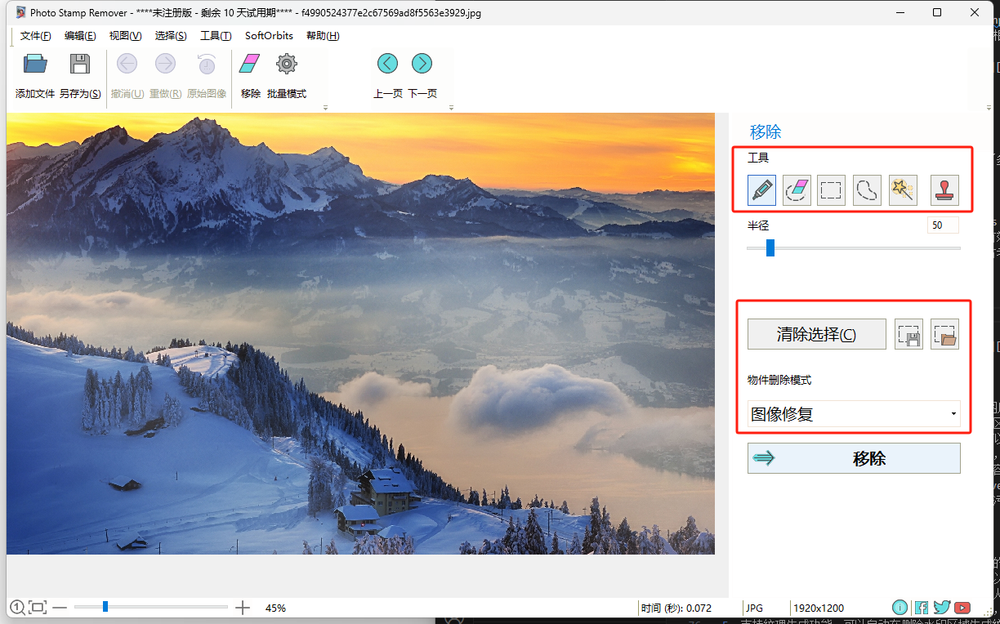

### 软件功能

1. Photo Stamp Remover功能简单，可以自由移除图片上的内容，轻松删除水印
2. 如果图片有文字内容，可以通过这款软件选择文字区域，从而擦除内容
3. 支持图形删除功能，如果图片附加有logo图形，可以在这款软件完美移除图形
4. 支持人物移除功能，可以将图片上多余的人物选中，将人物从图片删除
5. 支持选择标记功能，可以自由在图片上添加标记内容，手动设置需要删除的区域
6. 支持水印设置功能，可以通过Photo Stamp Remover软件添加新的文字水印
7. 支持涂抹画笔，使用画笔在图片上消除瑕疵，消除污渍

### 软件特色

1. 支持图像剪裁功能，在软件界面自由设置图像裁剪的范围
2. 支持图章功能，直接在软件界面启动仿制图章，可以复制图像内容
3. 支持遮瑕画笔，可以在人像上添加遮瑕区域，移除人脸显示的瑕疵
4. 支持批量处理功能，可以加载多个图片到软件处理，可以执行图像修复
5. 支持纹理生成功能，可以自动在删除水印区域生成纹理内容

### 永久免费的万能PDF水印删除工具

## idmore在线去水印

官方地址：
[https://www.vidmore.com/zh/watermark-remover/](https://www.vidmore.com/zh/watermark-remover/)

 ### 使用 AI 技术从图像中在线去除水印

 Vidmore  Free Watermark Remover Online  是一个基于网络的工具。它使您能够从图像中删除文本、图像、徽标等，而不会留下任何痕迹。借助强大的AI技术，这款在线水印去除器可以准确定位水印并完美去除。此外，支持多种流行的图片格式，如JPG/JPEG/PNG/BMP/TIFF等。只需上传您的图片即可尝试。
 
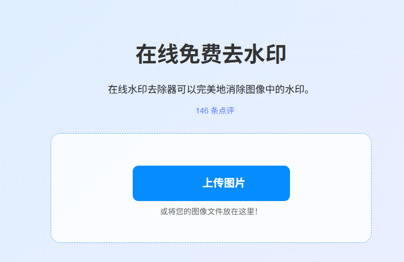

### 从照片中删除各种水印

这个在线水印去除器可以从字面上擦除照片中的任何内容。徽标、贴纸、相机日期戳等等都不是问题。您可以将其用作  TikTok 屏幕截图水印去除器。 Vidmore Free Watermark Remover Online  是从照片中删除任何不需要的内容的最佳选择。此外，它不需要专业技能来实现。只需选择您要删除的区域，您就会得到完美的照片。

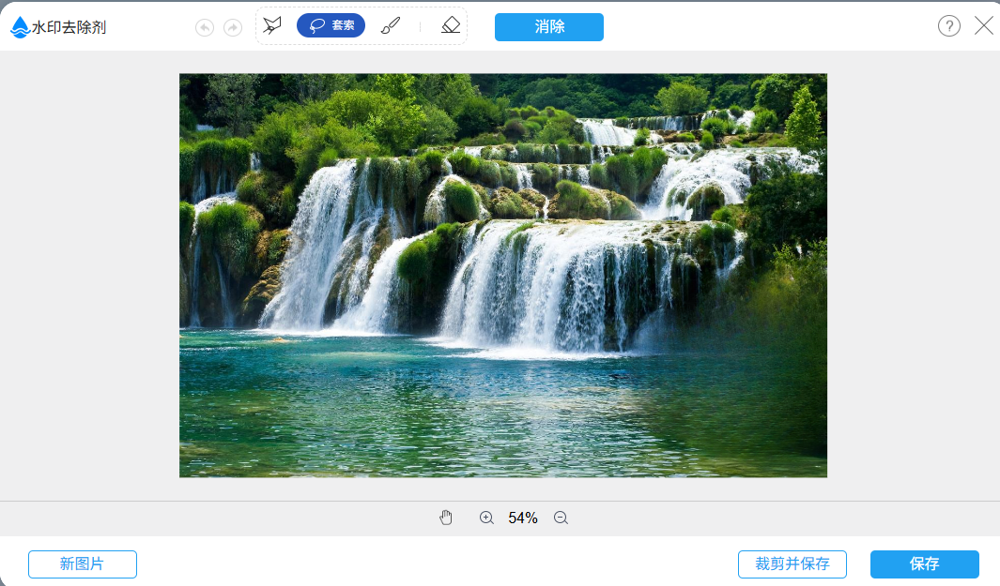

## 百度图片
百度图片，提供了多种图片处理方式，可以把图片变清晰，去水印，文字替换等功能

[https://image.baidu.com/](https://image.baidu.com/)

### 选择AI去水印

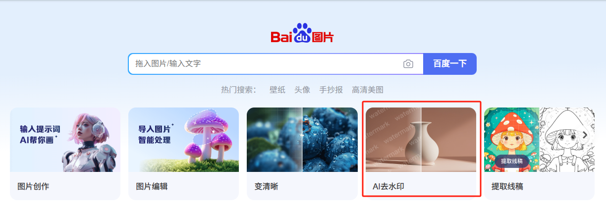

其实出了去水印，还有很多功能，并且是一个在线免费的去水印工具

 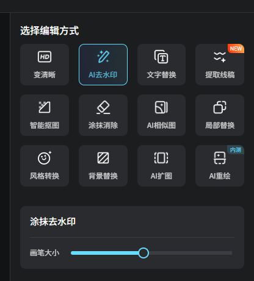

 ## 美图秀秀

 美图秀秀的功能就比较强大了，基本编辑，商品编辑等都有

 官方网址：

 [https://cutout.designkit.com](https://cutout.designkit.com)

 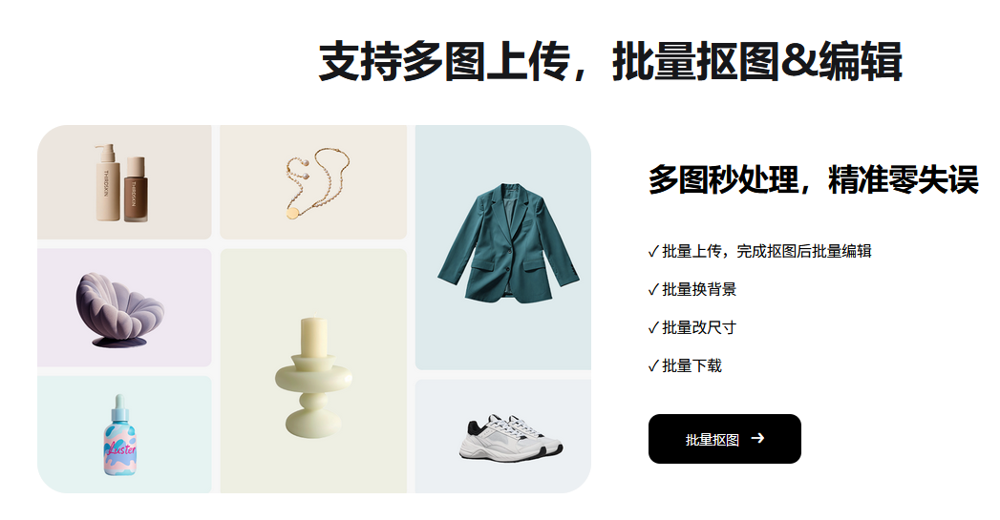

 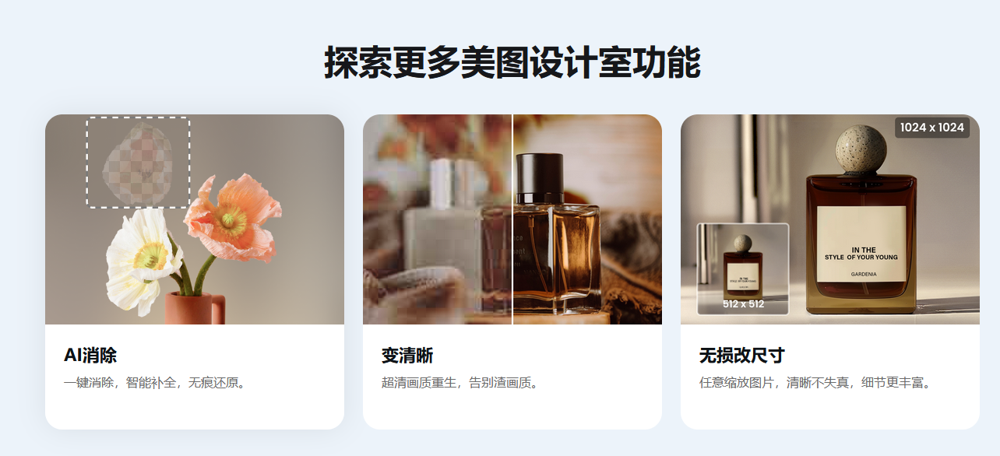

 改尺寸，去水印，头像，淘宝主图，小红书封面等等

 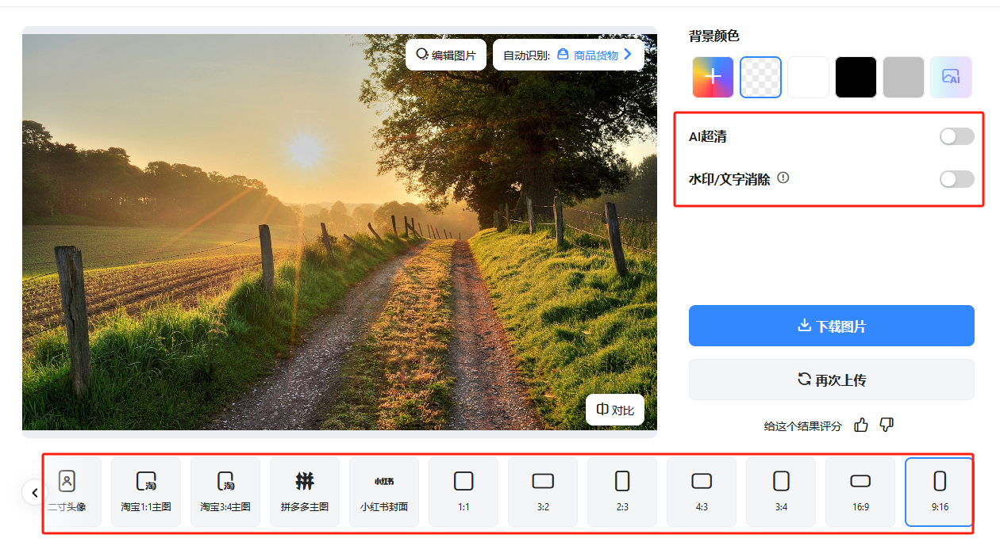