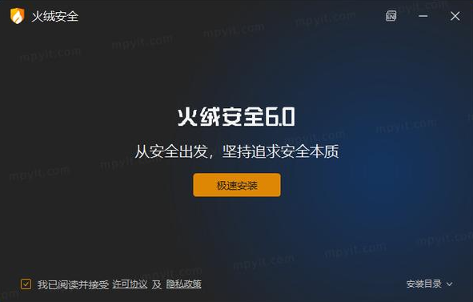
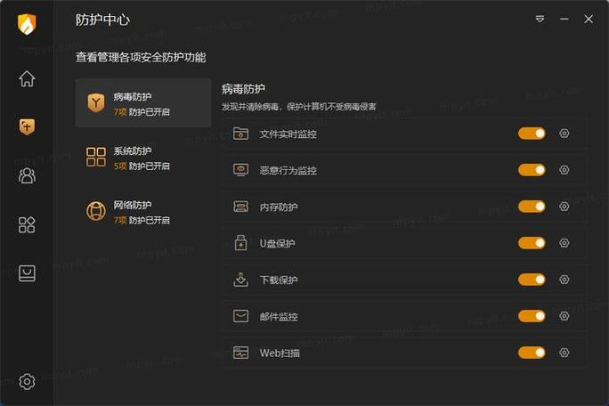
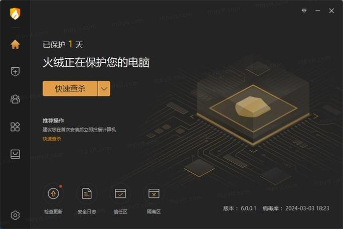
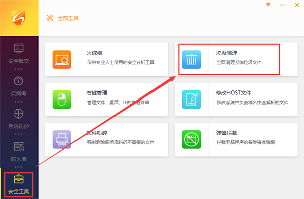
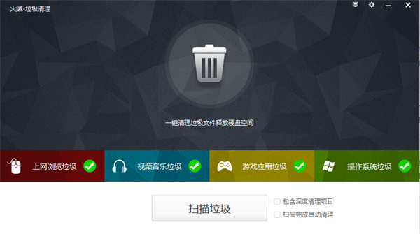
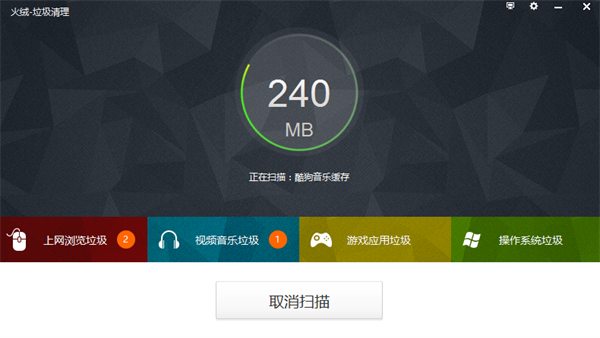
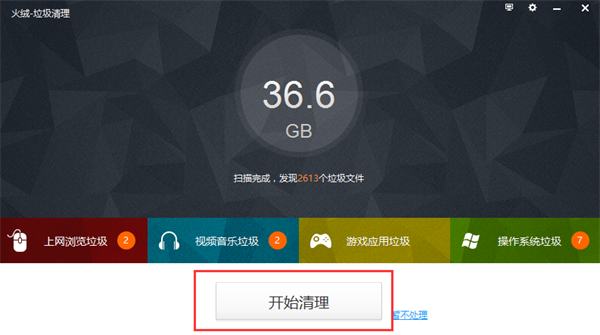
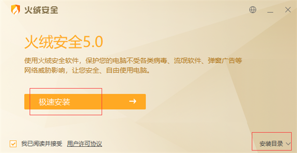
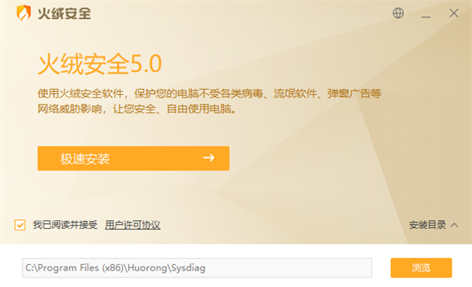
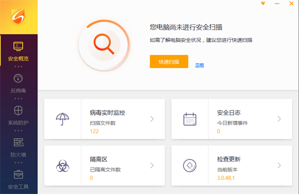

## 简介

解决病毒、木马、流氓软件、黑客入侵等终端威胁

火绒，北京火绒网络科技有限公司所推出的安全软件，于2012年12月上线。 

火绒提供的功能包括病毒查杀、防护中心、访问控制等；火绒自主研发的新一代反病毒引擎，拥有通用脱壳、动态行为查杀等技术；火绒的访问控制功能可拦截黑客入侵、网络钓鱼攻击、勒索攻击、无文件攻击等各项威胁，还可控制应用程序行为。 

据《火绒安全2024年终端安全洞察报告》显示，2024年火绒安全产品共拦截终端攻击36.33亿次，略低于2023年（37.35亿次）。2024年火绒安全产品共拦截1.9亿次漏洞攻击，其中拦截1.77亿次微软系统漏洞攻击，拦截1317万次Web漏洞攻击。

## 下载地址

[火绒安全软件下载地址](https://pan.quark.cn/s/3c11d3ef33e2)

## 使用教程

### 火绒安全软件怎么清理软件？

一、打开火绒安全软件，点击【安全工具】→【垃圾清理】。

二、点击【垃圾扫描】。

三、耐心等待软件扫描。

四、等待扫描完毕可以点击【开始清理】清理电脑里的垃圾;如果不想清理可以点击【暂不处理】。

### 火绒杀毒软件如何删病毒软件？

1、打开火绒软件，然后点击“病毒查杀”

2、然后会出现多个杀选项，选择“全盘查杀”模式

3、此时可以看到，已经对电脑进行杀毒，等待查杀结果就可以。如果提示有病毒，点击清除病毒

### 火绒安全软件电脑版安装方法

一、双击运行。【为保证软件正常安装，请退出其他安全软件。】

### 火绒安全软件安装方法1

二、点击【极速安装】或者【更改安装目录】。极速安装，软件安装在默认的位置;更改安装目录，用户可以自定义软件的安装位置。

### 火绒安全软件安装方法2

三、设置完毕点击【极速安装】，耐心等待软件安装完成。安装完毕会运行软件。

## 产品功能

### 多层防御
火绒多层次主动防御系统，病毒层、系统层、网络层纵横交错，编织安全防护网。
拦截各类病毒攻击

防护操作系统脆弱点

完整的网络防火墙

### 病毒查杀
快速扫描，精准查杀

精准识别病毒，高效查杀未知病毒，断网不受影响

### 全面防御，纵深守护

拦截黑客入侵、网络钓鱼攻击、勒索攻击、无文件攻击等各项威胁，还可控制应用程序行为

### 自定义电脑使用权限

可控制上网时段、网站类型、USB设备等，对未成年人、陌生人设定访问权限

### 模块化功能自由选择
提供实用的系统管理、网络管理安全小工具

### 海量应用一站式管理

非内置，可选择下载该应用，便捷管理软件，省时省力更省心