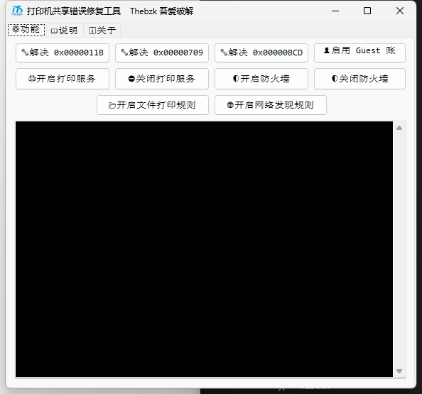
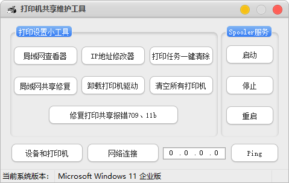
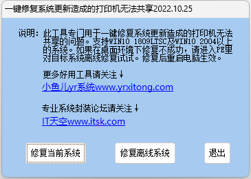
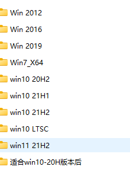

共4个工具，基本能解决常见问题

都放在这里了：

[打印机修复，打印机共享修复工具](https://pan.quark.cn/s/c556bd56cb78)

## 打印机修复工具

- 1、解决 0x0000011B：修改注册表，禁用 RPC 隐私保护。
- 2、解决 0x00000709：修改注册表，修正默认打印机名称。
- 3、解决 0x00000BCD：重启 Print Spooler 服务，并开启共享规则。
- 4、启用 Guest 账户：net user guest /active:yes 使来宾帐户可用。
- 5、开启/关闭打印服务：通过 sc config 与 net start/stop 管理 Print Spooler 服务。
- 6、开启/关闭防火墙：通过 netsh 设置所有防火墙配置文件状态 on/off。
- 7、开启文件和打印机共享防火墙：允许 SMB 端口用于共享。
- 8、开启网络发现防火墙：允许多播/ICMP/SSDP 等协议，使设备可见。

WIN7共享打印，一般只运行“局域网共享修复”后重启电脑。

WIN10和WIN11（WIN11 24H2没有效果）先运行“局域网共享修复”，再运行“修复打印共享报错709\11B”再重启电脑，主机与副机都要运行。 

然后 win键+R键 调出运行窗口，输入:`\\ip地址\`或者`\\计算机名\`进行链接。

如果有问题运行“修复打印共享报错709\11B”里面的“恢复备份文件”。

## 打印机共享维护

常用功能：

- 打印机共享维护工具
- 打印设置小工具
- Spooler 服务
- 局域网查看器
- IP 地址修改器
- 打印任务一键清除
- 启动
- 局域网共享修复
- 卸载打印机驱动
- 清空所有打印机
- 停止
- 修复打印共享报错 709、11b
- 重启
- 设备和打印机
- 网络连接

## 一键修复系统更新造成的打印机无法共享

此工具专门用于一键修复系统更新造成的打印机无法共享的问题，支持 WIN10 1809 及 WIN10 2004 以上的系统，如果在桌面环境下修复不成功，请进入 PE 里对目标系统离线修复即可，修复后重启电脑生效。

## 共享打印机错误修复PrintFix(709&11b等错误代码)

其它问题修复都在这里了

