这个问题比较多，各种情况都有，下面例出都是以上问题，但解决办法各不一样的：

## 一、显卡问题

显卡驱动异常可能会导致 WeGame 兼容性问题，更新驱动有助于解决问题。

解决方法：

下载安装“显卡驱动”类软件，自动检测并安装最适配的显卡驱动，避免兼容性问题

下面是地址：

[驱动修复，驱动更新，驱动安装](https://pan.quark.cn/s/17a8f491a2b9)

## 一、重装游戏

其实很多人重装游戏后，打开还是会出现这个问题，那是因为卸载的时候就没卸载干净，游戏一些常用配置，注册信息还留在原有系统里面，所以重装游戏后还是会出现这个问题。

提示：但如果是重装后，游戏都重装了一遍，还是不行的话，那就看看下面提供的几个方法，特别是`语言配置`问题解决方案；

需要用专业的卸载软件，不光是把游戏卸载了，还要

比如这几款都不错 `geek`，`HiBit uninstaller`，`SoftCnkiller`，`UninstallTool`，`RevoUnistaller`，`阿香婆卸载`

地址都放这里了 [卸载软件地址下载](https://pan.quark.cn/s/580d82d2fe68)

不知道选哪款就用 geek 就行，主要是清理以下问题：

1、清除残留文件与注册表

2、清理注册表

3、清除隐藏启动项和服务残留（如：禁用启动项，禁用残留服务）

清理完成后，直接重新安装游戏，安装的时候记得不要安装在原来的盘里面，再启动试试。以下是随便拿一款软件举例：

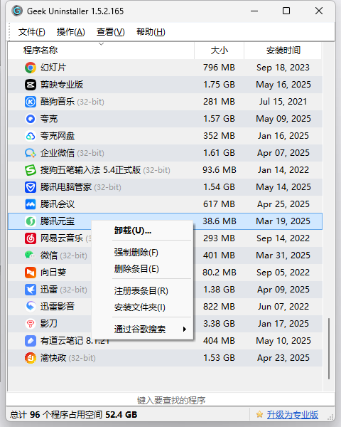

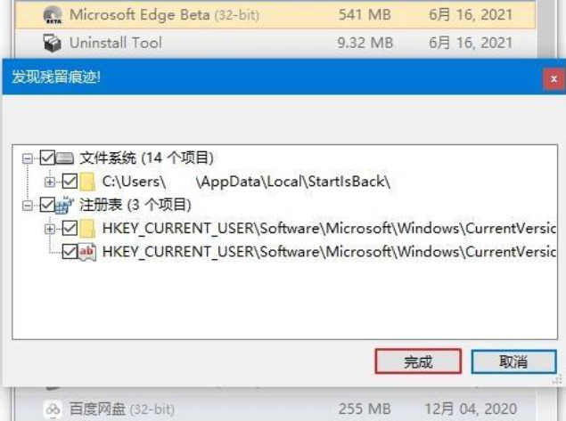

## 三、木马病毒的问题

木马病毒的原因导致游戏的乱码，可以通过杀毒软件里面的“全盘杀毒”来彻底清除电脑中的木马病毒，完成之后必须重新启动，然后登录游戏就会发现乱码消失了。

获取地址：[电脑杀毒及垃圾清理等](https://pan.quark.cn/s/52c6315c772b)

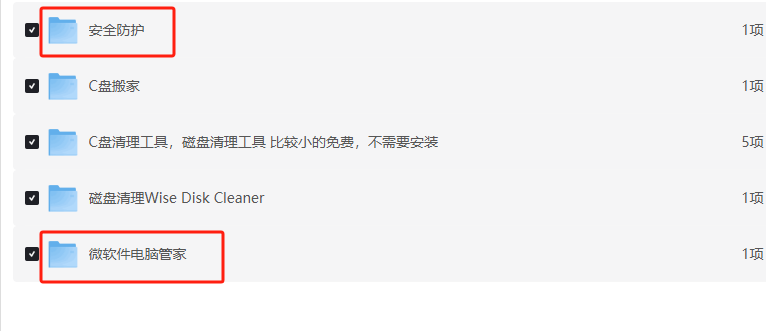

可以使用`微软电脑管家`或`安全防护`中的`火绒`功能，也可以使用其它杀毒软件。

有人用用`火绒`的专杀工具和重置网络适配主可以启动了。

## 四、文件丢失，这个很奇怪，重装也不行，解决办法见下面

某些文件丢失导致的这种情况，这个时候最便捷的方法就是从别人电脑里面复制一份完好的“GAME”文件夹，然后替换掉自己电脑上的。如果这种方法还不行的话只能重新安装游戏了，但要记住得先彻底卸载掉。

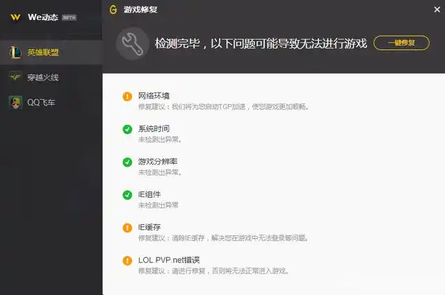

安装的时候如果还安装在原盘是不会成功的，只能换一个新的盘安装，具体是什么原因我也说不清楚。还有就是在WEGAME里面找到英雄联盟，点击右键进行游戏修复，修复之后重启下可能就可以正常登录了。

## 五、8.11版本“乱码”问题

这种现象在8.10版本也比较多见，往往就发生在版本更新之后，是文件丢失、损坏的一种表现。具体是因为版本更新过程中文件被损坏，还是玩家在清理垃圾或者其他操作的时候误删文件，这些就不得而知了

## 六、区域语言的问题

有时候版本更新会把电脑的一些设置进行更改，首先我们需要点开菜单进入控制面板，然后选择区域和语言界面，这里面是对电脑的时间和区域语言进行管理的地方。

主要是改为简体中文，如果其它系统，可以自己百度一下。

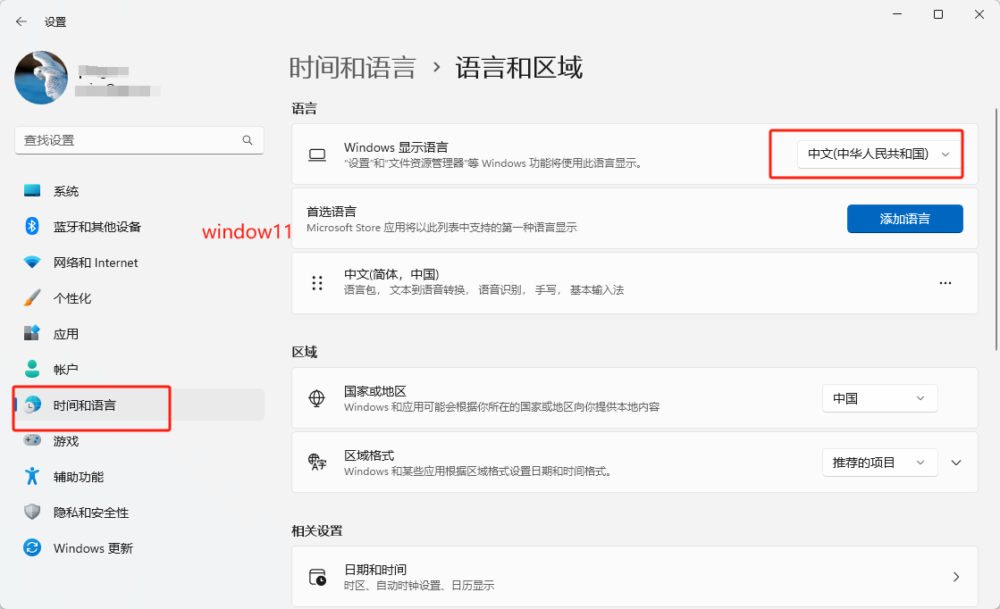

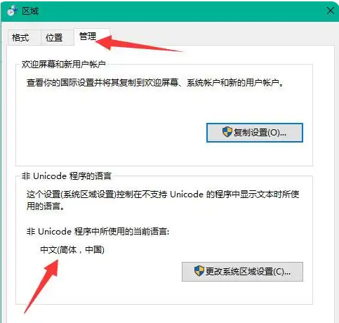

## 七、因为语言没调整好的问题 - 很多人还用这个方法解决了

直接点击以下操作改完就正常了：

系统的语言设置-管理语言设置-非Unicode程序的语言-选择中文/下面打勾

## 八、英雄联盟出现game_error_directx的解决办法

近来有玩家反馈他们的英雄联盟出现game_error_directx错误，进不去游戏，如下图。

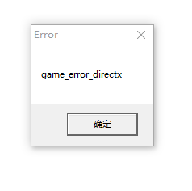

1、显卡驱动没装好。关于这点我就不多说了，各位根据自己的显卡型号，到显卡官网下载最新的显卡驱动并安装重启即可。如果不知道显卡型号，也可以用360驱动大师、驱动精灵之类的软件协助安装显卡驱动。总之是显卡驱动一定要安装好的，要不然肯定用不了。

2、第二种情况，就是已经在第一步确定了显卡驱动已经安装没问题的情况下，仍然出现game_error_directx错误。经分析，这是由于DirectX加速未完全开启造成的。开启Direct加速，需要我们使用DirectX修复工具来完成。如果你只想开启/关闭加速，可以下载在线修复版（文件包比较小）来操作，如果你还想顺便解决诸如0xc000007b，缺少dll文件等问题，可以下载增强版（文件包比较大）来操作。

下载过程都不多说了，下载后解压，然后双击exe运行程序即可。程序运行后，到程序主界面点击“工具”菜单下的“选项”按钮，在弹出的对话框里找到“DirectX加速”这一项。这里可能会显示某些加速未启用，把没启用的加速启用即可。操作如下图：

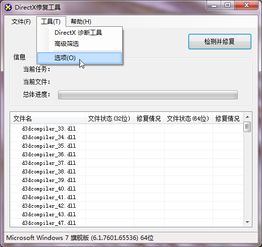

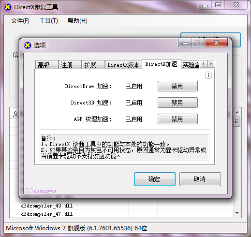

如果你没有看到有未开启的项目，可能是你之前自己下载的DirectX修复工具版本太旧了，请使用V4.0版及以上版本即可看到部分加速未开启，如下图，单击启用即可。本文上面的链接里给出的是最新版的DirectX修复工具，如果你不是从本文链接下载的，建议从这里再下一个试一下。

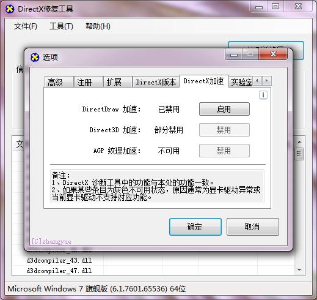

这时再试试你的英雄联盟，错误消失，程序可以进入了。

## 九、一启动游戏就会弹回WeGame

1、首先我们要先登录进入我们wegame平台，登录进入平台后先不要直接启动LOL。

2、找到右上方有一个“三条横线”按钮，点击按钮。

3、选择界面中出现的“辅助工具”选项。

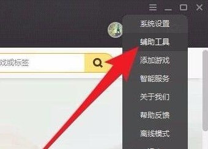

4、在页面中找到英雄联盟一栏，点击“深度优化“对应的按钮。

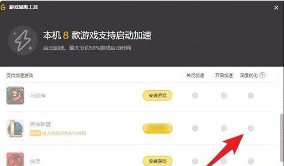

5、然后切换到硬件检测，可以查看到电脑综合性评分，不用wegame启动英雄联盟后对英雄联盟细节进行设计，然后点击右下角“保存”按钮

6、再一次重新进入wegame，在wegame中点击启动英雄联盟。应该可以直接使用了

## 十、WeGame打不开LOL英雄联盟解决方法

1、打开wegame，点击最上方的主页，

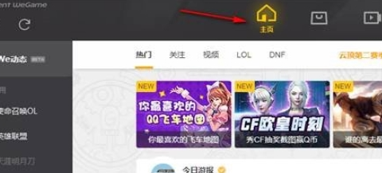

2、右键点击左侧的“英雄联盟”，把启动优化速度后边的对勾去掉就可以了

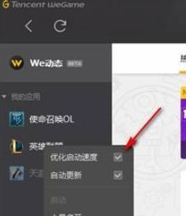

解决方法二：卸载讯飞输入法

解决方法三：更新显卡驱动

## 十一、wegame无法启动英雄联盟

把游戏日志里改成默认dx9运行就可以了

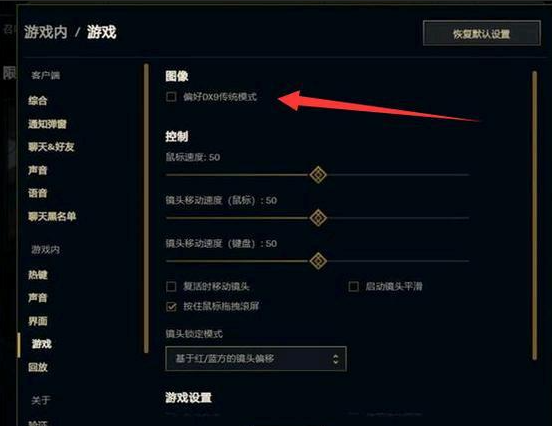

## 十二、关防火墙

有人关防火墙后也解决了问题，可以自己搜索一下关闭防火强方法，下面提供window11方法

1、window11关防火墙

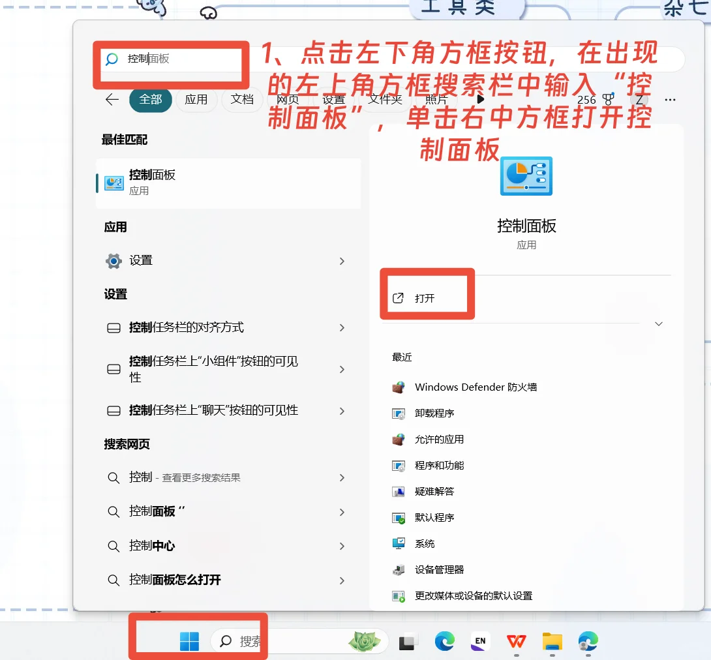

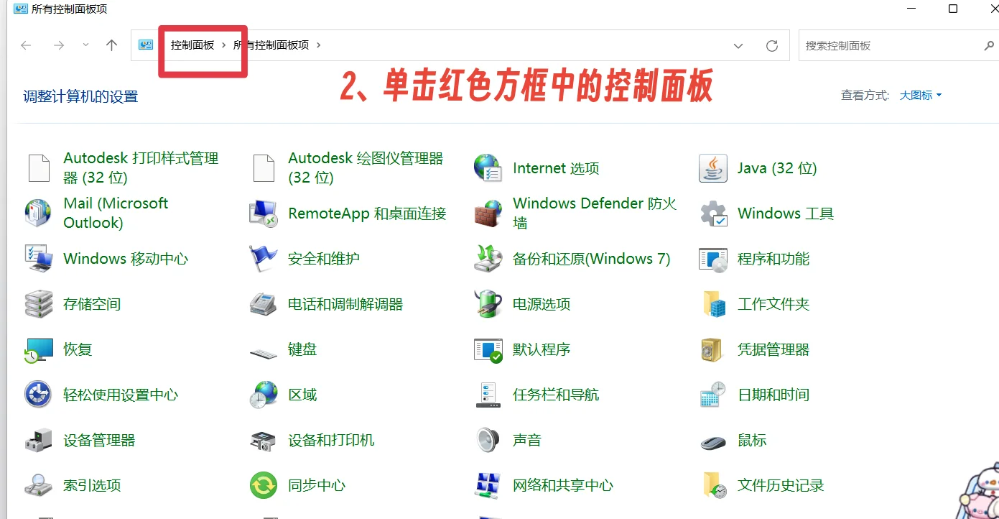

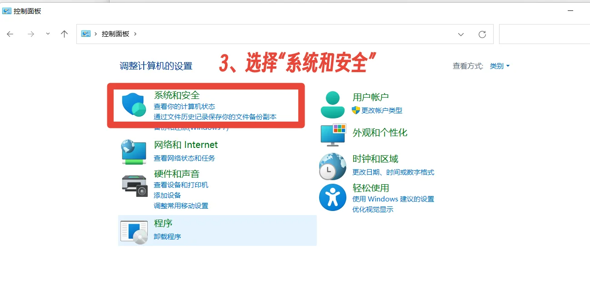

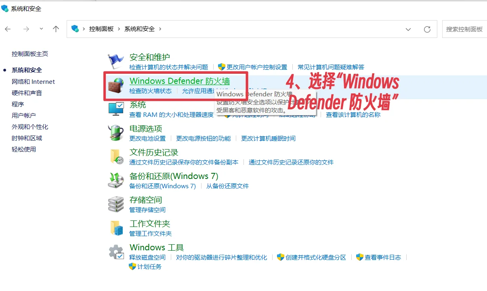

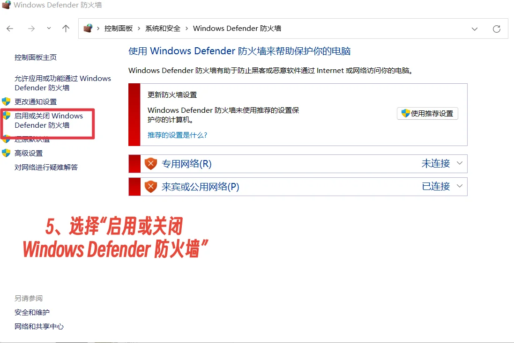

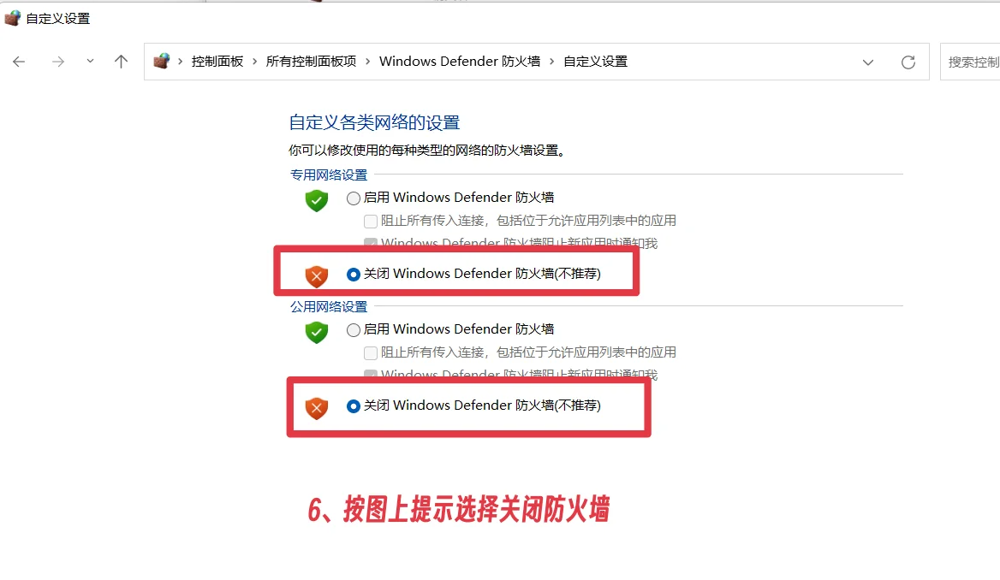

方法二

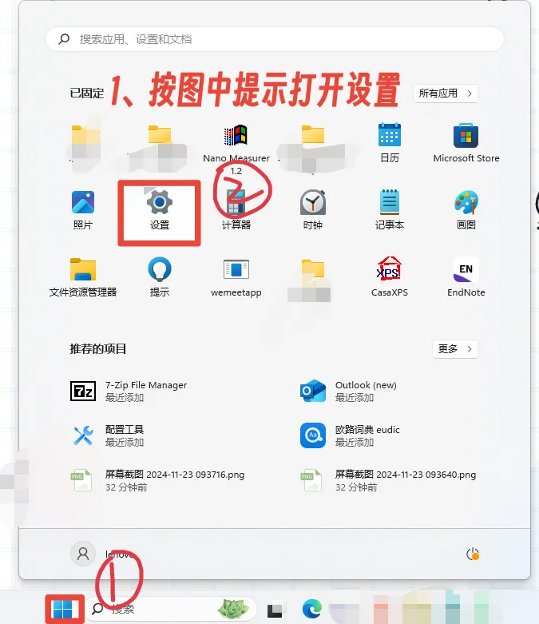

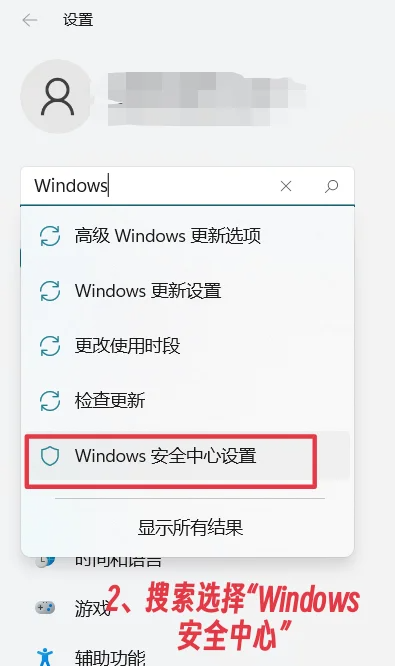

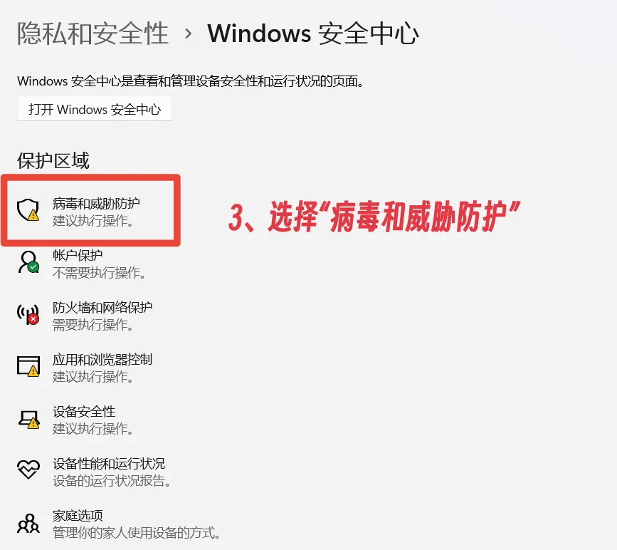

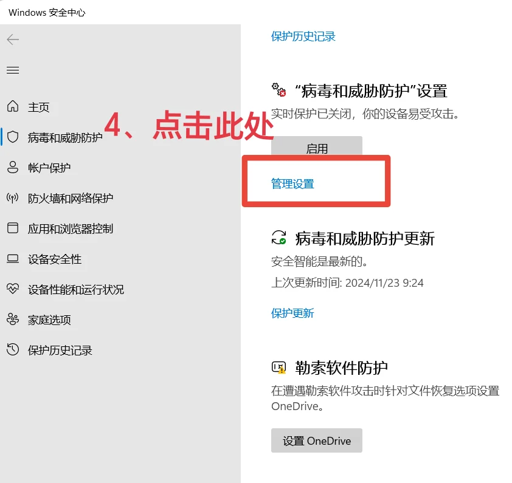

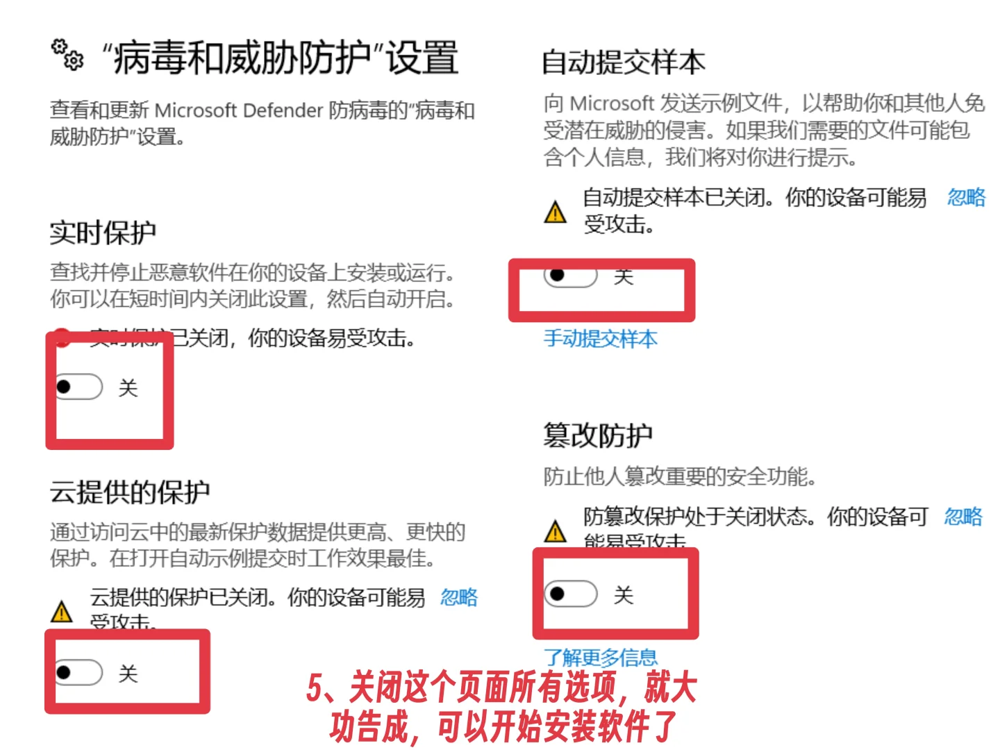