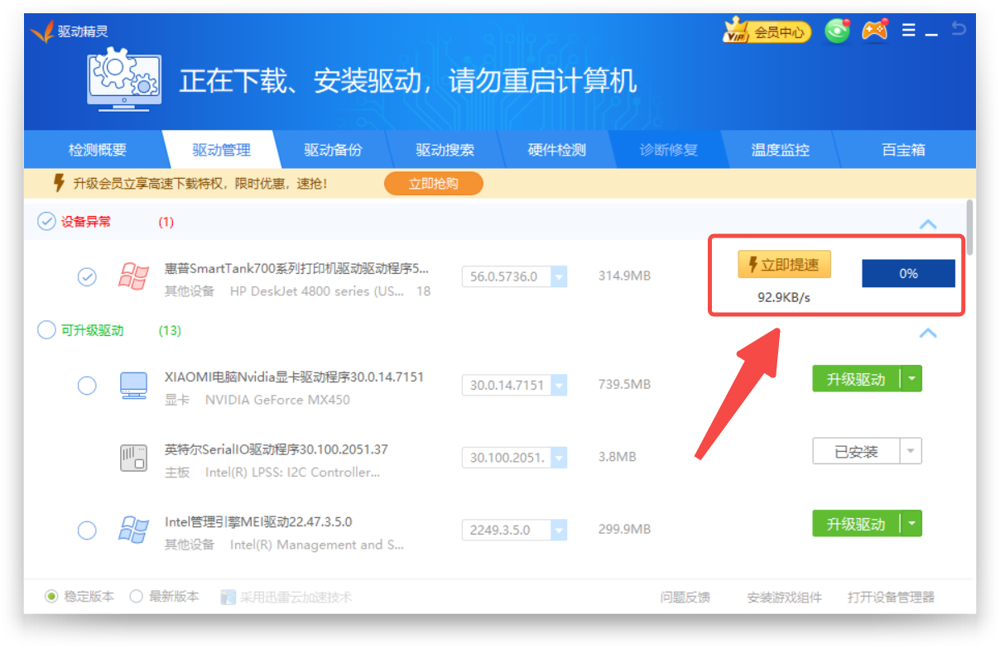
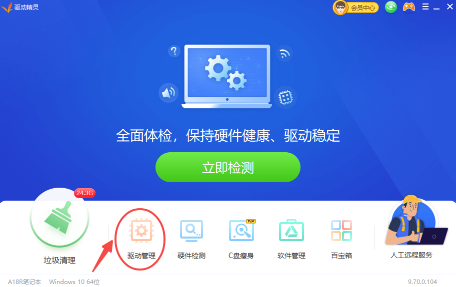
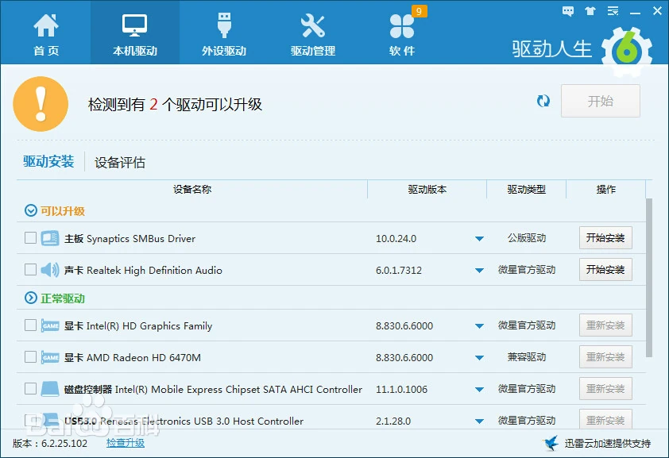
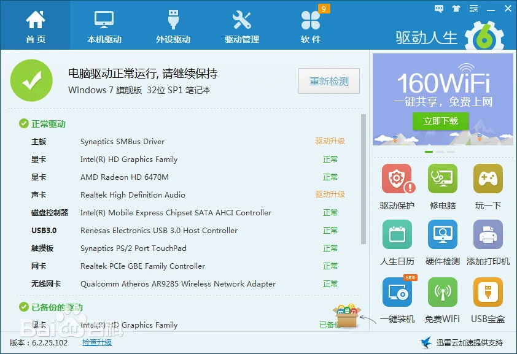
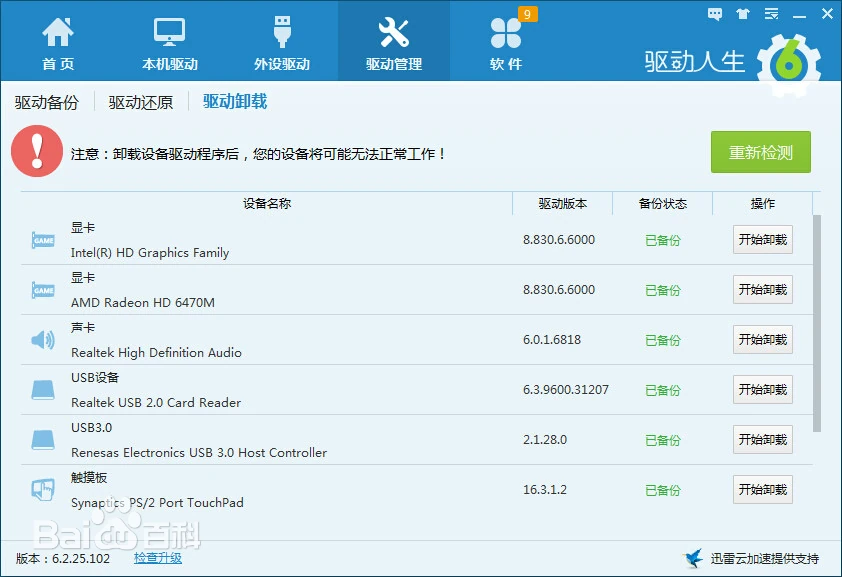
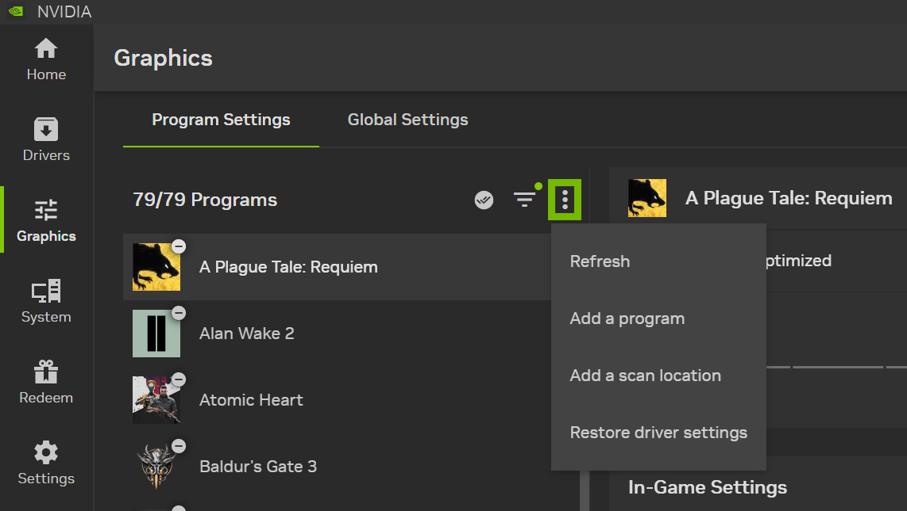
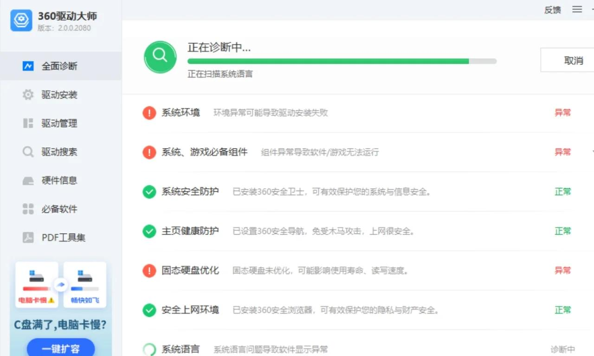
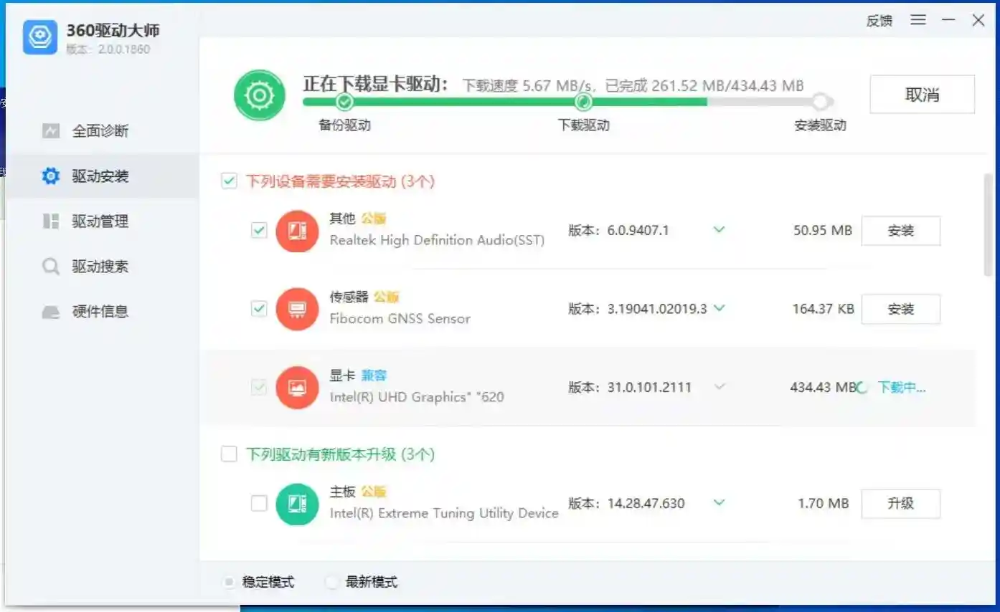
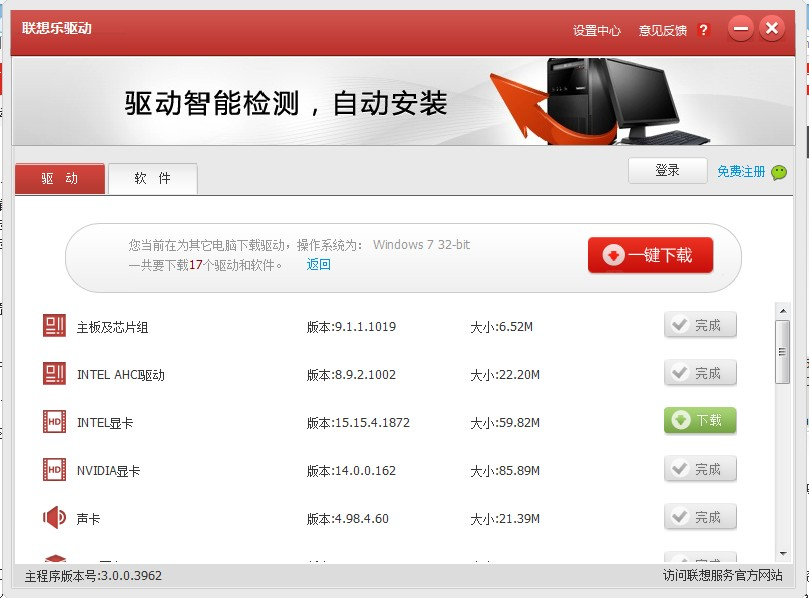

电脑驱动基本装好后，能解决好多问题，比如游戏卡顿，电脑卡顿，网速慢，甚至是不能上网等问题。

一个好的驱动程序往往能够更好的利用硬件，发挥更大的作用，而且如果驱动不对应或者驱动有问题是会严重影响系统稳定性的，比如显卡驱动，没有弄好往往会出现黑屏，死机的现象，但驱动不是随随便便就行的，其中也是有一些要求的

驱动有几个来源，系统自带，系统更新，其它平台万能驱动，主板厂商提供的驱动，笔记本或者品牌机原厂提供驱动，这些都比较靠谱的，但不一定很新

下面推荐几款驱动解决一下电脑问题；

- 驱动精灵
- 驱动人生
- NVIDIA专业显卡驱动
- 360驱动大师
- 联想乐驱动

地址放在这里了：[驱动修复，驱动更新地址点击获取](https://pan.quark.cn/s/17a8f491a2b9)

## 驱动精灵

驱动精灵是一款集驱动管理和硬件检测于一体的、专业级的驱动管理和维护工具。驱动精灵为用户提供安装、删除、在线更新等实用功能。

驱动精灵基于驱动之家十余年的专业数据积累，驱动支持度高，已经为数亿用户解决了各种电脑驱动问题、系统故障，是目前有效的驱动软件。驱动精灵网卡驱动版，支持市面常见的网卡设备，冷门网卡可用手机联网下载，完整解决系统新装问题。

 

## 优势
- 超强硬件检测
- 驱动智能升级
- 驱动维护
- 智能系统状态判断

**一、驱动精灵是万能驱动程序**

利用先进的硬件检测技术，配合驱动之家近十年的驱动数据库积累，驱动精灵能够智能识别计算机硬件，匹配相应驱动程序并提供快速的下载与安装。

**二、硬件侦测功能 配置一目了然**

驱动精灵不仅是驱动助手，还将是硬件助手。新加入的计算机硬件检测功能让计算机配置一清二楚。随时保持硬件的最佳工作状态。不仅可以用驱动精灵升级驱动，还可以让它报出详细的硬件配置。

**三、先进备份技术备份还原轻松搞定**

对于很难在网上找到驱动程序的设备，不提供驱动光盘的“品牌电脑”。驱动精灵的驱动备份技术可完美实现驱动程序备份过程。硬件驱动可被备份为独立的文件、Zip压缩包、自解压程序或自动安装程序，系统重装不再发愁。还可以通过驱动精灵的驱动还原管理界面进行驱动程序还原。

## 驱动人生

驱动人生是一款免费的驱动管理软件，实现智能检测硬件并自动查找安装驱动，为用户提供最新驱动更新，本机驱动备份、还原和卸载等功能。软件界面清晰，操作简单，设置人性化等优点，大大方便广大机友管理自己的电脑的驱动程序。

驱动人生是一款提供电脑驱动下载和安装自动化的软件，通过驱动人生可一键安装显卡驱动、网卡驱动、声卡驱动、打印机驱动、万能网卡驱动等多种电脑所需的驱动程序，目前驱动人生已经累计为用户成功解决了10亿多条电脑驱动问题，是市面上常用的驱动问题解决工具。

驱动人生支持所有品牌（如Intel、NVIDIA/3DFX、AMD/ATI、VIA/S3．Realtek、C-Media、Marvell、ADI、IBM、Creative、Broadcom、Conexant、 SigmaTel、Matrox等）的主板、显卡、声卡、网卡、调制解调器、摄像头、无线、打印机、扫描仪、读卡器、阵列卡、蓝牙、手写板、读写器、USB接口、1394．Bluetooth、Display、Image、MEDIA、Modem、Net、PCMCIA、SCSIAdapter、 SmartCardReader、System、MODEM、串口、并口等设备的识别与驱动。

## 特色

- 全方位安装、升级、备份、还原等简易操作一体化；
- 全范围检测识别所有计算机硬件；
- 全自动匹配最合适品牌驱动，享受品牌官方原汁原味的驱动程序；
- 移动设备即插即装即用；
- 全面兼容Windows系统平台，完全兼容Windows 8和Windows10操作系统。

## NVIDIA App 

NVIDIA App 是 PC 游戏玩家和创作者的必备辅助工具。可以使你的 PC 及时升级到最新的 NVIDIA 驱动程序和技术。在全新的统一 GPU 控制中心内优化游戏和应用，通过游戏内悬浮窗提供的强大录像工具捕捉精彩时刻，并可以轻松发现最新的 NVIDIA 工具和软件。

对于搭载 NVIDIA GPU 的 PC 和笔记本电脑，NVIDIA App 是用户的必备工具。无论是游戏爱好者还是内容创作者，NVIDIA App 能简化升级最新 GeForce Game Ready 和 NVIDIA Studio 驱动的流程，并可快速发现和安装 NVIDIA 应用，如 NVIDIA Broadcast 应用。

## AI 增强的游戏视觉效果

借助 NVIDIA Freestyle，你可以使用 RTX Dynamic Vibrance 和 RTX HDR 等强大的全新 AI 滤镜，实时定制游戏的视觉效果。Freestyle 已整合到驱动程序层以实现无缝兼容，目前支持超过 1200 款游戏。

## 衡量性能表现

你可以通过全新更新的 NVIDIA 浮窗查看实时 FPS 和性能统计数据。浮窗支持集成的 NVIDIA Reflex 分析器，你可以定制显示内容，显示 GPU 和 CPU 利用率、FPS 1% Low，以及 PC 和系统延迟等指标。

## 优化和调整 GPU

你可以在其中一站式轻松优化游戏内设置和 GPU 设置，自定义 VSYNC、DSR 和低延迟模式等 NVIDIA 图形设置，利用 NVIDIA 云数据中心的强大功能，根据系统的 GPU、CPU 和显示器提供个性化图形设置，从而优化游戏内设置。此外，只需单击一下即可监控并自动调整 GPU。

## 捕捉你的高光时刻 

NVIDIA ShadowPlay 简化了视频录制和截屏操作，具备类似于 DVR 的即时回放功能，可让用户即时保存长达 30 秒的游戏视频。你也可以手动录制分辨率高达 8K、帧率为 30 fps 的 HDR 视频，或者录制帧率为 120 fps 的 4K HDR 视频，而且录制过程对性能的影响微乎其微。RTX 40 系列 GPU 用户现在可以使用 AV1 编解码器录制视频，从而以更小的磁盘空间提供更高保真视频。NVIDIA Highlights 则能够自动捕捉重要游戏时刻、关键击杀和制胜之举，确保自动保存玩家的精彩游戏时刻。

## NVIDIA DLSS 4 优设将升级游戏和应用

NVIDIA DLSS 利用 AI 和 GeForce RTX Tensor Core 加速帧率，同时为超过 700 款 RTX 游戏和应用提供清晰锐利、高质量的图像，从而彻底改变了图形技术。自发布以来，DLSS 的升级不断提高了 DLSS 超分辨率的图像质量，通过引入 DLSS 帧生成实现帧率倍增，并通过添加 DLSS 光线重建增强了全景光线追踪游戏和应用的画面效果。

现在，随着 GeForce RTX 50 系列 GPU 的发布，我们还将推出 NVIDIA DLSS 4，该技术引入了 DLSS 多帧生成功能，并可为全套 DLSS 技术带来提升。

DLSS 多帧生成技术可为每个传统渲染帧生成多达三帧，配合整套 DLSS 技术，最高可将帧率提升至传统图像渲染的 8 倍。得益于该技术，玩家在 GeForce RTX 5090 D 上可解锁超绝惊艳的 4K 240 FPS 全景光线追踪游戏体验。

## 360驱动大师

360驱动大师是一款专业解决驱动安装更新软件，百万级的驱动库支持，驱动安装一键化，无需手动操作，先进的驱动体检技术，让你更直观了解您电脑的状态，强大的云安全中心让保证您所下载的驱动不带病毒，快一点，再快一点，体验一键化安装和升级的乐趣，驱动大师陪你一路行。

**驱动体检**

先进驱动体检技术，更快更精准地识别您的电脑，电脑信息一目了然。

**精确识别**

在线云端独有的技术，准确地驱动匹配，让驱动安装更简单。

**驱动云备份**

一键备份驱动到云端，让驱动备份更简单、安装更无优。

**极速安装**

同样的软件我们比速度；同样的速度我们比安装；同样的安装比体验；比同类软件安装更快、更轻便。 

**硬件识别**

先进一键智能识别假显卡、假硬件，让无良硬件商无处可藏。

**即插即用**

真正让你体验即插即用的乐趣，让复杂的安装流程随之远去，硬件本应如此简单

## 联想乐驱动

联想乐驱动是联想公司推出的智能驱动更新客户端软件，主要为旗下电脑用户提供硬件驱动自动检测、下载及安装服务，支持主板、显卡、声卡等核心组件。软件通过主机编号或手动选型匹配驱动，具备静默安装、代理配置、驱动备份等功能，并整合云端账号登录以同步默认机型信息 。

联想乐驱动安装成功后在桌面会生成该软件的快捷方式，双击图标启动该程序， 程序会自动获取到您的主机编号，如果主机编号错误 或者没有获取到请您手工输入，点击确定按钮；接下来程序会为您找到当前使用机器的驱动，如：主板，显卡，声卡，无线网卡等，您可以点击下载、安装按钮轻松 完成驱动程序的下载安装。

