## 介绍

它不止能看图，还能预览音频、视频、压缩文件、OFFICE三件套，甚至压缩包。

可以像MacOS一样（Bring MacOS Quicklook），通过“空格键（Space）”，预览各种格式的文件：
比如预览图片（Jpg）：

## 安装

下载地址： [QuickLOOK官方下载地址](https://pan.quark.cn/s/db9903d2eca6)

1.下载QuickLook(文件预览插件)软件最新版压缩包

2.解压QuickLook(文件预览插件)软件压缩包，选中QuickLookexe程序

3.双击exe程序，进入QuickLook(文件预览插件)软件安装界面，点击下一步

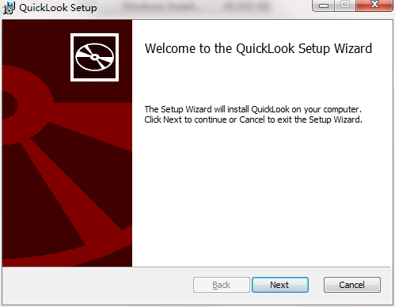

4.选择我接受此协议，点击下一步

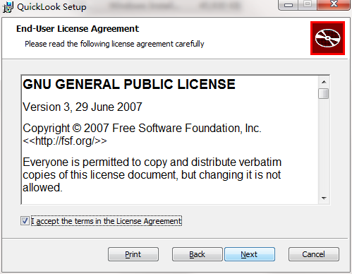

5.选择合适的安装位置，点击下一步

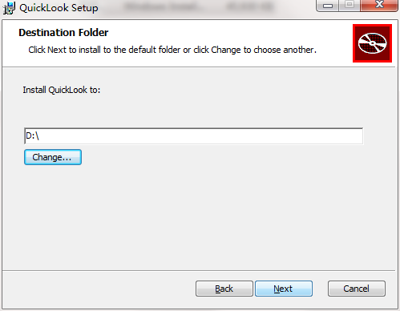

6.确认安装程序，选择点击“install”

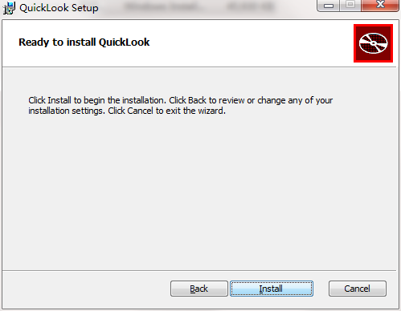

7.QuickLook(文件预览插件)软件安装完成，请耐心等待

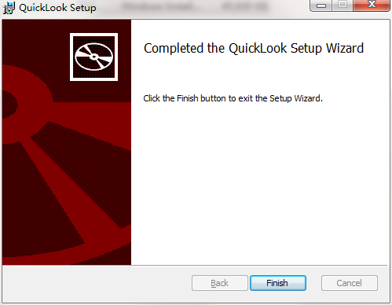

## 说明

QuickLook内置所支持预览的文件格式

- 几乎所有的图片格式: .png, .png, .jpg, .bmp, .gif, .psd, Camera RAW等
- 压缩包: .zip, .rar, .tar.gz, .7z等
- .pdf and .ai file
- 几乎所有的音视频格式: .mp4, .mkv, .m2ts, .ogg, .mp3, .m4a等
- 数据文档 (.csv)
- 邮件 (.eml and .msg)
- HTML文件 (.htm, .html)
- Markdown文件 (.md, .markdown)
- 所有的文本文件 (determined by file content)

## 安装新插件流程

1、运行软件后右键图标，点击获取新插件

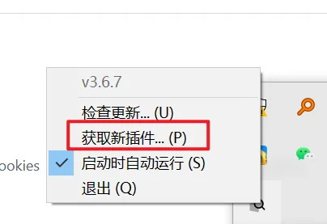

2、浏览页面，为了能够预览普通的文本、表格文件，选择如图所示OfficeViewer，点击Link跳转页面

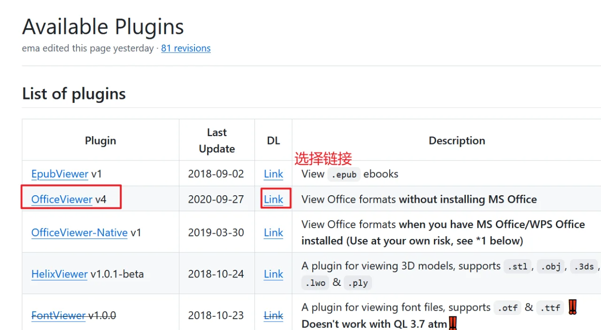

3、选择最上面的就是最新更新的版本，目前是V5即第五个版本，在Assets中下载第一个文件

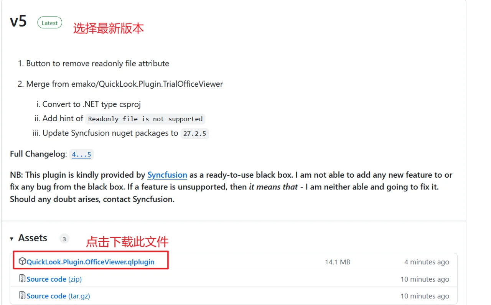

4、下载完成后，单击选中文件，敲击空格键，如【图】所示，点击install进行下载

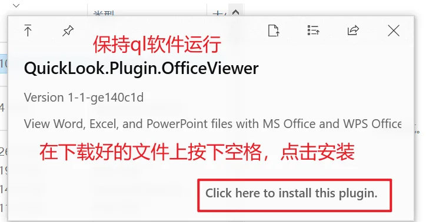

## 功能一: Quick Look插件扩展支持更多文件格式
- 源代码高亮(.cpp .c .h .c## .php .java .js .py .swift .css .vue .yml - .dart .sh .go 等)
- Markdown(.md .markdown .mdown .mkdn .mkd .rmd 等)
- 压缩文件(.tar .tar.gz .zip)
- 数据交换文件(.json)
- 数据库脚本(.sql )

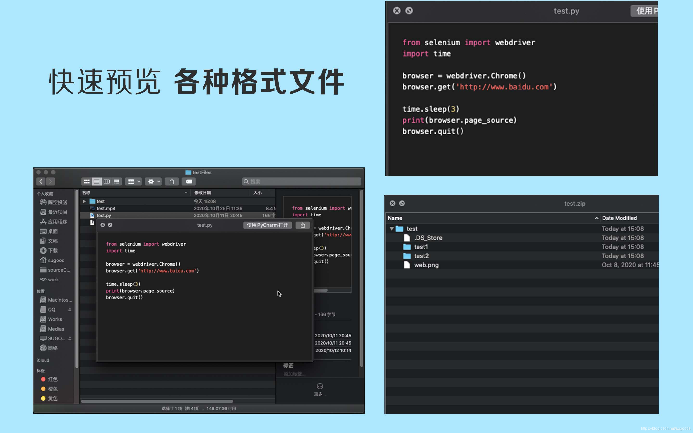

## 功能二:右键显示图片、音频、视频信息

由于一些图片、音频、视频文件在新版macOS中使用Quick Look插件已经无法自定义界面。所以我们通过扩展Finder（访达）的右键功能来显示图片、音频、视频的信息。

- 图片支持格式(.jpg .png .gif .psd .bmp .tif .svg 等)
- 视频支持格式(.mp4 .3gp )
- 音频支持格式(.mp3)

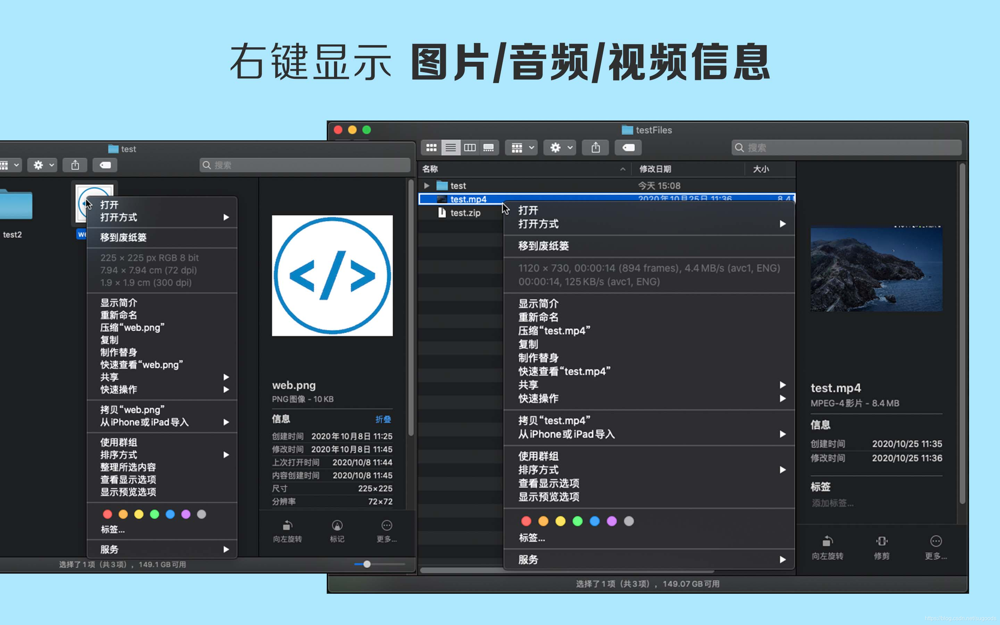