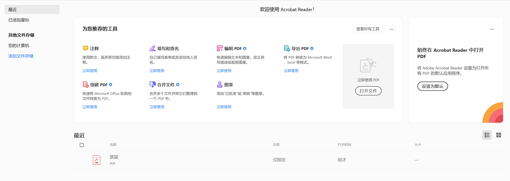
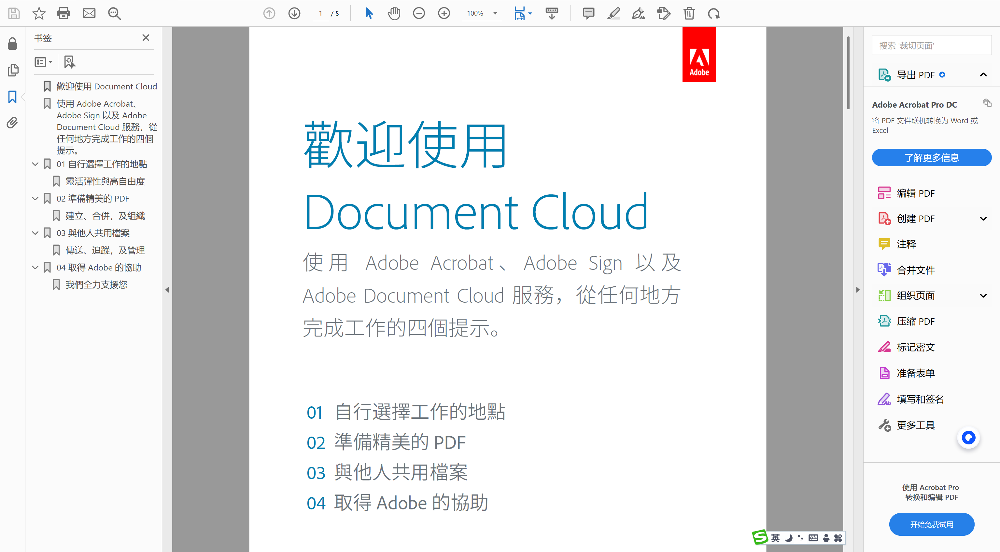

## 介绍 
其实PDF阅读器非常多，比较知名的就是`Adobe Acrobat Reader DC`、`万兴PDF阅读器`、`Sumatra PDF`，PDF阅读器功能特点其实都差不多，主要在于点击就能用；

下载链接都放在这里了：
[https://pan.quark.cn/s/945bef056362](https://pan.quark.cn/s/945bef056362)

## 如果要功能强大的
`Adobe Acrobat Reader DC`PDF文档的始祖，PDF格式都是他发明的，市面上所有的PDF功能他都有；
高阶功能全家桶：签名、批注、表单全支持

标准兼容性强，复杂文档也不出错

政企单位标配，办公信任度MAX

### 注释
使用附注、高亮等功能添加注释。

### 填写和签名
自己填写表单或发送给他人签名。
打开

### 编辑 PDF
快速编辑文本和图像。改正拼写错误或裁剪图像。

### 导出 PDF
将 PDF 转换为 Microsoft Word、Excel 等格式。

### 创建 PDF
快速将 Microsoft Office 和其他文件转换为 PDF。

### 合并文件
合并多个文件并将它们整理到一个 PDF 中。

### 图章
添加 “已批准” 或 “草稿” 等图章。

### 测量
测量对象的距离、面积和周长。

### 证书
以数字方式签名或验证文档，并验证其真实性。

## 如果要直接点击就能用的
`万兴PDF阅读器`、`Sumatra PDF`都适合，想用哪个就用哪个；

`万兴PDF阅读器`不仅能够打开PDF进行阅读，还能将PDF文档与其他文档格式轻松进行互转。除此之外，它还有各种PDF编辑功能，包括PDF拆分、合并、加密等功能，并且全部都可以批量进行操作。它的PDF编辑功能也很强大，有各种笔记功能可以任意对PDF文档进行标注。

`Sumatra PDF`因其简洁的界面，打开速度超快，使用简单，收获了一大票粉丝当然常见的阅读功能一个也不少
目录结构展示，放大缩小，查找功能等等所以，仅作为PDF阅读器，绰绰有余。

## 没什么需求，只是要看一看的

那我还是推荐`万兴PDF阅读器`，打开就能用，也不需要安装，反正只是阅读一下；
当然，他的特别能转成你要的格式；

TXT PDF 转为文本
JPG PDF 转为图片
图片转为 PDF
PDF PDF 转为 PDF
DOC PDF 转为 DOC
W DOC 转为 PDF