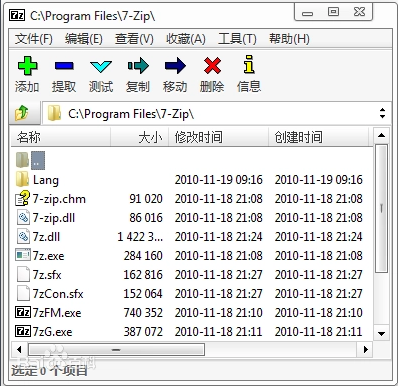
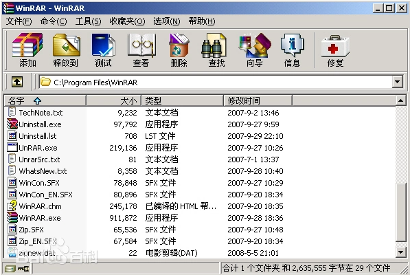
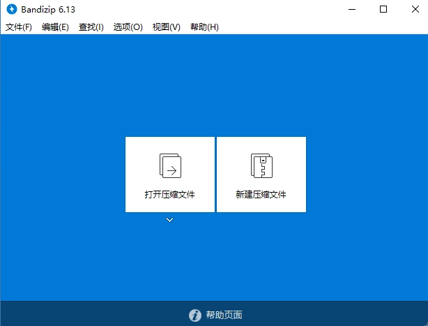

压缩和解压缩文件基本就这几款

## 1、 7-Zip
7-Zip是一款完全免费而且开源的压缩软件，相比其他软件有更高的压缩比而且相对于WinRAR不会消耗大量资源。

7-Zip是基于GNU LGPL协议发布的软件，通过全新算法使压缩比率大幅提升 

### 下载地址

[7-Zip点击下载](https://pan.quark.cn/s/a9220b346e17)

### 支持格式：
压缩 / 解压缩：7z, XZ, BZIP2, GZIP, TAR, ZIP 和 WIM

仅解压缩：AR、ARJ、CAB、CHM、CPIO、CramFS、DMG、EXT、FAT、GPT、HFS、IHEX、ISO、LZH、LZMA、MBR、MSI、NSIS、NTFS、QCOW2、RAR、RPM、SquashFS、UDF、UEFI、VDI、VHD、VMDK、WIM、XAR 以及 Z 

- 对于ZIP和GZIP格式，7-Zip能提供比使用 PKZip 及WinZip 高2~10%的压缩比率
- 7z 格式支持创建自解压(SFX)压缩文件
- 7z 格式支持加密功能(AES-256)
- 集成Windows外壳扩展
- 强大的文件管理能力
- 强大的命令行版本支持 FAR Manager插件
- 支持79种语言,包括简体中文
- 7-Zip适用于Windows 10 / 8 / 7 / Vista / XP / 2019 / 2016 / 2012 / 2008 / 2003 / 2000 / NT。并且7-Zip有面向Linux、Unix平台的命令行版本。支持x86 x86_64 ARM64 处理器

## 2、win_RAR

WinRAR_2025最新电脑版，全能老牌压缩软件，一键下载，快速安装。支持多种格式压缩，提供强力压缩、加密等功能。

### 下载地址

[win_RAR点击下载](https://pan.quark.cn/s/a9220b346e17)

WinRAR是一个文件压缩管理共享软件，由Eugene Roshal（所以RAR的全名是：Roshal ARchive）开发。首个公开版本RAR 1.3发布于1993年。Pocket RAR是为Pocket PC平台发布的免费软件。它是仅有的几个可以读写RAR文件的软件之一，因为它保留版权。

WinRAR 内置程序可以解开CAB、ARJ、LZH、TAR、GZ、ACE、UUE、BZ2、JAR、ISO、Z、XZ和7Z等多种类型的档案文件 、镜像文件和TAR 组合型文件；具有历史记录和收藏夹功能；新的压缩和加密算法，压缩率进一步提高，而资源占用相对较少，并可针对不同的需要保存不同的压缩配置；固定压缩和多卷自释放压缩以及针对文本类、多媒体类和 PE 类文件的优化算法是大多数压缩工具所不具备的；使用非常简单方便，配置选项也不多，仅在资源管理器中就可以完成你想做的工作；对于 ZIP 和 RAR 的自释放档案文件，点击属性就可以轻易知道此文件的压缩属性，如果有注释，还能在属性中查看其内容；对于 RAR 格式（含自释放）档案文件提供了独有的恢复记录和恢复卷功能，使数据安全得到更充分的保障。

### 优势特点
WinRAR 采用独创的压缩算法。这使得该软件比其他同类 PC 压缩工具拥有更高的压缩率，尤其是可执行文件、对象链接库、大型文本文件等。

WinRAR 支持的文件及压缩包大小达到 9，223，372，036，854，775，807 字节，约合 9000 PB 。事实上，对于压缩包而言，文件数量是没有限制的。

WinRAR 完全支持RAR及ZIP压缩包，并且可以解压缩CAB、ARJ、LZH、TAR、GZ、ACE、UUE、BZ2、JAR、ISO、Z、7Z格式的压缩包。

WinRAR 支持 NTFS 文件安全及数据流。

## 3、BANDIZIP

Bandizip 是一款压缩软件，它支持Zip、7Z 和 RAR 以及其它压缩格式。它拥有非常快速的压缩和解压缩的算法，适用于多核心压缩、快速拖放、高速压缩等功能。

支持压缩: ZIP, 7Z, ZIPX, EXE, TAR, TGZ, LZH, ISO, GZ, XZ

支持解压缩: 7Z, ACE, AES, ALZ, ARJ, BH, BIN, BZ, BZ2, CAB, MSI, EGG, GZ, IMG, ISO, ISZ, LHA, LZ, LZH, LZMA, PMA, RAR, TAR, TBZ, TBZ2, TGZ, TLZ, TXZ, UDF, WIM, XPI, XZ, Z, ZIP, ZIPX, ZPAQ, ZSTD, BR

### 下载地址

[BANDIZIP点击下载](https://pan.quark.cn/s/a9220b346e17)

### Bandizip的特色功能：

1.高速归档：avi，wmv、mp3这类的文件是很难压缩的，而这个功能能够使用自己独特的算法绕过这些文档，从而加快文件的压缩速度。

2.更快的拖拽压缩/解压缩：一般同类软件在使用拖拽方式解压缩的时候，软件先会把其中的文件提取到一个临时文件夹，解压完毕后才把临时文件夹中的所有文件复制到指定的文件夹中，这样会浪费很多时间，而Bandizip的拖拽功能则是直接解压到指定文件夹，所以整个时间会节省不少。