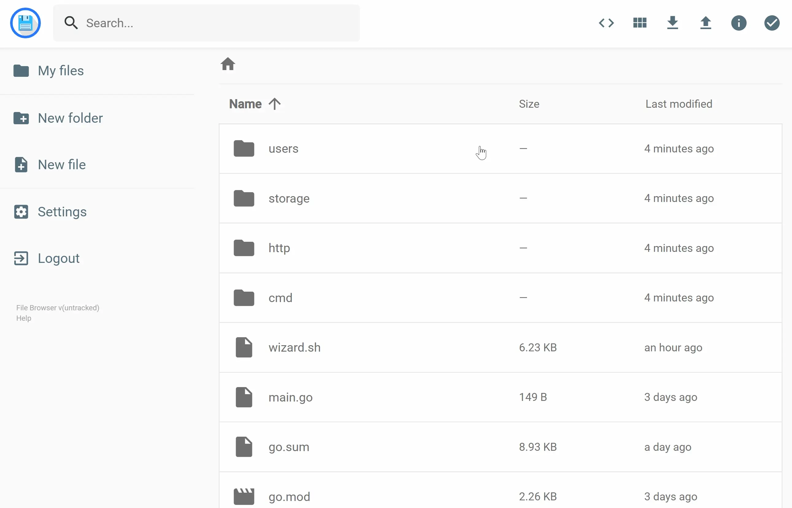
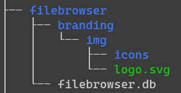
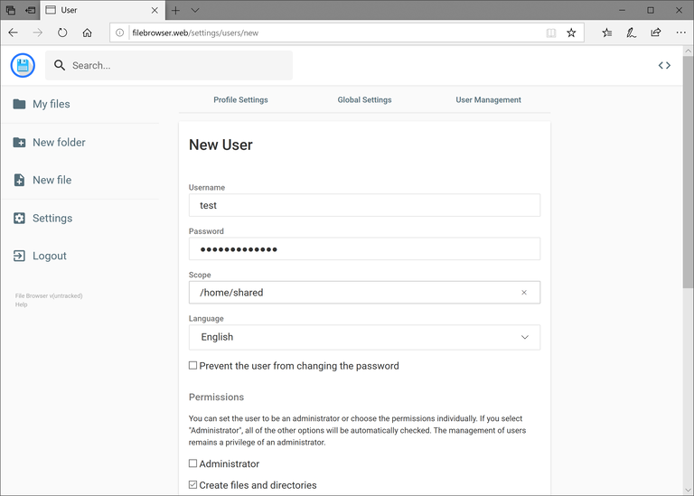

File Browser - 基于 Go 的 Web 文件浏览器


## 软件简介
File Browser 提供指定目录下的文件管理界面，可用于上传、删除、预览、重命名和编辑你的文件。它允许创建多个用户，每个用户可以有自己的目录。它可以用作独立的应用程序或中间件。



## 特性：
- 轻松登录系统
- 通过时尚的界面管理你的文件
- 管理用户、添加权限、设置范围
- 编辑你的文件
- 执行自定义命令
- 自定义你的安装

## 安装：
File Browser 是一个二进制文件，可以用作独立的可执行文件。尽管如此，有些人可能更喜欢将它与 Docker 或 Caddy 一起使用，这是一个很棒的 Web 服务器，默认情况下启用 HTTPS。

在Windows上运行，下载的是这个windows-amd64-filebrowser.zip

下载地址：[filebrowser个人网盘](https://pan.quark.cn/s/3987a4282387)

```bash
brew tap filebrowser/tap
brew install filebrowser
filebrowser -r /path/to/your/files
```
Unix

```bash
curl -fsSL https://raw.githubusercontent.com/filebrowser/get/master/get.sh | bash
filebrowser -r /path/to/your/files
```

windows

```bash
iwr -useb https://raw.githubusercontent.com/filebrowser/get/master/get.ps1 | iex
filebrowser -r /path/to/your/files
```

初学者开始使用 File Browser 的最快方法是打开终端并执行以下命令：


它将引导一个数据库，其中存储了所有配置和用户。现在，您可以在命令行中看到实例的运行地址。您只需访问该 URL 并使用以下凭据：

- 用户名： admin 
- 密码： admin

虽然这是引导实例的最快方法，但我们建议您查看选项的可能性config init，config set并使安装尽可能安全和定制。


## Docker
文件浏览器也以 Docker 镜像的形式提供。您可以在Docker Hub上找到它。使用方法如下：

```bash
docker run \
    -v /path/to/root:/srv \
    -v /path/filebrowser.db:/database.db \
    -v /path/.filebrowser.json:/.filebrowser.json \
    -u $(id -u):$(id -g) \
    -p 8080:80 \
    filebrowser/filebrowser
```

默认情况下，我们已经有一个包含一些默认设置的配置文件，因此您只需挂载根目录和数据库即可。不过，您也可以通过挂载包含新配置文件的目录来覆盖配置文件。如果您还没有数据库文件，请确保在指定的路径下创建一个新的空文件。否则，Docker 将创建一个空文件夹而不是空文件，从而导致在将数据库挂载到容器时出错。


## 自定义
您可以自定义文件浏览器的安装，例如将其名称更改为您想要的任何其他名称、添加全局自定义样式表以及使用您自己的徽标（如果需要）。为此，有三个配置选项可供更改：

- 名称：这是在登录和注册页面上显示的实例名称。这不会取代侧边栏中的版本信息。

- 禁用外部链接：这将禁用任何外部链接（指向此文档的链接除外）。

- 文件夹：是可以包含两项的目录路径：
  - custom.css，包含您想要应用到安装的样式。
  - img目录，其文件可以替换应用程序中的默认标识。

可以使用以下命令通过 CLI 界面设置这些选项：

```bash
filebrowser config set --branding.name "My Name" \
    --branding.files "/abs/path/to/my/dir" \
    --branding.disableExternal
```

或者可以在设置 → 全局设置中的“品牌目录路径”下设置。

为了识别自定义图标，您需要创建img目录img/icons并将 svg 放在branding/img目录中：文件浏览器自定义树



要替换图标，您需要将其放置在img/icons目录中，但还要注意，由于浏览器通常会使用可用的最高分辨率选项（至少为 16x16 和 32x32），因此还需要一些其他类型的 PNG 图标（请参阅上面的默认徽标链接）。您可以使用Real Favicon 生成器从基础图像生成这些图标。

图标已被缓存，为了使新图标更快地出现，请在浏览器中打开开发人员工具，然后单击“应用程序”选项卡，然后单击“存储”，然后单击“清除站点数据”。

## 身份验证方法

目前，有三种可用的身份验证方法。每种方法都有各自的功能和规范。如果您有兴趣贡献其他身份验证方法。



### JSON 身份验证（默认）
我们称之为 JSON 身份验证，但它只是默认的身份验证方法，如果您不做任何更改，它就是默认提供的身份验证方法。它是默认设置的，但如果您之前进行过更改，则可以恢复使用 JSON 身份验证：

```txt
filebrowser config set --auth.method=json
```

此方法还可以扩展登录时的`reCAPTCHA`验证：

```bash
filebrowser config set --auth.method=json \
    --recaptcha.key site-key \
    --recaptcha.secret private-key
```

默认情况下，我们使用`Google` 的 `reCAPTCHA`服务。如果您居住在中国，或者想使用其他提供商，可以使用以下命令更改主机：

```bash
filebrowser config set --recaptcha.host https://recaptcha.net
```

## 代理标头
如果您有反向代理服务器，并希望用它来登录用户，您可以通过我们的proxy身份验证方法来实现。要配置此方法，您的代理服务器必须发送一个包含已登录用户名的 HTTP 标头：

```txt
filebrowser config set --auth.method=proxy --auth.header=X-My-Header
```

## 无需身份验证
我们还为希望在家庭网络等私密环境中使用文件浏览器的用户提供无需身份验证的机制。设置此身份验证方法后，ID 为 1的用户将被用作默认用户。创建更多用户不会有任何影响。

```bash
filebrowser config set --auth.method=noauth
```