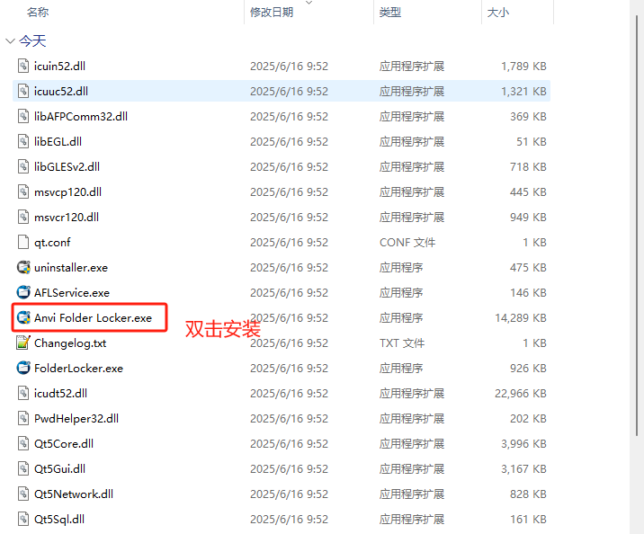
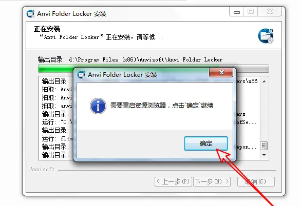
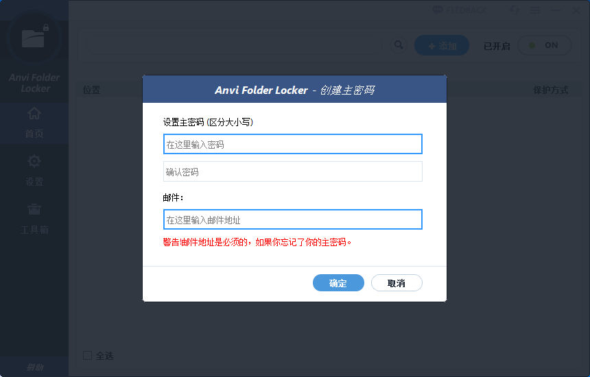
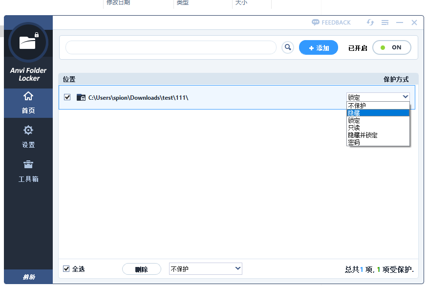
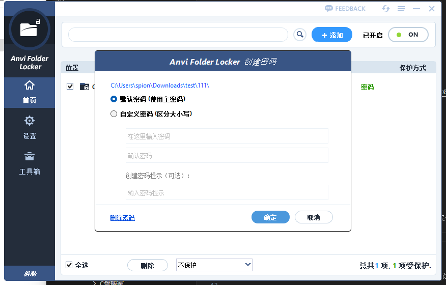
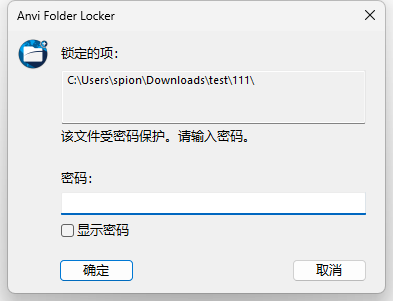
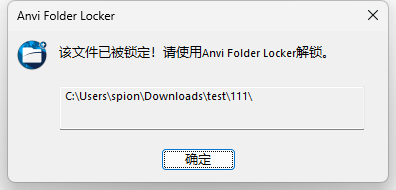
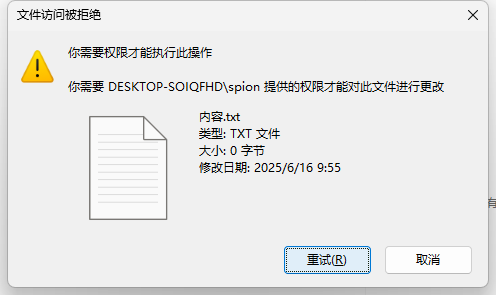

‌Anvi Folder Locker是一款由Anvsoft Corporation开发的免费文件夹和文件加密工具，支持多种保护方式（如锁定、隐藏、密码保护等），适用于Windows系统，旨在保护敏感数据免受未经授权的访问‌。

个人自用的一款文件夹加密软件，主要有几个功能点能满足日常需要：

- 隐藏：隐藏文件夹；
- 密码：不隐藏文件夹但需要密码输入进入文件夹；
- 锁定：文件夹能看不能进入文件夹；
- 只读：文件夹可以看但不能操作；
- 隐藏并锁定：文件夹隐藏且不能进入；

## 下载地址

软件为免费软件，可以直接使用。

[文件夹加密Anvi Folder Locker](https://pan.quark.cn/s/c0b073583a8a)

## 安装

解压文件后，会进入安装界面，选择以下软件进行安装。

安装时会有提示，需要重启资源，点击确定就可以。

初次启动Anvi Folder Locker时，系统会要求您设置主密码。该程序还要求提供有效的电子邮件地址，电子邮件可以随便输入，也可以使用正常的，常用于找回密码。

## 使用方法

### **隐藏**

隐藏：隐藏文件夹；操作后，该文件夹将在电脑中看不到。

### **密码**

密码：不隐藏文件夹但需要密码输入进入文件夹；操作后，该文件夹在电脑中可以看到但需要输入密码才能进入，见下图：

密码有二种操作，1、默认使用该软件的默认密码，2、自定义设置自己的密码。

设置完密码后，双击打开文件夹时，会弹出输入密码的对话框，见下图：

### **锁定**
锁定：文件夹能看不能进入文件夹；见下图：

### **只读**
只读：文件夹可以看但不能操作；见下图：

### **隐藏并锁定**

隐藏并锁定：文件夹隐藏且不能进入；见下图：

哈哈，没有图，因为看不到了。

## **功能**

1、添加权限：使用文件权限(如锁定，只读，隐藏与锁定)，无法修改，复制或删除文件。

2、隐藏文件或文件夹：隐藏关键或机密文件，它们将保持不可见。

3、密码保护：设置文件或文件夹的密码，以便唯有具有有效密码的用户才可以访问它。

4、24/7技术支持： 免费24小时在线技术支持。

5、单击ADD按钮：计算机您可以一次选择一个或多个文件(文件夹)并将其添加到Anvi 文件夹 储物柜。 Anvi Folder Locker为您提供了5个选项来保护与管理添加的文件与文件夹，即隐藏，锁定，只读，隐藏与锁定，密码。

6、Anvi Folder Locker中文版集成在Windows资源管理器中：每当您想要添加新文件夹时，您可以浏览到其位置(如前所述)，还可以将其拖放到应用程序的主窗口中。 

