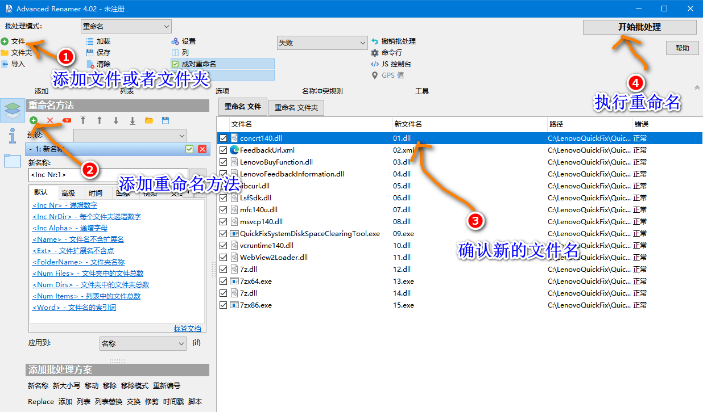
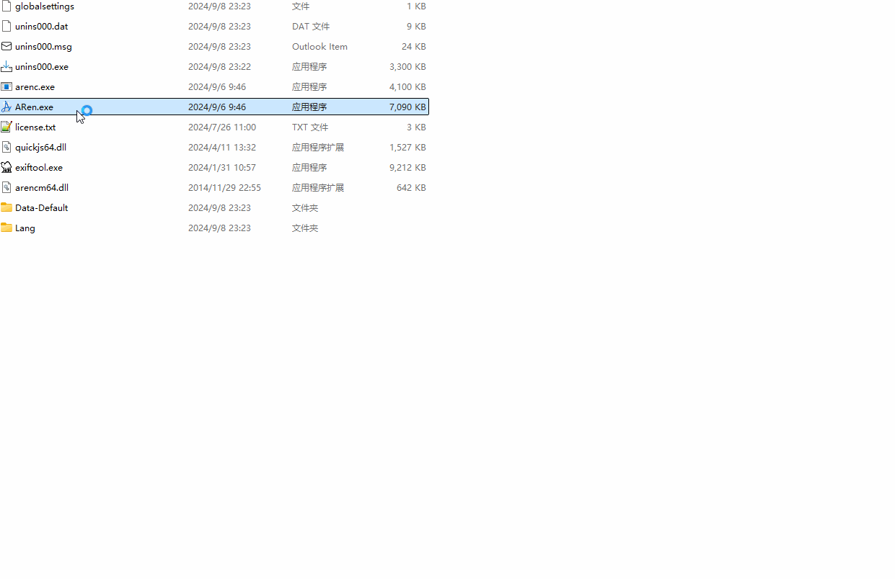
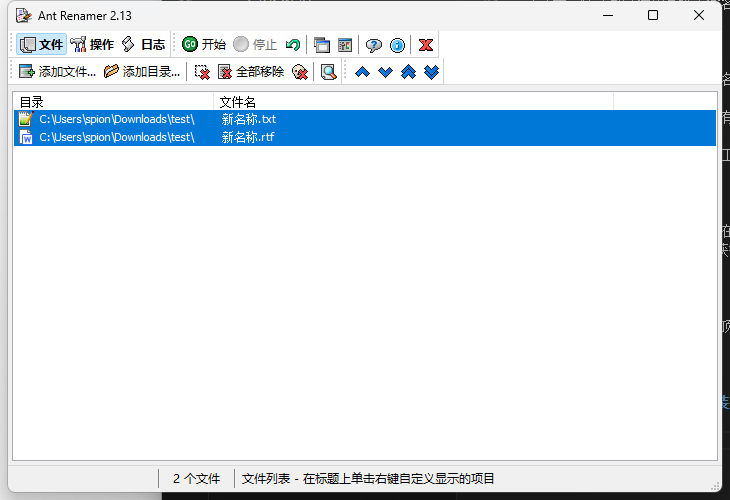
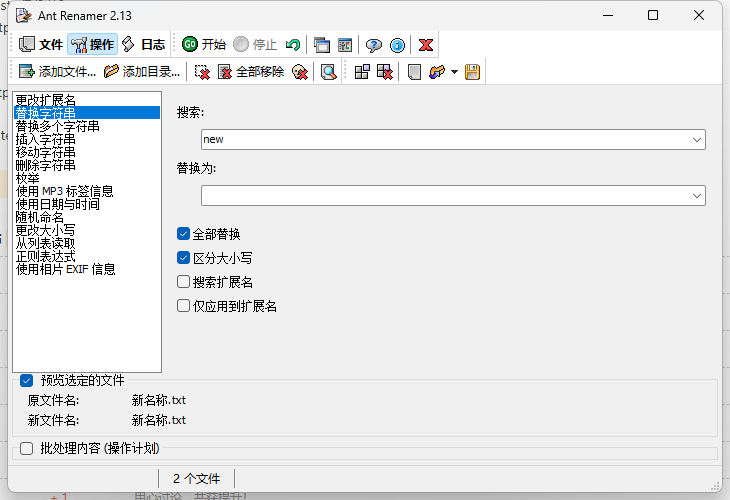
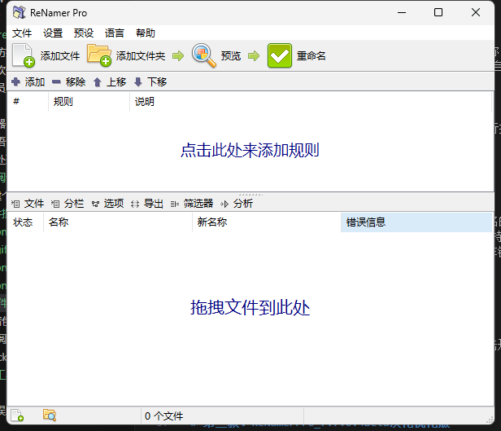
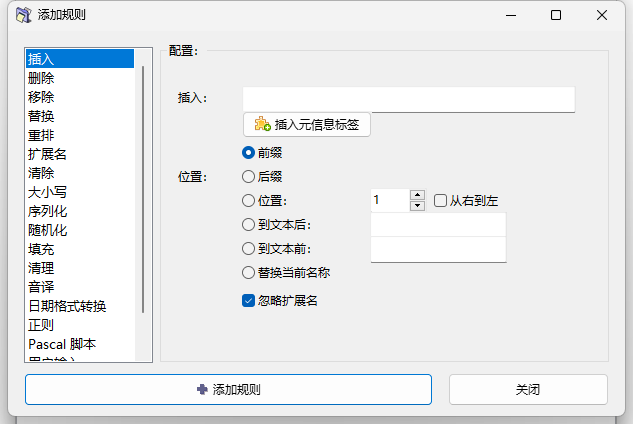
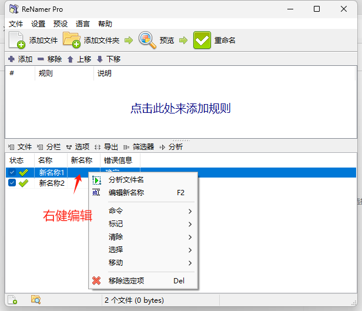

批量重命名文件是一项常见的事情，尤在处理大量照片、音乐或文档时。有多种工具可以帮助您轻松完成此操作，但并非所有这些工具都易于使用且功能齐全。

下面我将推荐三款批量重命名工具，它们分别是：Advanced Renamer，antrenamer，ReNamerPro，这三款重命名软件都是绿色版，可以直接使用，无需安装。

## 下载地址

[三款软件都放这里了，点击直接获取](https://pan.quark.cn/s/d0495e145206)

## 第一款：Advanced Renamer

Advanced Renamer是一款免费的文件重命名工具软件，适用于Windows平台。该软件提供多种重命名方法，包括添加前缀、替换字符串、提取文件属性或ID3标记信息等，并支持实时预览功能 。其功能涵盖批量重命名、属性修改、大小写转换等，支持图像、音乐、视频等文件类型 。

注意：显示未注册？不影响使用。

### 第 1 步：添加文件

通过单击“添加”按钮来执行此操作 屏幕截图中突出显示，或者将文件从 Windows 资源管理器拖放到高级重命名器。

如果添加文件夹，该文件夹中包含的所有文件都将添加到列表中。

请注意，还可以使用高级重命名器重命名文件夹。为此，请单击项目列表上方的“重命名文件夹”选项卡。

### 第 2 步：添加方法

这些方法用于定义用于批量重命名的规则。可以通过单击窗口左侧的“添加”按钮来添加方法。

根据您想要重命名文件的方式，有多种方法。可以在方法部分阅读有关不同方法的更多信息。

可以通过单击方法面板底部工具栏中的方法名称来添加方法。

### 第 3 步：验证新名称

添加文件并设置方法后，可以在“新文件名”列中验证新名称。 

在实际重命名文件之前，最好始终检查批处理的结果。如果你对显示的结果不满意， 可以更新方法的配置以获得所需的结果。新名称列将自动更新。

### 第 4 步：开始批处理
准备好后，可以通过单击窗口顶部的“开始批量”按钮来执行批量重命名。 将出现一个新窗口，可以在其中单击“开始”按钮来启动批处理。

## 第二款：antrenamer免安装版

Ant Renamer是一套可以批量将文件名及扩展名进行重新命名的免费软件，除了有多样化的命名公式来协助批量重新命名之外，数码照片可以汇入EXIF信息，MP3音乐文件可以将ID3标签做为新的文件名，支持手动编写命名公式﹝正则表达式﹞的方式来命名，Ant Renamer可先预览重新命名后的文件名，重新命名作业完成后也能显示完整记录，若是操作错误或对文件的新名称不满意时，还可以复原。

主界面：

操作比较简单，直接点击操作，设置要操作的方式，最后点击开始就可以了。

## 第三款：ReNamerPro_7.7.0.4Beta汉化优化版

ReNamer 是一个非常强大和灵活的文件重命名工具，它提供所有标准的重命名过程，包括前缀、后缀、替换、大小写更改以及删除括号内容、添加编号规则、更改文件扩展名等。对于高级用户，支持正则表达式和 PascalScript 规则，允许用户编写自己的重命名规则。

### 【版本说明】

- 1.单文件便携，集成激活，启动即是专业版，可保存设置。
- 2.对官方遗漏的简体中文语言进行了补译。
- 3.移除了多余的语言文件，仅保留英文和简体中文，文件数量减少了292个。

### 专业版特点：
程序允许您将多个重命名操作组合为一个规则集，以逻辑顺序应用每个操作，这些操作可在程序中保存、加载和管理。此外，它还可以重命名文件夹、处理正则表达式、Unicode 功能、并支持各种元标记，如：ID3v1、ID3v2、EXIF、OLE、AVI、MD5、CRC32 和 SHA1。
支持系统：Windows 98 及更高版本

重命名功能：使用无限数量的重命名规则、存储无限数量的预设、将预设组织到目录结构中

规则修改：

### 重命名

右健编辑

