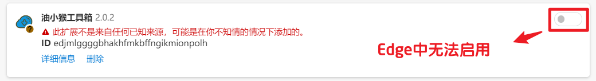

Edge浏览器无法安装扩展如果安装失败，并出现以下几种提示：

程序包无效：CRX_REQUIRED_PROOF_MISSING

该扩展程序未列在 Edge 网上应用店中，并可能是在您不知情的情况下添加的

扩展的按钮开关为灰色，无法启用

下面以安装 油小猴工具箱 扩展为例，提供 2 种解决方法：

## 方法一（推荐）：

下载 [Chrome和Edge策略文件.zip](https://pan.quark.cn/s/8a6b5734c68d) (opens new window)并解压，得到 msedge.adm 文件。

按 Win+R 键打开运行，输入 gpedit.msc 确定，进入本地组策略编辑器。

在 管理模板 下找到 经典管理模板(ADM) -> Microsoft Edge -> 扩展

双击 允许安装特定扩展，将其改为【已启用】，然后点击【显示】进入白名单列表。

找到无法开启的应用，复制不可用的扩展ID，例如：`edjmlggggbhakhfmkbffngikmionpolh` 填入白名单中，然后点击确定。

重启 Edge 浏览器后扩展即可正常使用。

## 方法二

**注意**

此方法安装的扩展有几率会在下次打开浏览器时被自动删除，推荐方法一。

将扩展文件后缀由 crx 改为 zip，把 zip 文件拖动到扩展管理页面。（若拖动没反应，请刷新本页）

若依然无效，则解压 zip 文件，回到浏览器扩展页面，点击【加载解压缩的扩展】按钮，选择刚才解压的文件夹，扩展安装成功。

