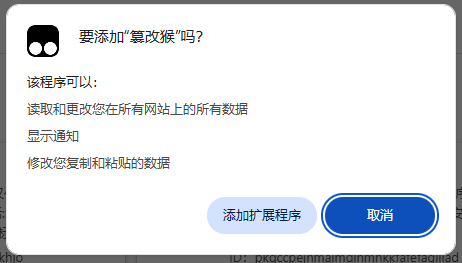

篡改猴 (Tampermonkey) 是拥有 超过 1000 万用户 的最流行的浏览器扩展之一。 它适用于 Chrome、Microsoft Edge、Safari、Opera Next 和 Firefox。

有些人也会把篡改猴(Tampermonkey)称作油猴(Greasemonkey)，尽管后者只是一款仅适用于 Firefox 浏览器的浏览器扩展程序。

它允许用户自定义并增强您最喜爱的网页的功能。用户脚本是小型 JavaScript 程序，可用于向网页添加新功能或修改现有功能。使用 篡改猴，您可以轻松在任何网站上创建、管理和运行这些用户脚本。

例如，使用 篡改猴，您可以向网页添加一个新按钮，可以快速在社交媒体上分享链接，或自动填写带有个人信息的表格。在数字化时代，这特别有用，因为网页常常被用作访问广泛的服务和应用程序的用户界面。

此外，篡改猴 使您轻松找到并安装其他用户创建的用户脚本。这意味着您可以快速轻松地访问为您喜爱的网页定制的广泛库，而无需花费数小时编写自己的代码。

无论您是希望为您的站点添加新功能的 Web 开发人员，还是只是希望 改善在线体验的普通用户，篡改猴 都是您的工具箱中的一个很好的工具。

## 安装方法（Chrome）

[油猴（tampermonkey）脚本地址](https://pan.quark.cn/s/649d24b36c30)

浏览器下载地址：[点击下载](https://pan.quark.cn/s/649d24b36c30) （chrome、Firefox、safari都在里面了，请自己行选择。）

1、打开浏览器，在地址栏输入 `chrome://extensions/` 回车打开扩展程序页面，或者按下图方法选择扩展程序：

2、直接拖拽插件进入该扩展程序页面，即可安装，如下图。

选择`添加扩展程序`，完成安装。

3、展示在浏览器上，选择扩展程序，再选择固定，固定在浏览器上，如下图：

## 使用手册