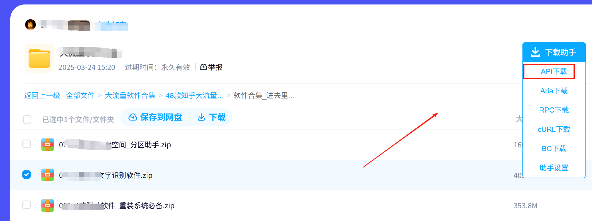

有时候找到的资源在百度网盘或夸克或其它网盘的情况下，下载速度太慢，就需要用到这个方法了；
主要解决网盘或其它下载链接过慢情况；

## 准备工作

开始之前，需要准备以下工具才能下载网盘内容

1. chrome浏览器（其它浏览器也可以，我这里是以chrome浏览器为教程讲解）
2. 油猴（tampermonkey）浏览器扩展程序
3. 网盘下载插件
4. IDM下载器

以上内容在我其它的文章都有写过

[浏览器 如何安装浏览器扩展](/article/sxzpoun8/)

[油猴（tampermonkey）脚本下载及安装使用教程](/article/i4d84ah1/)

[油猴脚本分类清单，浏览器必备的多类型油猴脚本推荐](/article/dgoha52k/)

[IDM 下载器永久免费版 网盘磁力视频资源利用](/article/u3cz9ogt/)

## 安装
1、安装chrome浏览器；
2、安装油猴（tampermonkey）浏览器扩展程序
3、安装网盘下载插件-网盘直链下载助手
4、安装IDM下载器

## 百度网盘为例

1、进入网盘，会发现网盘多个了个下载助手，选择API下载；如下图

2、在弹出的下载中，可以选择直接下载，这样一搬小文件还可以，速度也肯定比网盘快，但要更快，可以网址复制。弹出匡如下图：

当文件比较大时，我们就要使用`多线程下载器 IDM`工具进行下载了

3、打开IDM下载器

