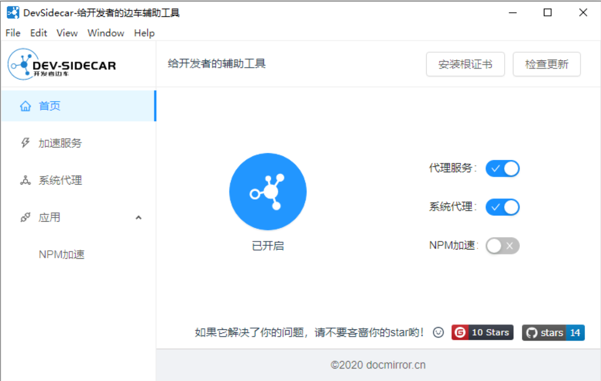
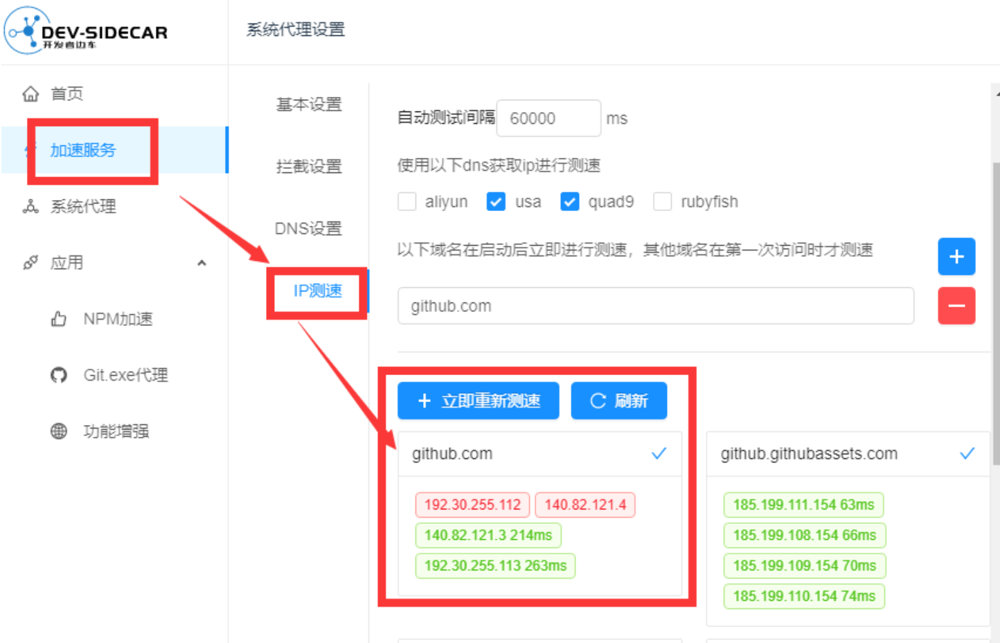

## 简介
在玩游戏时，网络慢就会用到，github则是专门对针对github这种外网打开比较慢还准备的，但他也慢慢的加了很多功以有，打游戏也可以用到了。

现在的加速器基本都能满足很多功能，该功能能够使 Steam 社区、 Github 、谷歌验证码等国内难以访问的网页正常访问。功能类似 steamcommunit302 ，使用YARP.ReverseProxy 开源项目进行本地反代。

## 下载渠道

点击以下内容获取：

[Watt Toolkit原名steam++,炽焰加速器，极狐加速器，github加速器，下载](https://pan.quark.cn/s/56c058a3cdf2)

## 一、Watt Toolkit 🧰 (原名 Steam++)

「Watt Toolkit」是一个开源跨平台的多功能游戏工具箱，此工具的大部分功能都是需要您下载安装 Steam 才能使用。

### 主要功能

**加速访问**

该功能能够使 Steam 社区、 Github 、谷歌验证码等国内难以访问的网页正常访问。功能类似 steamcommunit302 ，使用YARP.ReverseProxy 开源项目进行本地反代。 

**脚本配置**

通过加速服务拦截网络请求将一些 JS 脚本注入在网页中，提供类似网页插件的功能。
该功能内置了大量的游戏相关油猴脚本： Steam显示史低价格、一键出售 Steam 库存物品、跨区汇率换算、批量激活 CdKey 。脚本可以直接植入 Steam 客户端。

**账号切换**
一键切换已在当前 PC 上登录过的 Steam 账号，与管理家庭共享库排序及禁用等功能。

**库存管理**
让您直接管理 Steam 游戏库存，可以编辑游戏名称和自定义封面，也能解锁以及反解锁 Steam 游戏成就。支持监控 Steam 游戏下载进度实现 Steam 游戏下载完成定时关机功能。

**自动挂卡**
集成 ArchiSteamFarm 在应用内提供 挂机掉落 Steam 集换式卡牌 等功能。

**令牌管理**
该功能能够让手机令牌统一保存在电脑中，并且支持云备份，支持的令牌有 Steam 令牌、暴雪令牌、 Uplay 令牌、 Epic 令牌、 R 星令牌等常规 6 位、 8 位令牌。

**游戏工具**
强制游戏窗口使用无边框窗口化、更多功能待开发。

### 使用

选择带闪电图标，从中选择要加速的应用，在右上角选择加速，如下图：

## 二、炽焰加速器

1、海量游戏库任意畅行

炽焰加速器拥有海量游戏库，覆盖全球网游，知名新游实时收录，让您与全世界玩家站在同一起点竞技。

2、多端口多平台加速

炽焰加速器支持UPLAY、steam、EPIC、R星等多个市面主流游戏平台的加速，同时支持安卓端、IOS端等多端口加速，且PC端和移动端时长通用。

## 三、极狐加速器

1、极加速80%

顶级IDC集群，带宽专享，光纤直连，全线高端刀片服务器，为网游平均提速80%。

2、超稳定0丢包

高智能处理模块，实现0丢包损耗，节点中转行业领先。

极狐加速器官网版

3、全免费0*00

将永久免费进行到底，加速同时还能赢取积分，兑换超值游戏道具、周边。

## 四、dev-sidecar、GitHub加速器

开发者边车，命名取自service-mesh的service-sidecar，意为为开发者打辅助的边车工具
通过本地代理的方式将https请求代理到一些国内的加速通道上

### 特性

**1、 dns优选（解决***污染问题）**

- 根据网络状况智能解析最佳域名ip地址，获取最佳网络速度
- 解决一些网站和库无法访问或访问速度慢的问题
- 建议遇到打开比较慢的国外网站，可以优先尝试将该域名添加到dns设置中（注意：被***封杀的无效）

**2、 请求拦截**

- 拦截打不开的网站，代理到加速镜像站点上去。
- 可配置多个镜像站作为备份
- 具备测速机制，当访问失败或超时之后，自动切换到备用站点，使得目标服务高可用

**3、 github加速**

- github 直连加速 (通过修改sni实现，感谢 fastGithub 提供的思路)
- release、source、zip下载加速
- clone 加速
- 头像加速
- 解决readme中图片引用无法加载的问题
- gist.github.com 加速
- 解决git push 偶尔失败需要输入账号密码的问题（fatal: TaskCanceledException encountered / fatal:HttpRequestException encountered）
- raw/blame加速
