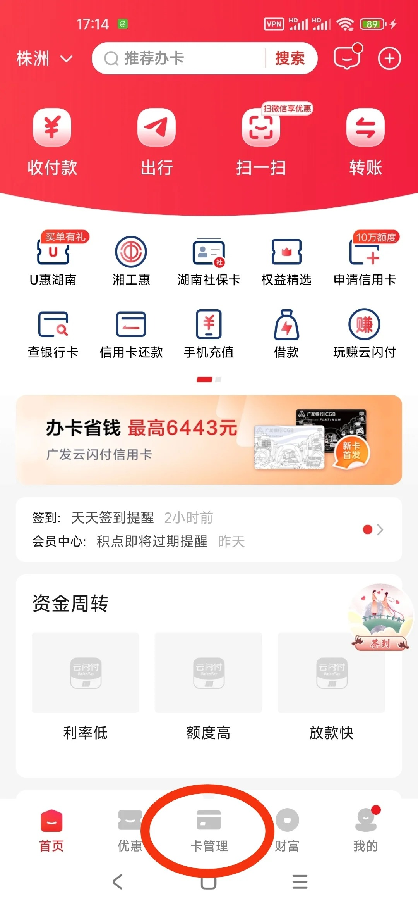
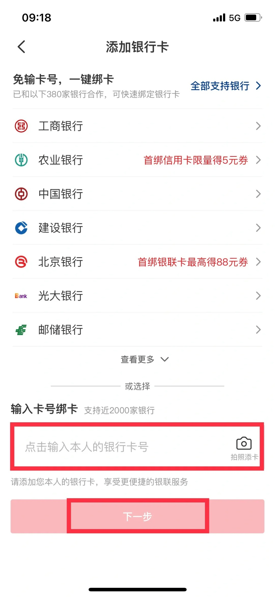
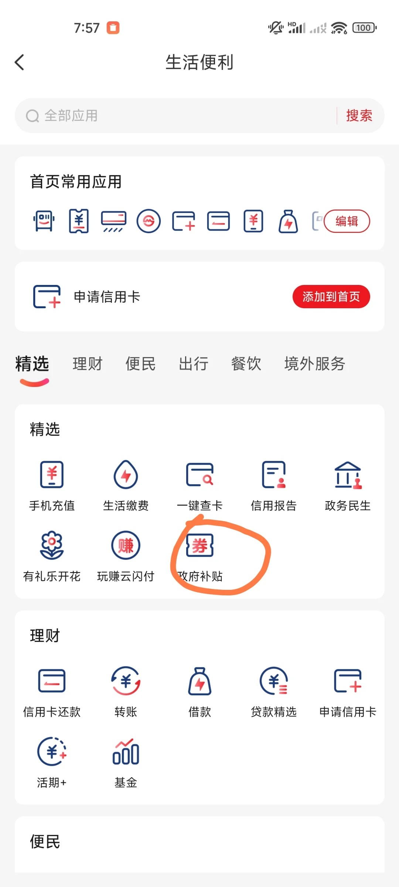
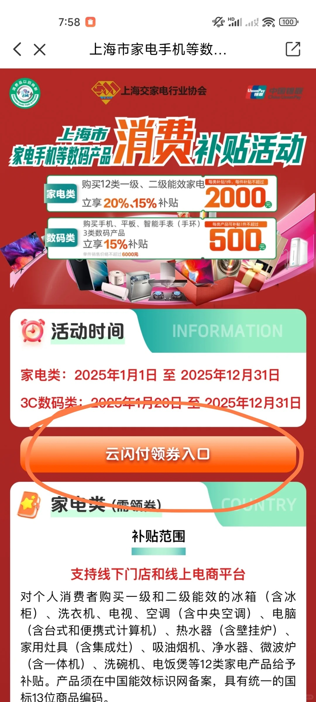
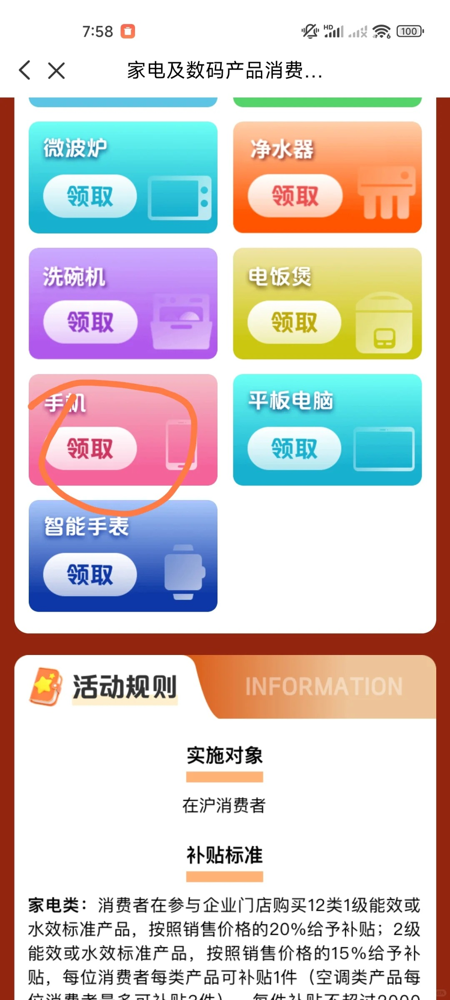
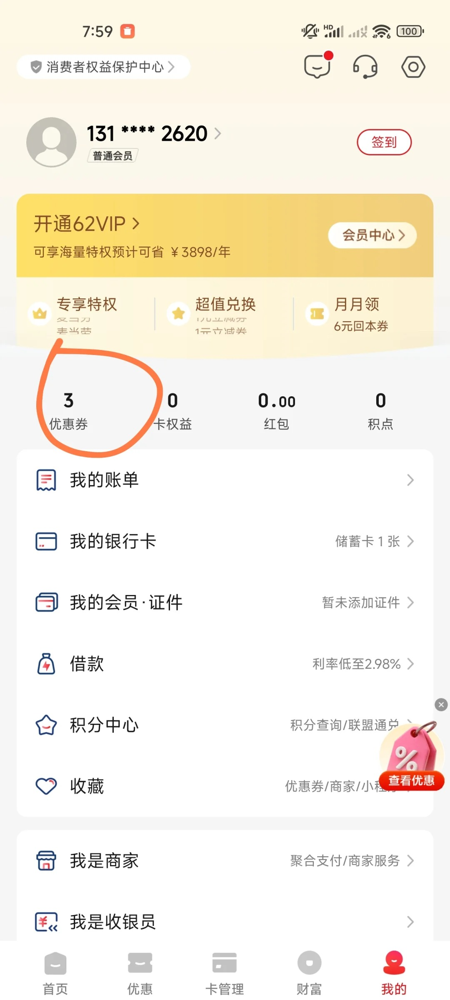
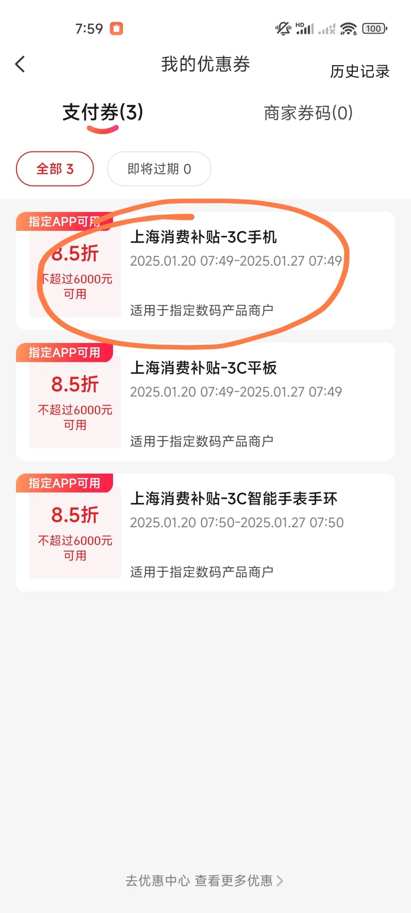
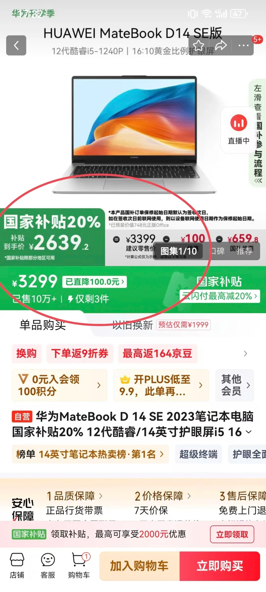
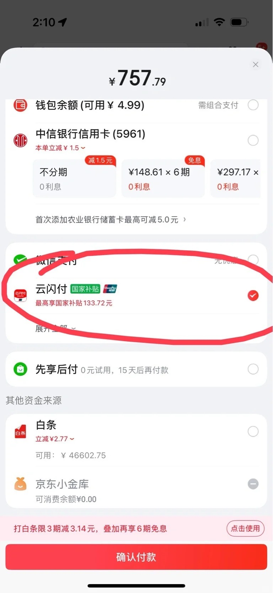

## 准备工作
领取京东、淘宝、拼多多、聚美优品、天猫等各大平台都是要去云闪寸领取，这里我们可以先下载去闪付APP，在里面领取国补，然后再去各大平台购买支持国补的商品，最后选择云闪付支付。

## 云闪付简介

### 介绍

银行业统一APP
云闪付（UnionPay）是在中国人民银行的指导下，由各家商业银行与银联共同开发建设、共同维护运营，共建共享的移动支付产品。于2017年12月11日发布。

### 银联合创
银行业统一APP是商业银行、中国银联等产业各方协力同心、共建共享的移动支付产品，是对银行业长期合作的发展深化，体现了银行业的集体智慧。商业银行与中国银联秉承“三个统一”(接口、标识、体验)原则，尊重产业各参与方诉求，并肩完成了首期联合开发。

### 便民服务
银联切实践行“支付为民”，联合产业各方积极落实移动支付便民工程建设，全面打造公交地铁、医疗健康、公共事业缴费、数字政务、校园、景区、餐饮、商超便利、企事业园区等便民场景并取得积极成效。移动支付便民工程重点打造百姓日常生活的“刚需”场景，以支付便民提升百姓美好生活新感受。

### 一网通办
云闪付APP“一网通办”应用可以查询公积金明细、教育资格证书、婚姻预约登记等政务事项，进行社保缴费、税款缴纳、非税缴款、交罚处理等事项缴费，同时提供电子健康卡、电子社保卡、健康码等合计500多项高频便民服务内容，用户只需简单几步操作即可掌上查询与缴费“一站式”服务。

## 云闪付领取操作流程：

安卓下载地址：[云闪付APP下载地址](https://pan.quark.cn/s/dc8b3d01727c)

苹果手机下载地址：[云闪付APP下载地址](https://apps.apple.com/cn/app/%E4%BA%91%E9%97%AA%E4%BB%98-%E9%93%B6%E8%A1%8C%E4%B8%9A%E7%BB%9F%E4%B8%80%E7%A7%BB%E5%8A%A8%E6%94%AF%E4%BB%98app/id600273928)

官网：[云闪付官网](https://youhui.95516.com/hybrid_v3/html/help/download.html)

再最下面，选择卡管理

填写卡号绑卡

## 领取国补

1、在最上面的栏目选择中，选择更多，如果没有选择更多，则滑动到最右则。

2、在生活便利中选择-政府补贴

3、参加活动地区中，选择你所在的地区，我这里选择上海，请按自己所在的购买地区领取。

4、选择。

5、选择领券入口

6、选择品类，按照你要购买的类型选择补贴

通过优惠券可以查看已领取的国补。

## 京东淘宝等购买操作

1、选择支持国补的商品，以下为举例，该商品支持国补。

2、支付时，选择云闪付支付

输入支付金额时，价格会比原有价格会是国补价格，说明购买条件是对的。