## 安装

先下载获取安装版：

[Axure RP11安装版](https://pan.quark.cn/s/8c3c4c266032)

一定要照着我的步骤来：

1、先选择【next】下一步

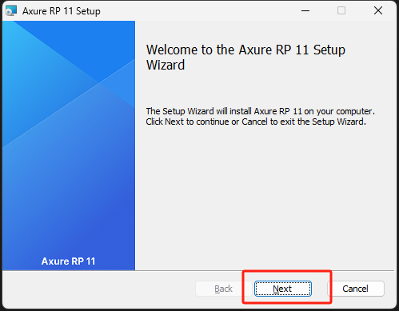

2、许可协议，勾选【I accept the terms in the License Agreement】，然后点击【Next】

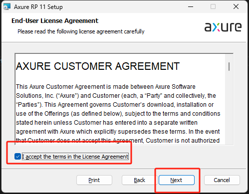

3、安装位置，一搬不修改，可以按自己的硬盘大小决定；

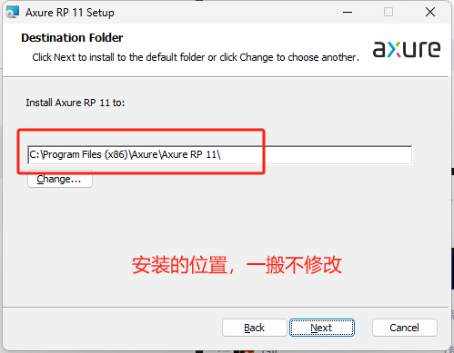

4、点击【Install】开始安装

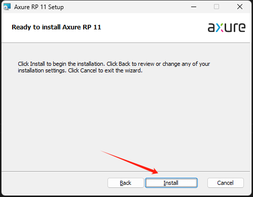

5、等待安装完成再操作：

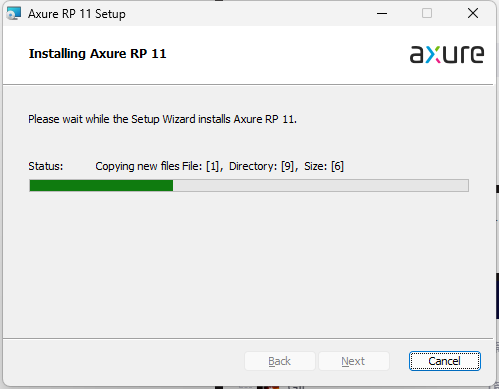

6、安装完成，勾图下的话，表示立即启动；

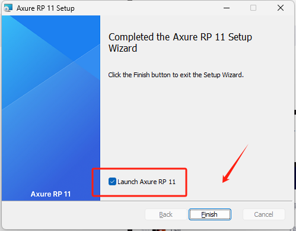

## 激活 Axure RP11

进入后，由于还没做任何操作，软件是需要激活的；

1、点击【Create an account】创建账号

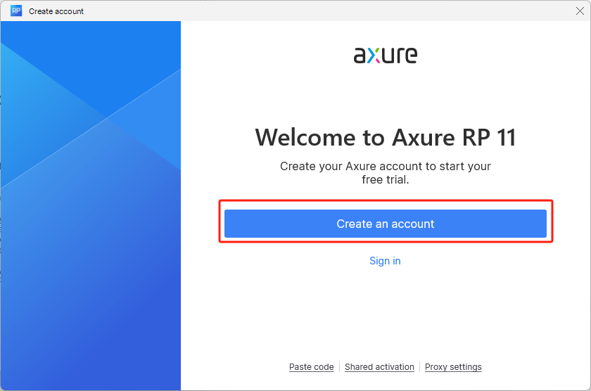

2、注册账号

如果之前已经有账号就不需要注册，如果没有需要用你的邮箱注册一下账号

注册成功后会马上弹出打开你的软件

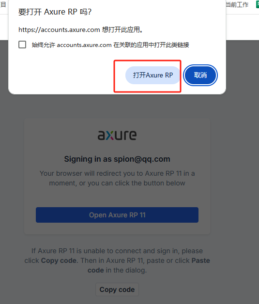

返回 Axure RP 11软件，这时候会发现按钮文字变了，点击【Continue to trial】，进入

刚开始用会有以下提示：

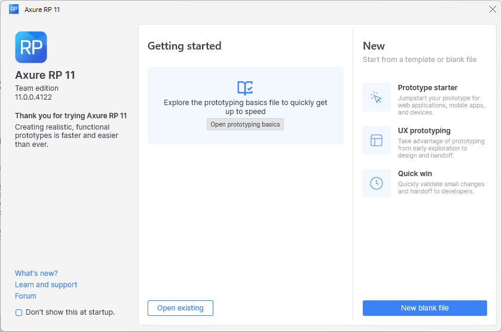

好了，软件激活成功。可以直接使用了。

## 汉化

因为全是英文的，也看不懂，，需要汉化，汉化文件已经和软件放在一起了。

找到文件安装位置将lang文件拷入进去，重新启动软件

可以看到我之前安装的路经`C:\Program Files (x86)\Axure\Axure RP 11`

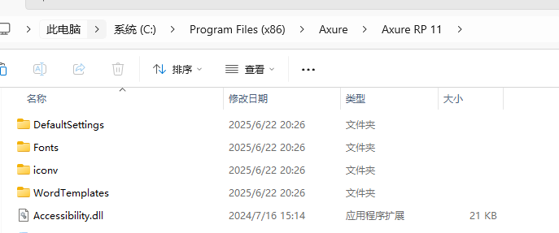

汉化后的界面：

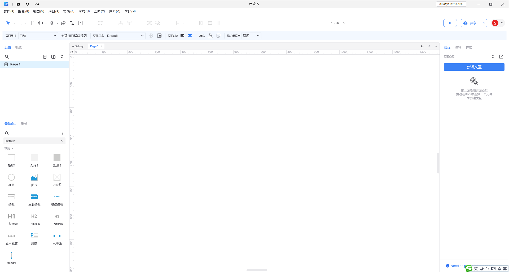

## 授权

如果这个失效了可以自己在网上找授权码就好了，然后填进去就好了

因为授权码一直失败，文章又不可能一直更新，如果不能用了，可以去我分享的网盘地址中获取

- 61fc6a67b014457d81854b3df84ed549

授权方法：

选择帮助 - 管理授权

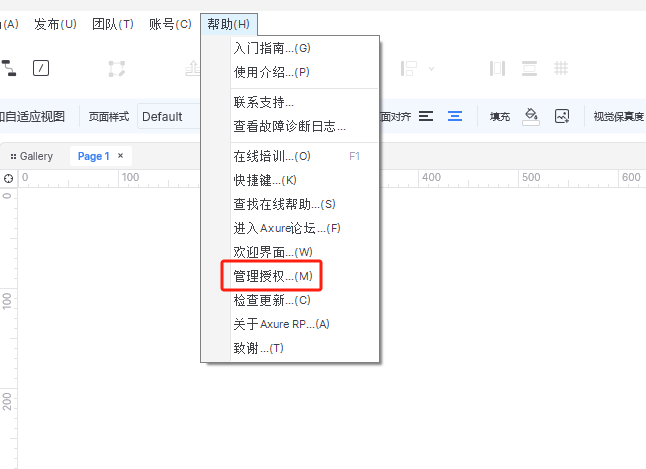

选择使用共享的激活码

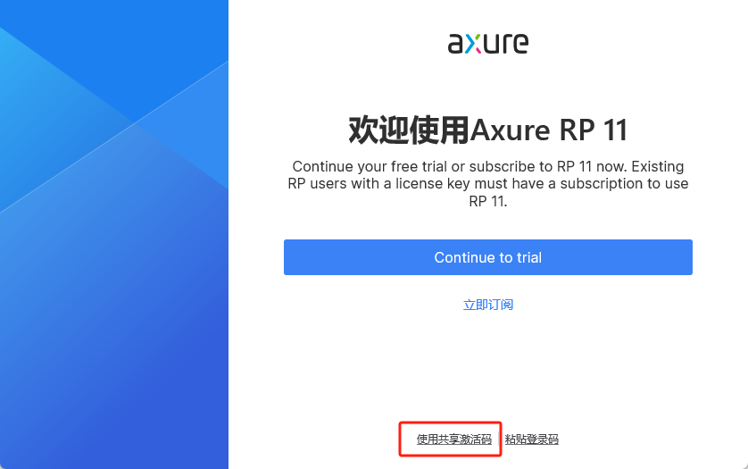

输入激活码使用

