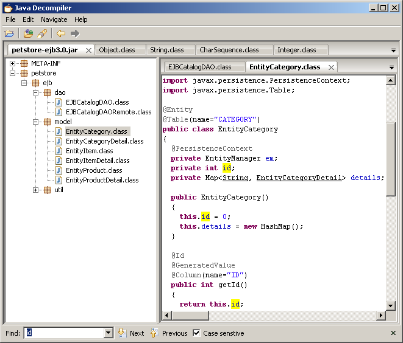
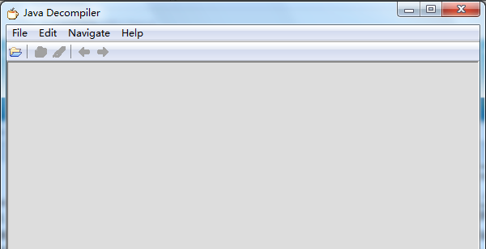
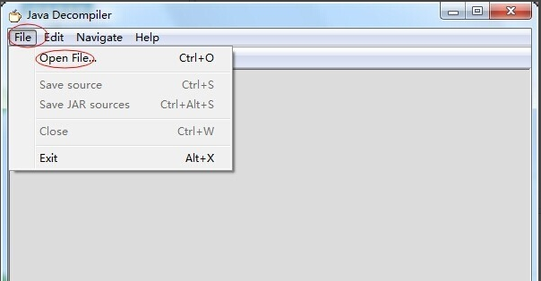
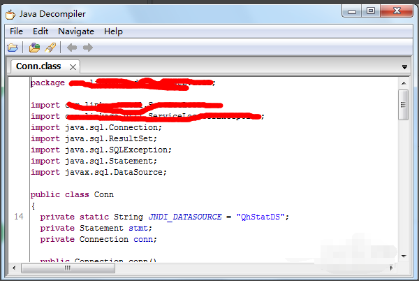
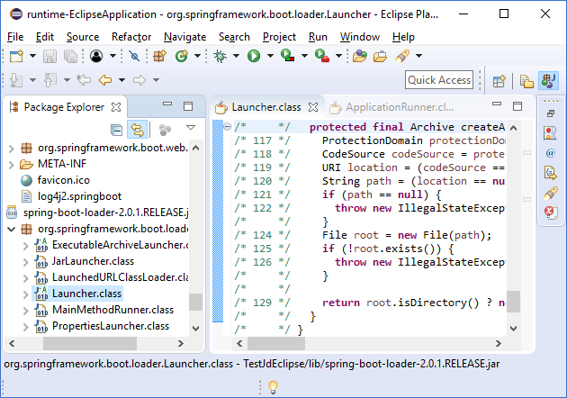

## 软件简介

Java Decompiler （ JD-GUI ）这款反编译器叫 "Java Decompiler", 由 Pavel Kouznetsov 开发，目前最新版本为 1.1.0. 它由 groovy 开发，并且官方可以下载 windows、linux 和苹果 Mac Os 三个平台的可执行程序。

官网：[github.io](https://java-decompiler.github.io/)

如果下载慢，我整到这里了，点开链接下载：[java-decompliler所有平台版本](https://pan.quark.cn/s/804dc21c60b1)

## 安装

**1.下载java反编译工具软件，进行安装**

**2.双击打开，打开后的界面如下图，一目了然吧？界面很简洁，虽然是英文，但是难不倒大家的**

** 3.通过file-》open file打开你想反编译的class文件**

 

**4.打开，马上看到了你熟悉的java代码了。简单吧？**

ava反编译工具(java decompiler )实现了eclipse的高亮着色功能，多文件标签浏览,Java反编译工具还可以很方便的反编译Java5以及以上版本生成的.class文件，软件界面友好，操作起来非常简单，java反编译工具是一款非常实用的工具。

其有下面几个功能：

  1. 支持对整个 Jar 文件进行反编译，并本源代码可直接点击进行相关代码的跳转
  2. 支持众多 Java 编译器的反编译 (支持泛型， Annotation 和 enum 枚举类型)

- jdk1.1.8

- jdk1.3.1

- jdk1.4.2

- jdk1.5.0

- jdk1.6.0

- jikes-1.22

- harmony-jdk-r533500

- Eclipse Java Compiler v_677_R32x, 3.2.1 release

- jrockit90_150_06

## java反编译工具常见问答

 ### 一、什么是JD-GUI？

 1JD-GUI是一个独立的图形实用程序，显示“.class”文件的Java源代码。您可以使用JD-GUI浏览重建的源代码，以便即时访问方法和字段。

### 二、程序可以反编译岂不是很不安全？

 1、可以采用代码混淆等技术来加大反编译的难度和降低反编译代码的可读性，但是完全避免反编译是不可能的。

## 三、java反编译工具的原理是什么？

 由于Java、.net这样的基于虚拟机技术的语言都是采用了ByteCode的二进制结构，因此很容易将ByteCode转化为“抽象语法树”（简称AST，《编译原理》这门课中的概念），然后采用反编译器就可以将AST转换为代码了。

java反编译工具更新日志

 1、修正了“.class”表达式的识别错误。

 2、修正错误识别“开关枚举”指令。

 3、用已知的数字常量（例如Long.MAX_VALUE）替换数值。

 4、删除了不必要的“java.lang”前缀。

 5、修正了在最后位置上包含三元运算符的try-cacht语句的识别错误。

 6、添加了返回的通用变量的转换说明。

 7、隐藏匿名类的合成字段。

 8、在内部，改进的JD-Core内存管理（复杂的智能指针C ++ 11由基本但非常高效的内存池替代）