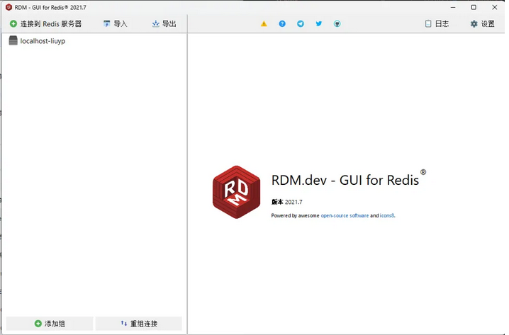

## 介绍

Redis桌面管理器（又名RDM） - 是一个用于Windows，Linux和MacOS的快速开源Redis数据库管理应用程序。

该工具为您提供了一个易于使用的GUI，可以访问您的Redis数据库并执行一些基本操作：将键视为树，CRUD键，通过shell执行命令。

RDM支持SSL / TLS加密，SSH隧道，基于SSH隧道的TLS（带有In-Transit加密的AWS ElastiCache）和云Redis实例，例如：Amazon ElastiCache，Microsoft Azure Redis Cache和Redis Labs

## 安装

[RedisDesktopManager早期免费版](https://pan.quark.cn/s/dfee2f17d1ef)

就只有一个文件，因为是早期的免费版，双击安装就可以打开了。



## Redis 教程

#### 键（Key）操作命令


```
KEYS pattern          # 查找所有符合给定模式的键
EXISTS key            # 检查键是否存在
DEL key [key ...]     # 删除一个或多个键
EXPIRE key seconds    # 为键设置过期时间（秒）
TTL key               # 查看键的剩余过期时间
PERSIST key           # 移除键的过期时间
TYPE key              # 返回键所存储的值的类型
```

#### 字符串（String）操作命令


```
SET key value         # 设置键值对
GET key               # 获取键对应的值
GETSET key value      # 设置新值并返回旧值
INCR key              # 将键值递增1
DECR key              # 将键值递减1
INCRBY key increment  # 将键值增加指定的整数
DECRBY key decrement  # 将键值减少指定的整数
APPEND key value      # 在键值末尾追加内容
STRLEN key            # 返回键值的长度
```

#### 哈希（Hash）操作命令


```
HSET key field value  # 设置哈希表中的字段值
HGET key field        # 获取哈希表中指定字段的值
HMSET key field value [field value ...]  # 同时设置多个字段值
HMGET key field [field ...]  # 获取多个字段的值
HGETALL key           # 获取哈希表中所有字段和值
HKEYS key             # 获取哈希表中所有字段
HVALS key             # 获取哈希表中所有值
HLEN key              # 获取哈希表中字段的数量
HDEL key field [field ...]  # 删除哈希表中的一个或多个字段
```

#### 列表（List）操作命令


```
LPUSH key value [value ...]  # 在列表左侧插入一个或多个值
RPUSH key value [value ...]  # 在列表右侧插入一个或多个值
LPOP key                      # 从列表左侧弹出一个值
RPOP key                      # 从列表右侧弹出一个值
LLEN key                      # 获取列表长度
LRANGE key start stop         # 获取列表指定范围内的元素
LTRIM key start stop          # 只保留列表指定范围内的元素
LINDEX key index              # 通过索引获取列表中的元素
LSET key index value          # 通过索引设置列表元素的值
LREM key count value          # 移除列表中指定值的元素
```

#### 集合（Set）操作命令


```
SADD key member [member ...]  # 向集合添加一个或多个成员
SREM key member [member ...]  # 移除集合中一个或多个成员
SMEMBERS key                  # 获取集合中所有成员
SISMEMBER key member          # 判断成员是否在集合中
SCARD key                     # 获取集合中成员的数量
SPOP key [count]              # 随机弹出一个或多个成员
SRANDMEMBER key [count]       # 随机获取一个或多个成员
SUNION key [key ...]          # 返回多个集合的并集
SINTER key [key ...]          # 返回多个集合的交集
SDIFF key [key ...]           # 返回多个集合的差集
```

#### 有序集合（Sorted Set）操作命令


```
ZADD key score member [score member ...]  # 向有序集合添加一个或多个成员
ZREM key member [member ...]  # 移除有序集合中一个或多个成员
ZRANGE key start stop [WITHSCORES]  # 获取有序集合指定范围内的成员
ZREVRANGE key start stop [WITHSCORES]  # 获取有序集合指定范围内的成员（降序）
ZRANGEBYSCORE key min max [WITHSCORES] [LIMIT offset count]  # 根据分数范围获取成员
ZREVRANGEBYSCORE key max min [WITHSCORES] [LIMIT offset count]  # 根据分数范围获取成员（降序）
ZCARD key                     # 获取有序集合成员数量
ZSCORE key member             # 获取有序集合成员的分数
ZINCRBY key increment member  # 增加有序集合成员的分数
ZRANK key member              # 获取有序集合成员的排名（升序）
ZREVRANK key member           # 获取有序集合成员的排名（降序）
```

#### 发布/订阅（Pub/Sub）命令

```
PUBLISH channel message       # 发布消息到指定频道
SUBSCRIBE channel [channel ...]  # 订阅一个或多个频道
UNSUBSCRIBE [channel [channel ...]]  # 取消订阅一个或多个频道
PSUBSCRIBE pattern [pattern ...]  # 订阅符合指定模式的频道
PUNSUBSCRIBE [pattern [pattern ...]]  # 取消订阅符合指定模式的频道
PUBSUB subcommand [argument [argument ...]]  # 查看发布/订阅系统状态
```

#### 事务命令


```
MULTI                   # 标记一个事务块的开始
EXEC                    # 执行所有事务块内的命令
DISCARD                 # 取消事务，放弃执行事务块内的所有命令
WATCH key [key ...]     # 监视一个或多个键，若在事务执行前被修改，事务将被打断
UNWATCH                 # 取消 WATCH 命令对所有键的监视
```

#### 服务器命令


```
PING                    # 测试连接是否存活
INFO [section]          # 获取服务器信息
CONFIG GET parameter    # 获取服务器配置参数
CONFIG SET parameter value  # 设置服务器配置参数
FLUSHDB                 # 删除当前数据库中的所有键
FLUSHALL                # 删除所有数据库中的所有键
SHUTDOWN [NOSAVE] [SAVE]  # 关闭服务器
BGSAVE                  # 异步保存数据到磁盘
SAVE                    # 同步保存数据到磁盘
LASTSAVE                # 获取最后一次成功将数据保存到磁盘的时间
```

