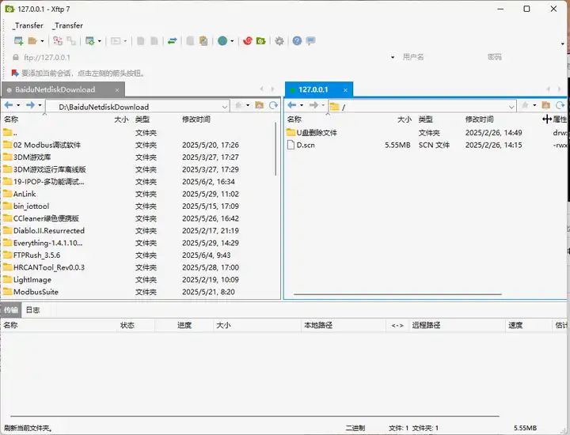

FTP（文件传输协议）是我们日常使用比较广泛的一款服务，无论个人还是企业都可以搭建属于自己的FTP服务器，用以存储并上传下载数据。下面我们就以非常著名的server-u为例来演示如何搭建FTP服务器。

## 地址

所有地址都放在网盘里了，直接获取

[FileZilla等上传工具总目录下载](https://pan.quark.cn/s/4a9eaf35976c)

## 一、FileZilla

免费开源的FileZilla在FTP软件这块领域中肯定算的上，很多FTP工具都是抄袭FileZilla，换个皮。

FileZilla比其他任何一款FTP软件都要简单,同类软件排第一，这个应该没人反驳吧！

FileZilla是一个免费开源的FTP软件，分为客户端版本和服务器版本，具备所有的FTP软件功能。服务器版本可以将自己的电脑会变成一个文件分享站点，方便分发文件。我们使用的是客户端版本，用来下载数据，Filezilla支持Windows，MacOS以及Linux全平台，下载安装都比较简单（有免安装版本）。

### 安装

FileZilla客户端开箱即用，无需安装，非常方便。

点击`filezilla.exe`即可启动客户端。

整体界面：

filezilla客户端的连接默认是需要账号和密码的。

第1步：服务端设置账号和密码

第2步：设置共享文件夹

另外还可以分别设置文件、目录的权限。

别忘记设置主目录了。

第3步：设置成功后，客户端登录时端口默认是`21`,可以不输入。

已成功连接到服务端，读取目录成功

## 二、FlashFxp

flashfxp是功能强大的FXP/FTP软件，融合了一些其他优秀FTP软件的优点，如像CuteFTP一样可以比较文件夹，支持彩色文字显示;像BpFTP支持多文件夹选择文件，能够缓存文件夹;像LeapFTP一样的外观界面。

### 安装步骤

1、在上面的地址中下载最新安装包，按提示安装，因为是绿色软件，所以无需安装，双击就可以了

下面箭头有对应的激活码，可以直接使用会员功能。

最后效果，可以去关于中查看

## 三、FTPRush

运行在微软Windows平台的高性能 FTP/FXP/SFTP/TFTP 客户端

FTPRush是一个运行在微软Windows平台的高性能 FTP/FXP/SFTP/TFTP 客户端，您可以使用FTPRush来进行文件上传下载和服务器对服务器传输. FTPRush支持完全的界面自定义，您可以定制出你喜欢的界面布局和风格. 通过内置的脚本功能您还可以轻松地制作自动化任务.

### 安装
和上面的一样，基本都是双击运行

功能：

一个高性能的FTP客户端, 通过它你可以轻松地上传下载和FXP(Ftp服务器之间的文件传输), 完全多线程的构造, 让你自由自在地存取FTP服务器的资源。主要的特性：连接到多个ftp服务器、支持Ftp代理、脚本支持、多语言支持、容易使用、自动CRC校验、支持mIRC宣告。

站点链接管理：

安全的文件传输

★支持SSL 加密连接: AUTH SSL, AUTH TLS, Implicit SSL.

★支持多个连接到不同的FTP服务器.

## 四、XFTP

Xftp是一个功能强大的SFTP、FTP 文件传输软件。使用了 Xftp 以后，MS Windows 用户能安全地在 UNIX/Linux 和 Windows PC 之间传输文件。Xftp 能同时适应初级用户和高级用户的需要。它采用了标准的 Windows 风格的向导，它简单的界面能与其他 Windows 应用程序紧密地协同工作，此外它还为高级用户提供了众多强劲的功能特性。

用户界面

用户界面直观，你应该能够很好地使用这个程序。它采用Windows 风格制作向导。可以很好地与其他软件融合。

### 安装
安装同上，双击运行

便携版本是7.0版本，完全免费，开箱即用，点击Xftp.exe即可运行。

为了创建一个新的会话交换文件通过网络，你应该输入一个文件的名称、一个主机名或IP地址、一个适当的协议、远程服务器使用的端口号、和一个用户帐户。

您可以从本地文件夹窗口选择您要转移的文件或直接将其拖拽到主窗口。 您可以使用超过两个窗格。每个窗格都可能包含多个选项卡，因此多个会话可以在单个Xftp窗口打开，方便多任务同时处理。

转输效果还可以

## 五、CuteFtp

CuteFTP，FTP工具之一，与LeapFTP与FlashFXP并称 FTP 三剑客。其传输速度比较快，但有时对于一些教育网FTP 站点却无法连接；速度稳定，能够连接绝大多数 FTP 站点（包括一些教育网站点）；CuteFTP 虽然相对来说比较庞大，但其自带了许多免费的 FTP 站点，资源丰富。

### 安装
安装同上

假设您的虚拟主机的ip地址是“116.252.97.41”，ftp用户名是“aiwangluo”，ftp密码是“aiwl33”，将文件“index.htm ”上传到服务器，那么请按如下步骤操做：

cuteFTP在下载或上传文件的时候容易遇到下载错误或者上传错误，此类问题一般是服务器上的文件正在使用或文件过大导致的。解决此类问题我们可以用一些辅助软件解决，例如网络人软件。网络人软件可以直接上传下载服务器上的文件，即使服务器正在使用此文件，或者是上G的大文件都可以下载。

## 六、WinSCP

WinSCP是一个Windows环境下使用SSH的开源图形化SFTP客户端。同时支持SCP协议。它的主要功能就是在本地与远程计算机间安全的复制文件。winscp也可以链接其他系统,比如linux系统。

WinSCP可以执行所有基本的文件操作，例如下载和上传。同时允许为文件和目录重命名、改变属性、建立符号链接和快捷方式。

### 安装
安装同上

两种可选界面允许用户管理远程或本地的文件。

### 连接到远程计算机
使用WinSCP可以连接到一台提供SFTP (SSH File Transfer Protocol)或SCP (Secure Copy Protocol)服务的SSH (Secure Shell)服务器，通常是UNIX服务器。SFTP包含于SSH-2包中，SCP在SSH-1包中。两种协议都能运行在以后的SSH版本之上。WinSCP同时支持SSH-1和SSH-2。

## 七、3CDaemon

3CDaemon是一款高效实用的TFTP（Trivial File Transfer Protocol）服务器模拟软件，特别适合在中文环境下使用。它提供了一种轻量级的文件传输服务，尤其适用于网络设备配置、固件更新以及嵌入式系统的开发和调试。TFTP协议比FTP（File Transfer Protocol）更为简单，通常用于不需要复杂身份验证和目录浏览功能的场景。

## 八、Serv-U-FTP服务器

FTP的全称是File Transfer Protocol(文件传输协议)。　顾名思义，就是专门用来传输文件的协议。而FTP服务器，则是在互联网上提供存储空间的计算机，它们依照FTP协议提供服务。当它们运行时，用户就可以连接到服务器上下载文件，也可以将自己的文件上传到FTP服务器中。

Serv-U FTP服务器软件是一种被广泛运用的FTP服务器端软件，支持3x/9x/ME/NT/2K等全Windows系列。可以设定多个FTP服务器、限定登录用户的权限、登录主目录及空间大小等，功能非常完备。 它具有非常完备的安全特性，支持SSL FTP传输，支持在多个Serv-U和FTP客户端通过SSL加密连接保护您的数据安全等。　

Serv-U 是目前众多的FTP 服务器软件之一。通过使用Serv-U，用户能够将任何一台PC 设置成一个FTP 服务器，这样，用户或其他使用者就能够使用FTP 协议，通过在同一网络上的任何一台PC与FTP 服务器连接，进行文件或目录的复制，移动，创建，和删除等。这里提到的FTP 协议是专门被用来规定计算机之间进行文件传输的标准和规则，正是因为有了像FTP 这样的专门协议，才使得人们能够通过不同类型的计算机，使用不同类型的操作系统，对不同类型的文件进行相互传递。

虽然目前FTP 服务器端的软件种类繁多，相互之间各有优势，但是Serv-U 凭借其独特的功能得以展露头脚。

## 九、WingFtpServer

Wing FTP Server，是一个专业的跨平台FTP服务器端，它拥有不错的速度、可靠性和一个友好的配置界面。它除了能提供FTP的基本服务功能以外，还能提供管理员终端、任务计划、基于Web的管理端，基于Web的客户端和Lua脚本扩展等，它还支持虚拟文件夹、上传下载比率分配、磁盘容量分配，ODBC/Mysql存储账户等特性，支持Windows、Linux、MacOS和Solaris等操作系统。

### 其他

其它几款都在压缩包里了，方法都一样，就不去讲解了。