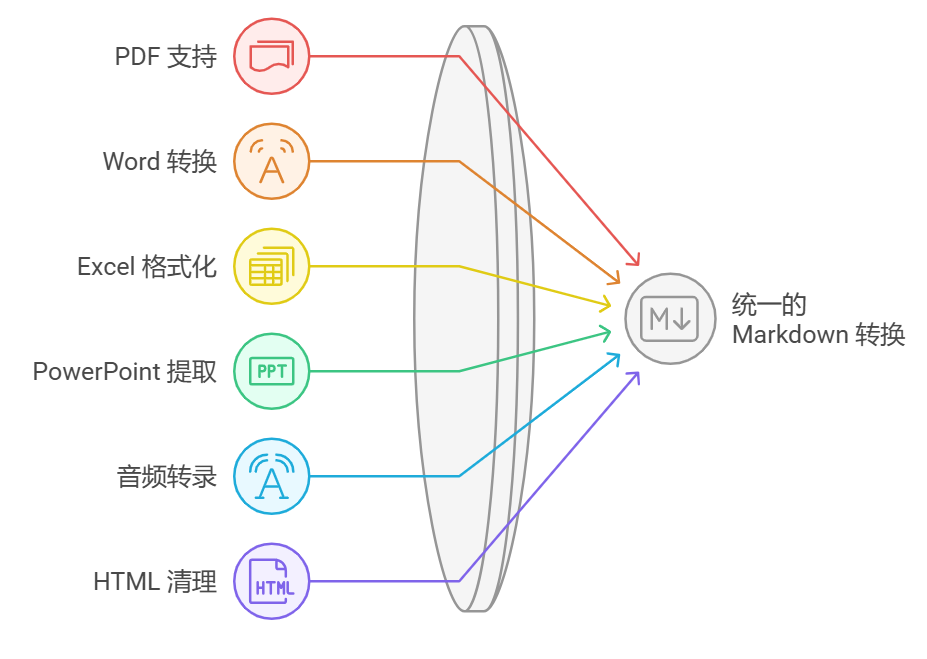

开源项目推荐`MarkItDown`，多种办公文件转Markdown，支持MCP

MarkItDown 是一个轻量级的 Python 实用程序，用于将各种文件转换为 Markdown，它最类似于 textract，但注重保留重要的文档结构和内容为 Markdown 格式（包括：标题、列表、表格、链接等）。

地址：[https://github.com/microsoft/markitdown](https://github.com/microsoft/markitdown)

MarkItDown 目前支持的转换格式包括：

- PDF
- PowerPoint
- Word
- Excel
- 图片（EXIF 元数据和 OCR）
- 音频（EXIF 元数据和语音转录）
- HTML
- 基于文本的格式（CSV、JSON、XML）
- ZIP 文件（迭代内容）
- YouTube 链接
- 电子书（EPubs）


## 安装

要安装 MarkItDown，请使用 pip: pip install 'markitdown[all]'。或者，您可以从源代码安装它：

```bash
git clone git@github.com:microsoft/markitdown.git
cd markitdown
pip install -e 'packages/markitdown[all]'
```

## 用法
命令行

```bash
markitdown path-to-file.pdf > document.md
```

或者使用-o指定输出文件：

```bash
markitdown path-to-file.pdf -o document.md
```

您还可以通过管道传输内容：

```bash
cat path-to-file.pdf | markitdown
```

可选依赖项
MarkItDown 具有用于激活各种文件格式的可选依赖项。在本文档的前面部分，我们已使用该选项安装了所有可选依赖项。但是，您也可以单独安装它们以获得更好的控制。例如：

```bash
pip install 'markitdown[pdf, docx, pptx]'
```

将仅安装 PDF、DOCX 和 PPTX 文件的依赖项。

目前，有以下可选依赖项可用：

- [all]安装所有可选依赖项
- [pptx]安装 PowerPoint 文件的依赖项
- [docx]安装 Word 文件的依赖项
- [xlsx]安装 Excel 文件的依赖项
- [xls]安装旧 Excel 文件的依赖项
- [pdf]安装 PDF 文件的依赖项
- [outlook]安装 Outlook 消息的依赖项
- [az-doc-intel]安装 Azure 文档智能的依赖项
- [audio-transcription]安装 wav 和 mp3 文件的音频转录依赖项
- [youtube-transcription]安装用于获取 YouTube 视频转录的依赖项




## 插件

MarkItDown 还支持第三方插件。默认情况下，插件处于禁用状态。要列出已安装的插件：

```bash
markitdown --list-plugins
```

要启用插件，请使用：

```bash
markitdown --use-plugins path-to-file.pdf
```

要查找可用的插件，请在 GitHub 上搜索标签`#markitdown-plugin`。要开发插件，请参阅`packages/markitdown-sample-plugin`。

## Azure 文档智能
要使用 `Microsoft Document Intelligence` 进行转换：

```bash
markitdown path-to-file.pdf -o document.md -d -e "<document_intelligence_endpoint>"
```

有关如何设置 Azure 文档智能资源的更多信息，请参见此处

## Python API
Python中的基本用法：

```bash
from markitdown import MarkItDown

md = MarkItDown(enable_plugins=False) # Set to True to enable plugins
result = md.convert("test.xlsx")
print(result.text_content)
```

Python 中的文档智能转换：

```bash
from markitdown import MarkItDown

md = MarkItDown(docintel_endpoint="<document_intelligence_endpoint>")
result = md.convert("test.pdf")
print(result.text_content)
```

要使用大型语言模型进行图像描述，请提供llm_client和llm_model：

```bash
from markitdown import MarkItDown
from openai import OpenAI

client = OpenAI()
md = MarkItDown(llm_client=client, llm_model="gpt-4o")
result = md.convert("example.jpg")
print(result.text_content)
```

### Docker

```bash
docker build -t markitdown:latest .
docker run --rm -i markitdown:latest < ~/your-file.pdf > output.md

```
