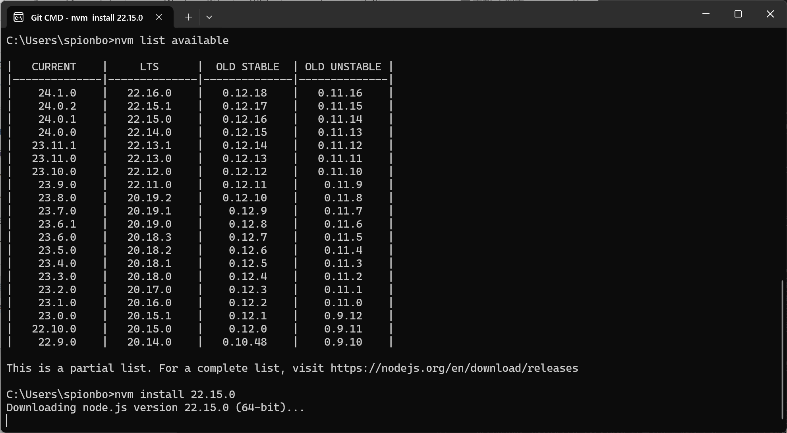

## 简介
Node Version Manager（NVM）是一个常用的 Node.js 版本管理工具，可用于在开发过程中方便地切换不同版本的 Node.js。通过 NVM，用户可以根据项目需求选择不同的 Node.js 版本，而无需手动安装和卸载多个版本的 Node.js。

## 安装

**下载NVM**

点击以下进行下载：

[「nvm安装nodejs版本管理器」](https://pan.quark.cn/s/6af99d8a3e0a)

---

!!!!注意：为了避免版本冲突和环境混乱，在安装 `nvm` 之前先卸载之前安装的 `Node.js`。

删除 `node.js` 相关的目录。
查看 C:\Users\用户名 目录下是否拥有 `.npmrc`、`.yarnrc` 等都要进行删除。
查看环境变量中是否拥有关于 `node.js` 相关的配置也要进行相应的删除。

1. 选择 `nvm` 安装路径

2. 选择 `node.js` 安装路径

3. 之后就是一直 `next`

4. 检测是否安装成功

通过 `nvm version` 命令查看版本号

```bash
nvm version
```

## 配置
安装 `node`
1. 查看可安装 `node` 版本

```bash
nvm list available
```
展示效果如以下图



2. 安装相应的 `node` 版本，这里我安装的是`22.15.0`，可以按个人需要安装自己的版本

```bash
nvm install <version>
```


3. 查看已安装 `node` 版本

```bash
nvm list
```

目前已经安装了指定版本的 `node`，但是是无法使用的，可以通过 `node -v` 看到提示没有 `node` 命令。因为我们还没有切换到此 `node` 版本。

## 切换 node 版本


```bash
nvm use <version>
```

比如我切换到我的版本: 
```bash
nvm use 22.15.0
```

通过切换相应的 `node` 版本，我们就可以使用 `node` 了，通过 `node -v` 命令进行测试，可以看到输出了 node 的版本号。

之后我们再通过 nvm list 查看已经安装的 node 版本，可以看到我们这个版本前拥有一个 * 符号表示我们当前的版本是这个。


## nvm 命令的使用


nvm arch：显示node是运行在32位还是64位。

`nvm install <version> [arch]` ：安装node， version是特定版本也可以是最新稳定版本latest。可选参数arch指定安装32位还是64位版本，默认是系统位数。可以添加--insecure绕过远程服务器的SSL。

`nvm list [available]` ：显示已安装的列表。可选参数available，显示可安装的所有版本。list可简化为ls。

`nvm ls`或`nvm list` ：显示已安装的列表。

`nvm on` ：开启node.js版本管理。

`nvm off` ：关闭node.js版本管理。

`nvm proxy` [url] ：设置下载代理。不加可选参数url，显示当前代理。将url设置为none则移除代理。

`nvm node_mirror` [url] ：设置node镜像。默认是https://nodejs.org/dist/。如果不写url，则使用默认url。设置后可至安装目录settings.txt文件查看，也可直接在该文件操作。

`nvm npm_mirror` [url] ：设置npm镜像。https://github.com/npm/cli/archive/。如果不写url，则使用默认url。设置后可至安装目录settings.txt文件查看，也可直接在该文件操作。

`nvm uninstall <version>` ：卸载指定版本node。

`nvm use [version] [arch]` ：使用制定版本node。可指定32/64位。

`nvm root [path]` ：设置存储不同版本node的目录。如果未设置，默认使用当前目录。

`nvm version` 或`nvm v`或`nvm -v`：显示nvm版本。version可简化为v。