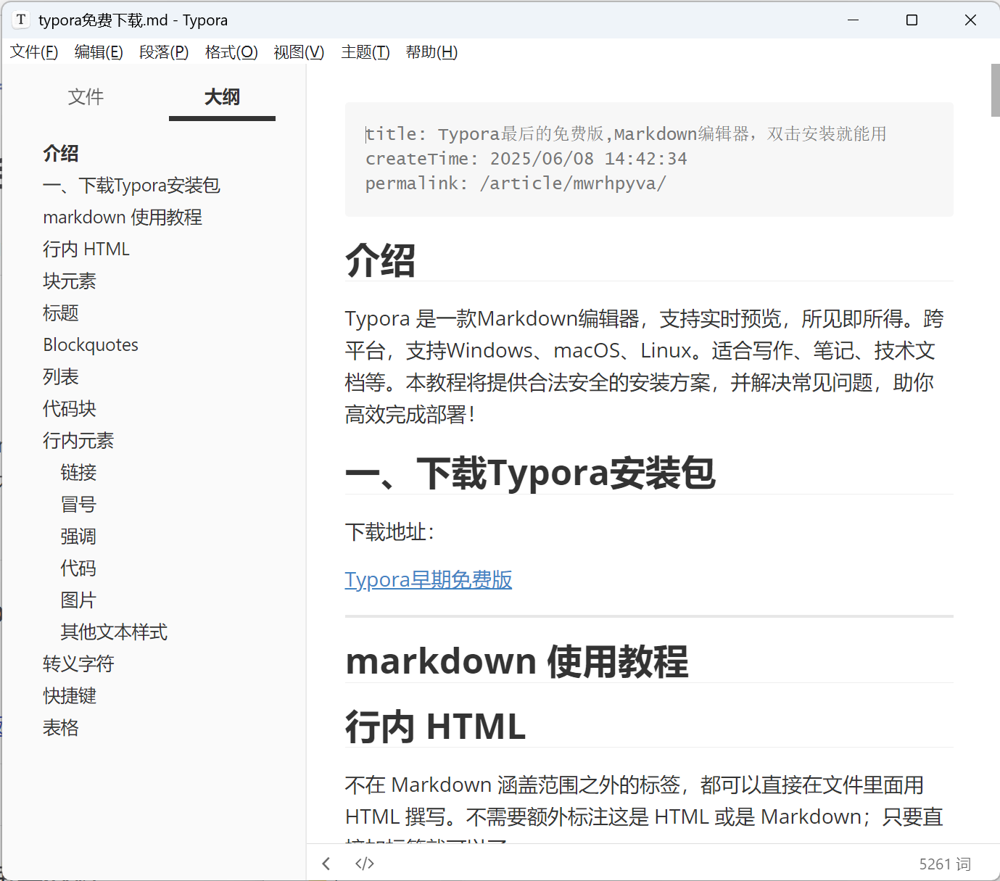

## 介绍
Typora 是一款Markdown编辑器，支持实时预览，所见即所得。跨平台，支持Windows、macOS、Linux。适合写作、笔记、技术文档等。本教程将提供‌合法安全‌的安装方案，并解决常见问题，助你高效完成部署！

## 一、下载Typora安装包

下载地址：

[Typora早期免费版](https://pan.quark.cn/s/d48c21f5c4cc)

---

## 安装

安装没有什么多余选项，基本就是下一步下一步的选择操作就可以使用了。

附markdown文件打开界面：



## markdown 使用教程
### 1. 标题 (让你的文章有层级)
这样写：

# 我是一级标题 (最大号)
## 我是二级标题
### 我是三级标题 (小一点)
#### 再小一点...
看起来像这样：

我是一级标题 (最大号)
我是二级标题
我是三级标题 (小一点)
再小一点...

### 2. 加粗和斜体 (突出重点)

这样写：

*这是斜体文字*
**这是加粗文字**
***又粗又斜***
看起来像这样：

这是斜体文字

这是加粗文字

又粗又斜

### 3. 列表 (让内容更有条理)

无序列表 (用 - 或 * 或 + 都行，后面加空格)
这样写：

- 苹果
- 香蕉
  - 黄香蕉 (可以缩进变子项)
- 橘子
看起来像这样：

苹果
香蕉
黄香蕉 (可以缩进变子项)
橘子
有序列表 (用 数字.，后面加空格)
这样写：

1. 起床
2. 吃饭
3. 写 Markdown
看起来像这样：

起床
吃饭
写 Markdown

### 4. 链接 (跳转到其他地方)

这样写： [你想显示的文字](你的链接地址)


点我访问知乎

### 5. 图片 (插入图片)
这样写： !\[图片描述(可以不写)\]\(图片链接地址\)

!\[知乎 Logo\]\(https://xxx.jpg\)
看起来像这样：

(如果图片加载失败，会显示 "知乎 Logo")

### 6. 引用 (引用别人的话)
这样写： 在文字前加 > 和一个空格

> 这是引用的内容。
>
> 可以有多行。
看起来像这样：

这是引用的内容。
可以有多行。
### 7. 代码 (展示代码片段)
行内代码 (一小段代码)
这样写： 用反引号 ``` 把代码包起来

像这样 `var message = "Hello";` 放在句子里。
看起来像这样：

像这样 var message = "Hello"; 放在句子里。

代码块 (多行代码)
这样写： 用三个反引号 ``` 包裹代码，可以写上语言名字（如python,javascript`）

```javascript
// 这是一段 JavaScript 代码
function sayHi(name) {
  console.log("Hi, " + name);
}
sayHi("Markdown User");
```

看起来像这样：

// 这是一段 JavaScript 代码
function sayHi(name) {
  console.log("Hi, " + name);
}
sayHi("Markdown User");

### 8. 表格 (展示规整数据)

这样写：

| 姓名 | 年龄 | 职业   |
|------|------|--------|
| 张三 | 25   | 工程师 |
| 李四 | 30   | 设计师 |
看起来像这样：

姓名	年龄	职业
张三	25	工程师
李四	30	设计师

### 9. 分割线 (分隔内容)

这样写： 单独一行输入三个或更多 - 或 *

---
***
看起来像这样： (就是一条线)