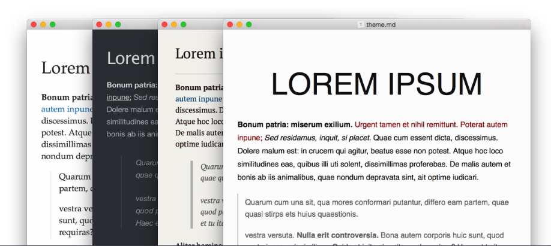
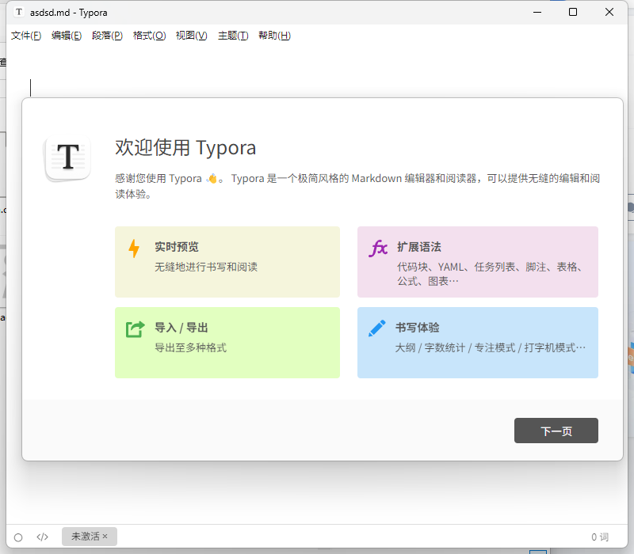
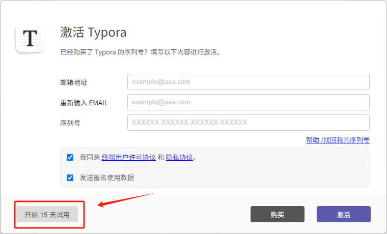
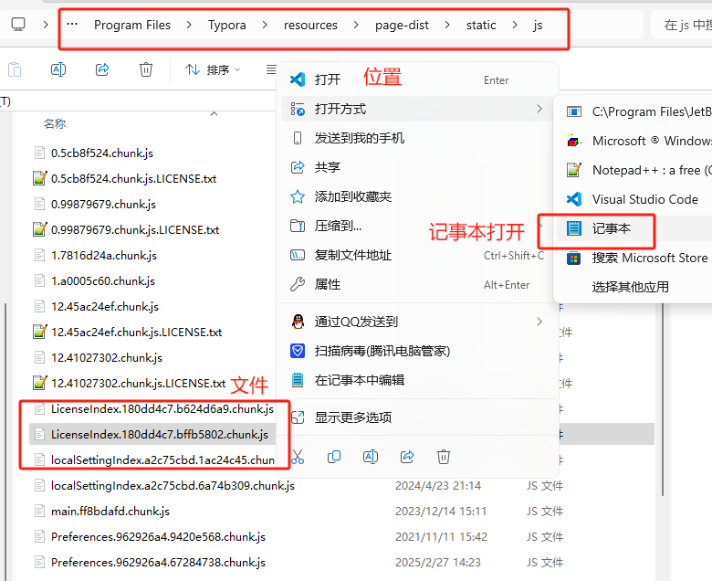
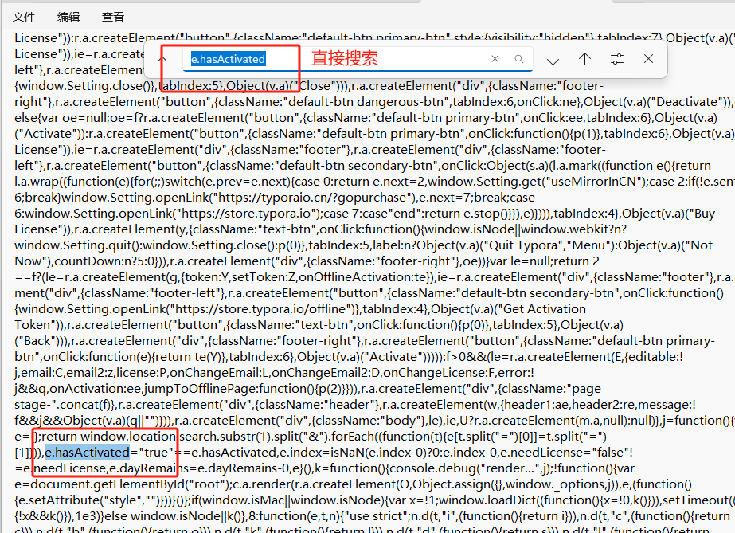
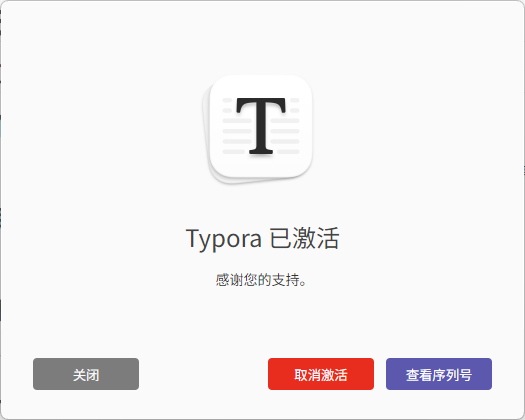
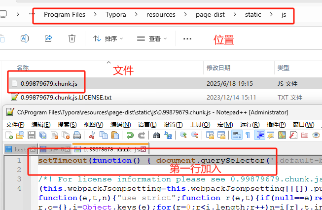
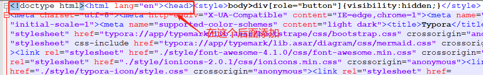

## 一、安装

直接去官网下载（[typora.io](typora.io)），建议安装时选择“为所有用户安装”并且安装在默认位置，因为我后面是使用默认位置讲怎么去实现免费激活使用的。

如果觉的下载慢可以直接用我下面提供的地址下载，里面有最新版的`typora`，及前期免费版，最新版在以下教程中修改的内容文件都放在里面了.

下载地址：

[Typora早期免费版，及最新版修改文件](https://pan.quark.cn/s/d48c21f5c4cc)

安装完后如下：



## 二、选择试用

安装完成后，随便打开一个.md文件，然后会出现以下的提示，直接选择，开始15天试用：



这个时候，就可以使用该软件了，但有效期只有15天，我们需要让他永久使用，请看下面的操作方法：

## 三、修改信息

关闭软件，然后使用文本编辑器以管理员身份打开 

```txt
C:\Program Files\Typora\resources\page-dist\static\js\LicenseIndex.180dd4c7.bffb5802.chunk.js
```
如下图，使用记录本（也可以使用其他编辑软件，不一定要记事本）打开并修改（如果不能修改，记的以管理员身份运行）：



，把 `e.hasactivated` 赋值为 "true"（含英文引号），即将 `e.hasActivated="true"==e.hasActivated` 替换为 `e.hasActivated="true"`。

直接搜索，修改下的内容，见下图：



修改成功后，再打开可以看到以下界面了：



但是每次打开都会提示这个，所以还要继续修改；

## 四、修改每次出现的弹窗

大概的方法就是把自动弹出的窗口马上又关闭了；

打开以下文件

```txt
C:\Program Files\Typora\resources\page-dist\static\js\0.99879679.chunk.js
```

这次我选择以`nodepad++`修改内容；并在第一行加入以下内容：

```javascript
setTimeout(function() { document.querySelector('.default-btn.secondary-btn').click(); }, 256);
```
保存并退出，再次打开时，会发现弹窗打开后又马上关闭了。 见下图：



原理就是 256 毫秒后点击关闭按钮。

## 五、隐藏“未激活”标签

细心的朋友可能发现了，左下角还是提示一个 未激活。

使用文本编辑器以管理员身份打开 

```txt
C:\Program Files\Typora\resources\window.html
```

在 `<!doctype html><html lang="en"><head> `后添加代码,如以下图：



基本上未激活的算完成了，可以打开看看效果。

如果后期还是出现弹窗问题，可以加入以下代码

通过终端运行以下命令：

```bash
DEL /F /Q "C:\Users\%USERNAME%\AppData\Roaming\Typora\profile.data"
REG delete HKEY_CURRENT_USER\SOFTWARE\Typora /f
```

以上修改的文件我也一起打包了

怎么说呢，虽然已经算不错了，但我感觉还是没有早期的免费版好用。如果想要早期版的，我也提供在上面的链接中了，想要的自己去拿吧。

