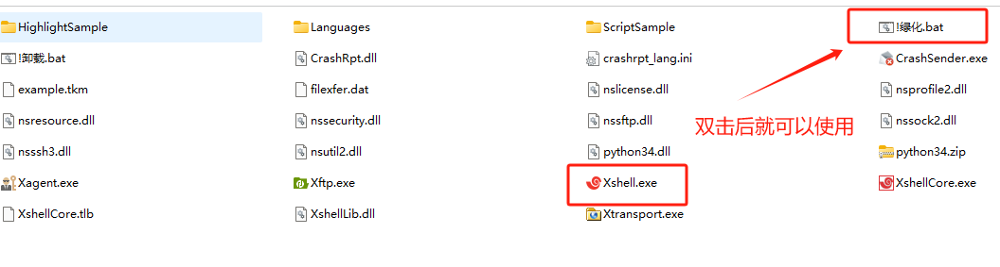
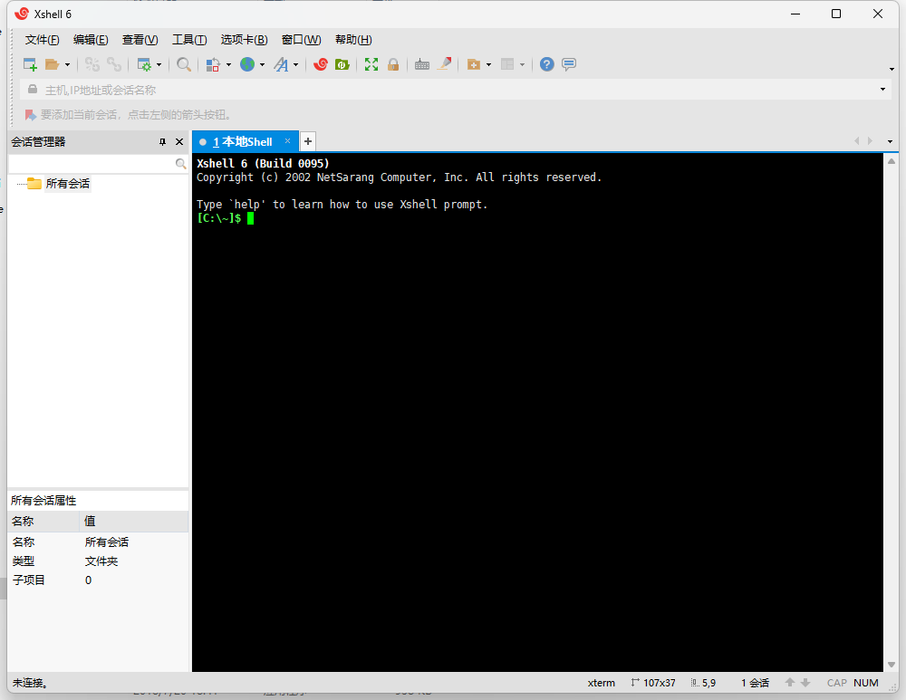
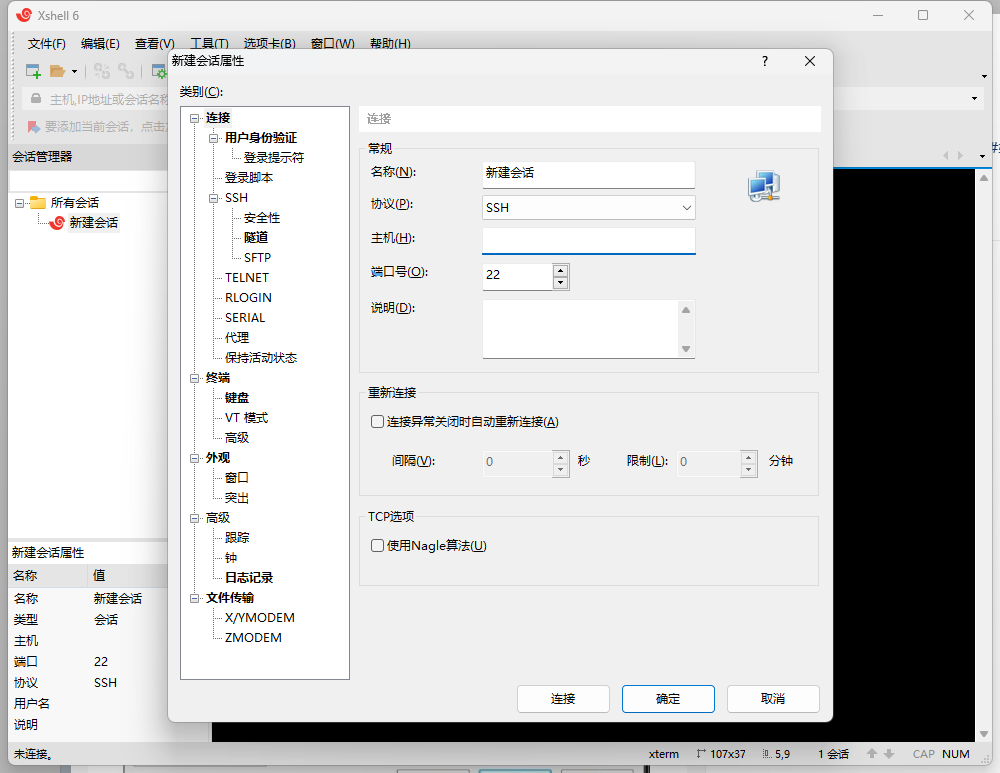
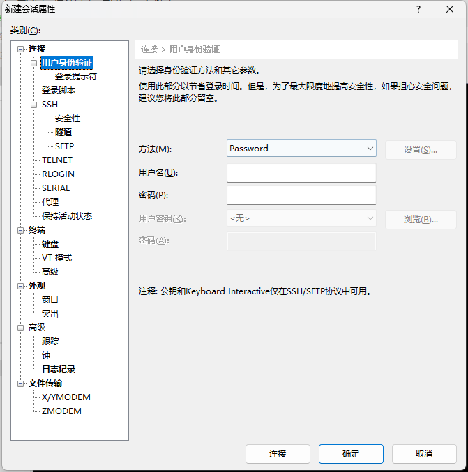
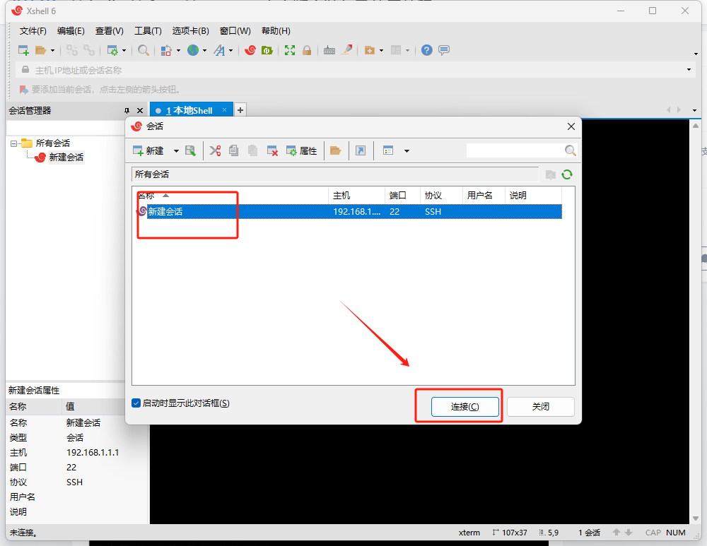

Xshell是一个强大的安全终端模拟软件，它支持SSH1, SSH2, 以及Microsoft Windows 平台的TELNET 协议。Xshell 通过互联网到远程主机的安全连接以及它创新性的设计和特色帮助用户在复杂的网络环境中享受他们的工作。

Xshell可以在Windows界面下用来访问远端不同系统下的服务器，从而比较好的达到远程控制终端的目的。除此之外，其还有丰富的外观配色方案以及样式选择。

Screen不会闪屏，并且可以回滚，这个功能比较好用。Script的执行顺序可以调整，SecureCRT的这个功能相较而言比较死板，不过可以同时发送指令到多个session，这个功能较好。键盘映射的兼容性比较好，不需要自己去改映射，可以展现tunnel等。支持布局切换，像gnome-terminal。缺憾是对Unicode制表符支持不够好，内置的sftp不怎么符合用户的操作习惯（该公司有另外的xftp）。许可相对便宜，对个人、教育用户是免费的。

## 安装

有多个版本，看你怎么选了，也可以选择安装版，这里提供的是绿色版，解压即可使用。

[Xftp，Xftp终端远程软件，免费安装版下载地址](https://pan.quark.cn/s/82eb7d8f6d1e)

以下图，双击绿色，然后就可以使用了。

## 功能

**1. 有效保护信息安全性**

Xshell支持各种安全功能，如SSH1 / SSH2协议，密码，和DSA和RSA公开密钥的用户认证方法，并加密所有流量的各种加密算法。重要的是要保持你的数据安全与内置Xshell安全功能，因为像Telnet和Rlogin这样的传统连接协议很容易让你的网络流量受到任何有网络知识的人的窃取。Xshell将帮助您保护数据免受黑客攻击。

**2. 最好的终端用户体验**

终端用户需要经常在任何给定的时间中运用多个终端会话，以及与不同主机比较终端输出或者给不同主机发送同一组命令。Xshell则可以解决这些问题。此外还有方便用户的功能，如标签环境，广泛拆分窗口，同步输入和会话管理，您可以节省时间做其他的工作。

**3. 代替不安全的Telnet客户端**

Xshell支持VT100，vt220，vt320，xterm，Linux，scoansi和ANSI终端仿真和提供各种终端外观选项取代传统的Telnet客户端。

**4. Xshell在单一屏幕实现多语言**

Xshell中的UTF-8在同类终端软件中是第一个运用的。用Xshell，可以将多种语言显示在一个屏幕上，无需切换不同的语言编码。越来越多的企业需要用到UTF-8格式的数据库和应用程序，有一个支持UTF-8编码终端模拟器的需求在不断增加。Xshell可以帮助你处理多语言环境。

**5. 支持安全连接的TCP / IP应用的X11和任意**
在SSH隧道机制中，Xshell支持端口转发功能，无需修改任何程序，它可以使所有的TCP / IP应用程序共享一个安全的连接。

## 配置

创建远程链接 ，选择文件->新建，输入主机端口，

选择用户身份验证，输入用户名和密码。

点击创建好的会话，点链接就可以链接远程服务器了。

配置好就可以用了。。

## Linux 常用命令汇总  

#### **文件与目录操作**  
- **ls（列出文件）**  
  - `ls -la`：显示当前目录所有文件的长列表（含隐藏文件）。  
  - `ls a*`：列出以字母 `a` 开头的所有文件。  
  - `ls -l *.doc`：显示以 `.doc` 结尾的文件的长列表。  

- **cp（复制文件）**  
  - `cp oldfile newfile.bak`：复制文件为新文件。  
  - `cp oldfile /home/data/`：将文件复制到指定目录。  
  - `cp * /tmp`：复制当前目录所有非隐藏文件到 `/tmp`。  
  - `cp -a docs docs.bak`：递归复制目录（含隐藏文件，保持属性）。  
  - `cp -i`：覆盖前询问用户；`cp -v`：显示复制过程。  

- **mv（移动/重命名文件）**  
  - `mv oldfile newfile`：重命名文件。  
  - `mv oldfile /tmp`：移动文件到指定目录。  

- **rm（删除文件/目录）**  
  - `rm oldfile`：删除文件。  
  - `rm *`：删除当前目录所有非隐藏文件。  
  - `rm -rf domed`：递归强制删除目录及内容。  
  - `rm -i a*`：删除以 `a` 开头的文件并确认。  

- **cd（切换目录）**  
  - `cd ~`：切换到用户主目录（如 `root` 用户为 `/root`）。  
  - `cd /tmp`：切换到 `/tmp` 目录。  
  - `cd dir`：切换到当前目录下的 `dir` 目录。  
  - `cd ..`：切换到上级目录；`cd ../../`：切换到上两级目录。  

- **mkdir（创建目录）**  
  - `mkdir photos`：创建名为 `photos` 的目录。  
  - `mkdir -p this/that/photos`：创建嵌套子目录。  

#### **文件内容查看与编辑**  
- **more/less（分页查看文件）**  
  - `more /etc/passwd`：分页显示文件内容。  
  - `less /etc/passwd`：类似 `more`，支持更多交互操作。  

- **grep（搜索文件内容）**  
  - `grep bible /etc/exports`：查找包含 “bible” 的行。  
  - `tail -100 /var/log/apache/access.log | grep 404`：在日志后 100 行中查找含 “404” 的行。  
  - `grep -v ^# /etc/apache2/httpd.conf`：查找非注释行（`-v` 表示排除）。  

- **vi/vim（文本编辑器）**  
  - `vi /etc/bubby.txt`：编辑文件。  
  - 常用操作：  
    - `i`：插入模式；`esc`：退出编辑。  
    - `:wq`：保存并退出；`:q!`：强制退出不保存。  
    - `yy`：复制当前行；`p`：粘贴。  

- **cat（显示文件内容）**  
  - `cat file.xxx`：直接显示文件全部内容。  

#### **系统与进程管理**  
- **ps（查看进程）**  
  - `ps -e`：显示所有进程；`ps -ef`：显示详细进程信息。  

- **kill（终止进程）**  
  - `kill -9 %1`：强制终止编号为 1 的作业。  
  - `kill -l`：列出可用信号（如 `-1` 重读配置，`-15` 正常终止）。  

- **top（查看系统资源）**  
  - 实时显示 CPU、内存、进程等系统资源使用情况。  

- **free（查看内存状态）**  
  - `free -tm`：以 TB/MB 为单位显示内存和 Swap 分区使用情况。  

#### **文件压缩与传输**  
- **tar（打包/解包）**  
  - `tar -cvf package.tar a.jsp b.java`：打包文件为 `package.tar`。  
  - `tar -xvf package.tar`：解包 tar 文件。  

- **rz/sz（文件上传下载）**  
  - `sudo rz`：通过 Xshell 接收文件到当前目录。  
  - `sudo sz file.xxx`：发送文件到 Windows 客户端。  

#### **其他常用命令**  
- **pwd**：查看当前工作目录路径。  
- **tail/head**：  
  - `tail -f aaa.txt`：实时追踪文件末尾内容。  
  - `head -n 10 aaa.log`：查看文件前 10 行。  
- **diff**：比较文件或目录内容差异。  
- **ln**：创建链接（`ln` 硬链接，`ln -s` 软链接）。  
- **touch**：创建空文件（如 `touch aaa.txt`）。  
- **man**：查看命令帮助（如 `man ls`）。  
- **date/clock**：设置系统时间或同步 BIOS 时间。  
- **reboot/shutdown**：重启或关闭系统（如 `shutdown -r now` 立即重启）。  
- **su**：切换用户（`su -` 切换到 root）。  
- **clear**：清屏。  

#### **系统信息查看**  
- **uname**：查看系统版本（`uname -R` 显示内核版本）。  
- **uptime**：显示系统运行时间、负载等信息。  
- **vmstat/iostat**：监视虚拟内存或磁盘吞吐量。  
- **w/who/last**：查看当前登录用户或历史登录记录。