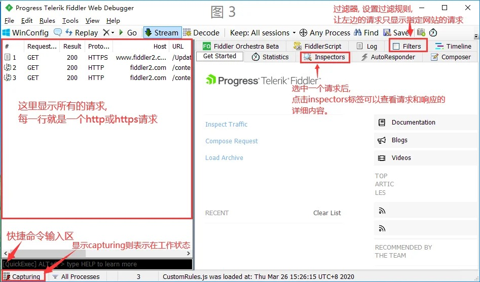
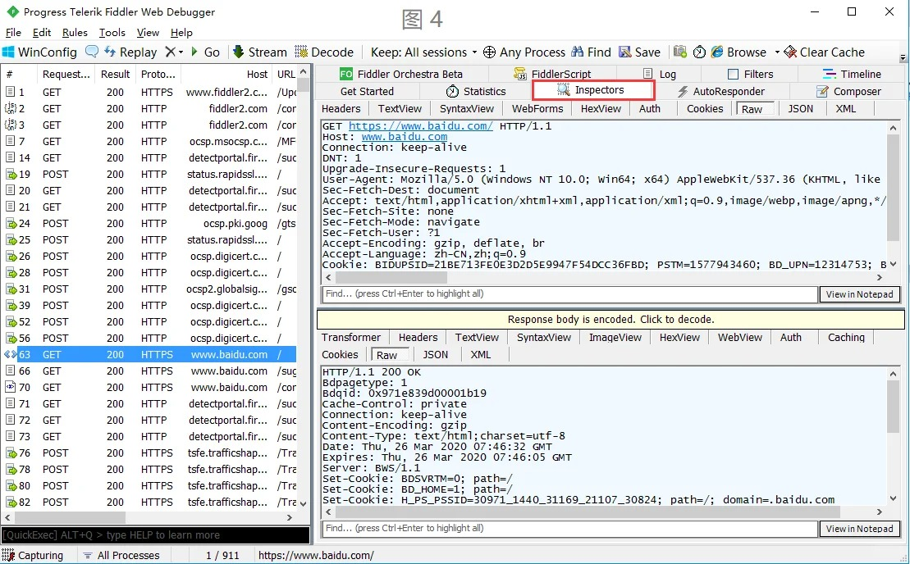
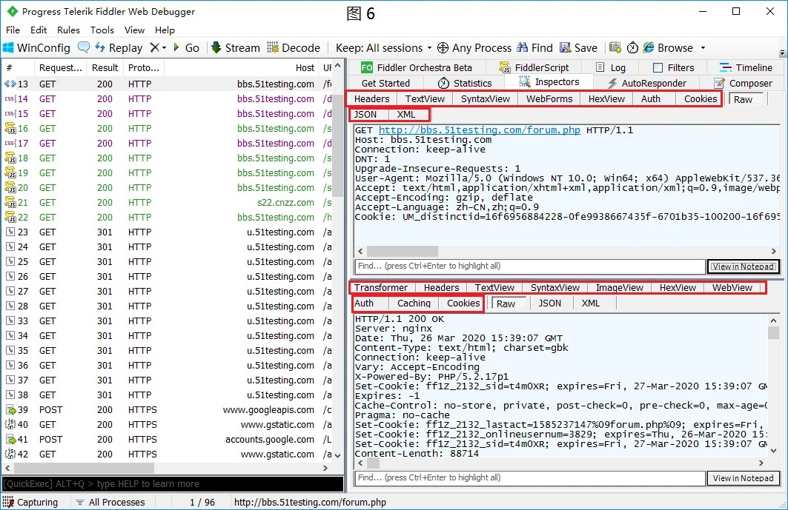
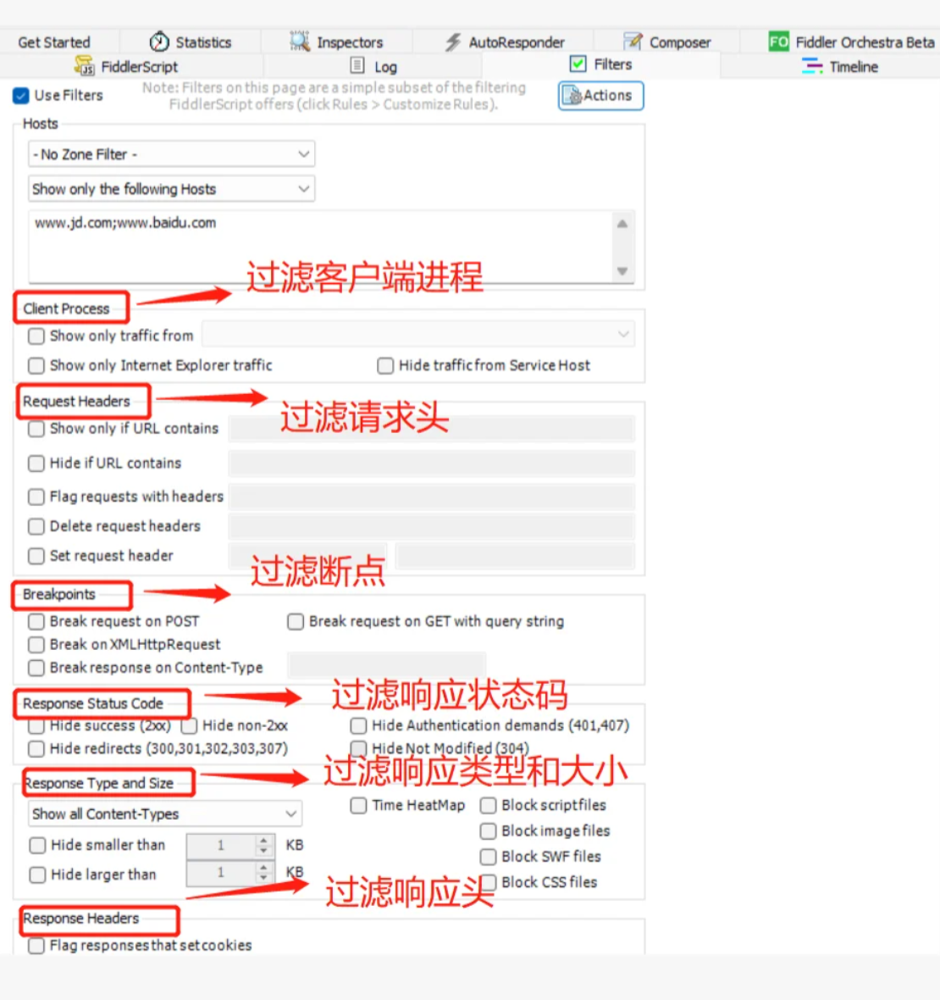
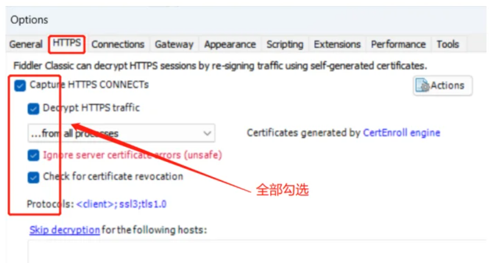
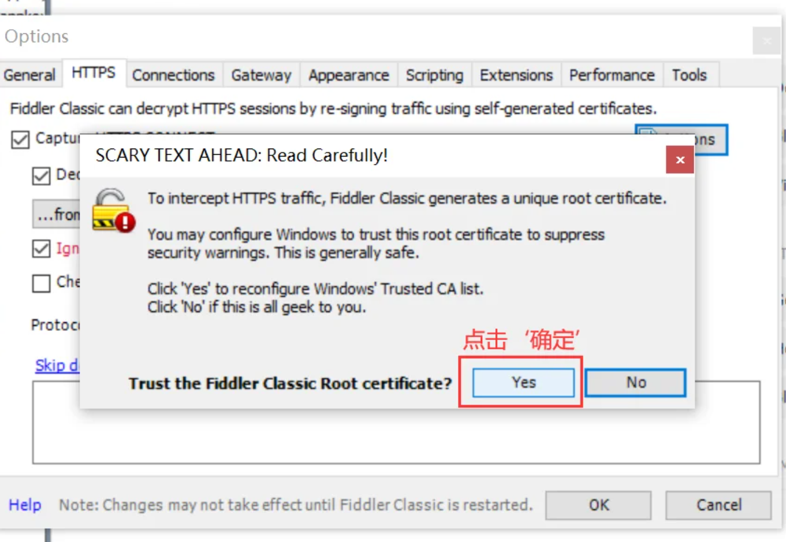
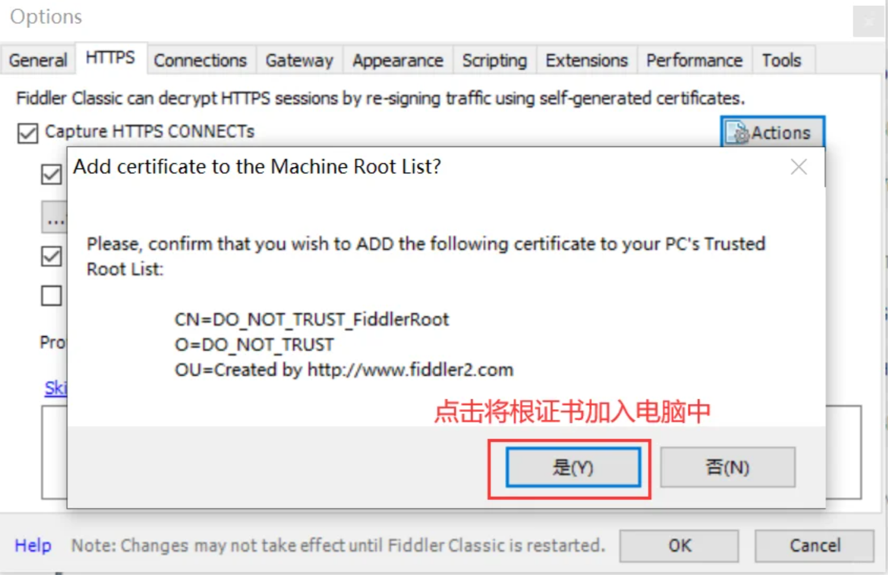
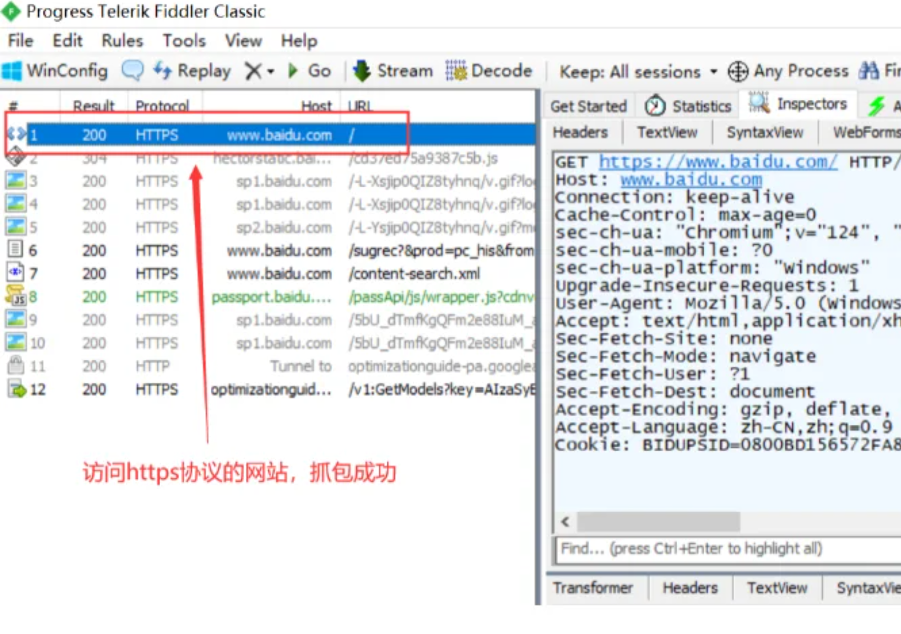

## 介绍

Fiddler是一个http协议调试代理工具，它能够记录并检查所有你的电脑和互联网之间的http通讯，设置断点，查看所有的“进出”Fiddler的数据（指cookie,html,js,css等文件）。 Fiddler 要比其他的网络调试器要更加简单，因为它不仅仅暴露http通讯还提供了一个用户友好的格式。

## 下载
[fiddler抓包工具免费版](https://pan.quark.cn/s/497b5d80cd98)

## 使用

### 请求界面
左侧的请求界面，所有的网洛请求都会在这里展示；

### 编辑区
右侧的编辑区，fiters过滤器，当请求界面过多时，可以选择打指定要看的，方便查看。

### 选择请求

当选中一个请求后，可以查看该请求的网址的相关信息。

选中一行,也就是一个请求, 再点击Inspectors标签可以查看该请求的详细信息,包括请求数据和响应数据。
上半部分为请求的详细内容, 下半部分为响应的详细内容,可点击raw子标签查看原始的数据信息。

### 过滤设置

## HTTPS 数据抓取

1、打开Fiddler，菜单栏：Tools –> Fiddler Options 打开fiddler配置。

2、点击确定

3、将证书加入电脑中

4、HTTPS已被抓取

## 说明 

Fiddler支持断点调试技术，当你在软件的菜单—rules—automatic breakpoints选项选择before request,或者当这些请求或响应属性能够跟目标的标准相匹配，Fiddler就能够暂停Http通讯，并且允许修改请求和响应。这种功能对于安全测试是非常有用的，当然也可以用来做一般的功能测试，因为所有的代码路径都可以用来演习。

通过显示所有的Http通讯，Fiddler可以轻松地演示哪些用来生成一个页面，通过统计页面（就是Fiddler左边的那个大框）用户可以很轻松地使用多选，来得到一个WEB页面的“总重量”（页面文件以及相关js,css等）你也可以很轻松地看到你请求的某个页面，总共被请求了多少次，以及多少字节被转化了。
用户可以加入一个Inspector插件对象，来使用.net下的任何语言来编写Fiddler扩展。RequestInspectors 和 ResponseInspectors提供一个格式规范的，或者是被指定的（用户自定义）Http请求和响应视图。

另外，通过暴露HTTP头，用户可以看见哪些页面被允许在客户端或者是代理端进行缓存。如果要是一个响应没有包含Cache-Control 头，那么他就不会被缓存在客户端。 

同类的工具有: httpwatch, firebug, wireshark。

## HTTP请求类型：

请求行以一个方法符号开头，以空格分开，后面跟着请求的URI和协议的版本，格式如下：Method Request-URI HTTP-Version CRLF, 其中 Method表示请求方法；Request-URI是一个统一资源标识符；HTTP-Version表示请求的HTTP协议版本；CRLF表示回车和换行（除了作为结尾的CRLF外，不允许出现单独的CR或LF字符）。

请求方法（所有方法全为大写）有多种，各个方法的解释如下：

|请求方法 |	说明|
|-|-|
|GET	|请求获取Request-URI所标识的资源|
|POST|	在Request-URI所标识的资源后附加新的数据|
|HEAD	|请求获取由Request-URI所标识的资源的响应消息报头|
|PUT	|请求服务器存储一个资源，并用Request-URI作为其标识|
|DELETE	|请求服务器删除Request-URI所标识的资源|
|TRACE	|请求服务器回送收到的请求信息，主要用于测试或诊断|
|CONNECT|	保留将来使用|
|OPTIONS	|请求查询服务器的性能，或者查询与资源相关的选项和需求响应状态码：|

状态代码有三位数字组成，第一个数字定义了响应的类别，且有五种可能取值：

- 1xx：指示信息--表示请求已接收，继续处理
- 2xx：成功--表示请求已被成功接收、理解、接受
- 3xx：重定向--要完成请求必须进行更进一步的操作
- 4xx：客户端错误--请求有语法错误或请求无法实现
- 5xx：服务器端错误--服务器未能实现合法的请求