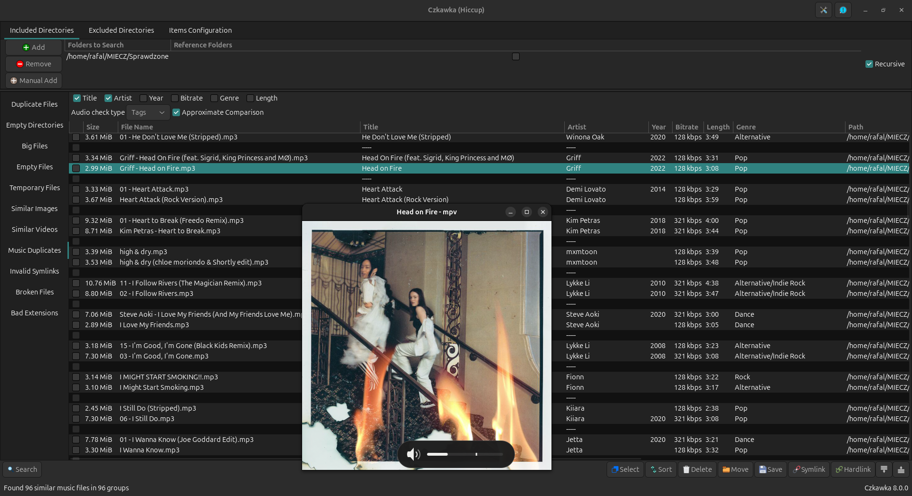

Czkawka 是一款开源、跨平台的重复文件清理工具，支持 Windows、Linux、macOS 等系统。其核心功能是通过扫描文件哈希值、大小或名称等属性识别重复项，并提供相似图片/视频检测、空文件夹清理等扩展功能。作为免费工具，Czkawka 以高效、安全（无网络连接、无数据收集）著称，适合需要深度清理存储空间的用户。

## 下载地址

[Czkawka跨平台重复文件清理](https://pan.quark.cn/s/84bec7839eef)

## 核心功能特点‌

**‌重复文件检测‌**

支持按文件哈希值、大小或名称精准匹配重复项。

可检测视觉相似的图片/视频（即使格式或分辨率不同）。

**‌多样化清理选项‌**

扫描空文件夹、大文件、临时文件及损坏/无效文件。

提供批量重命名和文件分类管理功能。

**‌跨平台与高性能‌**

兼容 Windows、Linux、macOS 等多系统。

采用 Rust 语言开发，支持多线程加速扫描。

**‌用户友好性‌**

- 提供图形界面（GUI）和命令行（CLI）两种操作模式。
- 支持中文界面，无广告且无需安装（绿色便携版）
- 重复文件查找：可以高效地扫描整个文件系统，找出重复的文件，并通过哈希值和文件大小进行对比。

- 相似图像搜索：支持相似度调整，即使图片尺寸不同或有部分涂抹和马赛克也能找到相似图片。

- 空文件和大文件检测：能够识别并列出空文件和大文件，帮助用户清理不必要的空间。

- 无效和损坏文件检查：扫描并报告损坏或无效的文件，确保文件系统的健康。

- 临时文件清理：提供快速扫描临时文件的功能，提升系统性能。

- 真实文件扩展名探测：能够识别错误的文件扩展名并建议正确的扩展名。

- CLI和GUI界面：提供命令行界面（CLI）和图形用户界面（GUI），适合不同使用习惯的用户。

- 多语言支持：界面支持多种语言，包括中文，方便全球用户使用。

- 缓存支持：第二次和进一步的扫描比第一次快，提高效率。

Czkawka 凭借其 ‌高效扫描算法‌、‌多维度清理功能‌ 和 ‌跨平台兼容性‌，成为重复文件管理领域的优选工具。适合对系统存储有深度清理需求，且追求安全、免费解决方案的用户。对于普通用户，建议结合可视化操作（GUI）和定期维护习惯，以最大化工具效用。