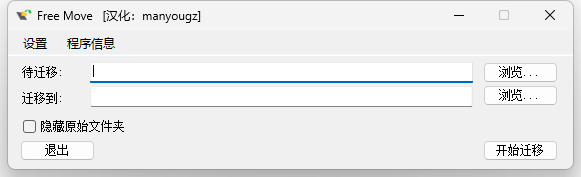
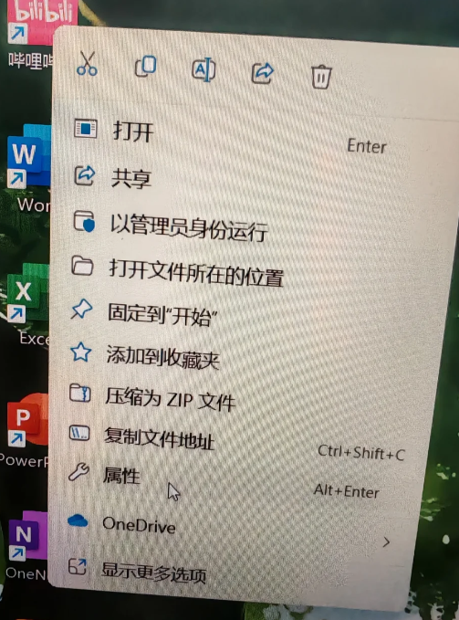
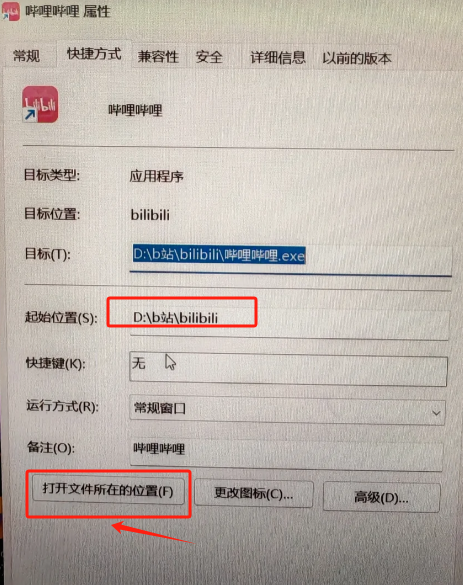

和C盘红条说拜拜，我的C盘红了，电脑有点卡怎么办。

电脑空间告急？试试FreeMove，不到1MB的软件轻松拯救C盘！

## 首推Free Move

因为他只有2个选项，1、需要搬家的软件；2、搬到哪里去；




### 下载安装

[C盘搬家下载地址](https://pan.quark.cn/s/a27def7e7871)

解压后，双击就可以运行，不需要安装。

### 怎么知道软件目录在哪里

1、选择软件，并点击右键选择属性



2、点击打开所在位置



最后就知道软件所在的位置在哪里了。

提示一下，因为什么都能移动，所以要注意：

系统目录不能移动，否则会破坏系统核心功能，导致系统启动不了。比如C:Users和C:Docuents and Settings，这些系统文件夹是不能移动喔，否则一切后果自负。


## 下面是一些不做任何安装，清理文件，转移文件的方法

## 一、清理C盘临时文件
### （一）使用系统自带的磁盘清理工具
1. 右键点击 **C盘** → 选择 **属性** → 点击 **磁盘清理** → 勾选“临时文件”、“系统缓存”等 → 点击 **确定**  。  
2. 点击 **清理系统文件**（需管理员权限）→ 勾选“Windows更新清理”、“旧的系统还原点”等 。  

### （二）手动清理常见大文件
检查 `C:\Users\你的用户名\Downloads`（下载文件夹）和 `C:\Windows\Temp`（临时文件）中的无用内容 。  


## 二、转移用户文件夹到D盘
将“文档”、“下载”、“桌面”等个人文件夹重定向到D盘，操作步骤如下：  
1. 打开 **文件资源管理器** → 右键 **文档/图片/下载** 等文件夹 → 选择 **属性** 。  
2. 切换到 **位置** 选项卡 → 点击 **移动** → 选择D盘中的目标路径（如 `D:\Users\Documents` ） 。  
3. 确认后，系统会提示移动现有文件，点击 **是**  。  


## 三、迁移已安装的软件到D盘
注意：直接剪切 `Program Files` 中的软件可能导致无法运行，需通过以下方法：  

### （一）卸载后重新安装到D盘
通过 **控制面板 > 程序和功能** 卸载软件 → 重新安装时选择D盘路径（如 `D:\Program Files` ） 。  

### （二）使用第三方迁移工具（如Steam Mover或EaseUS PCTrans）
适用于无需重装即可移动软件，但需谨慎操作 。  


## 四、调整虚拟内存到D盘
操作流程：  
1. 右键 **此电脑** → **属性** → 点击 **高级系统设置** → 在 **高级** 选项卡下点击 **性能** 区域的 **设置**  。  
2. 再次进入 **高级** → 点击 **虚拟内存** 下的 **更改**  。  
3. 取消勾选 **自动管理分页文件** → 选择 **C盘** → 勾选 **无分页文件** → 点击 **设置**  。  
4. 选择 **D盘** → 勾选 **系统管理的大小** → 点击 **设置** → 重启生效  。  


## 五、使用符号链接（高级操作）
将C盘的大文件夹（如Steam游戏库）映射到D盘，步骤如下：  
1. 将原文件夹（如 `C:\Program Files\Steam` ）剪切到D盘 。  
2. 以管理员身份打开 **命令提示符**，输入：  

```cmd
mklink /J "C:\原路径" "D:\新路径"
```

（例如：mklink /J "C:\Program Files\Steam" "D:\Steam" ）


## 六、扩展 C 盘空间（需 D 盘在同一硬盘）

若 D 盘与 C 盘在同一物理磁盘且有未分配空间，按以下操作：

- 备份 D 盘数据 。
- 右键 此电脑 → 管理 → 磁盘管理 。
- 右键 D 盘 → 压缩卷 → 输入压缩量（如 50GB） 。
- 右键 C 盘 → 扩展卷 → 将未分配空间合并到 C 盘 。