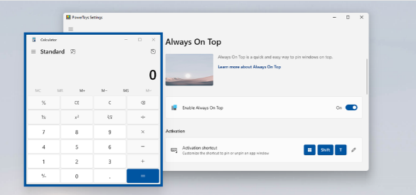

## 介绍：

Microsoft PowerToys是一组实用工具，可帮助高级用户调整和简化其Windows体验，从而提高工作效率。以下是其一些主要功能：
1. **FancyZones（窗口布局）**：用户可创建自定义的窗口布局，通过拖放方式将窗口放置到预定义的区域中，实现多任务处理时窗口的高效整理和布局，优化桌面空间利用率。
2. **PowerToys Run（快速启动工具）**：通过键盘快捷键（如Win+Space）快速启动应用程序、打开文件、执行命令等。用户输入关键词，它会智能匹配相关内容并提供快速启动方式。
3. **Keyboard Manager（键盘管理器）**：允许用户自定义键盘按键映射，重新定义系统的快捷键组合，还可创建复杂的多键组合快捷键，满足个性化操作需求。
4. **Shortcut Guide（快捷键指南）**：当用户按下Windows键时，显示当前应用程序的快捷键列表，帮助用户快速掌握常用操作。
5. **文件资源管理器预览面板**：使用空格键可快速预览文件内容，无需打开文件就能查看信息，支持多种文件格式，包括Markdown、SVG、PDF和G - code等。
6. **SVG预览器插件**：为Windows文件资源管理器添加了SVG文件的预览功能，方便用户直接在文件资源管理器中预览和浏览SVG格式的图像文件。
7. **Color Picker（颜色拾取器）**：用户可从屏幕上任意位置拾取颜色，并将其以各种格式复制到剪贴板中，还能通过放大功能更详细地查看光标所在区域的颜色信息，适用于设计和开发工作。
8. **Image Resizer（图像大小调整器）**：支持批量调整图像大小，用户右击图像文件（支持多选），选择“调整图片大小”即可，还可自定义调整尺寸，方便图片处理和分享。
9. **PowerRename（批量重命名）**：可对文件和文件夹进行批量重命名，支持强大的命名规则和筛选条件，在处理大量文件时能节省时间和减少错误率。
10. **Mouse Utilities（鼠标实用工具）**：具有显示光标位置等实用功能，提升鼠标操作效率。
11. **Video Conference Mute（视频会议静音）**：在视频会议中可通过快捷键快速静音/取消静音麦克风，方便用户灵活控制麦克风状态。
12. **PowerToys Awake（保持唤醒）**：使计算机保持清醒状态，无需管理电源和睡眠设置，运行耗时任务时，可确保计算机不会进入睡眠状态或关闭屏幕。
13. **File Locksmith**：检查哪些文件正在使用以及由哪些进程使用。
14. **Host编辑器**：便捷地编辑包含域名和匹配IP地址的“host”文件，充当识别和定位IP网络上主机的映射。
15. **Mouse without Borders**：可在最多四台安装了PowerToys的Windows电脑上使用同一鼠标，还能复制剪贴板内容和在机器间传输文件。

## 下载地址

[Microsoft PowerToys点击获取](https://pan.quark.cn/s/78bba9497092)

## 高级粘贴

高级粘贴是一种工具，可将剪贴板内容转换为所需的任何格式，重点用于开发人员工作流。它可以直接通过 UX 或直接击键调用粘贴为纯文本、markdown 或 json。这些完全本地执行。此外，它还具有 100% 选择加入且需要 Open AI 密钥的 AI 支持选项。注意：这会将剪贴板中格式化的文本替换为所选格式。

## Always On Top
“前端显示” 可通过固定应用程序窗口使其始终位于前面（即使焦点在此之后更改至另一个窗口也是如此），来改进多任务工作流。

### 如何使用

固定或取消固定所选窗口，使其始终位于所有其他窗口的顶部。 （快捷键：⊞（Windows 徽标键） + Ctrl + T ，界面上对应显示的图标和按键为 ：⊞ 、Ctrl 、T ）

## 唤醒
Awake 是一种 Windows 工具，旨在使你的电脑按需保持唤醒状态，而无需管理其电源设置。此行为在运行耗时的任务时很有用，同时确保你的电脑不会进入睡眠状态或关闭其屏幕。

### 如何使用
打开 PowerToys 设置 并启用 Awake

## 颜色选择器
颜色选取器是 Windows 系统范围内的颜色选择工具，使用此工具，可以从任何当前正在运行的应用程序中选取颜色，并自动将其以可配置格式复制到剪贴板。

### 如何使用
⊞（Windows 徽标键） + Shift + C 打开 “颜色选取器”。 （界面上对应显示的图标和按键为 ：⊞ 、Shift 、C ）

## 命令面板
一个完全可扩展的快速启动器，提供更丰富的显示和更多功能，且不会降低性能。

### 如何使用
⊞（Windows 徽标键） + Alt + Space 然后开始键入！（界面上对应显示的图标和按键为 ：⊞ 、Alt 、Space ）

## 未找到命令
“未找到命令” 检测到 PowerShell 中的命令引发的错误，并建议安装相关的 WinGet 包 (如果可用)。

### 如何使用
如果命令返回错误，模块将建议可能提供相关可执行文件的 WinGet 包。

## 窗口裁剪器
窗口裁剪器可以将一个窗口裁剪成更小的窗口，或是创建一个展示裁剪后的内容的窗口（但是不影响原来的窗口）。选中想要的窗口，按快捷键开始裁剪。

### 如何使用
⊞（Windows 徽标键） + Ctrl + Shift + T 以裁剪并创建另一个窗口的缩略图。应用程序无法通过缩略图进行控制，但兼容性问题会降低。

⊞（Windows 徽标键） + Ctrl + Shift + R 将应用程序的窗口裁剪到裁剪窗口中。这是实验性的，可能会导致某些应用程序出现问题，因为裁剪窗口将包含原始应用程序窗口。

## 环境变量
环境变量是用于管理环境变量的快速实用工具。

## FancyZones
FancyZones 是一个窗口管理器，便于你轻松地创建复杂的窗口布局，并快速将窗口定位到这些布局。

### 如何使用
按 Shift + 拖动窗口 将窗口对齐到区域，然后在所需区域中释放窗口。

⊞（Windows 徽标键） + Shift + `（此为键盘上的反引号键，因显示问题可能呈现空白 ） 打开 FancyZones 编辑器。

## File Locksmith
File Locksmith 列出了哪些进程正在使用所选文件或目录，并允许关闭这些进程。

### 如何使用
在文件资源管理器中，右键单击一个或多个所选文件，然后从上下文菜单中选择 “使用文件锁定程序解锁” 。

## 文件资源管理器加载项
PowerToys 向 Windows 文件资源管理器引入了加载项，这些加载项将启用可在预览窗格中查看的 Markdown (.md)、PDF (.pdf)、SVG (.svg)、STL (.stl)、G - code (.gcode) 和开发人员文件等文件。还引入了对许多此类文件类型的文件资源管理器缩略图支持。

### 如何启用
选择位于文件资源管理器顶部的 “视图”，然后选择 “显示”，再选择 “预览窗格”。从那里，只需在文件资源管理器中单击其中一个支持的文件，并观察预览窗格上的内容！

## Hosts 文件编辑器
Hosts 文件编辑器是用于管理 Hosts 文件的快速而简单的实用工具。

## 图像大小调整器
图像大小调整器是一个 Windows shell 扩展，用于简单的批量图像大小调整。

### 如何启动
在文件资源管理器中，右键单击一个或多个图像文件，然后从上下文菜单中选择使用图像大小调整器调整大小。

## 键盘管理器
使用键盘管理器，可以通过重映射键并创建你自己的键盘快捷键来自定义键盘，从而提高工作效率。

### 如何创建映射
启动 PowerToys 设置，导航到 “键盘管理器” 菜单，然后选择 “重新映射键” 或 “重新映射快捷键” 。

## 鼠标实用工具
用于增强鼠标的实用工具集合。

### 查找我的鼠标
按两次 Ctrl 键、使用自定义快捷方式或摇动鼠标，以聚焦鼠标指针。

### 鼠标荧光笔
使用键盘快捷键突出显示鼠标左键和鼠标右键单击。

### 鼠标指针十字线
绘制以鼠标指针为中心的十字线。

### 鼠标跳转
将鼠标指针快速跳转到桌面上的任意位置。

## 无界鼠标
“无边界鼠标” 允许在同一本地网络中的计算机之间使用鼠标指针、键盘、剪贴板和拖放。

### 如何使用
使用每台计算机上的 “设置” 屏幕，使用相同的密钥连接到其他计算机。如果连接无法正常工作，可能需要向 Windows 防火墙添加例外。

## 新建 +
根据一组个性化的模板创建文件和文件夹。

### 如何使用
在文件资源管理器中，右键单击桌面或文件夹，并通过上下文菜单中的 “新建 +” 选择模板。可以通过 “打开模板” 打开模板文件夹，添加新模板，然后在其中添加新文件和文件夹。

## 速览
Windows 的闪电快速文件预览功能。

### 如何使用
Ctrl + Space 预览当前在文件资源管理器中选择的文件。（界面上对应显示的按键为 ：Ctrl 、Space ）

## PowerRename
使用 PowerRename，可以执行简单的文件名批量重命名、搜索和替换。

### 如何使用
在文件资源管理器中，右键单击一个或多个所选文件，然后从上下文菜单中选择使用 PowerRename 重命名。

## PowerToys Run
PowerToys Run 是为高级用户提供的快速启动程序，其中包含一些附加功能，但不会影响性能。

### 如何启动
Alt + Space 打开 “运行”，然后即可开始键入。（界面上对应显示的按键为 ：Alt 、Space ）

## 快速重音
快速重音是一种书写带重音字母的简便方法，例如在智能手机上。

### 如何使用
打开 “PowerToys 设置” 并启用快速重音。按住要向其添加重音的字符的键时，按激活键，然后将显示用于选择已加重音字符的覆盖图。

## 注册表预览
注册表预览一个快速的小实用工具，用于可视化和编辑复杂的 Windows 注册表文件。

### 如何使用
在文件资源管理器中，右键单击一个.REG 文件并从上下文菜单中选择 “预览”。

## 屏幕标尺
屏幕标尺是用于测量屏幕上像素的快速简便方法。

### 如何启动
⊞（Windows 徽标键） + Ctrl + Shift + M 显示屏幕标尺命令栏。（界面上对应显示的图标和按键为 ：⊞ 、Ctrl 、Shift 、M ）

使用边界模式，可以选择要测量的特定区域。还可以拖移某个区域，以使其保留在屏幕上。借助各种间距模式，可以使用可自定义的像素容差阈值沿水平轴和垂直轴跟踪相似的像素 (使用设置或鼠标滚轮进行调整)。

## 快捷键指南
快捷键指南向用户显示当前桌面状态的可用快捷键列表。

### 如何启动
⊞（Windows 徽标键） + Shift + / 要打开 “快捷键指南”，请将其再次按下以关闭或按 Esc 。（界面上对应显示的图标和按键为 ：⊞ 、Shift 、/ ）

## 文本提取器
文本提取器的工作方式与截图工具类似，但使用 OCR 将文本从所选区域复制出来，然后将其放入剪贴板。

### 如何使用
⊞（Windows 徽标键） + Shift + T 打开文本提取器，然后选择要从中复制文本的区域。（界面上对应显示的图标和按键为 ：⊞ 、Shift 、T ）

## 工作区
使用 Workspaces 实用工具，可以一次性启动一组应用程序到自定义布局和配置。

### 如何使用
在 “Workspaces 编辑器” 窗口中，创建 Workspaces -- 一组在自定义布局中排列的应用程序。你可以从 Workspaces 编辑器或通过在 Workspaces 编辑器中创建的快捷方式启动 Workspaces。
⊞（Windows 徽标键） + Ctrl + `（因显示问题，原按键显示空白，实际为反引号键 ） 以打开 Workspaces 编辑器。

## ZoomIt
ZoomIt 是用于技术演示和演示的屏幕缩放、批注和录制工具。还可以使用 ZoomIt 将屏幕截图截图截图到剪贴板或文件中。

### 如何使用
从 “设置” 页启用 ZoomIt 并检查可用的快捷方式和模式。