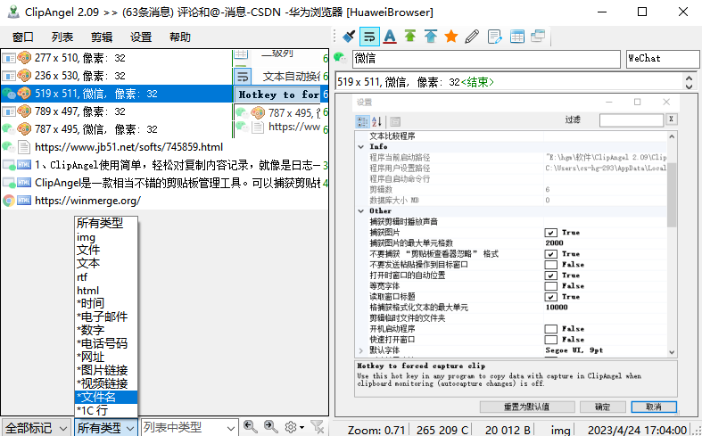
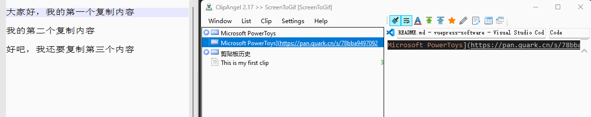
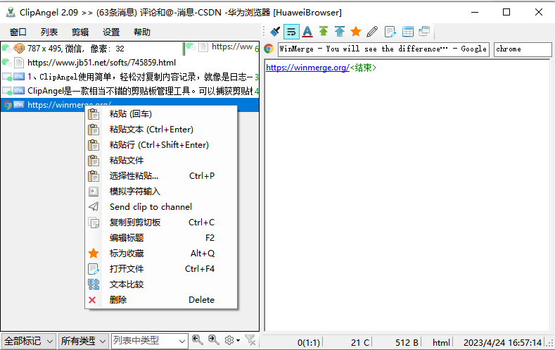
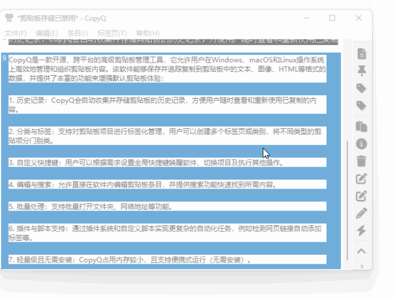
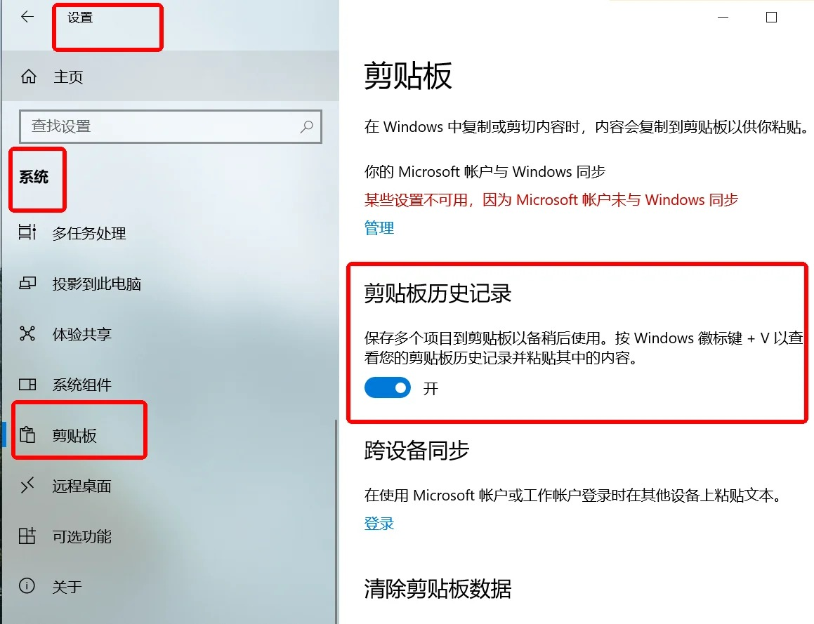
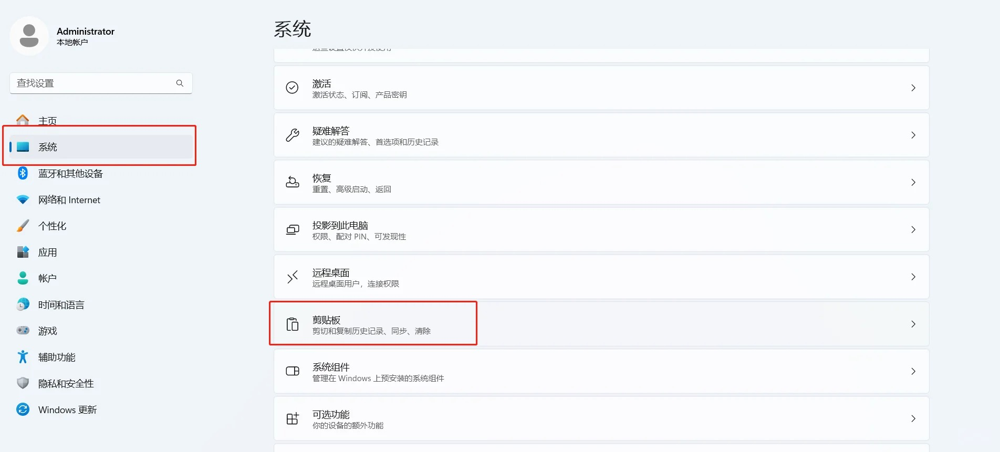
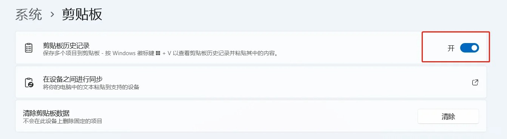
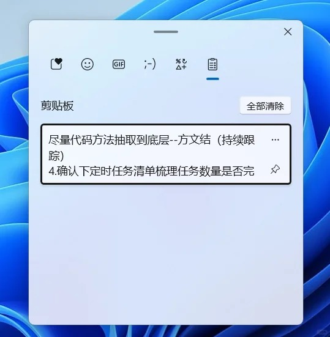

剪贴板是电脑中一个非常实用的功能，允许用户在不同的应用程序之间复制和粘贴文本、图像、文件等内容。然而，默认情况下，剪贴板只能存储最近一次复制的内容，这可能会限制我们的工作效率。

但是 Windows 上的剪贴板只有简单的拷贝粘贴功能，而且几十年来从未升级，更没有增加新功能。为了满足人们对剪贴板的需求，出现了很多第三方剪贴板增强软件，例如：Ditto，CopyQ，ClipAngel 等等。

不过，电脑剪贴板历史记录查看的方法有很多，可以帮助我们更好地管理和使用剪贴板内容。本文将介绍三种方法，详细讲解如何查看电脑剪贴板的历史记录，帮助您更高效地进行复制和粘贴操作。

## 下载地址

[ClipAngel，CopyQ、Ditto等剪切版软件都放这里了](https://pan.quark.cn/s/e945b6972447)

## ClipAngel

ClipAngel是一款功能强大且轻量级的剪贴板管理工具，适用于Windows操作系统。它以其小巧的体积（仅3M左右）和强大的功能，吸引了众多用户的关注。ClipAngel能够自动捕获并存储用户复制到剪贴板的文本、文件和图像，方便用户后续快速存取和使用。

该工具支持自动记忆剪切板中的文字及图片复制记录，预设记忆10000条文字和2000张图片（可设定更多），并支持网页图文格式。用户还可以编辑、搜索剪切板内容，并将常用内容收藏起来，极大地方便了后续使用。

ClipAngel的主界面清晰展示了剪切板列表和内容信息，支持多种类型的剪切板内容，如图片、文件、文本、rft、html和图片链接等。用户可以通过鼠标右键对选中的剪切板内容进行操作，如粘贴、粘贴文件和标为收藏等。

## Ditto

Ditto是一款免费且开源的Windows剪贴板增强工具。它扩展了Windows操作系统自带的剪贴板功能，允许用户保存和管理多个剪贴板项目，并可通过便捷的方式快速查找和粘贴之前复制过的内容。Ditto能够记录文本、图像、HTML等多种格式的数据到其内部存储中，并提供搜索、分组、排序等功能。

### 主要特点包括：

1. 保存剪贴板历史记录：每次复制内容时，Ditto都会将其添加到历史列表中。

2. 搜索与过滤：用户可以通过关键词搜索剪贴板历史中的特定条目。

3. 快捷键操作：支持通过自定义快捷键来调用程序主界面、选择并粘贴剪贴板历史中的项目。

4. 自定义设置：用户可以根据个人喜好更改软件界面语言（如中文）、皮肤样式、字体、快捷键、版式等。

5. 网络同步：部分版本或配合第三方服务可实现剪贴板内容在多台设备之间的同步。

6. 剪贴板数量统计及更多高级功能：如记录分组、名称粘贴等。

## CopyQ

一款开源、跨平台的高级剪贴板管理工具，它允许用户在Windows、macOS和Linux操作系统上高效地管理和组织剪贴板内容。该软件能够保存并追踪复制到剪贴板中的文本、图像、HTML等格式的数据，并提供了丰富的功能来增强默认剪贴板体验：

1. 历史记录：CopyQ会自动收集并存储剪贴板的历史记录，方便用户随时查看和重新使用已复制的内容。

2. 分类与标签：支持对剪贴板项目进行标签化管理，用户可以创建多个标签页或类别，将不同类型的剪贴项分门别类。

3. 自定义快捷键：用户可以根据需求设置全局快捷键唤醒软件、切换项目及执行其他操作。

4. 编辑与搜索：允许直接在软件内编辑剪贴板条目，并提供搜索功能快速找到所需内容。

5. 批量处理：支持批量打开文件夹、网络地址等功能。

6. 插件与脚本支持：通过插件系统和自定义脚本实现更复杂的自动化任务，例如检测网页链接自动添加标签等。

7. 轻量级且无需安装：CopyQ占用内存较小，且支持便携式运行（无需安装）。

## 微软自带“剪贴板历史”

### windows 10 方法

打开设置==>系统==>剪贴板==>剪贴板历史记录==>打开开关

复制完内容后按【win】+【v】打开剪切板。

### windows 11 方法

打开设置==>系统==>剪贴板==>剪贴板历史记录==>打开开关

复制完内容后按【win】+【v】快捷键就可以看到复制的历史记录了。
点击对应记录就会自动插入了。

