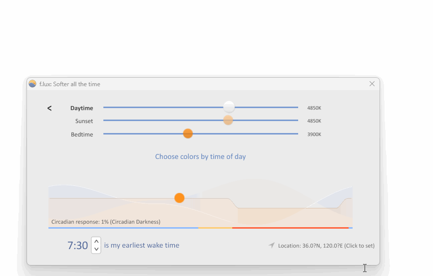

有没有经常出现电脑看久了，眼睛痛，流眼泪，干涩等情况，电脑的颜色，不同色调，亮度，对高强度工作的人来说，眼睛的伤害是很大的，因此长时间使用电脑，需要一款护眼的软件，flux 就是一款不错的选择。

## 简介
《f.lux自动护眼工具》是一款非常好用的护眼软件，它可以根据时间自动调整频幕色温。对于长时间在电脑前工作的人群来说，时间久了，视力会下降，这时候F.lux自动护眼工具就非常好用，它可以根据时间自动调整频幕色温。是一款非常不错的软件。

## 下载

[屏幕护眼flux](https://pan.quark.cn/s/c8ba9e356ffb)

## f.lux怎么设置位置

1、软件界面打开后，我们先点击右上角的“settings”按钮进入设置界面

2、设置白天和晚上的亮度。白天的色温控制在6500K以下，晚上的色温控制在3500K以上

3、点击“Change”对自己的位置进行设定。

## 亮点

1、可以自动根据时间自动调整电脑屏幕的色温

2、可以不需动手，就起到自动保护眼睛的作用

3、特别适合长期在电脑前工作并且有大量阅读工作的用户

4、在改变屏幕色温时，是动态改变，大大增强了用户的适应过程与兴趣心理

f.lux 的工作方式是：调节电脑显示器的颜色使之适应使用者一天内的生物钟规律，夜晚使用祥和的暖色调，白天则是像日光一样爽快的白色。 

电脑屏幕的颜色不够柔和很可能是人们不自觉地熬夜太晚甚至失眠的原因之一。

使用 f.lux 能够促使人养成良好的睡眠习惯，或者仅仅是让屏幕看起来舒服一些。 

f.lux 能够全天候使电脑屏幕与所在环境的光线协调一致。当太阳落山，它会使屏幕看起来就像室内光线一样柔和。而在白天，它又能使屏幕看起来和日光一样明亮。 

- f.lux 只调节色温而对屏幕的亮度、饱和度、对比度等对视力损伤较大的硬件指标没有影响。

- 因此它在保护视力方面效果并不突出，其主要的作用还是通过颜色来影响人的情绪，进而调节人的内分泌，稳定生物节律，改善睡眠质量，提高工作活力。

一天中按时相应调节显示器的色温与在夜间仍使用较强烈的白色偏冷光相比，前者对褪黑素的分泌抑制较小，不会像后者一样一直使人保持相对兴奋状态，因而能让人适时产生睡意，更加符合人体生物钟的睡眠规律，降低了睡眠紊乱的发生概率。

当夜晚到来时，f.lux 自动调整色温（显得偏红或偏黄），从而使屏幕显示相对柔和。眼球的视锥细胞敏感度下降，代之以视杆细胞敏感度上升。褪黑素的分泌能够更加接近夜晚的正常水平，也就能更加容易、平稳地入睡，进而有助于养成良好的睡眠习惯，有效地改善睡眠质量，甚至治疗睡眠紊乱和失眠。

## 色温是什么？强光对眼睛有啥影响？

1、色温是表示光源光谱质量最通用的指标，单位为K。低色温光源的特征是能量分布中，红辐射相对说要多些，通常称为“暖光”；色温提高后，能量分布中，蓝辐射的比例增加，通常称为“冷光”。常规意义来说，色温越“冷”，则对眼睛的伤害越大。

2、LED、电脑背景光等人造光源中保留了大量的蓝光，因为这样会使得人工光更白，更亮，有些特别白亮的光甚至会给人一直泛蓝的感觉，这就是蓝光比例过高引起的。各类电脑、电视机屏幕、节能灯等各种新型人造光源发出的可见光中都含有大量的不规则频率的短波蓝光。长期的蓝光照射视网膜会产生自由基，而这些自由基会导致视网膜色素上皮细胞衰亡，从而引起视网膜病变等多种眼科疾病。

3、F.lux的设定在中午12点时是色温高潮点，午夜12点是色温低谷点。简单的说，也就是说白天冷色调，夜晚暖色调。可有效保护眼睛不受强光损害，但是为了眼睛的健康，多多软件站友情提示经常坐在电脑前的朋友，保护眼睛最好的方法莫过于每小时都能让眼睛休息会儿了！可以看看远处的建筑或树木，也可以闭目养神。