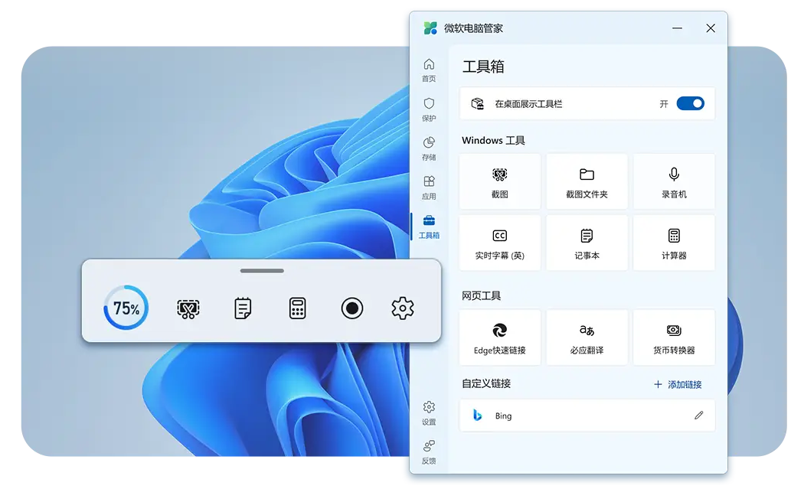
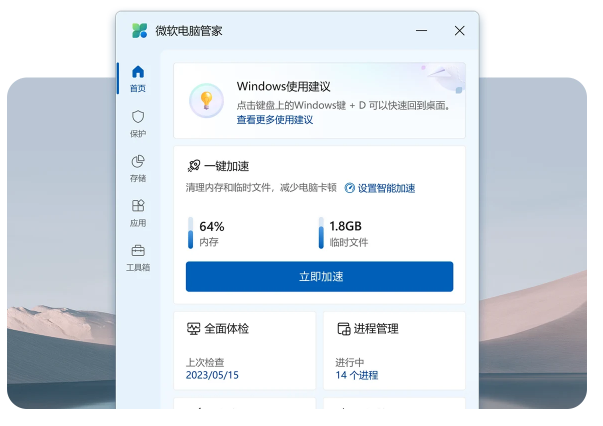
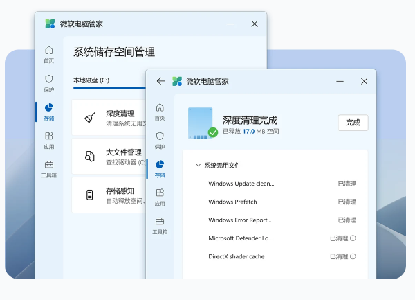
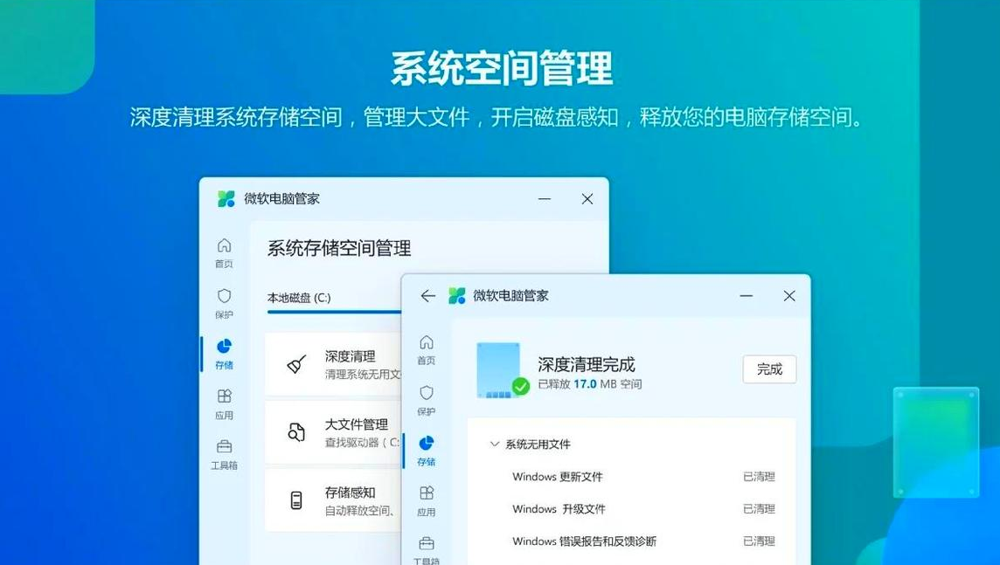
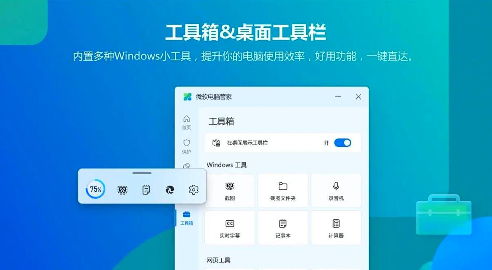

微软电脑管家是一款守卫电脑安全的软件,由微软官方出品,具备`电脑杀毒`,`深度清理`,`木马查杀`,`电脑加速`,`系统补丁`升级功能,

同时还配有独家查杀优化引擎,`电脑加速`让你的电脑焕然一新.微软电脑管家堪称目前市面上最精简的杀软工具,没有任何广告弹窗,不会推送第三方软件,也不会篡改主页,占用大量后台资源,而且平时完全感受不到它的存在,精简不打扰。

微软电脑管家3.8公测版新版发布，此版本继续秉承纯净、无打扰、给用户打造无忧系统环境的产品理念，升级了【Windows功能修复】，新增了一键【重置默认应用】，优化了【开机启动项管理】，可以通过“一键”快速解决你的电脑问题，更好地保护你的Windows操作体验。全面兼容Win10 以上操作系统。

微软电脑管家V3.0新增了桌面工具栏，方便你快速访问截图、录音机、记事本、计算器等Windows原生工具，以及必应翻译、货币换算器等网页工具。

## 下载

[微软件电脑管家点击下载](https://pan.quark.cn/s/52c6315c772b)

## 【微软电脑管家主要功能】

**功能1：一键加速**

清理系统碎片，释放占用资源，让你的Windows飞速如新。

**功能2：系统空间管理**

深度清理系统存储空间，管理大文件，开启磁盘感知，释放您的电脑存储空间。

**功能3：弹窗管理**

开启弹窗管理功能，减少广告及应用弹窗，使你的电脑纯净无扰。

**功能4：全面体检**

快速检测电脑异常，垃圾清理，病毒检测，系统风险一键解决。

**功能5：工具箱 桌面工具栏**

内置多种Windows小工具，提升你的电脑使用效率，好用功能，一键直达。

在“系统保护”页： 微软电脑管家能够调用Microsoft Defender快速查杀病毒，保护电脑不被病毒侵染。你可以通过【重置默认应用】及【浏览器保护】功能，实现对浏览器的保护、修复被三方应用修改的任务栏、恢复默认应用设置等。你还可以通过【弹窗管理】关闭你不想看到的广告弹窗，让电脑重回纯净。

在“系统存储空间管理”页： 微软电脑管家清晰显示了你的磁盘容量。【深度清理】【大文件管理】功能，可以帮助你深度扫描和清理系统中的无用文件和垃圾，释放电脑空间；通过大文件整理功能，你可以快速整理电脑中的大文件，高效清理和管理你的文件；同时，你还可以通过【存储感知】功能，设置定时自动清理硬盘空间。

在“应用管理”页： 你可以通过【应用进程管理】管理当前使用的应用，通过【开机启动项管理】来提升电脑开机速度，或者通过【应用管理】来卸载你不想用的应用程序。

