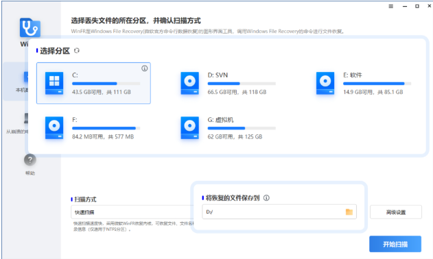
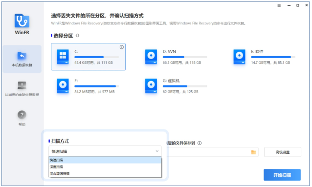
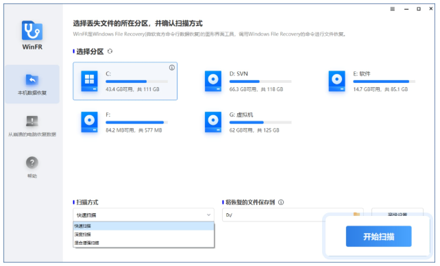
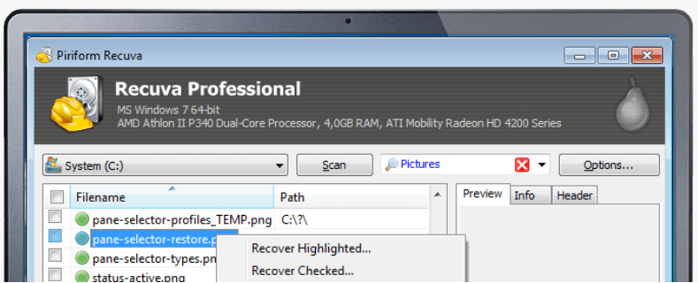
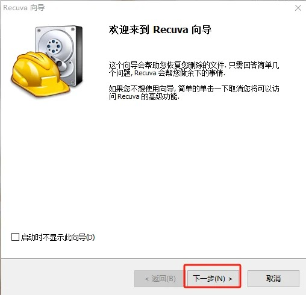
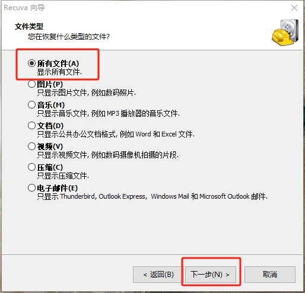
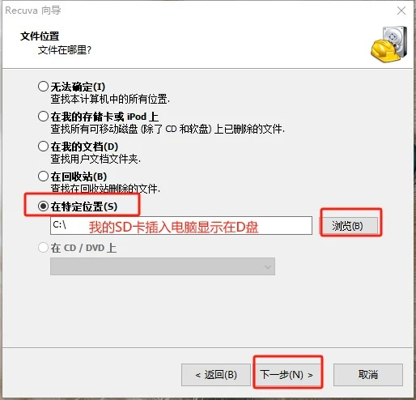
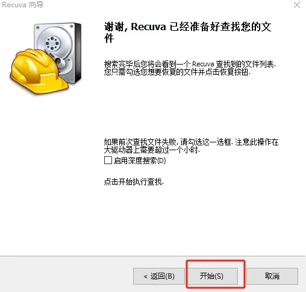
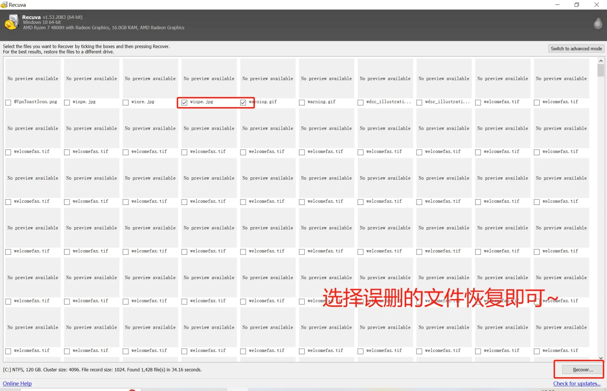

和好友出去玩拍的照片不小心被误删了还是在相机SD卡里删的，这可怎么办！

计算机崩溃后丢失了文件？

或者是自己不小心的误操作，导致文件丢失了，这可怎么办！

甚至是女朋友故意把文件删除了，都可以用以下两款免费的数据恢复工具找回

数据恢复软件其实有很多，但基本都是收费，或在有限的文件中进行找回，或限制文件大小，免费的确实很少。

下面介绍一下这2款及使用方式

## 获取地址

[Recuva及WinFR数据恢复软件地址](https://pan.quark.cn/s/1c231e62e2f6)

## WinFR

微软在Win10 系统中新增了一个非常实用的数据恢复软件：Windows File Recovery 。

微软推出的这款数据恢复工具完全免费，功能也很强大，唯一的缺点，它是一款命令行数据恢复工具，没有图形界面，所有操作需要输入命令来执行，这直接劝退一大波小白同学

WinFR界面版最近偶然发现傲梅将微软这款命令行程序二开成了图形版，核心内容还是 Windows File Recovery 只是给他增加了图形界面。图形界面设计简单易用，更适合大众用户使用。并且保持着完全免费

### WinFR软件介绍

WinFR是一个完全免费的工具。软件内没有任何需要付费的功能或服务。无论您使用哪种扫描方式，恢复哪种类型的文件，该软件均不收取任何费用。

WinFR界面版完全调用Windows文件恢复（Microsoft 命令行应用程序），为用户提供简单易用的图形界面，帮助用户快速从Windows 10/11中恢复已删除的文件。

### 快速&深度扫描
快速扫描：扫描速度快；使用NTFS文件系统下的目录结构和文件名恢复文件。

深度扫描：恢复更多丢失目录结构和文件名的文件。

### 恢复多种数据类型
可以恢复媒体文件、办公文件、压缩文件等，包括JPEG、 PDF、DOCX、MP3、EXCEL、ZIP等。

### 支持从多种设备恢复

可以在Windows 11/10/8/7中恢复采用NTFS、FAT、exFAT、ReFS文件系统格式的SSD、HDD、U盘或存储卡中丢失的文件。

### 适用场景
恢复意外删除的文件；从格式化的硬盘中恢复文件； 从损坏的硬盘中恢复文件。

### 恢复文件类型
图片/视频/音频、文件夹/压缩包、office文档等等......

### WinFR怎么用？

1. 选择要扫描的分区和要保存的位置

选择您已删除文件的分区，然后根据您的偏好选择另一个位置来存储恢复的文件。

2. 选择扫描方法

根据文件系统和数据丢失情况选择扫描方法。如果需要，可以使用高级设置。

3. 单击“开始扫描”
单击“开始扫描”即可轻松恢复所有已删除的文件。

## Recuva

### 卓越的文件恢复功能
Recuva 可以恢复您丢失的图片、音乐、文档、视频、电子邮件或任何其他文件类型。它可以从任何可重写介质中恢复：存储卡、外部硬盘、U 盘等！

### 从损坏的磁盘恢复
与大多数文件恢复工具不同，Recuva 可以从损坏的或新格式化的硬盘中恢复文件。更大的灵活性意味着更大的恢复机会。

### 深度扫描隐藏文件
对于那些难以找到的文件，Recuva 有一个高级深度扫描模式，搜索您的硬盘，找到任何已删除文件的痕迹。

### 安全地删除文件
有时候您希望一个文件永远消失。Recuva 的安全覆盖功能使用工业和军用标准的删除技术，以确保您的文件完全清除。

### 怎么恢复？

1、打开软件，并选择下一步；

2、选择要恢复的文件类型

3、选择要恢复的软件位置

4、开始恢复

5、选择误删除或丢失的文件，点击恢复就可以了。

