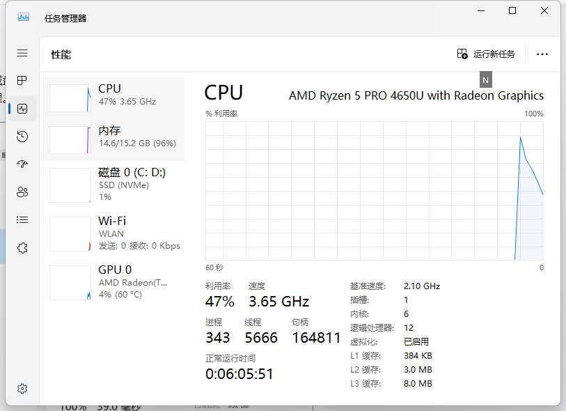
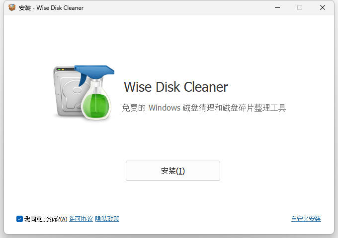
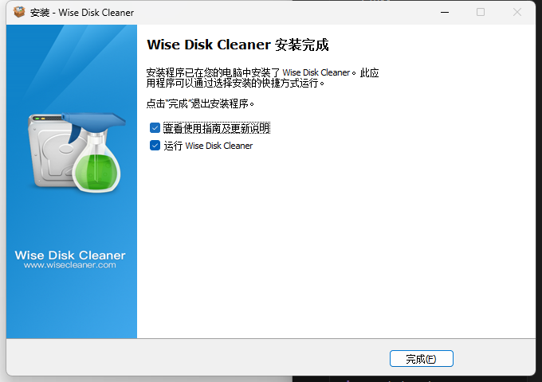
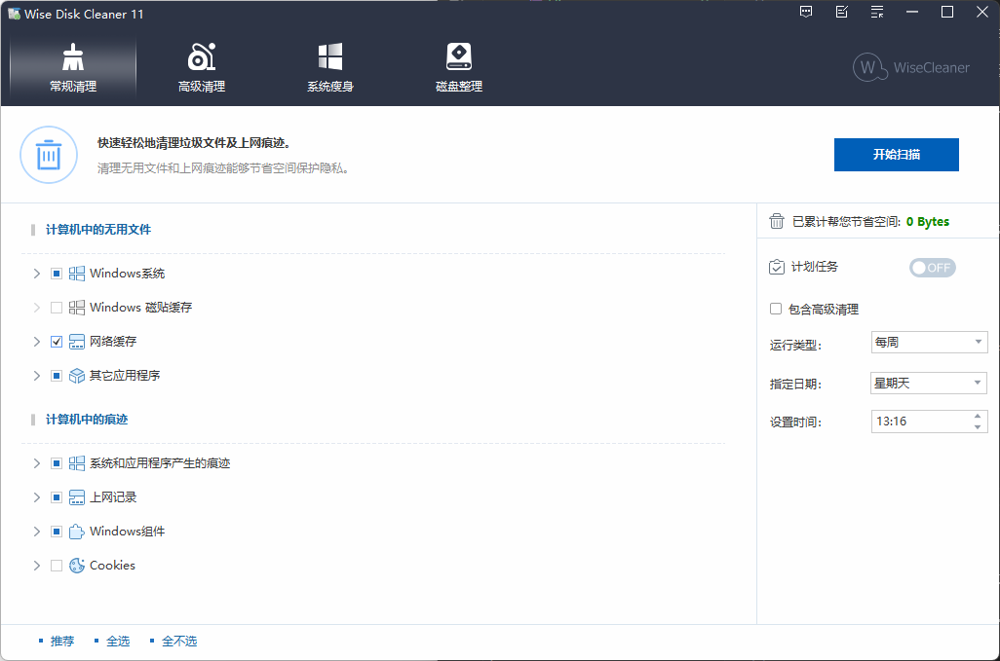
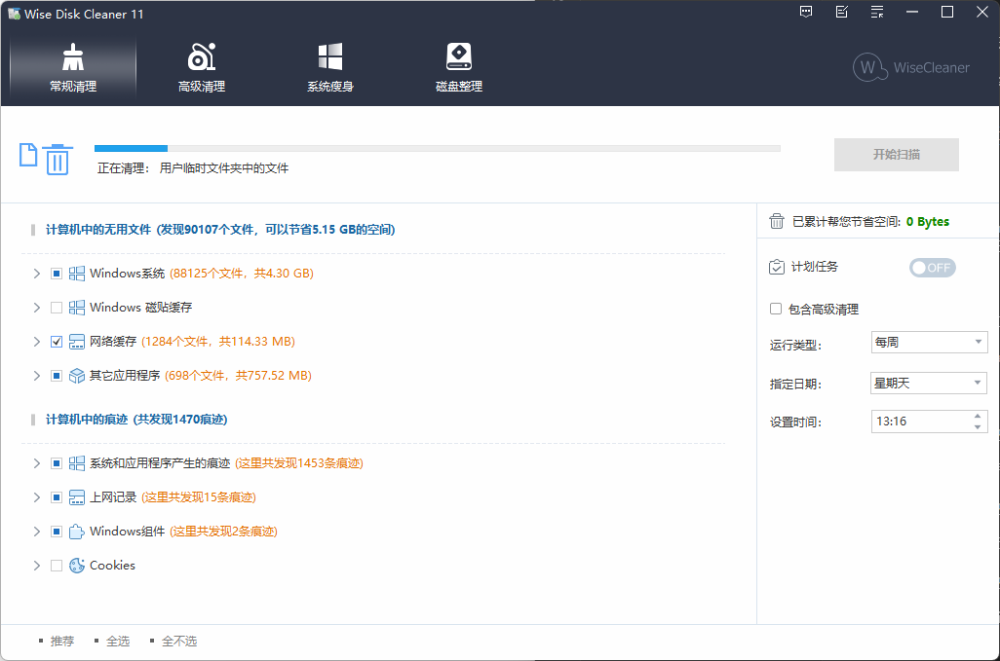
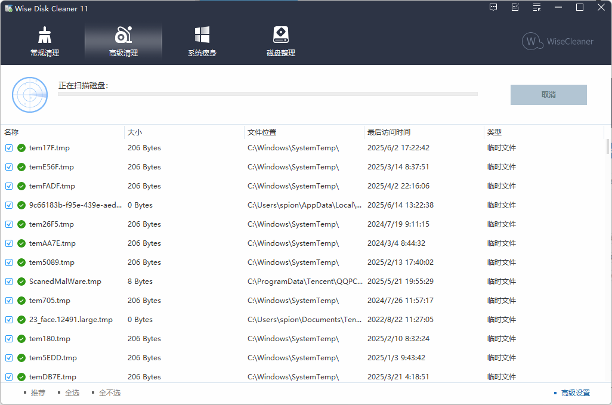
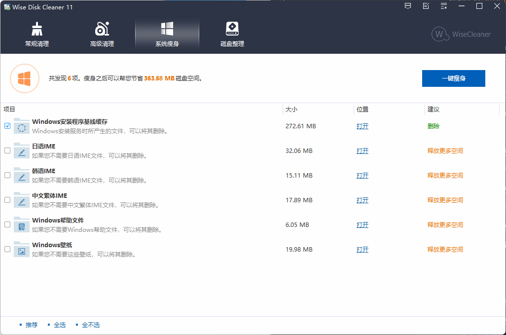
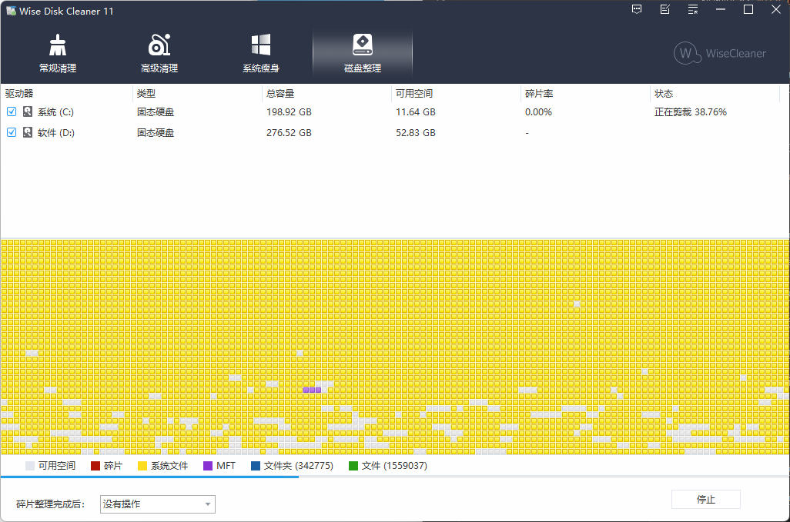

系统突然变卡的情况，SSD测速的时候指数也是急剧下降，这是怎么回事？

可能经常玩电脑吧，有一天一直从早玩到晚。等到八九点钟准备用电脑的时候发现笔记本没电了，按开关也不管用，再仔细一看原来插排的电没开（电池的电耗尽了），按开，开机发现系统明显变慢了，变卡了。测试SSD，各项指数急剧下降。关机再开，状况毫无改变。分别单独挂120G和500G的盘，依旧。小编就纳闷了，无头绪。难道是断电导致的盘坏了？又下载了几款测试软件，健康度检查什么的，都显示没问题，PE下边也检测了，也没问题。百度也没找到答案。一连几天，就这么凑合用着，可心里总是不得劲。

1、无意中在网上看到关闭磁盘的定期碎片整理有用，试着照着网上的方法给关闭了，然后重启电脑，居然好了！！！

2、但是第二次又出现这种情况了，而且又试着清理磁盘，问题并没有得到解决，后面反复想，就是磁盘没也清理过，，就差没重启电脑。结果我就试了一下，重启电脑，好了。

## 问题分析

1、电脑一直开机，那么有的已经一直运行的软件或程序，可能一直占用着CPU，内存之类的。导致其它程序的运行速度变慢。

2、电脑一直运行，各种硬件的温度和散热，也会导致电脑变卡。

3、重启后，很多硬件得到了释放，相当于休息了一下。

重要的事情说三遍，重启电脑，重启电脑。

1、如果电脑一整天没关机了，先不要试着清理磁盘之类的，可以试试重启电脑，如果重启后还是卡顿，那就有可能是固态硬盘碎片过多导致的。

不管怎么样，解决没解决，定期清理磁盘，删除多余垃圾等还是能优化电脑速度，所以还是见意定期清理一下电脑。

大多数‌固态硬盘突然变卡的主要原因包括接口松动、存储空间不足、节能设置不当、固件未更新以及高温影响等。‌ 

通过排查硬件连接、释放存储空间、调整电源管理、更新固件等方法可以有效解决卡顿问题，下面推荐一款软件可以有效处理这些问题:`Wise Disk Cleaner`

## 软件介绍

Wise Disk Cleaner清理系统垃圾、整理磁盘的工具。它能识别多达50种垃圾文件，可以让你轻松地把垃圾文件请出你的计算机，界面友好快速简便，支持简体中文多语言界面，支持XP下透明界面。

## 安装
点击以下获取安装文件：

[Wise Disk Cleaner磁盘清理软件](https://pan.quark.cn/s/826f255415c1)

1、双击运行安装

2、点击安装，等待安装完成

3、安装完成，点击启动

可以看到共四大功能：
1. 常规清理
2. 高级清理
3. 系统瘦身
4. 磁盘整理

## 核心功能模块

**常规垃圾**

清理采用多线程扫描技术识别50余种垃圾文件类型，包括系统更新残留、浏览器缓存、回收站文件及应用程序日志等。清理过程中自动标记高价值文件（如文档、图片）避免误删，支持设置排除目录和特定文件后缀名实现个性化清理。

**深度清理模式**

通过二次扫描机制定位常规清理遗漏的冗余文件，重点清理软件安装包缓存、Windows错误报告及缩略图数据库。2025年5月版本更新后，新增对Adobe Photoshop 2024、Foxit PDF等专业软件的缓存清理规则。

**系统瘦身方案**
专为系统盘空间优化设计，可删除预装示例视频、多语言资源包及Windows更新备份文件。该模块设置安全提示机制，对可能影响系统稳定的文件进行黄标警示，需用户二次确认后执行清理

**磁盘清理**
清除磁盘碎片，提升文件访问速度。内置碎片整理算法支持碎片整理前预览功能，避免误操作导致数据丢失风险 。

## 技术特性

智能扫描引擎搭载多核优化算法实现40GB磁盘扫描时间小于30秒，扫描结果按文件类型、占用空间及安全等级进行三维分类展示 。支持保存扫描配置文件实现一键复用。

自动化运维支持提供定时清理任务设置功能，可设定每日/每周/每月自动执行特定清理方案。配合命令行参数支持，可实现无人值守的服务器环境清理作业。

隐私保护机制内置浏览器隐私痕迹专项清理模块，覆盖Chrome、Edge等主流浏览器的历史记录、Cookie及自动填充表单数据。清理过程采用安全擦除算法，确保敏感信息不可恢复。