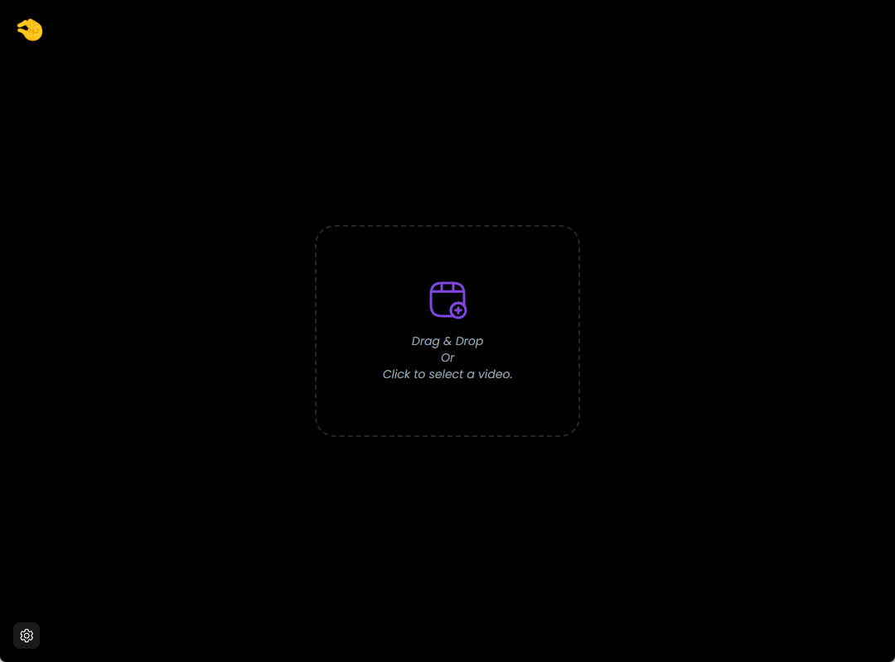
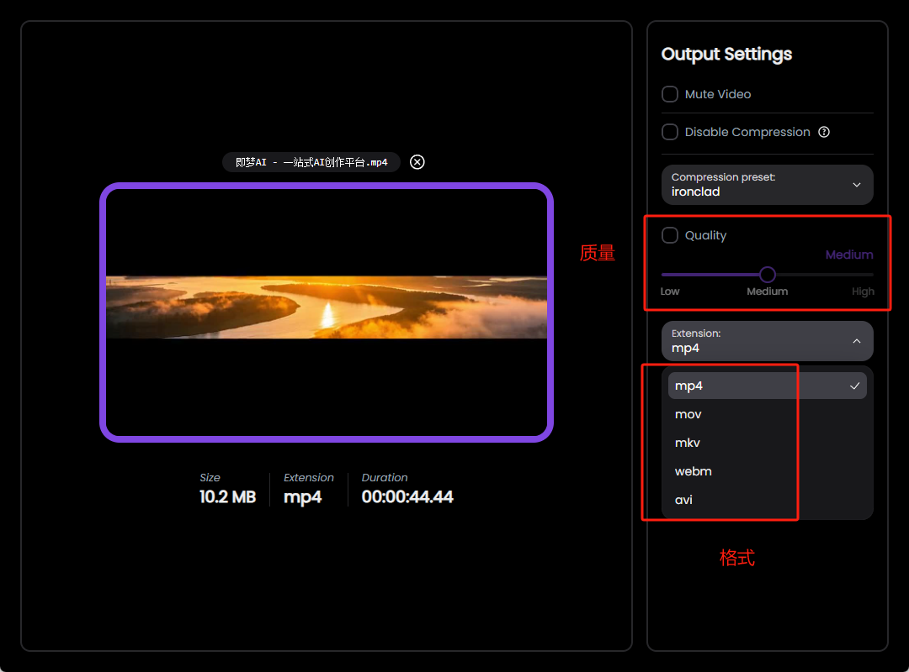
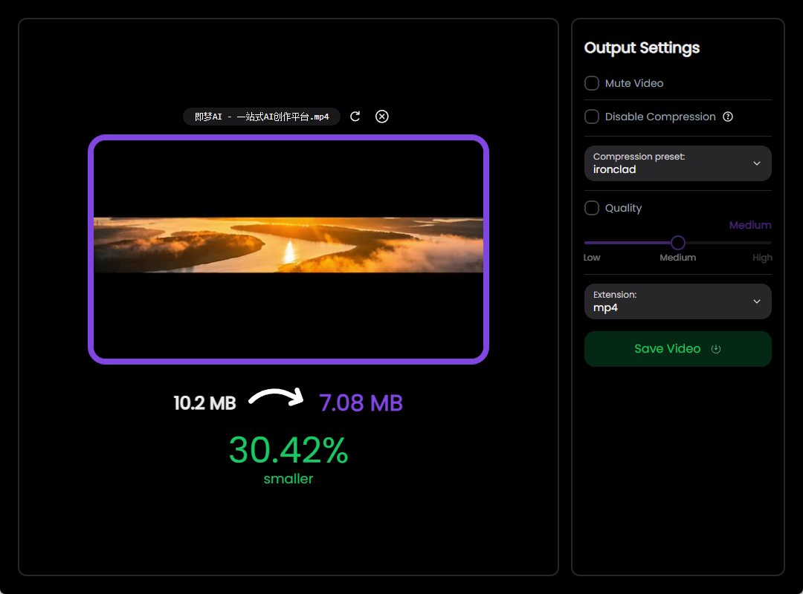

## 一、工具介绍

CompressO 是一个基于 FFmpeg 的视频压缩工具，可以大幅度减少视频体积。它支持 Windows、Linux 和 macOS 系统，完全离线运行，简单易用。CompressO 具有以下特点：

- 支持压缩中取消：在压缩过程中可以随时取消操作。
- 拖拽视频：支持将视频文件拖拽到软件界面进行处理。
- 静音视频：可以选择将视频静音。
- 完全离线运行：无需联网即可使用。

使用 CompressO，可以轻松地将视频文件压缩到较小的体积，还保持较高的清晰度。

一个 720P 的视频文件从 481M 压缩到 70.2M，清晰度几乎没有变化

## 二、安装步骤

1、打开浏览器，在搜索引擎中输入 “CompressO 视频压缩工具”，找到官方网站。为确保下载的软件安全可靠，建议从官方渠道获取安装包。​
在官网页面上，找到软件的下载按钮，根据自己的操作系统选择对应的版本（Windows 版或 Mac 版），点击下载。

2、使用我从官方下载的软件，直接下载。

[CompressO开源免费版](https://pan.quark.cn/s/423ed90a3f16)

### （二）安装过程

1. 下载完成后，找到下载的安装包文件，双击运行。
2. 在弹出的安装向导界面中，点击“下一步”开始安装。
3. 阅读软件的许可协议，若同意协议内容，勾选“我接受许可协议”选项，然后点击“下一步”。
4. 选择软件的安装路径，你可以选择默认路径，也可以点击“浏览”按钮自定义安装位置。选择好路径后，点击“下一步”。
5. 根据提示选择是否创建桌面快捷方式等附加任务，完成选择后点击“下一步”。
6. 确认安装信息无误后，点击“安装”按钮，等待安装过程完成。
7. 安装完成后，点击“完成”按钮退出安装向导，此时可以在桌面或开始菜单中找到CompressO的图标，双击打开软件。

可以说是一个非常轻量经的软件了：界面也比较简单：

## 三、核心功能
### （一）高效压缩
CompressO采用先进的视频压缩算法，能够根据用户设定的压缩参数，对视频进行智能压缩。无论是几分钟的短视频，还是长达数小时的长视频，都能在短时间内完成压缩处理，并且有效减小文件体积，最高可实现90%的压缩率，同时保持画面清晰流畅。

### （二）多格式支持
如前文所述，该软件支持几乎所有常见的视频格式。用户无需担心因视频格式不兼容而无法进行压缩的问题，无论是手机拍摄的MP4格式视频，还是摄像机录制的AVI格式视频，都能直接导入CompressO进行压缩处理。

### （三）质量调节
CompressO允许用户根据实际需求自由调节视频质量。在压缩过程中，用户可以通过设置分辨率、码率、帧率等参数，精确控制压缩后的视频质量。例如，若视频仅用于手机端小屏幕观看，可适当降低分辨率和码率，以获得更大的压缩比；若视频需要在大屏幕上展示，则可保持较高的质量参数，确保画面细节清晰。

### （四）批量处理
当用户有多个视频需要压缩时，CompressO的批量处理功能就能大显身手。用户只需将多个视频文件一次性拖放到软件界面中，设置好压缩参数，即可同时对多个视频进行压缩，大大提高工作效率，节省大量时间。

### （五）预览与对比
在完成视频压缩后，CompressO提供了预览和对比功能。用户可以直接在软件中预览压缩后的视频效果，同时还能将压缩前后的视频进行画面、文件大小等方面的对比，直观地了解压缩效果，以便根据需要进一步调整压缩参数。

因为是轻量的，所以功能也不多，压缩质量决定大小，压缩后转换的格式：

## 四、使用方法
### （一）导入视频
1. 打开CompressO视频压缩软件，进入主界面。
2. 在主界面中，点击“添加文件”按钮，在弹出的文件选择窗口中，找到需要压缩的视频文件，选中后点击“打开”；或者直接将视频文件从文件夹中拖放到软件界面指定区域。若需要批量处理多个视频，可在文件选择窗口中按住Ctrl键（Windows系统）或Command键（Mac系统），同时选中多个视频文件进行导入。

压缩速度也还可以

### （二）设置压缩参数
1. **分辨率调整**：在软件的参数设置区域，找到“分辨率”选项，点击下拉菜单，选择合适的分辨率。常见的分辨率选项有1920×1080（全高清）、1280×720（高清）、854×480（标清）等，可根据视频的使用场景和需求进行选择。
2. **码率和帧率设置**：码率和帧率直接影响视频的质量和文件大小。一般来说，码率越高，视频质量越好，但文件也越大；帧率越高，视频画面越流畅，但同样会增加文件大小。在参数设置区域，找到“码率”和“帧率”选项，通过滑块或手动输入数值的方式进行调整。如果对这些参数不太熟悉，也可以选择软件预设的压缩模式，如“快速压缩”“高质量压缩”等。
3. **输出格式选择**：在“输出格式”选项中，点击下拉菜单，选择压缩后视频想要保存的格式，如MP4、AVI等。

### （三）开始压缩
完成视频导入和参数设置后，点击软件界面上的“开始压缩”按钮，CompressO将根据设置的参数对视频进行压缩处理。在压缩过程中，界面会显示压缩进度条和预计剩余时间，方便用户了解压缩进程。

### （四）查看与导出
1. 压缩完成后，软件会自动弹出提示框告知压缩已完成。此时，在软件界面中选中压缩后的视频文件，点击“预览”按钮，可查看压缩后的视频效果。
2. 确认视频效果满意后，点击“导出”按钮，在弹出的保存路径选择窗口中，选择视频保存的位置，然后点击“保存”，即可将压缩后的视频文件导出到指定文件夹中。 