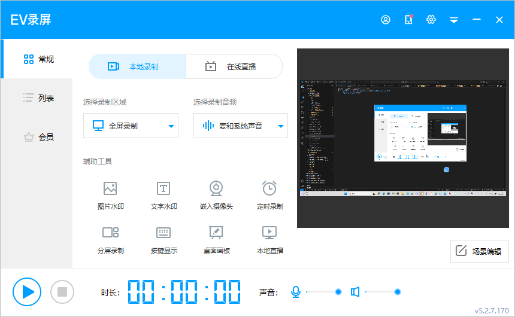
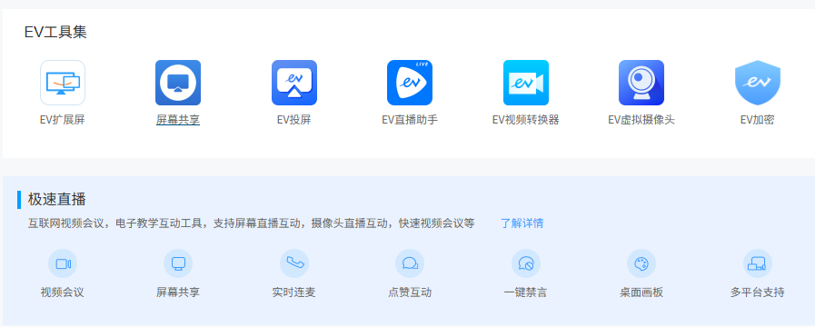
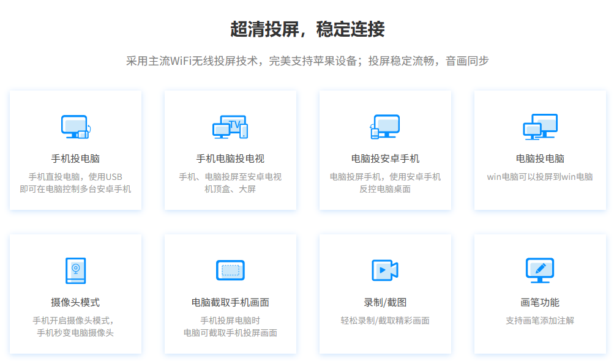
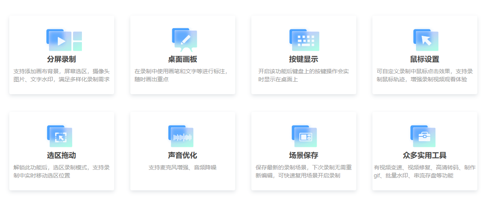
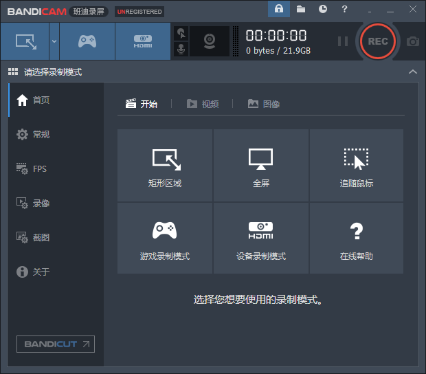
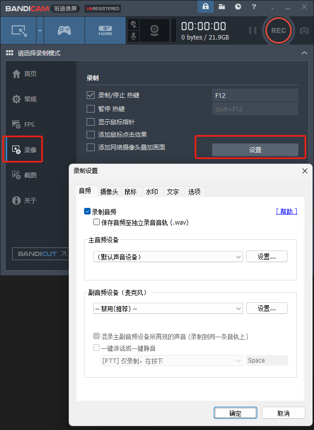
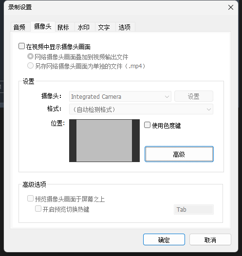
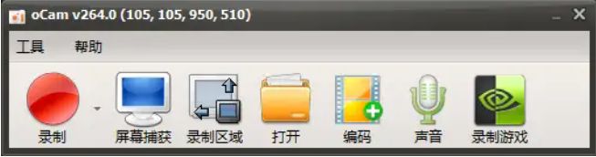

全部是免费版，录制视频不会添加水印，且都是高清录制。

## 一、EVCapture（视频录制与直播）
可以说是功能最强大的了，录制视频只是他的一个功能。

全名叫EVCapture ，EV录屏大家应该都有听过，这款录屏软件和市面上试用三分钟就要收费的录屏软件不同。EV录屏的win版是支持免费不限时长录屏的。有时候是需要一些录制一些素材，或者是开会需要录制会议过程。都可以使用EV录屏。

它录制出来的视频体积很小，但是非常清晰！

并且是一个集视频录制与直播功能于一身的桌面录屏软件，可实现分屏录制、实时按键显示、录屏涂鸦等功能

视频录制完成后，还可以添加水印，很好的保护了版权：

### EV 工具集

- EV 扩展屏 
- 屏幕共享 
- EV 投屏 
- EV 直播助手 
- EV 视频转换器 
- EV 虚拟摄像头 
- EV 加密

### EV录屏—屏幕共享功能

通过EV录屏的屏幕共享功能，即可将电脑的录屏画面共享到此页面。将顶部地址栏中的地址或右侧二维码发送给他人，在同一局域网（Wifi）下仅需打开地址或微信扫码即可观看共享。 默认观看人数为3台，开通EV录屏VIP可达到10台。

**超清投屏，稳定连接**
采用主流 WiFi 无线投屏技术，完美支持苹果设备；投屏稳定流畅，音画同步

**手机投电脑**
手机直投电脑，使用 USB 即可在电脑控制多台安卓手机

**手机电脑投电视**
手机、电脑投屏至安卓电视机顶盒、大屏

**电脑投安卓手机**
电脑投屏手机，使用安卓手机反控电脑桌面

**电脑投电脑**
win 电脑可以投屏到 win 电脑

**摄像头模式**
手机开启摄像头模式，手机秒变电脑摄像头

**电脑截取手机画面**
手机投屏电脑时，电脑可截取手机投屏画面

**录制 / 截图**
轻松录制 / 截取精彩画面

**画笔功能**
支持画笔添加注解

## 二、Bandicam

班迪录屏Bandicam是一款功能强大的视频录制工具，录制出来的视频体积较小且内容清晰度较高，平时录屏、录游戏都非常合适。可以全屏幕录制，也可以自定义录制区域，还可以在录制时添加自定义的logo，并且有个绘制模式，适合演示。

### 音频设置

- 录制音频：如果选中此选项，录制视频和音频在一起。
- 保存音频至独立录音音轨 （.wav）：如果选中此选项，音频将另存为.wav文件。
- 扬声器：用户选择要录制的扬声器，通常选择（默认输出设备）。
- 麦克风：如果您要录制麦克风声音，请选择（默认输入设备）或您用的麦克风名称，如果您只想录制电脑声音而不录制麦克风声音，请选择 --禁用--。
- 设置：单机以打开 Windows 声音设置窗口。
- 滤声器：单击可以使用单声道转换选项和噪声抑制选项。
- 副音频设备：仅当您要录制主音频设备的扬声器和麦克风声音以外的其他音频时才使用。 通常推荐不要使用，如果要录制第三个音频就可选声音设备中选择其他音频设备。
- 混录主副音频设备所再现的声音（录制到同一条音轨上）：此选项允许用户混合 “主声音设备” 和 “副声音设备” 录制到同一条音轨上。
- 一键讲话或一键静音：此选项允许用户使用可以自定义热键，热键于讲话或静音。

### 摄像头设置

-在视频中显示摄像头画面：此选项允许用户录制视频上叠加网络摄像头画面。
添加网络摄像头覆盖到输出视频文件
-另存网络摄像头画面为单独的文件（.mp4)
-摄像头：此选项用户选择可用的网络摄像头设备。
-格式：此选项允许用户选择网络摄像头的尺寸，FPS等。
-使用色度建/高级：可以使用色度建，高级更改录制视频上的摄像头画面的尺寸，位置，翻转等。

### 鼠标设置
-显示鼠标指针：此选项允许用户录制视频时显示或不显示鼠标指针。
-添加鼠标点击效果：此选项允许用户点击左/右键的时候出现光圈颜色效果。（录制的时候看不到，录制好的视频中才可以看到）
-添加鼠标高亮效果：此选项允许用户鼠标指针周围高亮效果,也能调整高亮的不透明度。（录制的时候看不到，录制好的视频中才可以看到）
-在录制视频中添加鼠标点击音效：此选项允许用户录制时发出鼠标点击音效。

### 水印设置

-此选项允许用户录制视频时添加图像水印。
-用户选择添加的图象文件。
-此选项允许用户调整水的印透明度和位置。

### 文字设置

-添加文字水印：此选项允许用户录制视频时添加文字水印。
-此选项允许用户设置[字体，大小，微调，透明度，阴影等。
-预览文字位置：此选项允许用户预览画面添加的文字位置

## 三、屏幕录像机(oCam)
这款软件主打小巧，体积小巧，功能强大，录制视频清晰度高，录制时可以选择录制区域。
视频格式也是可以选择的，GIf、MP4，FLV、AVI、WMV……10种视频格式，满足你的多种需求！

同时它也可以录制音频、游戏、GIF、以及截图等！

