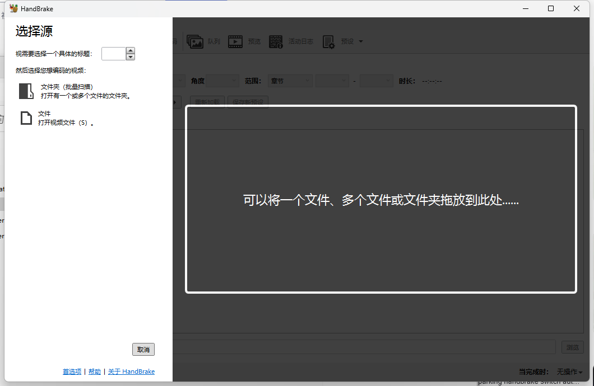
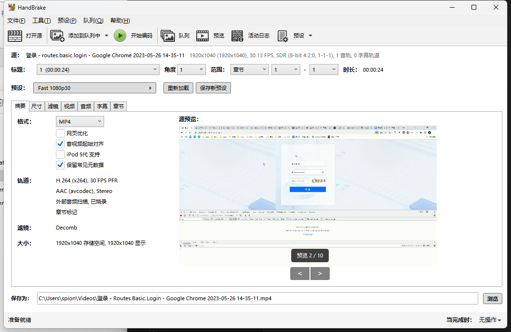
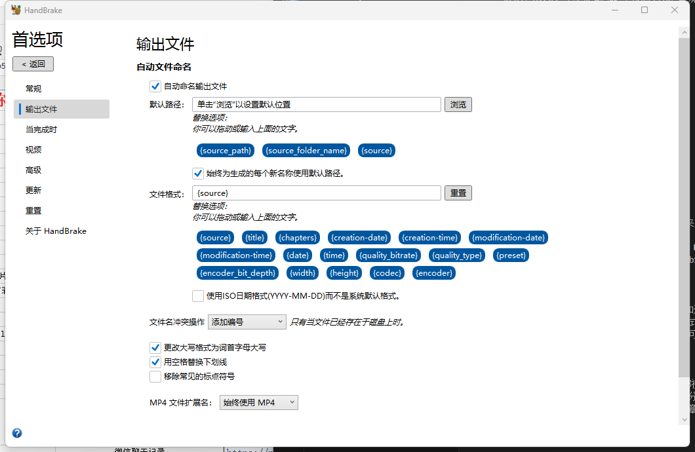
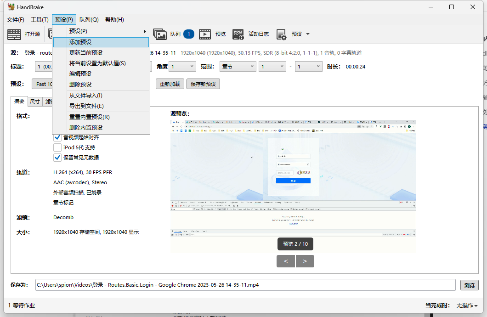
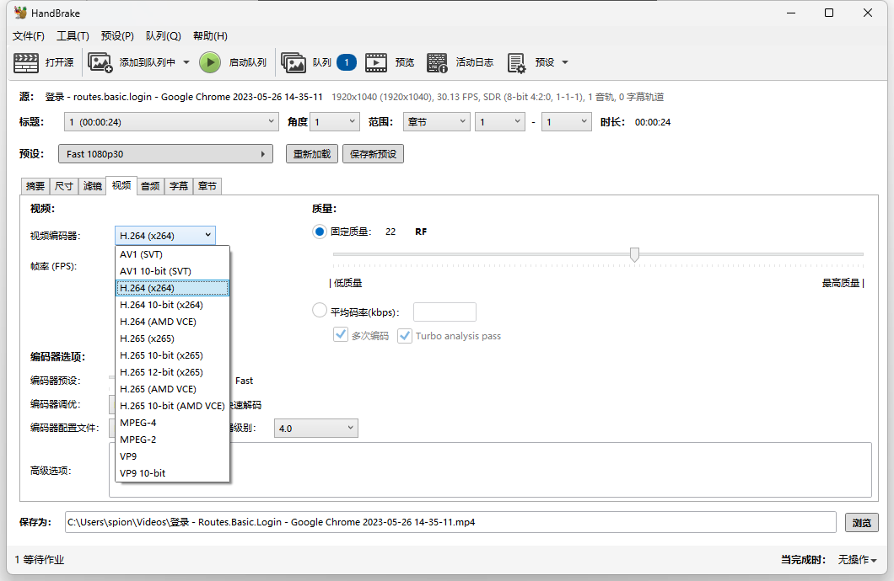
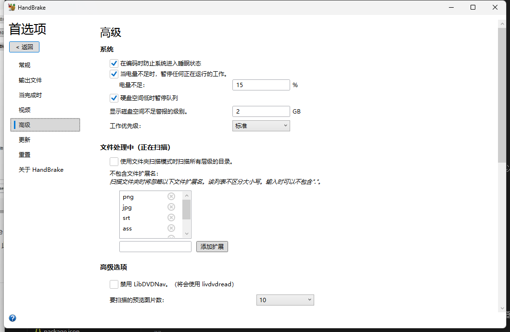

## HandBrake下载，HandBrake中文版，HandBrake汉化绿色版下载

HandBrake 是一款跨平台开源视频转码软件，支持 Windows、Mac 和 Linux 系统。其核心功能包括视频格式转换、压缩处理及多轨道音视频编码，支持 DVD、蓝光、消费级设备文件等输入源转换为 MP4、MKV 等主流容器格式。通过集成 x264、H.265 等视频编码器与 AAC/FLAC 音频编码器，实现高效的多媒体处理，并提供批量转换、视频滤镜、字幕嵌入等专业功能。

使用他的人都喜欢以下几点：

- 转换几乎任何格式的视频
- 免费且开源，双击就能用，无需安装
- 多平台（Windows、Mac 和 Linux）

## 安装地址

[HandBrake-1.9.2中文绿色免安装版视频压缩](https://pan.quark.cn/s/423ed90a3f16)

## 使用方法

其实就几步：

- 下载 HandBrake (Windows、Mac 和 Linux)
- 选择要转换为的格式（输出）
- 选择要压缩的文件（输入）
- 点击“开始转换”开始进行视频压缩！

 

## 输入输出特性

- 支持读取 DVD 映像文件、VIDEO_TS 文件夹、蓝光光盘内容及 MXF、MPEG-TS 等专业格式，但对加密 DRM 文件与 AVCHD 播放列表支持有限。
- 可输出 MP4、MKV、AVI 等格式文件，兼容 H.264 Baseline、H.265 和 VP9 编码标准。
- 支持多音轨混流与第三方字幕文件封装（VobSub/SRT），但暂不支持 ASS/SSA 字幕格式

## 编码处理能力

- 采用多线程 H.264 编码技术，支持 GPU 加速与 CRF（恒定质量）模式
- 音频处理支持 AC-3、AAC、FLAC 等编码格式，提供音轨语言选择与声道映射功能
- 内置反交错、降噪、画面裁剪等视频滤镜，可调整 NTSC/PAL 制式参数与屏幕纵横比

## 软件架构

- 基于 ffmpeg 框架开发，支持其解码的全部视频格式
- 提供设备预设配置文件，包含主流移动设备分辨率与编码参数模板
- 采用批量转换架构，支持多任务并行处理与章节标记分割功能

HandBrake是一款视频处理的软件，支持将视频文件从一种格式转换为另一种常见的格式，如MP4或MKV。用户可以根据自己的需求调整视频编解码器、帧速率、比特率等参数。该工具非常实用且功能丰富，是处理视频转码的理想选择。

首选项功能查看：

预设：

**丰富的格式输出**

HandBrake 支持多种文件容器和视频编码器，包括MP4、MKV、WebM等容器以及AV1、H.265、H.264等视频编码器。此外，还支持多种音频编码器和音频直通功能。

**多项高级功能HandBrake**

还具备标题/章节和范围选择、批量扫描和编码队列、章节标记、字幕支持等多项高级功能。此外，还支持恒定质量或平均比特率视频编码以及VFR和CFR支持。